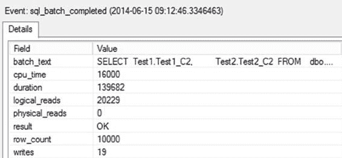
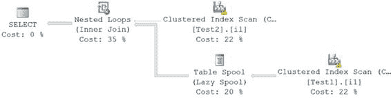

# 第 12 章：统计数据、数据分布与基数

为验证两个表的不同结果集大小如何影响查询优化器的决策，修改查询的筛选条件，使两个表返回相反大小的结果集（从 `Test1` 表获取小结果集，从 `Test2` 表获取大结果集）。将原先基于 `Test1.Test1_C2 = 2` 的筛选条件，改为基于 `1` 进行筛选：

```sql
SELECT t1.Test1_C2,
       t2.Test2_C2
FROM dbo.Test1 AS t1
JOIN dbo.Test2 AS t2
ON t1.Test1_C2 = t2.Test2_C2
WHERE t1.Test1_C2 = 1;
```

图 12-10 展示了得到的执行计划，图 12-11 展示了此查询的扩展事件会话输出。

**图 12-10.** 不同结果集对应的执行计划

**图 12-11.** 不同结果集对应的跟踪输出

[www.it-ebooks.info](http://www.it-ebooks.info/)

所得的会话输出并未执行任何额外的 SQL 活动来管理统计信息。非索引列（`Test1.Test1_C2` 和 `Test2.Test2_C2`）上的统计信息在索引创建时就已生成，并随着数据变化而更新。

为实现有效的成本优化，查询优化器在上述两种情况下，根据非索引列（`Test1.Test1_C2` 和 `Test2.Test2_C2`）上的统计信息，选择了不同的处理策略。从前两个执行计划中可以看出这一点：在第一个计划中，表 `Test1` 作为嵌套循环连接的外表；而在最新的计划中，表 `Test2` 成了外表。通过拥有非索引列（`Test1.Test1_C2` 和 `Test2.Test2_C2`）的统计信息，查询优化器能够为每种情况创建成本效益高的合适执行计划。

更优的解决方案是在该列上创建索引。这不仅会创建该列上的统计信息，还能在检索少量结果集时，通过索引查找操作实现快速数据检索。

然而，对于一个数据库应用程序，如果其查询在 `WHERE` 子句中引用了非索引列，保持自动创建统计信息功能开启，仍然允许优化器根据列中现有的数据分布来确定最佳处理策略。

如果你需要知道某个给定统计信息覆盖了哪一列或多列，需要查看 `sys.stats_columns` 系统表。你可以用与查询 `sys.stats` 表相同的方式来查询它。

```sql
SELECT *
FROM sys.stats_columns
WHERE object_id = OBJECT_ID('Test1');
```

这将显示由自动创建的统计信息所引用的列。如果你决定需要创建索引来替代统计信息，可以利用此信息来确定应在哪些列上创建索引。此处列出的列是该列在表中的序号位置。要查看列名，则需要修改查询。

```sql
SELECT c.name,
       sc.object_id,
       sc.stats_column_id,
       sc.stats_id
FROM sys.stats_columns AS sc
JOIN sys.columns AS c
ON c.object_id = sc.object_id
AND c.column_id = sc.column_id
WHERE sc.object_id = OBJECT_ID('Test1');
```

### 缺少非索引列统计信息的缺点

为理解非索引列上没有统计信息的不利影响，请通过以下步骤删除 SQL Server 自动创建的统计信息，并阻止 SQL Server 在无索引的列上自动创建统计信息：

1.  通过“管理统计信息”对话框删除在列 `Test1.Test1_C2` 上自动创建的统计信息（如“非索引列统计信息的优势”一节所示），或使用以下 SQL 命令（将 `StatisticsName` 替换为系统自动为该统计信息指定的名称）：
    ```sql
    DROP STATISTICS [Test1].StatisticsName;
    ```
2.  同样地，删除列 `Test2.Test2_C2` 上对应的统计信息。

[www.it-ebooks.info](http://www.it-ebooks.info/)





