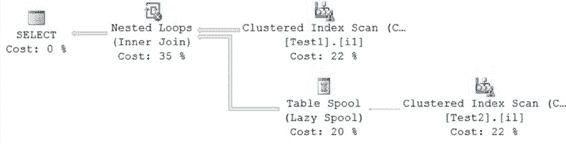
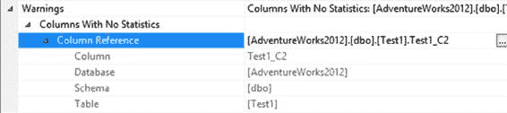

# 第 12 章

通过取消选中对应数据库的 `Auto Create Statistics` 复选框，或通过执行以下 SQL 命令来禁用自动创建统计信息功能：
```sql
ALTER DATABASE AdventureWorks2012 SET AUTO_CREATE_STATISTICS OFF;
```
现在重新执行 `SELECT` 语句——`nonindexed_select`。
```sql
SELECT Test1.Test1_C2,
    Test2.Test2_C2
FROM dbo.Test1
JOIN dbo.Test2
    ON Test1.Test1_C2 = Test2.Test2_C2
WHERE Test1.Test1_C2 = 2;
```
图 12-12 和图 12-13 分别显示了由此产生的执行计划和扩展事件输出。

**图 12-12.** `禁用 AUTO_CREATE_STATISTICS 时的执行计划`

**图 12-13.** `禁用 AUTO_CREATE_STATISTICS 时的跟踪输出`

在自动创建统计信息功能关闭的情况下，查询优化器选择了一个与该功能开启时不同的执行计划。由于未能在相关列上找到统计信息，优化器选择 `FROM` 子句中的第一个表（`Test1`）作为嵌套循环联接操作的外表。优化器无法根据列中的实际数据分布来做出决策。你可以在执行计划中看到一个警告（感叹号），这表示数据访问操作符（聚集索引扫描）缺失了统计信息。

如果你修改查询，使 `Test2` 表成为 `FROM` 子句中的第一个表，那么优化器就会选择 `Test2` 表作为嵌套循环联接操作的外表。图 12-14 显示了其执行计划。

[www.it-ebooks.info](http://www.it-ebooks.info/)



```sql
SELECT Test1.Test1_C2,
    Test2.Test2_C2
FROM dbo.Test2
JOIN dbo.Test1
    ON Test1.Test1_C2 = Test2.Test2_C2
WHERE Test1.Test1_C2 = 2;
```

**图 12-14.** `禁用 AUTO_CREATE_STATISTICS 时的执行计划（一种变体）`
通过比较在非索引列上有统计信息和无统计信息时该查询的开销，你可以看到禁用自动创建统计信息功能会对性能产生负面影响。表 12-3 显示了该查询开销的差异。

**表 12-3.** `非索引列上有统计信息和无统计信息时查询的开销比较`

| 非索引列上的统计信息 | 开销 | 持续时间（毫秒） | 读取次数 |
| :--- | :--- | :--- | :--- |
| 有统计信息 | 图 12-11 | | |
| 无统计信息 | 图 12-13 | | |

当非索引列上没有统计信息时，逻辑读取次数和 CPU 利用率都更高。

没有这些统计信息，优化器无法创建一个经济高效的计划，因为它实际上不得不通过一系列内置的启发式计算来猜测选择性。

查询执行计划通过在可能使用统计信息的操作符上放置一个感叹号，来突出显示缺失的统计信息。你可以在前面的执行计划（图 12-12 和 12-14）的聚集索引扫描操作符中看到这一点，也可以在图形执行计划节点属性的 `警告` 部分看到详细说明，如图 12-15 所示（针对 `Test1` 表）。

[www.it-ebooks.info](http://www.it-ebooks.info/)



**图 12-15.** `图形计划中缺失统计信息的指示`

**注意**
在数据库应用程序中，查询使用没有索引的列的可能性始终存在。因此，在大多数系统中，出于性能原因，建议保持 `SQL Server` 数据库的自动创建统计信息功能处于开启状态。

你可以查询缓存中的计划，以识别那些可能存在缺失统计信息的计划。
```sql
SELECT dest.text AS query,
    deqs.execution_count,
    deqp.query_plan
FROM sys.dm_exec_query_stats AS deqs
CROSS APPLY sys.dm_exec_text_query_plan(deqs.plan_handle,
    deqs.statement_start_offset,
```

