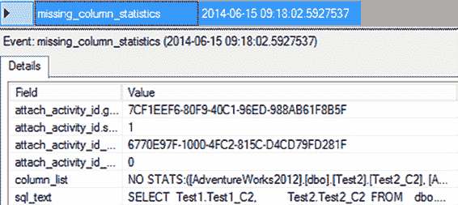
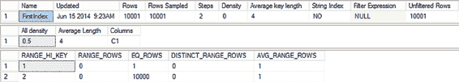
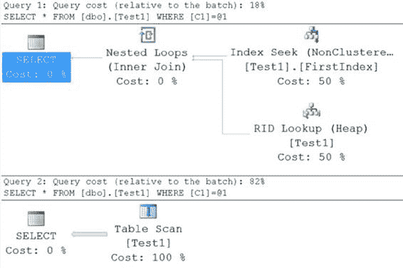
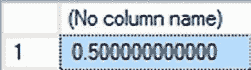

# 第 12 章：统计信息、数据分布与基数

## 查询缺失的统计信息

```sql
deqs.statement_end_offset) AS detqp
CROSS APPLY sys.dm_exec_query_plan(deqs.plan_handle) AS deqp
CROSS APPLY sys.dm_exec_sql_text(deqs.sql_handle) AS dest
WHERE detqp.query_plan LIKE '%ColumnsWithNoStatistics%';
```

这个查询稍微有些取巧。我在 `LIKE` 运算符中对变量使用了双侧通配符，这实际上是一个常见的代码问题（更详细的讨论见第 18 章），但在这种情况下，另一种选择是运行 XQuery，这需要加载 XML 解析器。根据系统可用内存量的不同，这种通配符搜索方法可能比直接查询执行计划的 XML 快得多。查询调优并非仅仅使用单一方法，而是要理解所有这些方法如何协同工作。

如果你处于需要禁用统计信息自动创建的情况，你可能仍然希望跟踪统计信息可能对你的查询有用的地方。你可以使用扩展事件 `missing_column_statistics` 来捕获该信息。对于前面的示例，你可以在图 12-16 中看到此事件的输出示例。

[www.it-ebooks.info](http://www.it-ebooks.info/)



**图 12-16.** `missing_column_statistics` 扩展事件的输出

`column_list` 将显示哪些列没有统计信息，而 `sql_text` 事件字段将显示该事件适用于哪个查询。然后，你可以决定是否创建自己的统计信息以使相关查询受益。

在继续之前，请务必将统计信息的自动创建重新打开。

```sql
ALTER DATABASE AdventureWorks2012 SET AUTO_CREATE_STATISTICS ON;
```

## 分析统计信息

统计信息是由三组数据定义的信息集合：头信息、密度图和直方图。其中最常用的数据集之一是直方图。`直方图` 是一种统计结构，显示数据落入不同类别（称为 `步骤`）的频率。SQL Server 存储的直方图由对某一列或索引键（或多列索引键的第一列）数据分布的采样组成，最多包含 200 行。两个连续采样之间的索引键值范围信息即为一个 `步骤`。这些步骤由存储的 200 个值之间的不同大小的区间组成。一个步骤提供以下信息：

-   给定步骤的最高值 (`RANGE_HI_KEY`)
-   等于 `RANGE_HI_KEY` 的行数 (`EQ_ROWS`)
-   在前一个最高值与当前最高值之间（不包括这两个边界点）的行数 (`RANGE_ROWS`)
-   范围内的不同值数量 (`DISTINCT_RANGE_ROWS`)；如果范围内的所有值都是唯一的，则 `RANGE_ROWS` 等于 `DISTINCT_RANGE_ROWS`
-   范围内任何潜在键值的平均行数 (`AVG_RANGE_ROWS`)

例如，当引用索引时，直方图中某个步骤内键值的 `AVG_RANGE_ROWS` 值可帮助优化器决定在 `WHERE` 子句中引用索引列时如何（以及是否）使用该索引。因为优化器可以执行 `SEEK` 或 `SCAN` 操作来从表中检索行，所以优化器可以根据索引键值的潜在匹配行数来决定执行哪种操作。当引用 `RANGE_HI_KEY` 时，这可以更加精确，因为优化器知道应该从该值中找到相当精确的行数（假设统计信息是最新的）。

要理解优化器的数据检索策略如何依赖于匹配行数，请在索引列上创建具有不同数据分布的测试表。

[www.it-ebooks.info](http://www.it-ebooks.info/)



```sql
IF (SELECT OBJECT_ID('dbo.Test1')) IS NOT NULL
    DROP TABLE dbo.Test1 ;
GO
CREATE TABLE dbo.Test1 (C1 INT, C2 INT IDENTITY) ;
INSERT INTO dbo.Test1 (C1) VALUES (1) ;
SELECT TOP 10000 IDENTITY( INT,1,1 ) AS n
INTO #Nums
FROM Master.dbo.SysColumns sc1, Master.dbo.SysColumns sc2 ;
INSERT INTO dbo.Test1 (C1)
SELECT 2
FROM #Nums ;
DROP TABLE #Nums;
CREATE NONCLUSTERED INDEX FirstIndex ON dbo.Test1 (C1) ;
```

当创建上述非聚集索引时，SQL Server 会自动在索引键上创建统计信息。

你可以通过执行 `DBCC SHOW_STATISTICS` 命令来获取此非聚集索引 (`FirstIndex`) 的统计信息。

```sql
DBCC SHOW_STATISTICS(Test1, FirstIndex);
```

图 12-17 显示了统计信息输出。

**图 12-17.** 索引 `FirstIndex` 上的统计信息

现在，为了理解优化器如何根据统计信息有效地决定不同的数据检索策略，请执行以下两个查询不同行数的查询：

```sql
--检索 1 行；
SELECT *
FROM dbo.Test1
WHERE C1 = 1;
```

[www.it-ebooks.info](http://www.it-ebooks.info/)



```sql
--检索 10000 行；
SELECT *
FROM dbo.Test1
WHERE C1 = 2;
```

图 12-18 显示了这些查询的执行计划。

**图 12-18.** 小结果集和大结果集查询的执行计划

根据统计信息，优化器可以找到上述两个查询所需的行数。

理解第一个查询只有一行需要检索，优化器选择了 `Index Seek` 操作，随后是必要的 `RID Lookup` 来检索未存储在聚集索引中的数据。对于第二个查询，优化器知道将影响大量行（10,000 行），因此避免使用索引以试图提高性能。（第 6 章详细解释了索引策略。）

除了直方图中包含的信息外，头信息还包含其他有用的信息，包括：

-   统计信息最后更新的时间
-   表中的行数
-   平均索引键长度
-   为直方图采样的行数
-   列组合的密度

关于最后更新时间的信息可以帮助你决定是否应手动更新统计信息。平均键长代表索引键列中数据的平均大小。它有助于你理解索引键的宽度，这是决定索引有效性的一个重要度量。

如第 6 章所述，宽索引的维护成本可能较高，需要更多的磁盘空间和内存页，但如下一节所述，它可以使索引具有极高的选择性。

[www.it-ebooks.info](http://www.it-ebooks.info/)



### 密度

在创建执行计划时，查询优化器会分析 `filter` 和 `JOIN` 子句中使用的列的统计信息。具有高选择性的筛选条件会将表中的行数限制为一个较小的结果集，并有助于优化器保持查询成本较低。具有唯一索引的列将具有高选择性，因为它可以将匹配行数限制为一。

另一方面，具有低选择性的筛选条件将从表中返回大的结果集。低选择性的筛选条件使该列上的非聚集索引失效。对于大结果集，通过非聚集索引导航到基表通常比直接扫描基表（或聚集索引）成本更高，因为与非聚集索引相关的查找操作存在开销成本。你可以在图 12-18 的执行计划中观察到这种行为。


