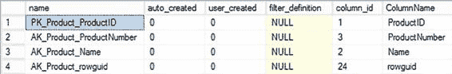
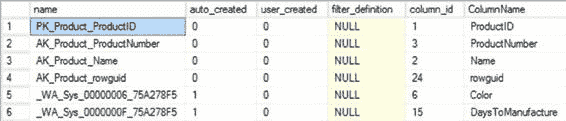
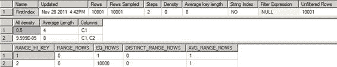
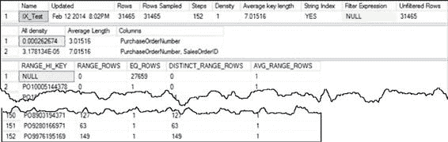
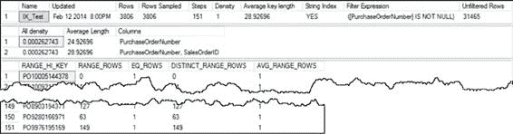
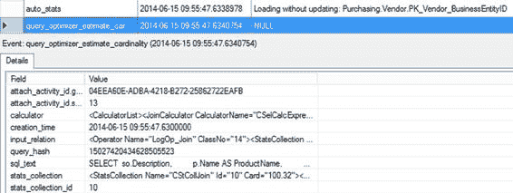
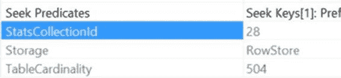
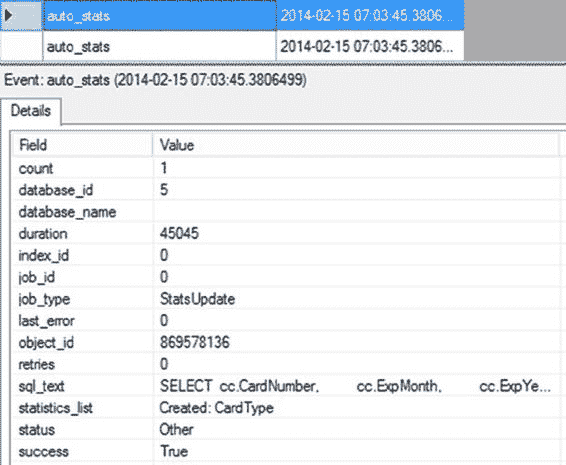
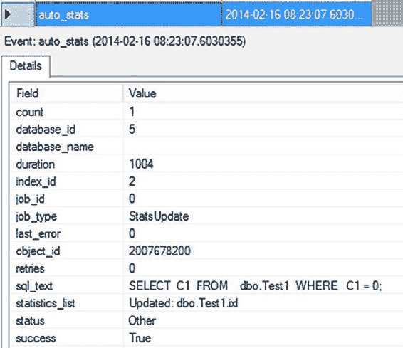

# 统计信息、数据分布与基数

统计信息以密度比的形式跟踪列的选择性。具有高选择性（或唯一性）的列将具有低密度。具有低密度（即高选择性）的列适合作为筛选条件，因为它可以帮助优化器快速检索少量行。这也是筛选索引（filtered index）运作的原理，因为筛选器的目标是提高索引的选择性或密度。

### 密度计算

密度可以表示如下：

`密度 = 1 / 列中不同值的数量`

密度的结果始终是介于 0 到 1 之间的数字。列的密度越低，它越适合用作索引键。你可以自己计算以确定索引和统计信息中列的密度。例如，要计算由 `create_t3.sql` 创建的测试表中列 `c1` 的密度，请使用以下查询（结果见图 12-19）：

```sql
SELECT 1.0 / COUNT(DISTINCT C1)
FROM dbo.Test1;
```

**图 12-19.** 列 `C1` 的密度计算结果

你可以在 `DBCC SHOW_STATISTICS` 输出的 `All density` 列中看到此实际数据。该列的高密度值使其不太适合作为索引（即使是筛选索引）的候选。然而，索引键值的统计信息有助于查询优化器将索引用于谓词 `C1 = 1`，如前面的执行计划所示。

### 多列索引的统计信息

对于单列索引，统计信息由该列的直方图和一个密度值组成。对于包含多列的复合索引，统计信息仅包含第一列的一个直方图和多个密度值。这是在构建复合索引或复合统计信息时，通常将选择性更高的列（密度最低的列）放在首位的一个原因。密度值包括第一列的密度以及索引键列的每个前缀组合的密度。多个密度值有助于优化器在 `WHERE` 和 `JOIN` 子句中谓词引用多列时，找到复合索引的选择性。尽管第一列有助于确定直方图，但列本身的最终密度与列的顺序无关。

[www.it-ebooks.info](http://www.it-ebooks.info/)





第 12 章 ■ 统计信息、数据分布与基数

多列密度图可能来自索引键中的多列，也可能来自手动创建的统计信息。但是，你永远不会看到由自动统计信息创建过程创建的多列密度图。让我们看一个简单的例子。这是一个可能生成包含两列统计信息的查询：

```sql
SELECT p.Name,
       p.Class
FROM Production.Product AS p
WHERE p.Color = 'Red' AND
      p.DaysToManufacture > 15;
```

在列 `p.Color` 和 `p.DaysToManufacture` 上创建的索引将具有一个多列密度值。在运行此查询之前，这是一个可以让你查看给定表上统计信息基本结构的查询：

```sql
SELECT s.name,
       s.auto_created,
       s.user_created,
       s.filter_definition,
       sc.column_id,
       c.name AS ColumnName
FROM sys.stats AS s
JOIN sys.stats_columns AS sc ON sc.stats_id = s.stats_id
                            AND sc.object_id = s.object_id
JOIN sys.columns AS c ON c.column_id = sc.column_id
                      AND c.object_id = s.object_id
WHERE s.object_id = OBJECT_ID('Production.Product');
```

在 `Production.Product` 表上运行此查询的结果如图 12-20 所示。

**图 12-20.** Product 表的统计信息列表

你可以看到表上的索引，每个索引都由单列组成。现在我将运行可能生成多列密度图的查询。但是，与其尝试通过 `SHOW_STATISTICS` 追踪统计信息，我将再次查询系统表。结果如图 12-21 所示。

**图 12-21.** Product 表中新增了两个统计信息

[www.it-ebooks.info](http://www.it-ebooks.info/)



第 12 章 ■ 统计信息、数据分布与基数

如你所见，系统没有添加一个包含多列的统计信息，而是创建了两个新的统计信息。你只会在多列索引键或手动创建的统计信息中获得多列统计信息。

为了更好地理解为多列索引维护的密度值，你可以修改之前使用的非聚集索引以包含两列。

```sql
CREATE NONCLUSTERED INDEX FirstIndex
ON dbo.Test1(C1,C2) WITH DROP_EXISTING = ON;
```

图 12-22 显示了由 `DBCC SHOW_STATISTICS` 提供的统计信息结果。

**图 12-22.** 多列索引 `FirstIndex` 上的统计信息

如你所见，`All density` 列下有两个密度值。

- 第一列的密度
- （第一列 + 第二列）组合的密度

对于包含三列的多列索引，索引的统计信息还将包含（第一列 + 第二列 + 第三列）组合的密度值。直方图不会包含任何其他列组合的选择性值。因此，此索引 (`FirstIndex`) 对于仅按第二列 (`C2`) 筛选行不太有用，因为第二列 (`C2`) 单独的值并未维护在直方图中。

你可以通过以下步骤计算图 12-19 中显示的第二个密度值 (`0.000099990000`)。

这是列组合 `(C1, C2)` 的不同值的数量。

```sql
SELECT 1.0 / COUNT(*)
FROM (SELECT DISTINCT
             C1,
             C2
      FROM dbo.Test1
     ) DistinctRows;
```

### 筛选索引的统计信息

筛选索引的目的是限制构成索引的数据，从而改变密度和直方图以使索引性能更佳。此示例将使用 AdventureWorks2012 数据库中的一个表，而不是测试表。在 `Sales.PurchaseOrderHeader` 表的 `PurchaseOrderNumber` 列上创建索引。

```sql
CREATE INDEX IX_Test
ON Sales.SalesOrderHeader (PurchaseOrderNumber);
```

[www.it-ebooks.info](http://www.it-ebooks.info/)





第 12 章 ■ 统计信息、数据分布与基数

图 12-23 显示了针对此新索引运行的 `DBCC SHOW_STATISTICS` 输出的标头和密度。

```sql
DBCC SHOW_STATISTICS('Sales.SalesOrderHeader',IX_Test);
```

**图 12-23.** 未筛选索引的统计信息标头

如果重新创建相同的索引以处理列中不为 `NULL` 的值，它将如下所示：

```sql
CREATE INDEX IX_Test
ON Sales.SalesOrderHeader (PurchaseOrderNumber)
WHERE PurchaseOrderNumber IS NOT NULL
WITH DROP_EXISTING = ON;
```

现在，在图 12-24 中查看统计信息。

**图 12-24.** 筛选索引的统计信息标头

首先你可以看到，由于存在筛选器，构成统计信息的行数在筛选索引中急剧下降，从 31465 行降至 3806 行。还要注意，由于不再处理零长度字符串，平均键长增加了。定义了筛选表达式，而不是图 12-21 中可见的 `NULL` 值。但两组数据的未筛选行是相同的。

[www.it-ebooks.info](http://www.it-ebooks.info/)

第 12 章 ■ 统计信息、数据分布与基数


密度测量结果很有意思。请注意，两个值的密度接近，但过滤后的密度略低，这意味着唯一值更少。这是因为过滤后的数据虽然选择性稍低，但实际上更准确，它消除了所有不会对搜索有贡献的 `NULL` 值。而第二个值（代表聚集索引指针）的密度与 `PurchaseOrderNumber` 单独的密度值相同，因为它们都代表了相同数量的唯一数据。上一列中额外聚集索引的密度是一个小得多的数字，这是由于 `SalesOrderId` 的所有唯一值因为 `NULL` 值的消除而未包含在过滤数据中。你还可以看到，直方图的第一列在图 12-23 中显示为 `NULL` 值，但在图 12-24 中却有值。

你还可以选择创建筛选统计信息。这允许你创建更精细的直方图。这在分区表上尤其有用。这是必要的，因为统计信息不会在分区表上自动创建，而且你无法使用 `CREATE STATISTICS` 创建自己的统计信息。你可以按分区创建筛选索引并获取统计信息，或者专门为分区创建筛选统计信息。

继续之前，清理（如有）已创建的索引。
```
DROP INDEX Sales.SalesOrderHeader.IX_Test;
```

**基数**

统计信息由直方图和密度组成，查询优化器使用它们来计算查询执行中每个过程（称为 `operations`）预期返回的行数。这个确定返回行数的计算称为 `cardinality estimate`（基数估计）。基数表示数据集中的行数，这意味着它与 SQL Server 中的密度度量直接相关。从 SQL Server 2014 开始，引入了一个新的基数估计器。这是自 SQL Server 7.0 以来对核心基数估计过程的首次更改。

估计器某些区域的更改意味着优化器以与以前相同的方式读取统计信息，但优化器根据已修改的基数计算，执行不同类型的计算来确定在执行计划中将通过每个操作的行数。

大多数情况下，数据是从直方图中提取的。对于单个谓词，值简单地使用直方图定义的选择性。但是，当使用多个列进行过滤时，基数计算必须考虑每个列潜在的选择性。在 SQL Server 2014 之前，使用几个简单的计算来确定基数。对于 `AND` 组合，计算基于将第一列的选择性乘以第二列的选择性，类似于这样：`Selectivity1 * Selectivity2 * Selectivity3 ...`

两个列之间的 `OR` 计算则更复杂。新的计算看起来像这样：`Selectivity1 * Power(Selectivity2,1/2) * Power(Selectivity3,1/4) ...`

简而言之，不是简单地相乘选择性以产生越来越高选择性的数据，而是提供了一个更柔和的计算，从选择性最低的数据到选择性最高的数据，但通过获取选择性的 1/2 次幂，然后 1/4 次幂，然后 1/8 次幂等等（取决于涉及多少列数据），从而得到一个更柔和、偏斜更小的估计。它不会改变所有生成的执行计划，但更准确的估计可能会改变某些位置的计划。

在 SQL Server 2014 中，发生了几组新的计算。这意味着对于大多数查询，平均而言，如果你的统计信息是最新的，你可能会看到性能提升，因为更准确的基数计算意味着优化器会做出更好的选择。但是，由于基数计算方式的更改，某些查询你也可能看到性能下降。这是可以预期的，因为你可能会遇到各种各样的工作负载、架构和数据分布。

[www.it-ebooks.info](http://www.it-ebooks.info/)

**第 12 章 ■ 统计信息、数据分布和基数**

SQL Server 2014 引入了另一个新的基数估计。在 SQL Server 2012 及更早版本中，当索引中包含递增或递减增量（例如标识列或日期时间值）的值引入了一个超出当前直方图范围的新行时，优化器会回退到其对无统计信息数据的默认估计，即一行。这可能导致严重不准确的查询计划，引起性能问题。现在，有了全新的计算。

首先，如果你使用 `FULLSCAN`（在“统计信息维护”部分详细解释）创建了统计信息，并且数据没有被修改，那么基数估计的工作方式与以前相同。

但是，如果统计信息是使用默认抽样创建的，或者数据已被修改，那么基数估计器将基于该统计信息集中返回的平均行数进行工作，并假设它不是单行。这可以使执行计划准确得多，但假设数据分布相当一致。不均匀的分布（称为 `skewed data`，偏斜数据）可能导致糟糕的基数估计，从而导致类似于糟糕的参数嗅探（在第 16 章详细介绍）的行为。

你现在可以使用扩展事件，通过 `query_optimizer_estimate_cardinality` 事件来观察基数估计的实际操作。我不会详细介绍事件的所有可能输出，但我确实想展示如何观察优化器行为，并在执行计划和基数估计之间建立关联。

对于绝大多数查询调优来说，这并不是那么有帮助，但如果你不确定优化器是如何做出估计的，或者这些估计似乎不准确，你可以使用这种方法进一步调查信息。

首先，你应该使用 `query_optimizer_estimate_cardinality` 事件设置一个扩展事件会话。

我创建了一个包含 `auto_stats` 事件的示例。然后，我运行了一个查询。
```
SELECT so.Description,
       p.Name AS ProductName,
       p.ListPrice,
       p.Size,
       pv.AverageLeadTime,
       pv.MaxOrderQty,
       v.Name AS VendorName
FROM   Sales.SpecialOffer AS so
       JOIN Sales.SpecialOfferProduct AS sop
            ON  sop.SpecialOfferID = so.SpecialOfferID
       JOIN Production.Product AS p
            ON  p.ProductID = sop.ProductID
       JOIN Purchasing.ProductVendor AS pv
            ON  pv.ProductID = p.ProductID
       JOIN Purchasing.Vendor AS v
            ON  v.BusinessEntityID = pv.BusinessEntityID
WHERE  so.DiscountPct > .15;
```

我选择了一个稍微复杂一些的查询，这样在执行计划中就有大量的运算符。当我运行查询时，我可以看到扩展事件会话的输出，如图 12-25 所示。

[www.it-ebooks.info](http://www.it-ebooks.info/)





**第 12 章 ■ 统计信息、数据分布和基数**

**图 12-25.** 显示 `query_optimizer_estimate_cardinality` 事件输出的会话
图 12-25 中可见的第一个事件显示 `auto_stats` 事件触发，因为它加载了索引 `Purchasing.ProductVendor.IX_ProductVendor_BusinessEntityID` 的统计信息。这意味着在基数估计触发之前，统计信息已经准备就绪。有多个这样的事件，包括一个针对 `PK_ProductID` 列的事件。


## 随后，“详细信息”选项卡上的信息是基数估算计算的结果输出。详细信息以 XML 格式包含在 `calculator` 字段和 `input_relation` 字段中。这些字段将显示计算的类型以及计算中使用的值。

如果您还捕获了查询的执行计划，您将在计划中获得额外的信息，以帮助您将基数估算与计划内的操作关联起来。如果您查看 `PK_ProductID` 列的 `Seek` 运算符的属性，您将获得如图 12-26 所示的值。

图 12-26. `聚集索引 Seek` 运算符的属性

`StatsCollectionId` 的值直接对应于图 12-25 中所示的事件以及该图中的 `stats_collection_id` 字段。这使您能够将统计信息收集事件与执行计划中的特定运算符相匹配。

## 启用和禁用基数估算器

如果您在 SQL Server 2014 中创建数据库，它将自动带有设置为 `120` 的兼容级别，这是 SQL Server 2014 的正确版本。但是，如果您从早期版本的 SQL Server 还原或附加数据库，则兼容级别将设置为该版本，即 `110` 或更早。该数据库随后将使用 SQL Server 7 基数估算器。您可以通过查看执行计划中第一个运算符（`SELECT`/`INSERT`/`UPDATE`/`DELETE`）的 `CardinalityEstimationModelVersion` 属性来判断，如图 12-27 所示。

[www.it-ebooks.info](http://www.it-ebooks.info/)


第 12 章 ■ 统计信息、数据分布与基数

图 12-27. 第一个运算符中显示正在使用的基数估算器的属性

SQL Server 2014 的显示值将对应于版本 `120`。这就是您可以判断正在使用哪个版本的基数估算器的方法。这很重要，因为估算可能导致执行计划的更改，因此您必须了解如何在因新的基数估算而导致性能下降时进行故障排除。

如果您怀疑遇到了升级引起的问题，您绝对应该比较执行计划中操作返回的实际行数与估计行数。这始终是判断统计信息或基数估算是否给您带来问题的好方法。您可以选择通过将兼容级别设置为 `110` 来禁用整个升级，但这也同时禁用了其他 SQL Server 2014 功能，因此可能不是一个好的选择。您可以对数据库的还原使用 `OPTION (QUERYTRACEON 9481)` 运行一个跟踪标志，这将仅针对该数据库的基数估算器。如果您在某个给定查询中确定遇到了新的基数估算器的问题，您可以在查询中以相同的方式利用跟踪标志。

```sql
SELECT p.Name,
    p.Class
FROM Production.Product AS p
WHERE p.Color = 'Red' AND
    p.DaysToManufacture > 15
OPTION(QUERYTRACEON 9481);
```

相反，如果您已使用跟踪标志或兼容级别关闭了基数估算器，您可以使用与之前相同的功能，但将跟踪标志值替换为 `2312`，有选择地为给定查询启用它。

## 统计信息维护

SQL Server 允许用户手动覆盖单个数据库中统计信息的维护。控制 SQL Server 自动统计信息维护行为的四个主要配置如下：

-   在没有索引的列上创建新统计信息（`自动创建统计信息`）
-   更新现有统计信息（`自动更新统计信息`）
-   用于生成统计信息的抽样程度
-   异步更新现有统计信息（`自动异步更新统计信息`）

您可以在数据库级别（所有表的所有索引和统计信息）或针对单个索引或统计信息逐案控制上述配置。`自动创建统计信息`设置仅适用于非索引列，因为 SQL Server 在创建索引时总是为索引键创建统计信息。

`自动更新统计信息`设置及其异步版本适用于索引和没有索引的 `WHERE` 子句列上的统计信息。

## 自动维护

默认情况下，SQL Server 会自动处理统计信息。`自动创建统计信息`和`自动更新统计信息`设置默认都是开启的。如前所述，通常最好保持这些设置为开启状态。`自动异步更新统计信息`设置默认是关闭的。

[www.it-ebooks.info](http://www.it-ebooks.info/)



第 12 章 ■ 统计信息、数据分布与基数

### 自动创建统计信息

`自动创建统计信息`功能会在查询的 `WHERE` 子句中引用非索引列时，自动在该列上创建统计信息。例如，当针对没有索引的列在 `Sales.SalesOrderHeader` 表上运行此 `SELECT` 语句时，将为该列创建统计信息。

```sql
SELECT cc.CardNumber,
    cc.ExpMonth,
    cc.ExpYear
FROM Sales.CreditCard AS cc
WHERE cc.CardType = 'Vista';
```

然后，`自动创建统计信息`功能（如果您已将其关闭，请确保重新打开）会自动在 `CardType` 列上创建统计信息。您可以在图 12-28 的扩展事件会话输出中看到这一点。

图 12-28. `AUTO_CREATE_STATISTICS ON` 的会话输出

`auto_stats` 事件触发以创建新的统计信息集。您可以在 `statistics_list` 字段中看到正在发生的事情的详细信息：“已创建：`CardType`。”

### 自动更新统计信息

`自动更新统计信息`功能会在永久表被查询引用时，自动更新其索引和列上的现有统计信息，前提是统计信息已被标记为过时。更改类型是操作语句，例如 `INSERT`、`UPDATE` 和 `DELETE`。更改数量的默认阈值取决于表中的行数，如表 12-4 所示。

[www.it-ebooks.info](http://www.it-ebooks.info/)

第 12 章 ■ 统计信息、数据分布与基数

表 12-4. 更改数量的统计信息更新阈值

| 行数 | 更改数量阈值 |
| --- | --- |
| < 500 | > 1 次插入 |
| >500 | 500 + 行更改的 20% |

行更改计为表中插入、更新或删除的次数。

使用阈值可以降低自动更新统计信息的频率。例如，考虑以下表（下载中的 `--autoupdates`）：

```sql
IF (SELECT OBJECT_ID('dbo.Test1')
) IS NOT NULL
DROP TABLE dbo.Test1;

CREATE TABLE dbo.Test1 (C1 INT);
CREATE INDEX ixl ON dbo.Test1(C1);
INSERT INTO dbo.Test1
    (C1)
VALUES (0);
```

在创建非聚集索引后，向表中添加了一行。这使得非聚集索引上的现有统计信息过时。如果执行以下带有 `WHERE` 子句中引用索引列的 `SELECT` 语句，如下所示，那么 `自动更新统计信息`功能会自动更新非聚集索引上的统计信息，如图 12-29 的会话输出所示。

```sql
SELECT C1
FROM dbo.Test1
WHERE C1 = 0;
```

[www.it-ebooks.info](http://www.it-ebooks.info/)



第 12 章 ■ 统计信息、数据分布与基数

图 12-29. `AUTO_UPDATE_STATISTICS ON` 的会话输出

统计信息更新后，相应表的更改跟踪机制被设置为 `0`。

通过这种方式，SQL Server 可以跟踪表的更改次数，并管理自动更新统计信息的频率。


