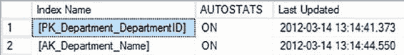

# 第 12 章 ■ 统计、数据分布与基数

• `sys.sp_createstats`：使用此存储过程为当前数据库中所有用户表的所有符合条件的列创建单列统计信息。这包括除计算列、具有 `NTEXT`、`TEXT`、`GEOMETRY`、`GEOGRAPHY` 或 `IMAGE` 数据类型的列、稀疏列以及已有统计信息或是索引首列的列之外的所有列。

此功能主要用于向后兼容，我不建议使用它。

类似地，要手动更新统计信息，请使用以下选项之一：

• `UPDATE STATISTICS`：您可以使用此选项更新表或索引视图的单个或所有索引键及非索引列的统计信息。

• `sys.sp_updatestats`：使用此存储过程更新当前数据库中所有用户表的统计信息。

您可能会发现，允许自动更新统计信息对于您的系统来说并不完全足够。在非工作时段安排对数据库执行 `UPDATE STATISTICS` 是处理此问题的可接受方法。`UPDATE STATISTICS` 是首选机制，因为它提供了更高程度的灵活性和控制力。由于插入的数据类型，用于收集统计信息的抽样方法（因其速度更快而被采用）可能无法收集到适当的数据。在这些情况下，您可以强制执行 `FULLSCAN`，以便使用所有数据来更新统计信息，就像统计信息最初创建时那样。这可能是一项成本高昂的操作，因此最好有选择性地决定对哪些索引进行此类处理以及何时运行。

■ 注意 通常，您应始终使用自动统计信息的默认设置。仅在确认默认设置似乎有损性能后，才考虑修改这些设置。

#### 统计信息维护状态

您可以使用以下方法验证自动统计信息功能的当前设置：

• `sys.databases`

• `DATABASEPROPERTYEX`

• `sp_autostats`

[www.it-ebooks.info](http://www.it-ebooks.info/)



#### 自动创建统计信息的状态

您可以通过查询 `sys.databases` 系统表来验证自动创建统计信息的当前设置。

```sql
SELECT is_auto_create_stats_on
FROM sys.databases
WHERE [name] = 'AdventureWorks2012';
```

返回值 1 表示启用，值 0 表示禁用。

您还可以使用 `sp_autostats` 系统存储过程验证特定索引的状态，如以下代码所示。向该存储过程提供任何表名，都将在全局统计信息设置的“输出”部分提供当前数据库的自动创建统计信息配置值。

```sql
USE AdventureWorks2012;
EXEC sys.sp_autostats
'HumanResources.Department';
```

图 12-30 显示了前述 `sp_autostats` 语句输出的摘录。

图 12-30. `sp_autostats` 输出

返回值 `ON` 表示启用，`OFF` 表示禁用。正如本章前面所述，在验证自动更新统计信息状态时，此存储过程更为有用。

#### 自动更新统计信息的状态

您可以以与验证自动创建统计信息类似的方式，验证自动更新统计信息以及异步自动更新统计信息的当前设置。使用函数 `DATABASEPROPERTYEX` 的方法如下：

```sql
SELECT DATABASEPROPERTYEX('AdventureWorks2012', 'IsAutoUpdateStatistics');
```

使用 `sp_autostats` 的方法如下。

```sql
USE AdventureWorks2012;
EXEC sp_autostats
'Sales.SalesOrderDetail';
```

#### 分析统计信息对查询的有效性

出于性能原因，在数据库对象上维护适当的统计信息极为重要。与统计信息相关的问题可能相当常见。在分析查询性能时，您需要对统计信息可能出现问题的可能性保持警惕。如果确实出现统计信息问题，那么它真的会让您大费周章。


实际上，在查询调优会话开始时检查统计信息是否为最新，可以避免一个容易修复的问题。在本节中，你将了解到当发现统计信息缺失或过时时，可以采取哪些措施。

[www.it-ebooks.info](http://www.it-ebooks.info/)

