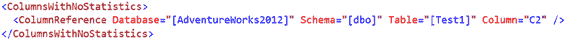
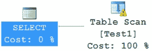
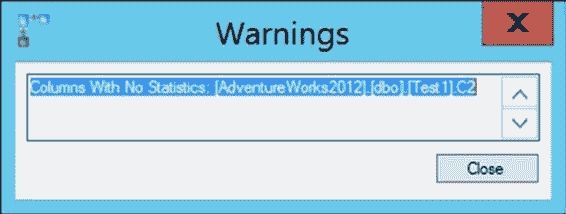

# 第 12 章：统计信息、数据分布与基数

在分析查询的执行计划时，请关注以下几点，以确保采用成本效益最优的处理策略：

*   筛选和连接条件中引用的列上存在索引。
*   若缺少索引，则应在没有索引的列上存在统计信息。拥有索引本身是更可取的。
*   由于过时的统计信息不仅无用，甚至可能产生误导，因此优化器依据统计信息所作的估算必须是最新的，这一点至关重要。

你在第 6 章分析了如何正确使用索引。在本节中，你将分析统计信息对查询的有效性。

#### 解决统计信息缺失问题

要了解如何识别并解决统计信息缺失问题，请考虑以下示例。为了更直接地控制数据，我将使用测试表，而非 `AdventureWorks2012` 中的表。首先使用 `ALTER DATABASE` 命令禁用自动创建统计信息和自动更新统计信息功能。

```sql
ALTER DATABASE AdventureWorks2012 SET AUTO_CREATE_STATISTICS OFF;

ALTER DATABASE AdventureWorks2012 SET AUTO_UPDATE_STATISTICS OFF;
```

创建一个包含大量行和非聚集索引的测试表。

```sql
IF EXISTS ( SELECT *
            FROM sys.objects
            WHERE object_id = OBJECT_ID(N'dbo.Test1') )
    DROP TABLE [dbo].[Test1] ;
GO

CREATE TABLE dbo.Test1 (C1 INT, C2 INT, C3 CHAR(50)) ;

INSERT INTO dbo.Test1
    (C1, C2, C3)
VALUES (51, 1, 'C3') ,
       (52, 1, 'C3') ;

CREATE NONCLUSTERED INDEX iFirstIndex ON dbo.Test1 (C1, C2) ;

SELECT TOP 10000
    IDENTITY( INT,1,1 ) AS n
INTO #Nums
FROM Master.dbo.SysColumns scl,
     Master.dbo.SysColumns sC2 ;

INSERT INTO dbo.Test1
    (C1, C2, C3)
SELECT n % 50,
       n,
       'C3'
FROM #Nums ;

DROP TABLE #Nums ;
```

[www.it-ebooks.info](http://www.it-ebooks.info/)







