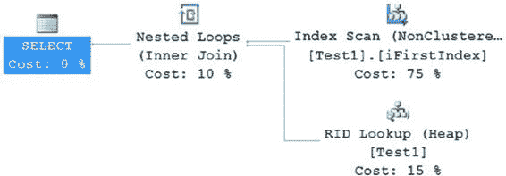

# 第 12 章：统计信息、数据分布与基数

由于索引是建立在 (`C1`, `C2`) 上的，该索引的统计信息包含了第一个列 `C1` 的直方图，以及前缀列组合（`C1` 和 `C1 * C2`）的密度值。没有单独为列 `C2` 提供直方图或密度值。

要了解如何识别没有索引的列上的缺失统计信息，请执行以下 `SELECT` 语句。由于自动创建统计信息功能已关闭，优化器将无法找到 `WHERE` 子句中使用的列 `C2` 的数据分布信息。在执行查询之前，请确保通过点击查询工具栏或按下 `CTRL+M` 启用了“包括实际执行计划”。

```sql
SELECT *
FROM dbo.Test1
WHERE C2 = 1;
```

如果右键单击执行计划，你可以查看其背后的 XML 数据。如图 12-31 所示，XML 执行计划在其 `Warnings` 元素下指出了某个执行步骤的统计信息缺失。这表明列 `Test1.C2` 的统计信息缺失。

图 12-31. XML 计划中的缺失统计信息指示

图形化执行计划也提供了缺失统计信息的提示，如图 12-32 所示。

图 12-32. 图形化计划中的缺失统计信息指示

图形化执行计划显示了一个带有黄色感叹号的操作符。这表明该操作符存在问题。你可以通过右键单击 `Table Scan` 操作符，然后从上下文菜单中选择 `Properties` 来获取警告的详细描述。属性页面中有一个警告部分可以深入查看，如图 12-33 所示。

图 12-33. 索引扫描操作符警告中的属性值

[www.it-ebooks.info](http://www.it-ebooks.info/)



