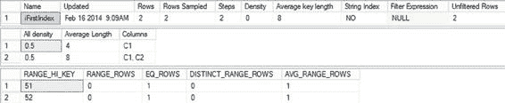

# 第 12 章：统计信息、数据分布与基数

图 12-33 显示该列的统计信息缺失。这可能妨碍优化器选择最佳处理策略。根据 `SET STATISTICS IO` 和 `SET STATISTICS TIME` 显示，当前此查询的开销如下：

```
Table 'Test1'. Scan count 1, logical reads 84
SQL Server Execution Times: CPU time = 0 ms, elapsed time = 22 ms.
```

要解决这个统计信息缺失问题，你可以使用 `CREATE STATISTICS` 语句在列 `Test1.C2` 上创建统计信息。

```sql
CREATE STATISTICS Stats1 ON Test1(C2);
```

在重新运行查询之前，请务必清空过程缓存，因为此查询将受益于简单参数化。

```sql
DBCC FREEPROCCACHE();
```

> **注意：** 这不应在生产系统上运行，因为它会移除缓存中存储的所有计划，导致所有查询大量重新编译，可能对性能产生严重的负面影响。

图 12-34 显示了在列 `C2` 上创建统计信息后的执行计划结果。

```
Table 'Test1'. Scan count 1, logical reads 34
SQL Server Execution Times:CPU time = 0 ms, elapsed time = 17 ms.
```

图 12-34. 包含统计信息的执行计划

查询优化器使用复合索引中非首列上的统计信息来确定扫描复合索引的叶级别以获取 `RID` 查找信息，是否比扫描整个表更高效。在此情况下，在列 `C2` 上创建统计信息使得优化器能够确定，与其扫描基表，不如扫描 (`C1`, `C2`) 上的复合索引并书签查找到基表中的少数匹配行，成本会更低。因此，逻辑读取次数从 84 减少到 34，但经过时间仅略微减少。

[www.it-ebooks.info](http://www.it-ebooks.info/)



