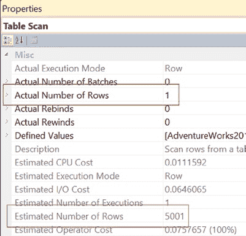
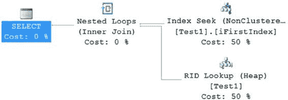

# 第 12 章：统计、数据分布和基数

你可以从执行计划中获取估计和实际行数的信息。估计执行计划仅参考并使用统计信息，而非实际数据。这意味着它与实际数据可能大相径庭，正如你现在所看到的。而实际执行计划则同时包含估计行数和实际行数。

执行查询会产生此执行计划（图 12-36）和性能数据：
```
Table 'Test1'. Scan count 1, logical reads 84
SQL Server Execution Times: CPU time = 0 ms, elapsed time = 16 ms.
```




**图 12-36.** 使用过期统计信息的执行计划

要查看估计行数和实际行数，你可以查看 `Table Scan` 运算符的属性（图 12-37）。

**图 12-37.** 显示行数差异的属性

从估计行数值与实际行数值的对比可以明显看出，优化器基于过时的统计信息做出了错误的估计。如果估计行数和实际行数之间的差异超过 10 倍，那么所选择的处理策略对于当前的数据分布来说很可能不太具有成本效益。不准确的估计可能会误导优化器决定处理策略。统计信息不准确的原因有很多。表变量和多语句用户定义函数根本没有统计信息，因此对这些对象的所有估计都假定为单行，而不考虑对象实际涉及多少行。

为了帮助优化器做出准确的估计，你应该更新列 `C1` 上非聚集索引的统计信息（当然，你也可以直接保持自动更新统计信息功能开启）。
```sql
UPDATE STATISTICS Test1 iFirstIndex WITH FULLSCAN;
```
这里可能不需要 `FULLSCAN`。采用抽样方法创建的统计信息通常相当准确，而且速度快得多。但是，在系统负载不高或非高峰时段，我倾向于使用 `FULLSCAN`，因为它能提高准确性。只要你能得到所需的统计信息，这两种方法都是有效的。

如果你再次运行查询，将得到以下统计信息，输出结果如图 12-38 所示：
```
Table 'Test1'. Scan count 1, logical reads 4
SQL Server Execution Times: CPU time = 0 ms, elapsed time = 0 ms.
```



**图 12-38.** 使用最新统计信息的实际行数和估计行数

优化器利用更新的统计信息准确地估计了行数，从而能够制定出更高效的计划。由于估计行数为 1，通过 `C1` 上的非聚集索引检索行是有意义的，而不是扫描基表。

在索引键列上更新准确的统计信息有助于优化器就处理策略做出更佳决策，从而将逻辑读次数从 84 次减少到 4 次，并将执行时间从 16 毫秒减少到 0 毫秒（存在 4 毫秒的延迟）。

在继续之前，重新为数据库启用统计信息。
```sql
ALTER DATABASE AdventureWorks2012 SET AUTO_CREATE_STATISTICS ON;
ALTER DATABASE AdventureWorks2012 SET AUTO_UPDATE_STATISTICS ON;
```

## 建议

在本章中，我介绍了关于统计信息的各种建议。为便于查阅，我将这些建议整合并扩展如下。

### 统计信息的向后兼容性

SQL Server 2014 中的统计信息生成方式可能与之前版本的 SQL Server 不同。然而，SQL Server 2014 在升级过程中会传输统计信息，并且默认情况下，会随着数据变化自动更新这些统计信息。但是，为了获得最佳性能，我建议在升级后立即手动更新统计信息，如果可能，最好使用 `FULLSCAN`。

### 自动创建统计信息

此功能通常应保持开启。在默认设置下，在创建执行计划期间，SQL Server 会判断非索引列上的统计信息是否有益。如果认为有益，SQL Server 会在该非索引列上创建统计信息。但是，如果你计划手动在非索引列上创建统计信息，那么你必须准确识别哪些非索引列上的统计信息会有帮助。

### 自动更新统计信息

此功能通常应保持开启，允许 SQL Server 根据数据分布随时间的变化来决定合适的执行计划。通常，此功能带来的性能收益大于开销。你很少需要干预统计信息的自动维护，此类需求通常在故障排除或分析性能时才会被发现。为了确保你不会因自动统计信息功能而遇到意外情况，在诊断 SQL Server 问题时分析统计信息的有效性非常重要。

不幸的是，如果你遇到自动更新统计信息功能的问题并不得不将其关闭，请确保创建一个 SQL Server 作业来更新统计信息，并将其安排为定期运行。出于性能原因，如有可能，请确保将 SQL 作业安排在非高峰时段运行。

你可以通过以下简单步骤，在 SQL Server Management Studio 中创建用于更新统计信息的 SQL Server 作业：

1.  选择 **ServerName** ➤ **SQL Server Agent** ➤ **Jobs**，右键单击并选择 **New Job**。
2.  在 **New Job** 对话框的 **General** 页面上，输入作业名称和其他详细信息，如图 12-39 所示。

    **图 12-39.** 输入新作业信息

3.  选择 **Steps** 页面，单击 **New**，并为用户数据库输入 SQL 命令，如图 12-40 所示。这是一种确保更新数据库中所有表上所有统计信息的简短方法。它不够精确，并且根据系统大小可能会产生较大负载，因此在运行前请确保这确实是你的系统所需要的。
    ```sql
    EXEC sys.sp_MSforeachtable 'UPDATE STATISTICS ? ALL WITH FULLSCAN';
    ```
    **图 12-40.** 为用户数据库输入 SQL 命令

4.  通过单击 **OK** 按钮返回 **New Job** 对话框。
5.  在 **New Job** 对话框的 **Schedules** 页面上，单击 **New Schedule**，并输入运行 SQL Server 作业的适当计划。通过单击 **OK** 按钮返回 **New Job** 对话框。
6.  输入所有信息后，单击 **New Job** 对话框中的 **OK** 以创建 SQL Server 作业。
7.  确保 **SQL Server Agent** 正在运行，以便 SQL Server 作业在设定的计划时间自动运行。

另一种统计信息维护方法是运行由 Ola Holengren 开发和维护的脚本之一：http://bit.ly/JijaNI。

### 异步自动更新统计信息


