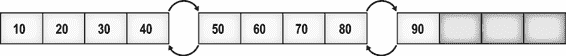
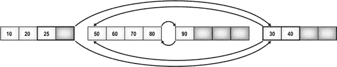
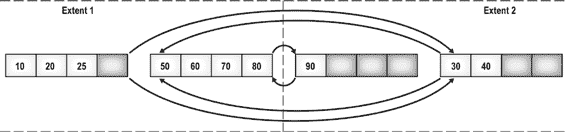

# 第 13 章：索引碎片

如第 8 章所述，索引列值存储在索引 B 树结构的叶级页中。当你在表上创建索引（聚集或非聚集）时，通过对索引的叶级页及页内行进行正确排序，可以降低数据检索的成本。在 OLTP 数据库中，数据不断变化，导致索引产生碎片。结果，为了返回相同数量的行，随着时间的推移，所需的读取次数会增加。

本章将涵盖以下主题：

*   索引碎片的产生原因，包括分析由`INSERT`和`UPDATE`语句引起的页拆分
*   碎片相关的开销成本
*   如何分析碎片量
*   解决碎片的技术
*   填充因子（`fill factor`）在帮助控制碎片方面的重要性
*   如何自动化碎片分析过程

## 碎片的原因

当表中的数据被修改时，就会产生碎片。当你向表中插入或更新数据（通过`INSERT`或`UPDATE`）时，表对应的聚集索引和受影响的非聚集索引都会被修改。如果对索引的修改无法在同一页内容纳，则可能导致索引叶级页拆分。然后将添加一个新的叶级页，其中包含原页的一部分内容，并保持索引键中行的逻辑顺序。虽然新的叶级页保持了原页中数据行的*逻辑*顺序，但这个新页在磁盘上通常不会与原页*物理*相邻。或者，稍微换种说法，索引的逻辑键顺序与文件内的物理顺序不匹配。

例如，假设一个索引有九个键值（或索引行），并且索引行的平均大小允许一个叶级页最多容纳四个索引行。如第 8 章所述，8KB 的叶级页连接到前一个和后一个叶级页以维护索引的逻辑顺序。图 13-1 展示了索引叶级页的布局。

**图 13-1.** 叶级页布局

由于叶级页中的索引键值总是排序的，一个键值为 25 的新索引行必须占据现有键值 20 和 30 之间的位置。因为包含这些现有索引键值的叶级页已满（有四个索引行），新索引行将导致相应的叶级页拆分。将为索引分配一个新的叶级页，并将第一个叶级页的一部分移动到这个新叶级页，以便可以按正确的逻辑顺序插入新的索引键。索引页之间的链接也会被更新，以便页按索引顺序逻辑连接。如图 13-2 所示，新的叶级页，即使以正确的逻辑顺序链接到其他页，在物理上也可能是乱序的。

**图 13-2.** 乱序的叶级页

页被分组在更大的单元中，称为*区（extents）*，一个区可以包含八个页。SQL Server 使用区作为磁盘上的物理分配单位。理想情况下，包含索引叶级页的区的物理顺序应与索引的逻辑顺序相同。这减少了在检索一系列索引行时在区之间切换的次数。然而，页拆分可能会使区内的页物理上无序，并且它们也可能使区本身物理上无序。例如，假设索引的前两个叶级页在区 1 中，第三个叶级页在区 2 中。如果区 2 有空闲空间，那么由于页拆分而分配给索引的新叶级页将在区 2 中，如图 13-3 所示。

**图 13-3.** 分布在多个区中的乱序叶级页

随着叶级页分布在两个区中，理想情况下，你预期检索一系列索引行最多只需要在两个区之间切换一次。然而，区之间的页组织混乱可能导致检索一系列索引行时需要多次区切换。例如，要检索键值在 25 到 90 之间的一系列索引行，你将需要在两个区之间进行三次区切换，如下所示：

*   第一次区切换：在键值 25 之后检索键值 30
*   第二次区切换：在键值 40 之后检索键值 50
*   第三次区切换：在键值 80 之后检索键值 90

[www.it-ebooks.info](http://www.it-ebooks.info/)

