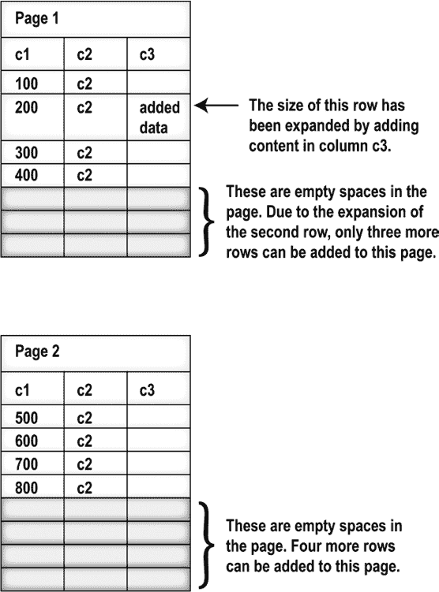
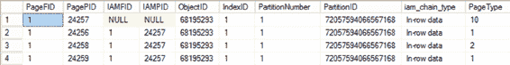
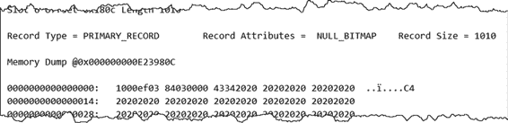
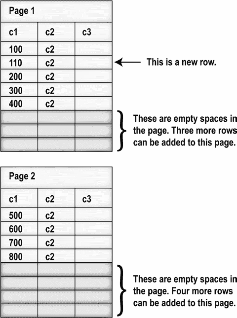

# 第 13 章 索引碎片

你可以在图 13-4 中看到此查询的结果。

**图 13-4. 索引 iClust 的物理布局**

从此输出的 `page_count` 列中，你可以看到分配给聚集索引的页数为 1。你还可以在 `avg_page_space_used_in_percent` 列中看到平均使用空间为 100。由此你可以推断，该页已没有剩余的空闲空间来扩展 `C3` 列的内容，该列类型为 `VARCHAR(10)` 且当前为空。

[www.it-ebooks.info](http://www.it-ebooks.info/)


> **注意** 我将在本章后面的“分析碎片量”一节中分析 `sys.dm_db_index_physical_stats` 提供的更多信息。

因此，如果你尝试按如下方式扩展某一行 `C3` 列的内容，它应该会导致页拆分：

```sql
UPDATE dbo.Test1
SET C3 = 'Add data'
WHERE C1 = 200;
```

从 `sys.dm_db_index_physical_stats` 中选择数据，会得到图 13-5. 中的信息。

**图 13-5. 数据更新后的 i1 索引**

从图 13-5, y 的输出中可以看到，SQL Server 已向索引添加了一个新页。在发生页拆分时，SQL Server 通常会将原始页中总行数的一半移动到新页。因此，两个页中的行分布如图 13-6. 所示。

[www.it-ebooks.info](http://www.it-ebooks.info/)



**图 13-6. 由 UPDATE 语句引起的页拆分**

从前面的表中可以看出，由 `UPDATE` 语句引起的页拆分导致叶级页中的数据出现内部碎片。如果新的叶级页无法在物理上紧邻原始叶级页写入，那么还会产生外部碎片。对于碎片量大的大表，需要更多的叶级页来容纳所有索引行。

另一种查看页面分布的方法是使用一些未充分文档化的 `DBCC` 命令。

首先，你可以使用 `DBCC IND` 查看表中的页。

```sql
DBCC IND(AdventureWorks2012,'dbo.Test1',-1)
```

此命令列出构成表的页。你会得到一个类似图 13-7 的输出。

[www.it-ebooks.info](http://www.it-ebooks.info/)




**图 13-7. DBCC IND 的输出，显示两个页**

如果你关注 `PageType`，可以看到现在有两个 `PageType = 1` 的页，即数据页。

输出中还有其他列，也显示了页是如何链接在一起的。

为了展示前面页面中行的最终分布，你可以在每个页末尾添加一行：

```sql
INSERT INTO dbo.Test1
VALUES (410, 'C4', ''),
(900, 'C4', '');
```

这些新行被容纳在现有的两个叶级页中，而不会引起页拆分。你可以通过查询查看页信息的另一种机制 `DBCC PAGE` 来确认这一点。要调用它，你需要从 `DBCC IND` 的输出中获取 `PagePID`。这将使你能够转储一个页上的所有内容。

```sql
DBCC TRACEON(3604);
DBCC PAGE('AdventureWorks2012',1,24256,3);
```

此命令的输出解释起来很复杂，但如果你滚动到底部，可以看到输出，如图 13-8. 所示。

**图 13-8. 添加更多行后的页**

在屏幕右侧，你可以看到内存转储的输出，一个值“C4”。这是由前面的数据添加的。在我们的测试中，两行都被添加到了一个页中。要全面解释这两个 `DBCC` 调用所有可能的排列组合，远远超出了本章的范围。但你要知道，你可以确定任何给定表的数据存储在哪个页上。

[www.it-ebooks.info](http://www.it-ebooks.info/)




## 由 INSERT 语句引起的页拆分

要理解 `INSERT` 语句如何引起页拆分，请创建与之前相同的测试表，包含初始的八行和聚集索引。由于单个索引叶级页已完全填满，任何尝试按如下方式添加中间行的操作都应导致叶级页的页拆分。

```sql
INSERT INTO Test1
VALUES (110, 'C2', '');
```

你可以通过检查 `sys.dm_db_index_physical_stats` 的输出（图 13-9). 来验证这一点。

**图 13-9. 插入后的页**

如前所述，原始叶级页中的一半行被移动到新页。一旦在原始叶级页中腾出空间，新行就会按适当的顺序添加到原始叶级页中。请注意，一行只与一个页关联；它不能跨越多个页。图 13-10 shows 两个页中行的最终分布。

**图 13-10. 由 INSERT 语句引起的页拆分**

[www.it-ebooks.info](http://www.it-ebooks.info/)

从前一个索引页中，你可以看到由 `INSERT` 语句引起的页拆分导致行稀疏地分布在叶级页上，从而引起内部碎片。它通常也会引起外部碎片，因为新的叶级页可能无法在物理上与原始页相邻。对于碎片量大的大表，由 `INSERT` 语句引起的页拆分将需要更多的叶级页来容纳所有的索引行。

为了演示索引页中显示的行分布，你可以再次运行创建 `dbo.Test1` 的脚本，向这些页添加更多行：

```sql
INSERT INTO dbo.Test1
VALUES (410, 'C4', ''),
(900, 'C4', '');
```

结果与前面的示例相同：这些新行可以被容纳在两个现有的叶级页中，而不会引起任何页拆分。你可以通过调用 `DBCC IND` 和 `DBCC PAGE` 来验证这一点。注意，在第一页中，新行被添加到该页的其他行之间。由于页中有可用空间，这不会引起页拆分。

那么，当你必须向索引末尾添加行时呢？在这种情况下，即使需要一个新页，它也不会拆分任何现有页。例如，添加一个 `C1` 等于 1300 的新行将需要一个新页，但它不会引起页拆分，因为该行不是添加在中间位置。因此，如果新行是按聚集索引的顺序添加的，那么索引行将始终添加在索引的末尾，从而防止原本可能由 `INSERT` 语句引起的页拆分。

由页拆分引起的碎片会损害数据检索性能，接下来你将看到这一点。

## 碎片开销

内部和外部碎片都会对数据检索性能产生不利影响。外部碎片导致磁盘上的索引页序列不连续，新的叶级页远离原始叶级页，并且它们的物理顺序与逻辑顺序不同。因此，对索引的范围扫描将需要比理想情况下更多的区切换，如本章前面所述。此外，对索引的范围扫描将无法受益于磁盘执行的预读操作。如果页面是连续排列的，那么预读操作可以在头部移动不多的情况下提前读取页面。


