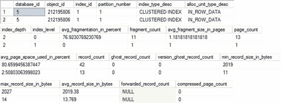
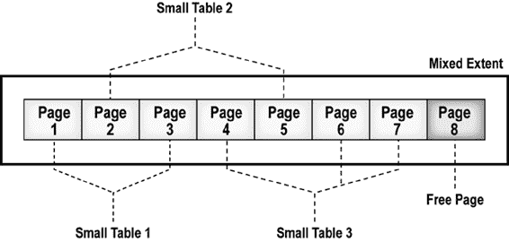

# 第十三章 ■ 索引碎片

动态管理函数 `sys.dm_db_index_physical_stats` 会扫描索引的页面以返回数据。你可以控制扫描的级别，这会影响扫描的速度和准确性。要快速检查索引的碎片情况，请使用 `Limited` 选项。通过使用 `Sample` 选项（如前面的示例，扫描 1% 的页面），你可以获得更高的准确性，同时速度仅适度下降。要获得最高的准确性，请使用 `Detailed` 扫描，它会访问索引中的所有页面。但请理解，`Detailed` 扫描可能会对性能产生重大影响，具体取决于所涉及的表和索引的大小。如果索引少于 10,000 个页面，而你选择了 `Sample` 模式，则系统会转而使用 `Detailed` 模式。这意味着尽管在之前的查询中做出了选择，但实际使用了 `Detailed` 扫描模式。默认模式是 `Limited`。

通过定义不同的参数，你可以获取不同数据集的碎片信息。如果移除之前查询中的 `OBJECTID` 函数并提供一个 `NULL` 值，查询将返回数据库中所有索引的信息。对此不必感到惊讶，但要避免不小心对所有索引运行 `Detailed` 扫描。你也可以指定要获取信息的索引，甚至是分区索引的特定分区。

`sys.dm_db_index_physical_stats` 的输出包含 21 个不同的列。我选择了一组基本的列，用于确定索引的碎片和大小。此输出代表以下内容：

- `avg_fragmentation_in_percent`：此数字表示索引和堆的逻辑平均碎片百分比。如果表是堆且模式为 `Sampled`，则此值将为 `NULL`。如果平均碎片率低于 10% 到 20%，并且表不是非常大，那么碎片不太可能成为问题。如果索引碎片率在 20% 到 40% 之间，碎片可能是个问题，但通常可以通过索引重新组织（关于索引重新组织和索引重建的更多信息，请参阅“碎片解决方案”一节）来改善。大规模碎片，通常大于 40%，可能需要重建索引。你的系统可能有不同的要求，不一定要遵循这些一般数字。

- `fragment_count`：此数字表示构成索引的片段（即分离的页面组）的数量。这个数字有助于理解索引的分布情况，特别是当与 `page_count` 值进行比较时。当采样模式为 `Sampled` 时，`fragment_count` 为 `NULL`。大量的片段数是存储碎片的另一个迹象。

[www.it-ebooks.info](http://www.it-ebooks.info/)



- `page_count`：这个数字是构成统计信息的索引或数据页面的数量。这个数字是大小的一个度量，但也可以帮助指示碎片情况。如果你知道数据或索引的大小，你可以计算一个页面可以容纳多少行。然后，如果你将此数字与表中的行数相关联，应该会得到一个接近 `page_count` 的值。如果 `page_count` 值显著偏高，你可能正在处理碎片问题。请参考 `avg_fragmentation_in_percent` 值以获得精确的度量。

- `avg_page_space_used_in_percent`：要了解索引页面内分配空间的使用情况，请使用此数字。当采样模式为 `Limited` 时，此值为 `NULL`。

- `record_count`：简单来说，这是统计信息所代表的记录数量。对于索引，这是扫描模式所表示的 B 树当前层级中的记录数。（详细扫描将显示 B 树的所有层级，而不仅仅是叶级。）对于堆，此数字表示存在的记录数，但此数字可能与表中的行数并不完全对应，因为一个堆在更新后可能有两条记录，并且可能发生页面拆分。

- `avg_record_size_in_bytes`：此数字简单地表示索引或堆记录中存储的数据量的一个有用度量。

使用 `Detailed` 模式运行 `sys.dm_db_index_physical_stats` 将为给定索引返回多行数据。也就是说，如果该索引跨越多个层级，则会显示多行。当索引跨越多个页面时，索引中就会存在多个层级。要查看其外观并观察动态管理函数中存在的其他一些数据列，请按以下方式运行查询：

```sql
SELECT ddips.*
FROM sys.dm_db_index_physical_stats(DB_ID('AdventureWorks2012'),
OBJECT_ID(N'dbo.Test1'),NULL,
NULL,'Detailed') AS ddips;
```

为了使数据易于阅读，我将结果数据表分成了三部分，放在一张图中；请参见图 13-12。

**图 13-12.** 碎片索引的详细扫描

[www.it-ebooks.info](http://www.it-ebooks.info/)



如你所见，返回了两行，分别代表索引的叶级（`index_level = 0`）和 B 树的第一级（`index_level = 1`，即第二行）。你可以看到 `sys.dm_db_index_physical_stats` 提供的更多信息，这些信息可以提供对索引更详细的分析。例如，你可以看到最小和最大的记录大小，以及索引深度（B 树中的层级数）和每个层级上的记录数。对于基本的碎片分析，这些信息大多不太有用，这就是为什么我在示例中选择了限制列数并使用 `Sampled` 扫描模式。

## 分析小型表的碎片

不要过于担心 `sys.dm_db_index_physical_stats` 对小型表的输出。对于少于八个页面的小型表或索引，SQL Server 为这些页面使用混合区。例如，如果一个表（SmallTable1 或其聚集索引）只包含两个页面，那么 SQL Server 会从一个混合区中分配这两个页面，而不是专门为该表分配一个区。混合区还可能包含其他小型表/索引的页面，如图 13-13 所示。

**图 13-13.** 混合区

页面分布在多个混合区上可能会让你认为表或索引存在高度的外部碎片，而实际上这是 SQL Server 的设计使然，因此是完全可以接受的。

要了解小型表或索引的碎片信息可能是什么样子，请创建一个带有聚集索引的小型表。

```sql
IF (SELECT OBJECT_ID('dbo.Test1')
) IS NOT NULL
DROP TABLE dbo.Test1;
GO
CREATE TABLE dbo.Test1
(C1 INT,
C2 INT,
C3 INT,
C4 CHAR(2000)
);
```

[www.it-ebooks.info](http://www.it-ebooks.info/)


```sql
DECLARE @n INT = 1;
WHILE @n <= 28
BEGIN
INSERT INTO dbo.Test1
VALUES (@n, @n, @n, 'a');
SET @n = @n + 1;
END
CREATE CLUSTERED INDEX FirstIndex ON dbo.Test1(C1);
```

在前面的表中，每个 `INT` 占用 4 字节，平均行大小为 2,012 (=4 + 4 + 4 + 2,000) 字节。


因此，默认的 8KB 页面最多可以包含四行。当所有 28 行都添加到表中后，会创建一个聚集索引来物理排列这些行，并将碎片降至最低。由于内部碎片最小，聚集索引（或基表）需要七个（=28 / 4）页面。因为页面数不超过八个，SQL Server 会为聚集索引（或基表）使用混合区中的页面。如果用于聚集索引的混合区不是连续相邻的，那么 `sys.dm_db_index_physical_stats` 的输出可能会显示出很高的外部碎片量。但是，作为 SQL 用户，你无法减少由此产生的外部碎片。图 13-14 展示了 `sys.dm_db_index_physical_stats` 的输出。

图 13-14. 一个小聚集索引的碎片情况

根据 `sys.dm_db_index_physical_stats` 的输出，你可以如下分析这个小聚集索引（或表）的碎片：

- `avg_fragmentation_in_percent`：虽然这个索引可能跨越多个区，但此处显示的碎片并非外部碎片的指示，因为该索引存储在混合区上。
- `Avg_page_space_used_in_percent`：这显示所有或大部分数据都良好地存储在 `pagecount` 字段显示的七个页面内。这排除了逻辑碎片的可能性。
- `Fragment_count`：这表明数据是碎片化的，并存储在不止一个区上，但由于其长度少于八个页面，SQL Server 在数据存储位置上没有太多选择。

尽管有上述误导性的数值，一个少于八页的小表（或索引）不太可能从消除碎片的努力中受益，因为它将存储在混合区上。

一旦确定索引（或表）中的碎片需要处理，你就需要决定使用哪种碎片整理技术。影响这一决定的因素以及不同的技术将在下一节中解释。

[www.it-ebooks.info](http://www.it-ebooks.info/)

