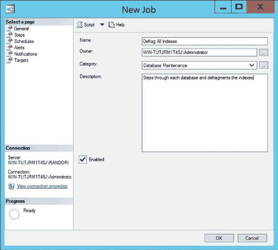
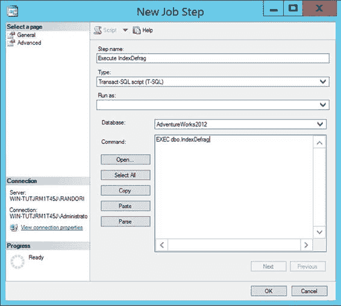
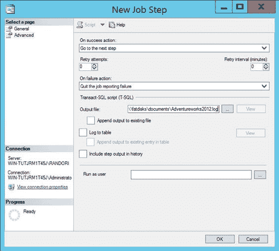
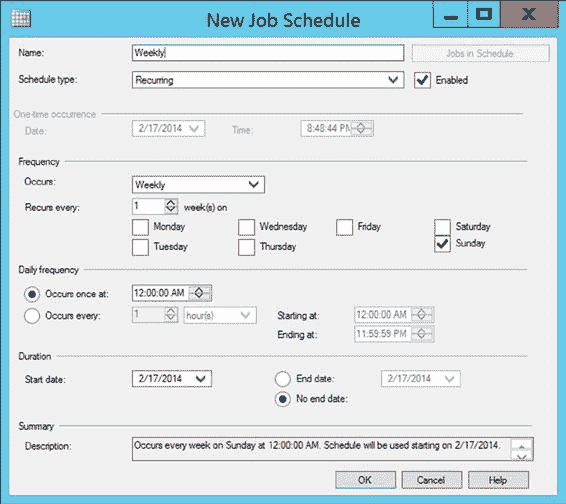
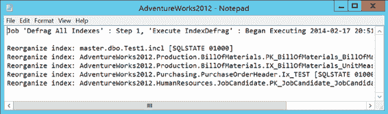

# 第 13 章 索引碎片整理

*   表/索引不能非常小——即 `pagecount` 大于 8

## 4. 对高碎片化的表和索引进行碎片整理

这里包含了一个 SQL 存储过程的示例，以便于参考。此脚本将执行基本操作，我将其包含在此处用于教学目的。但对于一个功能齐全、包含强大能力的脚本，我强烈推荐使用 Michelle Ufford 提供的脚本，地址为：[`bit.ly/1cjmzXv`](http://bit.ly/1cjmzXv)。另一套流行的脚本是 Ola Hollengren 的，地址为：[`bit.ly/JijaNI`](http://bit.ly/JijaNI)。

[www.it-ebooks.info](http://www.it-ebooks.info/)

我的脚本执行以下操作：

*   遍历系统上的所有数据库，识别每个数据库中符合碎片标准的用户表索引，并将它们保存在一个临时表中
*   根据碎片级别，重组轻度碎片的索引，并重建高度碎片化的索引

以下是分析和解决数据库碎片的方法（请将其存储在系统上的适当位置；我有一个专门用于企业级脚本的数据库）：

```sql
CREATE PROCEDURE IndexDefrag
AS
DECLARE @DBName NVARCHAR(255),
    @TableName NVARCHAR(255),
    @SchemaName NVARCHAR(255),
    @IndexName NVARCHAR(255),
    @PctFrag DECIMAL,
    @Defrag NVARCHAR(MAX)

IF EXISTS ( SELECT *
    FROM sys.objects
    WHERE object_id = OBJECT_ID(N'#Frag') )
    DROP TABLE #Frag;

CREATE TABLE #Frag (
    DBName NVARCHAR(255),
    TableName NVARCHAR(255),
    SchemaName NVARCHAR(255),
    IndexName NVARCHAR(255),
    AvgFragment DECIMAL)

EXEC sys.sp_MSforeachdb 'INSERT INTO #Frag ( DBName, TableName, SchemaName, IndexName, AvgFragment ) SELECT ''?'' AS DBName ,t.Name AS TableName ,sc.Name AS SchemaName ,i.name AS IndexName ,s.avg_fragmentation_in_percent FROM ?.sys.dm_db_index_physical_stats(DB_ID(''?''), NULL, NULL, NULL, ''Sampled'') AS s JOIN ?.sys.indexes i ON s.Object_Id = i.Object_id AND s.Index_id = i.Index_id JOIN ?.sys.tables t ON i.Object_id = t.Object_Id JOIN ?.sys.schemas sc ON t.schema_id = sc.SCHEMA_ID WHERE s.avg_fragmentation_in_percent > 20 AND t.TYPE = ''U'' AND s.page_count > 8 ORDER BY TableName,IndexName';

DECLARE cList CURSOR
FOR
    SELECT *
    FROM #Frag

OPEN cList;

FETCH NEXT FROM cList
INTO @DBName,@TableName,@SchemaName,@IndexName,@PctFrag;

WHILE @@FETCH_STATUS = 0
BEGIN
    IF @PctFrag BETWEEN 20.0 AND 40.0
    BEGIN
        SET @Defrag = N'ALTER INDEX ' + @IndexName + ' ON ' + @DBName
            + '.' + @SchemaName + '.' + @TableName + ' REORGANIZE';
        EXEC sp_executesql @Defrag;
        PRINT 'Reorganize index: ' + @DBName + '.' + @SchemaName + '.'
            + @TableName + '.' + @IndexName;
    END
    ELSE
        IF @PctFrag > 40.0
        BEGIN
            SET @Defrag = N'ALTER INDEX ' + @IndexName + ' ON '
                + @DBName + '.' + @SchemaName + '.' + @TableName
                + ' REBUILD';
            EXEC sp_executesql @Defrag;
            PRINT 'Rebuild index: ' + @DBName + '.' + @SchemaName
                + '.' + @TableName + '.' + @IndexName;
        END

    FETCH NEXT FROM cList
    INTO @DBName,@TableName,@SchemaName,@IndexName,@PctFrag;
END

CLOSE cList;
DEALLOCATE cList;
DROP TABLE #Frag;
GO
```

要自动化碎片分析过程，您可以通过以下简单步骤从 SQL Server 企业管理器创建一个 SQL Server 作业：

1.  打开 Management Studio，右键单击 SQL Server Agent 图标，然后选择“新建”➤“作业”。
2.  在“新建作业”对话框的“常规”页上，输入作业名称和其他详细信息，如图 13-22 所示。

    [www.it-ebooks.info](http://www.it-ebooks.info/)

    

    **图 13-22.** 输入作业名称和详细信息

3.  在“新建作业”对话框的“步骤”页上，单击“新建”，然后输入用户数据库的 SQL 命令，如图 13-23 所示。

    [www.it-ebooks.info](http://www.it-ebooks.info/)

    

    **图 13-23.** 输入用户数据库的 SQL 命令


4.  在“新建作业步骤”对话框的“高级”页面中，输入一个输出文件名来报告碎片分析结果，如**图 13-24**所示。

[www.it-ebooks.info](http://www.it-ebooks.info/)



第 13 章 ■ 索引碎片

**图 13-24.** 输入输出文件名

5.  单击“确定”返回到“新建作业”对话框。
6.  在“新建作业”对话框的“计划”页面中，单击“新建计划”，并输入合适的计划来运行 SQL Server 作业，如**图 13-25**所示。

[www.it-ebooks.info](http://www.it-ebooks.info/)



第 13 章 ■ 索引碎片

**图 13-25.** 输入作业计划

将这个存储过程安排在非高峰时段执行。为了确切了解数据库的使用模式，需要全天记录 `SQLServer:SQL Statistics\Batch Requests/sec` 性能计数器。它将显示数据库负载的波动情况。（我将在第 2 章详细解释这个性能计数器。）
7.  单击“确定”按钮返回到“新建作业”对话框。
8.  输入所有信息后，单击“新建作业”对话框中的“确定”以创建 SQL Server 作业。创建的 SQL Server 作业会将 `spIndexDefrag` 存储过程安排在定期的（每周）时间间隔运行。
9.  确保 `SQL Server Agent` 正在运行，以便 SQL Server 作业能根据设定的计划自动运行。

SQL 作业将在每周日凌晨 1 点自动分析和整理每个数据库的碎片。

**图 13-26** 显示了 `FragmentationOutput.txt` 文件的相应输出。

[www.it-ebooks.info](http://www.it-ebooks.info/)



第 13 章 ■ 索引碎片

**图 13-26.** FragmentationOutput.txt 文件输出

输出显示该作业分析了数据库的碎片，并识别出了一系列需要整理（具体是重组）的索引。随后，它对索引进行了整理。该存储过程只整理了高度碎片化的数据库对象。因此，下次运行 SQL 作业时，通常不会再次识别出这些相同的索引进行整理。

除了这个脚本，你还可以使用 Michelle 的脚本或 Ola 的脚本，也可以使用 SQL Server 内置的维护计划。不过，我不推荐后者，因为为了易用性，你会牺牲很多控制权。

使用前面推荐的一套脚本，你会对结果满意得多。

## 总结

正如你在本章所学，在高度事务性的数据库中，由 `INSERT` 和 `UPDATE` 语句导致的页面拆分会碎片化表和索引，从而增加数据检索的成本。你可以通过使用 `fill factor`（填充因子）在页面中预留可用空间来避免这些页面拆分。由于填充因子只在创建索引时应用，你应该定期重新应用它以保持其有效性。你可以使用 `sys.dm_db_index_physical_stats` 来确定索引（或表）的碎片量。确定存在大量碎片后，你可以根据所需的碎片整理程度和数据库并发性，选择使用 `ALTER INDEX REBUILD` 或 `ALTER INDEX REORGANIZE`。

碎片整理会重新排列数据，使其在磁盘上的物理顺序与表/索引中的逻辑顺序一致，从而提高查询性能。然而，除非优化器为查询确定了有效的执行计划，否则即使在碎片整理后，查询性能也可能仍然很差。因此，让优化器使用高效的技术来生成成本效益高的执行计划非常重要。

在下一章中，我将解释执行计划的生成以及优化器用来确定有效执行计划的技术。

[www.it-ebooks.info](http://www.it-ebooks.info/)

