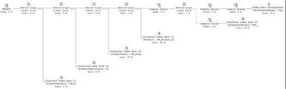
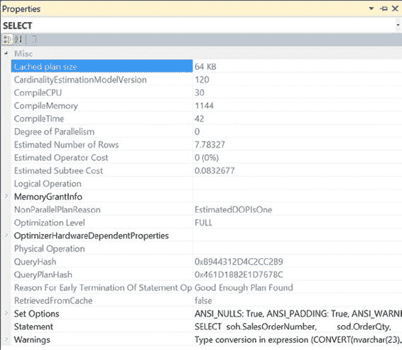

# SQL Server 执行计划生成

任何查询的性能都取决于优化器决定的执行计划的有效性。执行查询所需的总时间等于生成执行计划所需的时间加上基于该计划执行查询所需的时间，因此控制生成执行计划本身的成本非常重要。生成执行计划时产生的成本取决于生成过程、缓存计划的过程以及从计划缓存中重用计划的可能性。本章将介绍执行计划是如何生成的。

本章涵盖以下主题：

*   执行计划生成与缓存
*   用于生成执行计划的 SQL Server 组件
*   优化执行计划生成成本的策略
*   影响并行计划生成的因素

## 执行计划生成

SQL Server 使用基于成本的优化技术来确定查询的处理策略。优化器在决定使用哪个索引和连接策略时，会考虑数据库对象的元数据（如唯一约束或索引大小）以及查询中引用列的当前分布统计信息。

基于成本的优化使数据库开发人员能够专注于实现业务规则，而不是查询的确切语法。同时，确定查询处理策略的过程相当复杂，可能消耗大量资源。SQL Server 使用多种技术来优化资源消耗：

*   查询的基于语法的优化
*   通过简单的计划匹配，避免对简单查询进行深入优化
*   基于当前分布统计信息的索引和连接策略
*   分阶段进行查询优化以控制优化成本
*   执行计划缓存以避免重新生成查询计划

这些技术按顺序执行，如图 14-1 所示：

1.  解析
2.  绑定
3.  查询优化
4.  执行计划生成、缓存和哈希计划生成
5.  查询执行

```
Algebrizer
T-SQL Statement
Parser
Parse Tree
DML Statement?
No
Yes
Object Binding
Query Processor
Tree
Storage Engine
Optimizer
```

**图 14-1.** SQL Server 优化查询执行的技术

让我们详细看看这些步骤。

### 解析器

当提交查询时，SQL Server 将其传递给 *关系引擎* 中的 `algebrizer`。（这个关系引擎是 SQL Server 数据检索和操作的两个主要部分之一，另一个是 *存储引擎*，负责数据访问、修改和缓存。）关系引擎负责解析、名称和类型解析以及优化。它还根据查询执行计划执行查询，并向存储引擎请求数据。

`algebrizer` 过程的第一部分是 `Parser`。`Parser` 检查传入的查询，验证其语法是否正确。如果检测到语法错误，查询将被终止。如果多个查询作为一个批处理一起提交（注意语法错误），则 `Parser` 会检查整个批处理的语法，并在检测到语法错误时取消整个批处理。（注意，一个批处理中可能出现多个语法错误，但 `Parser` 只会处理到第一个错误为止。）

```sql
CREATE TABLE dbo.Test1 (c1 INT);

INSERT INTO dbo.Test1
VALUES (1);

CEILEKT * FROM dbo.t1; --错误：我的意思是，SELECT * FROM t1
```

在验证查询语法正确后，`Parser` 会为 `algebrizer` 生成一个称为 *解析树* 的内部数据结构。`Parser` 和 `algebrizer` 合称为 *查询编译*。

### 绑定

`Parser` 生成的解析树被传递给 `algebrizer` 的下一部分进行处理。`algebrizer` 现在解析 T-SQL 中引用的所有不同对象（如表、列等）的名称，这个过程称为 *绑定*。它还识别正在处理的所有不同数据类型。它甚至会检查聚合（如 `GROUP BY` 和 `MAX`）的位置。所有这些验证和解析的输出是一个称为 *查询处理器树* 的二进制数据集。

为了展示 `algebrizer` 的这一部分，如果提交以下批处理查询，那么错误语句之前的前三条语句将被执行，而错误语句及其后的语句将被取消。

```sql
IF (SELECT OBJECT_ID('dbo.Test1')
) IS NOT NULL
    DROP TABLE dbo.Test1;
GO

CREATE TABLE dbo.Test1 (c1 INT) ;

INSERT INTO dbo.Test1
VALUES (1);

SELECT '错误前',
    c1
FROM dbo.Test1 AS t;

SELECT '错误',
    c1
FROM dbo.no_Test1; --错误：表不存在

SELECT '错误后' c1
FROM dbo.Test1 AS t;
```

如果查询包含隐式数据转换，规范化过程会向查询树添加适当的步骤。该过程还执行一些基于语法的优化。例如，如果提交以下查询，基于语法的优化会转换查询的语法，如执行计划中 `SELECT` 操作符属性所示（见图 14-2），其中 `BETWEEN` 变成了 `>=` 和 `<=`。

```sql
SELECT soh.AccountNumber,
       soh.OrderDate,
       soh.PurchaseOrderNumber,
       soh.SalesOrderNumber
FROM   Sales.SalesOrderHeader AS soh
WHERE  soh.SalesOrderID BETWEEN 62500 AND 62550;
```

**图 14-2.** 基于语法的优化

你还可以看到参数化的一些证据，本章稍后将详细讨论。从查询生成的执行计划如图 14-3 所示。

**图 14-3.** 带有警告的执行计划

你还应该注意 `SELECT` 操作符上的警告指示器。查看此操作符的属性，你可以看到 `SalesOrderID` 实际上在转换过程中被转换了，优化器正在向你发出警告。

```
Type conversion in expression (CONVERT(nvarchar(23),[soh].[SalesOrderID],0)) may affect
"CardinalityEstimate" in query plan choice
```

我保留了这个带有警告的示例，是为了说明几点。首先，警告可能不清楚。在这个案例中，警告来自计算列 `SalesOrderNumber`。它正在将 `SalesOrderID` 转换为字符串并添加一个值。优化器以它的方式识别出这可能有问题，因此它给你一个警告。但是，你并没有以任何过滤方式（如 `WHERE` 子句、`JOIN` 或 `HAVING`）引用该列。因此，你可以安全地忽略这个警告。我保留它还因为 `AdventureWorks` 是一个很好的示例数据库，因为它包含了与现实世界数据库中有时出现的相同类型的不佳选择。

对于大多数数据定义语言（DDL）语句（如 `CREATE TABLE`、`CREATE PROC` 等），在通过 `algebrizer` 后，查询会被直接编译执行，因为优化器无需在多个处理策略中进行选择。特别是对于 `CREATE INDEX` 这条 DDL 语句，优化器可以根据表上其他现有索引来确定高效的处理策略，如第 8 章所述。


### 优化

根据查询的复杂程度（包括涉及的表数量和可用索引），在查询处理器树中执行查询的方式可能有多种。详尽比较所有执行方式的开销可能耗费大量时间，有时甚至可能超过找到最优查询所带来的益处。图 14-4 显示，为避免优化开销相对于查询实际执行成本过高，优化器采用了不同的技术，即以下各项：

*   简化
*   平凡计划匹配
*   多阶段优化
*   并行计划优化

[www.it-ebooks.info](http://www.it-ebooks.info/)

第 14 章 ■ 执行计划生成

```
简化
平凡计划匹配
是否找到平凡计划？
否
多阶段优化
是
1 到 n 个执行计划
是否符合并行计划条件？
是
并行优化
否
保存计划至过程缓存
```

***图 14-4.** 查询优化步骤*

#### 简化

在优化器开始处理您的查询之前，逻辑引擎已经识别了数据库中引用的所有对象。当优化器开始构建执行计划时，它首先确保所有被引用的对象都是实际使用且准确返回数据所必需的。如果您编写的查询涉及三个表的连接，但只有两个表被 `SELECT` 条件或 `WHERE` 子句实际引用，优化器可能会选择将另一个表排除在处理之外。这被称为简化步骤。它实际上是一个更大的处理过程的一部分，该过程收集统计数据并开始估算查询所涉及数据的基数。优化器还会收集有关约束（特别是外键约束）的必要信息，这将帮助其决定连接顺序，优化器可以根据需要重新排列顺序，以得出足够好的计划。

[www.it-ebooks.info](http://www.it-ebooks.info/)

第 14 章 ■ 执行计划生成

#### 平凡计划匹配

有时可能只有一种执行查询的方法。例如，没有索引的堆表只能通过一种方式访问：表扫描。为避免此类查询的运行时优化开销，SQL Server 维护一个定义平凡计划的模式列表。如果优化器找到匹配项，则会为查询生成一个类似的计划而无需任何优化。生成的计划随后存储在过程缓存中。消除优化阶段意味着生成平凡计划的成本非常低。这并不意味着平凡计划是理想的或比更复杂的计划更可取。平凡计划仅适用于极其简单的查询。一旦查询的复杂性上升，它必须经过优化。

#### 多阶段优化

对于一个非平凡的查询，需要分析的备选处理策略数量可能很多，并且评估每个选项可能需要很长时间。因此，优化器会经历三个不同级别的优化。这些级别被称为 `search 0`、`search 1` 和 `search 2`。但更易于将它们理解为事务、快速计划和完全优化。根据查询的大小和复杂性，这些不同的优化可能会逐一尝试，或者优化器可能直接跳到完全优化。每种优化都会考虑使用不同的连接技术以及通过扫描、查找和其他操作访问数据的不同方式。

索引变体考虑不同的索引方面，例如单列索引、复合索引、索引列顺序、列密度等。类似地，连接变体考虑 SQL Server 中可用的不同连接技术：`nested loop join`、`merge join` 和 `hash join`。（第 4 章详细介绍了这些连接技术。）诸如唯一值和外键约束等约束也是优化决策过程的一部分。

优化器会考虑 `WHERE` 子句中引用的列的统计信息，以评估索引和连接策略的有效性。基于当前的统计信息，它会在多个优化阶段评估配置的成本。成本包括许多因素，包括但不限于执行查询所需的 CPU、内存和磁盘 I/O（包括随机与顺序 I/O 估算）的使用情况。在每个优化阶段之后，优化器会评估处理策略的成本。此成本仅为估计值，并非实际测量或行为预测；它是基于统计信息和所考虑过程的数学构建。如果发现成本足够低，则优化器会停止进一步迭代优化阶段并退出优化过程。否则，它会继续迭代优化阶段，以确定具有成本效益的处理策略。

有时查询可能非常复杂，以至于优化器需要广泛地迭代优化阶段。在优化查询时，如果发现处理策略的成本超过并行度成本阈值，则它会评估使用多个 CPU 处理查询的成本。否则，优化器将继续使用串行计划。

您可以通过两个来源了解多阶段优化期间发生的一些细节。例如，这个查询：

```sql
SELECT soh.SalesOrderNumber,
sod.OrderQty,
sod.LineTotal,
sod.UnitPrice,
sod.UnitPriceDiscount,
p.[Name] AS ProductName,
p.ProductNumber,
ps.[Name] AS ProductSubCategoryName,
pc.[Name] AS ProductCategoryName
FROM Sales.SalesOrderHeader AS soh
JOIN Sales.SalesOrderDetail AS sod
ON soh.SalesOrderID = sod.SalesOrderID
[www.it-ebooks.info](http://www.it-ebooks.info/)



第 14 章 ■ 执行计划生成
JOIN Production.Product AS p
ON sod.ProductID = p.ProductID
JOIN Production.ProductModel AS pm
ON p.ProductModelID = pm.ProductModelID
JOIN Production.ProductSubcategory AS ps
ON p.ProductSubcategoryID = ps.ProductSubcategoryID
JOIN Production.ProductCategory AS pc
ON ps.ProductCategoryID = pc.ProductCategoryID
WHERE soh.CustomerID = 29658;
```

运行此查询时，会返回图 14-5 中的执行计划，这肯定是一个非平凡计划。

***图 14-5.** 非平凡执行计划*

我知道这个执行计划很难阅读，但请不要尝试阅读它。需要理解的重点是，它涉及相当多的表，每个表都有索引和统计信息，所有这些都必须被考虑才能得出此执行计划。您首先可以查找有关优化器在此执行计划上工作的信息的位置是第一个运算符的属性表，在本例中是位于执行计划最左侧的 `T-SQL SELECT` 运算符。

图 14-6 显示了属性表。

[www.it-ebooks.info](http://www.it-ebooks.info/)



第 14 章 ■ 执行计划生成

***图 14-6.** `SELECT` 运算符属性表*

从顶部开始，您可以看到与创建和优化此执行计划直接相关的信息。

*   缓存的计划大小，为 64 字节
*   编译计划所使用的 CPU 周期数，为 30ms
*   使用的内存量，为 1144KB
*   编译时间，为 42ms


#### 优化级别与执行计划哈希

优化级别属性（XML 计划中的 `StatementOptmLevel`）显示了优化器内发生了何种类型的处理。在本例中，`FULL` 表示优化器执行了完全优化。这在“语句提前终止原因”属性中进一步显示为 `Good Enough Plan Found`。因此，优化器花费了 42 毫秒来追踪一个它认为在此情况下足够好的计划。您还可以看到 `QueryPlanHash` 值，也称为执行计划的 ``fingerprint``（您可以在“查询计划哈希与查询哈希”一节中找到更多详细信息）。`SELECT`（以及 `INSERT`、`UPDATE` 和 `DELETE`）操作符的属性是评估任何执行计划时重要的第一个停留点，因为包含了这些信息。

