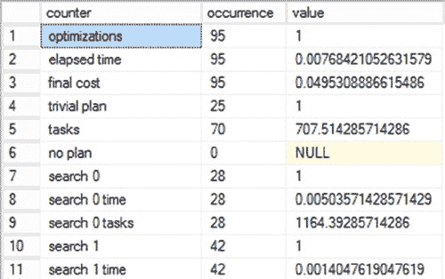

# 优化器信息的第二个来源

优化器信息的第二个来源是动态管理视图 `sys.Dm_exec_query_optimizer_info`。

这个 DMV 是随时间优化的事件聚合。它不会显示给定查询的个别优化，但会跟踪已执行的优化操作。这对于调整单个查询不那么直接方便，但如果您致力于降低一段时间内的工作负载成本，能够跟踪这些信息可以帮助您确定查询调整是否产生了积极的差异，至少在优化时间方面是如此。

返回的部分数据仅供 SQL Server 内部使用。图 14-7 显示了以下查询返回结果中有用数据的截断示例：

```sql
SELECT
    deqoi.counter,
    deqoi.occurrence,
    deqoi.value
FROM sys.dm_exec_query_optimizer_info AS deqoi;
```

[www.it-ebooks.info](http://www.it-ebooks.info/)



**图 14-7.** `sys.dm_exec_query_optimizer_info` 的输出

在另一个查询运行前后执行此查询，可以显示已完成的优化数量和类型所发生的变化。不过，如果您可以在测试服务器上隔离您的查询，就能更有把握地获得仅与您试图测量的查询直接相关的前后差异。

#### 并行计划优化

优化器在评估使用并行计划处理查询的成本时会考虑多种因素。其中一些因素如下：

*   SQL Server 可用的 CPU 数量
*   SQL Server 版本
*   可用内存
*   并行度的代价阈值
*   正在执行的查询类型
*   给定流中要处理的行数
*   活动的并发连接数

如果 SQL Server 只有一个 CPU 可用，则优化器不会考虑并行计划。SQL Server 可用的 CPU 数量可以使用 SQL Server 配置的 ``affinity`` 设置来限制。亲和性值可以设置为特定的 CPU，或特定的 NUMA 节点。您也可以将其设置为范围。例如，要允许 SQL Server 在八路服务器上仅使用 CPU0 到 CPU3，请执行以下语句：

```sql
USE master;
EXEC sp_configure 'show advanced option', '1';
RECONFIGURE;
ALTER SERVER CONFIGURATION SET PROCESS AFFINITY CPU = 0 TO 3;
GO
```

此配置立即生效。``affinity`` 是一个特殊设置，我建议您仅在将控制权从 SQL Server 手中夺走有意义的情况下使用它，例如当您在同一台机器上运行 SQL Server 的多个实例并且希望将它们彼此隔离时。您也可以使用相同的方式，通过 ``affinity I/O`` 选项将 I/O 绑定到特定的处理器集。

即使 SQL Server 有多个 CPU 可用，如果单个查询不允许使用多于一个 CPU 执行，那么优化器会放弃并行计划选项。并行查询可以使用的最大 CPU 数量由 SQL Server 配置的 ``max degree of parallelism`` 设置决定。默认值为 `0`，这允许所有 CPU（由亲和性掩码设置提供）用于并行查询。您也可以通过资源调控器控制并行度。如果您希望允许并行查询在 CPU0 到 CPU3 中使用不超过两个 CPU（受前述亲和性掩码设置限制），请执行以下语句：

```sql
USE master;
EXEC sp_configure 'show advanced option', '1';
RECONFIGURE;
EXEC sp_configure 'max degree of parallelism', 2;
RECONFIGURE;
```

此更改立即生效，无需任何重启。``max degree of parallelism`` 设置也可以在查询级别使用 `MAXDOP` 查询提示进行控制。

```sql
SELECT *
FROM dbo.t1
WHERE C1 = 1
OPTION (MAXDOP 2);
```

更改 ``max degree of parallelism`` 设置最好由您的应用程序需求及其上的工作负载决定。除非有迹象表明需要更改，否则我通常会将 ``max degree of parallelism`` 保留为默认值。我通常会将 ``cost threshold for parallelism`` 从其默认值 `5` 往上调。

由于并行查询需要更多内存，优化器在选择并行计划之前会确定可用内存量。所需内存量随着并行度的增加而增加。如果对于给定的并行度，并行计划的内存需求无法满足，那么 SQL Server 会自动降低并行度，或者在给定的工作负载上下文中完全放弃该查询的并行计划。您可以在图 14-6 的 `SELECT` 属性中看到这部分评估。

CPU 开销非常高的查询是并行计划的最佳候选者。示例包括连接大表、执行大量聚合以及对大型结果集进行排序，这些都是报表系统（在 OLTP 系统中较少）上常见的操作。对于事务处理应用程序中通常出现的简单查询，初始化、同步和终止并行计划所需的额外协调超过了潜在的性能优势。

查询是否简单是通过比较查询的估计执行时间与代价阈值来确定的。此代价阈值由 SQL Server 配置的 ``cost threshold for parallelism`` 设置控制。默认情况下，该设置的值为 `5`，这意味着如果串行计划的估计执行时间超过 5 秒，则优化器会考虑为该查询使用并行计划。例如，要将代价阈值修改为 35 秒，请执行以下语句：

```sql
USE master;
EXEC sp_configure 'show advanced option', '1';
RECONFIGURE;
EXEC sp_configure 'cost threshold for parallelism', 35;
RECONFIGURE;
```

此更改立即生效，无需任何重启。如果只有一个 CPU 可用于 SQL Server，则忽略此设置。我发现当 ``cost threshold for parallelism`` 设置得如此之低时，OLTP 系统会受到影响。通常将该值增加到 30 到 50 之间会是有益的。请务必针对您的系统测试此建议，以确保它对您有效。

[www.it-ebooks.info](http://www.it-ebooks.info/)

另一个选择是简单地查看缓存中的计划，然后根据其中的查询及其代表的 workload 类型进行估算，以得出一个具体的数字。您可以将 OLTP 查询与报表查询分开，然后重点关注最可能从并行执行中受益的报表查询。取这些成本的平均值，并将您的代价阈值设置为该数字。


### 注意
虽然我确实将这些值称为以秒为单位进行度量，但这只是优化器使用的一种抽象概念。
它们并非字面意义上的度量值。

DML 操作查询（`INSERT`、`UPDATE` 和 `DELETE`）是串行执行的。然而，`INSERT` 语句的 `SELECT` 部分以及 `UPDATE` 或 `DELETE` 语句的 `WHERE` 子句可以并行执行。实际的数据更改操作是串行应用到数据库的。此外，如果优化器判断估算成本过低，则不会引入并行运算符。

请注意，即使在执行时，SQL Server 也会判断当前系统工作负载和配置信息是否允许并行查询执行。如果允许并行查询执行，SQL Server 会确定最优线程数，并将查询的执行分配到这些线程上。当查询开始并行执行时，它将使用相同数量的线程直至完成。SQL Server 在下次执行并行查询前，会重新检查最优线程数。

一旦通过使用串行计划或并行计划确定了处理策略，优化器就会生成查询的执行计划。执行计划包含优化器为执行查询所决定的详细处理策略。这包括诸如数据检索、结果集连接、结果集排序等步骤。关于如何分析执行计划中包含的处理步骤的详细说明将在第 4 章中介绍。为查询生成的执行计划会被保存在计划缓存中，以供将来重用。

### 执行计划缓存
优化器生成的查询执行计划保存在 SQL Server 内存池的一个特殊区域，称为 `plan cache`（计划缓存）或 `procedure cache`（过程缓存）。（`procedure cache` 是 SQL Server 缓冲区缓存的一部分，将在第 2 章中解释。）将计划保存在缓存中，使得 SQL Server 在重新提交相同查询时，可以避免再次运行整个查询优化过程。SQL Server 支持不同的技术，如 `plan cache aging`（计划缓存老化）和 `plan cache types`（计划缓存类型），以提高缓存计划的可重用性。它还存储两个二进制值，称为 `query hash`（查询哈希）和 `query plan hash`（查询计划哈希）。

#### 注意
我将在本章（第 15 章）讨论 SQL Server 为提高执行计划重用有效性所支持的技术。

### 执行计划的组件
优化器生成的执行计划包含两个组件。
- `Query plan`（查询计划）：这表示指定了执行查询所需的所有物理操作的命令。
- `Execution context`（执行上下文）：这在给定用户的上下文中维护查询的可变部分。

我将在接下来的章节中更详细地介绍这些组件。

#### 查询计划
查询计划是一个可重入的、只读的数据结构，其命令指定了执行查询所需的所有物理操作。可重入特性允许多个连接并发访问查询计划。物理操作包括规范要访问哪些表和索引、如何以及以何种顺序访问它们、要在多个表之间执行的连接操作类型等等。

查询计划中不存储任何用户上下文。

#### 执行上下文
执行上下文是另一个数据结构，用于维护查询的可变部分。虽然服务器在 `procedure cache` 中跟踪执行计划，但这些计划是上下文中立的。因此，执行查询的每个用户都将拥有一个独立的执行上下文，其中保存特定于其执行的数据，例如参数值和连接详细信息。

#### 执行计划的老化
`procedure cache` 是 SQL Server 缓冲区缓存的一部分，它也保存数据页。随着新的执行计划添加到 `procedure cache`，其大小不断增长，影响了内存中有用数据页的保留。为避免这种情况，SQL Server 动态控制执行计划在 `procedure cache` 中的保留时间，保留频繁使用的执行计划，并丢弃在一定时间内未使用的计划。

SQL Server 通过为每个执行计划关联一个 `age field`（老化字段）来跟踪其重用频率。生成执行计划时，会使用生成该计划的 `cost`（成本）填充 `age field`。一个需要大量优化的复杂查询的 `age field` 值将高于一个较简单查询的值。

SQL Server 的 `lazy writer process`（惰性写入器进程）（它管理 SQL Server 中的大部分后台进程）会定期检查 `procedure cache` 中所有执行计划的当前 `cost`。如果某个执行计划长时间未被重用，那么其当前 `cost` 最终将降至 0。生成执行计划的成本越低，其 `cost` 就会越快降至 0。一旦执行计划的 `cost` 达到 0，该计划就成为从内存中移除的候选对象。当内存压力增大到不再有足够的可用内存来满足新请求时，SQL Server 会从 `procedure cache` 中移除所有 `cost` 为 0 的计划。

但是，如果系统有足够的内存，并且有空闲内存页可用于满足新请求，那么 `cost` 为 0 的执行计划可以在 `procedure cache` 中保留很长时间，以便在需要时以后重用。

除了将 `cost` 向下调整外，每次执行计划被重用时，其 `cost` 也可以增加到生成该计划的最大 `cost`（对于即席计划，则是增加到该计划的当前 `cost`）。例如，假设您有两个执行计划，其生成 `cost` 分别为 100 和 10。那么它们的起始 `cost` 值将分别是 100 和 10。如果这两个执行计划都被立即重用，它们的 `age field` 将被重置为该最大 `cost`。在这些 `cost` 值下，`lazy writer` 会比第一个计划更快地将第二个计划的 `cost` 降至 0，除非第二个计划被更频繁地重用。因此，即使一个昂贵的计划比一个廉价的计划重用频率更低，但由于初始 `cost` 的影响，该昂贵的计划可以在更长的时间内保持非零的 `cost` 值。

## 总结
SQL Server 基于成本的查询优化器决定有效执行计划的依据，不是查询的确切语法，而是通过评估使用不同处理策略执行查询的 `cost`。使用不同处理策略的 `cost` 评估在多个优化阶段完成，以避免花费过多时间优化单个查询。然后，执行计划会被缓存起来，以便在重新执行相同查询时节省执行计划生成的 `cost`。

在下一章中，我将讨论这些计划如何根据其调用方式以不同方式从缓存中重用。

## 第 15 章
## 执行计划缓存行为
一旦完成生成执行计划所需的所有处理，如果 SQL Server 每次调用查询时都丢弃已完成的工作并从头再来，那将是疯狂的。相反，它将创建的计划保存在服务器上一个称为 `plan cache`（计划缓存）的内存空间中。本章将引导您了解如何监控 `plan cache`，以便查看 SQL Server 如何重用执行计划。

在本章中，我将涵盖以下主题：
- 如何分析执行计划缓存
- `Query plan hash`（查询计划哈希）和 `query hash`（查询哈希）作为识别需要优化的查询的机制
- 执行计划出错和参数嗅探
- 提高执行计划缓存可重用性的方法

## 分析执行计划缓存


