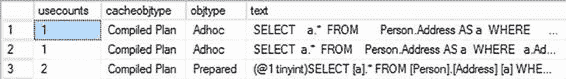
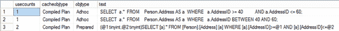

# 第 15 章 ■ 执行计划缓存行为

### 即席工作负载的计划可重用性

存储过程中包含的`SELECT`语句的计划将嵌入参数（`@ProductID`和`@CustomerID`），而非变量值。我很快会更详细地介绍这些方法。

当查询作为即席工作负载提交时，`SQL Server`会生成执行计划并将该计划存储在缓存中。如果相同的即席查询被重新提交，则可以重用该计划。由于没有参数，硬编码的值会作为计划的一部分存储。为了能从缓存中重用计划，`T-SQL`文本必须完全匹配。这包括所有空格、回车符以及随计划提供的任何值。如果其中任何一项发生变化，计划就无法重用。

为了理解这一点，考虑一下你之前使用过的即席查询：

```sql
SELECT soh.SalesOrderNumber,
       soh.OrderDate,
       sod.OrderQty,
       sod.LineTotal
FROM Sales.SalesOrderHeader AS soh
JOIN Sales.SalesOrderDetail AS sod
   ON soh.SalesOrderID = sod.SalesOrderID
WHERE soh.CustomerID = 29690
  AND sod.ProductID = 711;
```

为这个即席查询生成的执行计划基于查询的确切文本，包括注释、大小写、尾随空格和硬回车。要从`sys.dm_exec_cached_plans`中提取信息，必须使用确切的文本。

```sql
SELECT c.usecounts,
       c.cacheobjtype,
       c.objtype
FROM sys.dm_exec_cached_plans c
CROSS APPLY sys.dm_exec_sql_text(c.plan_handle) t
WHERE t.text = 'SELECT soh.SalesOrderNumber,
       soh.OrderDate,
       sod.OrderQty,
       sod.LineTotal
FROM Sales.SalesOrderHeader AS soh
JOIN Sales.SalesOrderDetail AS sod
   ON soh.SalesOrderID = sod.SalesOrderID
WHERE soh.CustomerID = 29690
  AND sod.ProductID = 711;';
```

图 15-1 显示了`sys.dm_exec_cached_plans`的输出。

图 15-1. `sys.dm_exec_cached_plans` 输出

从图 15-1 可以看出，一个已编译的计划已为前述即席查询生成并保存在过程缓存中。为了找到特定查询，我在`WHERE`子句中使用了查询文本本身。可以看到，这个计划到目前为止已被使用了一次（`usecounts` = 1）。如果重新执行这个即席查询，`SQL Server`会从过程缓存中重用现有的可执行计划，如图 15-2 所示。

图 15-2. 从过程缓存中重用可执行计划

在图 15-2 中，您可以看到前述查询的可执行计划的`usecounts`值已增加到 2，这证实该查询的现有计划已被重用。如果此查询被重复执行，现有计划每次都将会被重用。

由于为前述查询生成的计划包含了筛选条件值，该计划的可重用性仅限于使用相同的筛选条件值。重新执行查询，但将`soh.CustomerID`更改为 29500。

```sql
SELECT soh.SalesOrderNumber,
       soh.OrderDate,
       sod.OrderQty,
       sod.LineTotal
FROM Sales.SalesOrderHeader AS soh
JOIN Sales.SalesOrderDetail AS sod
   ON soh.SalesOrderID = sod.SalesOrderID
WHERE soh.CustomerID = 29500
  AND sod.ProductID = 711;
```

无法重用现有计划，如果原样重新运行`sys.dm_exec_cached_plans`，您会看到执行计数并未增加（图 15-3）。

图 15-3. `sys.dm_exec_cached_plans` 显示现有计划未被重用

相反，我将调整查询`sys.dm_exec_cached_plans`的方式。

```sql
SELECT c.usecounts,
       c.cacheobjtype,
       c.objtype,
       t.text,
       c.plan_handle
FROM sys.dm_exec_cached_plans c
CROSS APPLY sys.dm_exec_sql_text(c.plan_handle) t
WHERE t.text LIKE 'SELECT soh.SalesOrderNumber,
       soh.OrderDate,
       sod.OrderQty,
       sod.LineTotal
FROM Sales.SalesOrderHeader AS soh
JOIN Sales.SalesOrderDetail AS sod
   ON soh.SalesOrderID = sod.SalesOrderID%';
```

您可以在图 15-4 中看到此查询的输出。

图 15-4. `sys.dm_exec_cached_plans` 显示现有计划无法重用

从图 15-4 的`sys.dm_exec_cached_plans`输出中，您可以看到该查询的先前计划未被重用；相应的`usecounts`值保持在旧的 2。没有重用现有计划，而是为该查询生成了一个新计划，并以新的`plan_handle`保存在过程缓存中。如果使用不同的筛选条件值重复执行此即席查询，则每次都会生成一个新的执行计划。此即席查询对执行计划的低效重用，通过消耗额外的`CPU`周期来重新生成计划，从而增加了`CPU`的负载。

#### 简单参数化

总结一下，即席计划缓存使用语句级缓存，并且仅限于精确的文本匹配。如果即席查询不复杂，`SQL Server`可以隐式地参数化查询，以通过称为“简单参数化”的功能提高计划的可重用性。用于简单参数化的“简单查询”定义仅限于相当简单的情况，例如仅包含一个表的即席查询。如前例所示，大多数需要连接操作的查询无法被自动参数化。

## 针对即席工作负载进行优化

如果您的服务器将主要支持即席查询，则有可能实现一定程度的性能改进。有一个服务器选项称为`optimize for ad hoc workloads`（针对即席工作负载进行优化）。为服务器启用此选项会改变引擎处理即席查询的方式。不是在第一次调用查询时保存其完整的已编译计划，而是存储一个已编译计划存根。该存根没有关联完整的执行计划，从而节省了存储空间以及将其保存到缓存所需的时间。此选项可以在不重新启动服务器的情况下启用。

```sql
EXEC sp_configure
'optimize for ad hoc workloads',
1;
GO
RECONFIGURE;
```

更改选项后，刷新缓存，然后重新运行即席查询。修改对`sys.dm_exec_cached_plans`的查询，使其包含`size_in_bytes`列；然后运行它以查看图 15-5 中的结果。

图 15-5. `sys.dm_exec_cached_plans` 显示已编译计划存根

图 15-5 在`cacheobjtype`列中显示，缓存中的新对象是一个已编译计划存根。与完整的已编译计划相比，可以为更多的查询创建存根，对服务器的影响更小。但是，当下一次执行即席查询时，会创建一个完整的已编译计划。为了查看这一过程，再运行一次查询，并检查`sys.dm_exec_cached_plans`中的结果，如图 15-6 所示。

图 15-6. 已编译计划存根已变为已编译计划

检查`cacheobjtype`值。它已从`Compiled Plan Stub`更改为`Compiled Plan`。最后，要查看存根和完整计划之间的真正区别，请检查图 15-5 和图 15-6 中的`size_in_bytes`列。大小从存根中的 352 变为完整计划中的 65536。这精确地显示了在处理大量即席查询时可节省的空间。在继续之前，请确保禁用`optimize for ad hoc workloads`。

```sql
EXEC sp_configure
'optimize for ad hoc workloads',
0;
GO
RECONFIGURE;
```


就个人而言，我认为在几乎任何系统上实施这一点都几乎没有坏处。与所有建议一样，您应该进行测试，以确保您的系统不是例外。但是，当第二次调用计划时将其写入内存的成本，与您通过不存储那些只会使用一次的计划所看到的总体内存节省相比，是极其微不足道的。在我所有的测试和经验中，这纯粹是有益的，几乎没有缺点。

#### 简单参数化

当提交一个即席查询时，SQL Server 会分析查询以确定传入文本的哪些部分可能是参数。它会查看即席查询的可变部分，以确定是否可以安全地自动参数化它们，并在查询中使用参数（而不是可变部分），这样查询计划就可以独立于可变值。这种自动将查询的可变部分转换为参数的特性，即使没有显式参数化（使用预处理工作负载技术），也被称为 `简单参数化`。

在简单参数化过程中，SQL Server 确保如果即席查询被转换为参数化模板，参数值的更改不会广泛改变计划需求。在确定简单参数化是安全的之后，SQL Server 为即席查询创建一个参数化模板，并将参数化计划保存在过程缓存中。

参数化计划不是基于查询中使用的动态值。由于计划是为参数化模板生成的，因此当使用不同的值重新执行即席查询时，可以重用该计划。

为了理解 SQL Server 的简单参数化特性，请考虑以下查询：
```sql
SELECT a.*
FROM Person.Address AS a
WHERE a.AddressID = 42;
```
当提交此即席查询时，SQL Server 可以按原样处理该查询以创建计划。然而，在执行查询之前，SQL Server 会尝试确定是否可以安全地参数化。在确定查询的可变部分可以在不影响查询基本结构的情况下被参数化后，SQL Server 会对查询进行参数化，并为参数化查询生成一个计划。您可以从图 15-7 所示的 `sys.dm_exec_cached_plans` 输出中观察到这一点。

**图 15-7.** `sys.dm_exec_cached_plans` 输出，显示自动参数化计划




该参数化查询的可执行计划的 `usecounts` 恰当地将重用次数表示为 1。另请注意，自动参数化可执行计划的 `objtype` 不再是 `Adhoc`；它反映了该计划是针对参数化查询的这一事实，即 `Prepared`。

原始的即席查询，即使没有执行，也会被编译以创建简单参数化所需的查询树。即席查询的编译计划将保存在计划缓存中。但在创建即席查询的可执行计划之前，SQL Server 已经发现可以安全地自动参数化，因此为了进一步处理而自动参数化了查询。这在图 15-7 中作为突出显示的行可见。

由于此即席查询已被自动参数化，如果您使用不同的可变部分值重新执行 `simpleparameterization.sql`，SQL Server 将重用现有的执行计划。
```sql
SELECT a.*
FROM Person.Address AS a
WHERE a.[AddressID] = 52; --先前的值是 42
```
图 15-8 显示了 `sys.dm_exec_cached_plans` 的输出。

**图 15-8.** `sys.dm_exec_cached_plans` 输出，显示自动参数化计划的重用

从图 15-8 可以看出，尽管为这个使用 `AddressId` 值 52 的即席查询生成了一个新计划，但现有的 `Prepared` 计划被重用了，这由相应的 `usecounts` 值增加到 2 表明。即席查询可以使用不同的筛选条件值反复重新执行，重用现有的执行计划——尽管两个查询的原始文本并不匹配。两者的参数化查询将是相同的，因此它被重用了。

对于缓存执行计划的参数化查询，还有另一个方面需要注意。在图 15-7 中，观察参数化查询的主体与提交的即席查询的主体并不完全匹配。例如，在即席查询中，任何对象上都没有方括号。

在意识到即席查询可以安全地自动参数化后，SQL Server 会选择一个模板来代替查询的确切文本。

为了理解这一点的重要性，请考虑以下查询：
```sql
SELECT a.*
FROM Person.Address AS a
WHERE a.AddressID BETWEEN 40 AND 60;
```
图 15-9 显示了 `sys.dm_exec_cached_plans` 的输出。

**图 15-9.** `sys.dm_exec_cached_plans` 输出，显示使用模板进行查询简单参数化



从图 15-9 可以看出，SQL Server 对查询进行了简化处理，并用一对 `>=` 和 `<=` 运算符（它们等效于 `BETWEEN` 运算符）进行了替换。然后参数化步骤再次修改了查询。这意味着，如果不是重新提交前面的使用 `BETWEEN` 子句的即席查询，而是提交一个使用一对 `>=` 和 `<=` 的类似查询，SQL Server 将能够重用现有的执行计划。为了确认此行为，让我们按如下方式修改即席查询：
```sql
SELECT a.*
FROM Person.Address AS a
WHERE a.AddressID >= 40
  AND a.AddressID <= 60;
```
图 15-10 显示了 `sys.dm_exec_cached_plans` 的输出。

**图 15-10.** `sys.dm_exec_cached_plans` 输出，显示自动参数化计划的重用

从图 15-10 可以看出，即使该查询在语法上与之前执行的查询不同，现有计划也被重用了。SQL Server 生成的自动参数化计划允许在查询使用不同的可变值重新提交时重用现有计划，也适用于具有相同模板形式的查询。

#### 简单参数化限制

SQL Server 在简单参数化期间非常保守，因为糟糕计划的成本可能远远超过生成新计划的成本。这种保守的方法可以防止 SQL Server 创建不安全的自动参数化计划。因此，简单参数化仅限于相当简单的情况，例如仅包含一个表的即席查询。包含两个（或多个）表之间联接操作的即席查询（如“即席工作负载的计划可重用性”部分前面所示）不被认为是简单参数化安全的。

在可扩展的系统中，不要依赖简单参数化来实现计划可重用性。SQL Server 的简单参数化特性会对哪些变量和常量可以参数化进行有根据的猜测。您不应该依赖 SQL Server 进行简单参数化，而应该在构建应用程序时以编程方式明确指定它。

#### 强制参数化


## 第 15 章 ■ 执行计划缓存行为

如果你正在处理的系统主要由即席查询组成，你可能希望尝试增加可接受参数化的查询数量。你可以修改数据库以尝试强制所有查询实现参数化，就像简单参数化一样，但这存在某些限制。

要实现这一点，你需要使用 `ALTER DATABASE` 将数据库选项 `PARAMETERIZATION` 更改为 `FORCED`，如下所示：`ALTER DATABASE AdventureWorks2012 SET PARAMETERIZATION FORCED;`

[www.it-ebooks.info](http://www.it-ebooks.info/)


但是，如果你的查询稍微复杂一些，它就不会应用简单参数化。

```sql
SELECT ea.EmailAddress,
       e.BirthDate,
       a.City
FROM Person.Person AS p
JOIN HumanResources.Employee AS e
    ON p.BusinessEntityID = e.BusinessEntityID
JOIN Person.BusinessEntityAddress AS bea
    ON e.BusinessEntityID = bea.BusinessEntityID
JOIN Person.Address AS a
    ON bea.AddressID = a.AddressID
JOIN Person.StateProvince AS sp
    ON a.StateProvinceID = sp.StateProvinceID
JOIN Person.EmailAddress AS ea
    ON p.BusinessEntityID = ea.BusinessEntityID
WHERE ea.EmailAddress LIKE 'david%'
  AND sp.StateProvinceCode = 'WA';
```

当你运行此查询时，简单参数化并未被应用，正如你在图 15-11. 中所看到的那样。

**图 15-11.** 一个更复杂的查询不会被参数化

在 `sys.dm_exec_cached_plans` 的输出中看不到任何预编译计划。但如果你使用之前的脚本将 `PARAMETERIZATION` 设置为 `FORCED`，清空缓存，然后重新运行查询，`sys.dm_exec_cached_plans` 的输出会有所变化，如图 15-12 所示。

**图 15-12.** 强制参数化改变了执行计划

现在，在第三行可以看到一个预编译计划。然而，只提供了一个参数，即 `@0 varchar(8000)`。

如果你从 `sys.dm_exec_querytext` 获取预编译计划的完整文本并进行格式化，它看起来像这样：`(@0 varchar(8000))`

```sql
SELECT ea.EmailAddress,
       e.BirthDate,
       a.City
FROM Person.Person AS p
JOIN HumanResources.Employee AS e
    ON p.BusinessEntityID = e.BusinessEntityID
JOIN Person.BusinessEntityAddress AS bea
    ON e.BusinessEntityID = bea.BusinessEntityID
JOIN Person.Address AS a
    ON bea.AddressID = a.AddressID
JOIN Person.StateProvince AS sp
    ON a.StateProvinceID = sp.StateProvinceID
JOIN Person.EmailAddress AS ea
    ON p.BusinessEntityID = ea.BusinessEntityID
WHERE ea.EmailAddress LIKE 'david%'
  AND sp.StateProvinceCode = @0
```

由于其限制，强制参数化无法为字符串 'david%' 进行替换，但成功替换了字符串 'WA'。值得注意的是，变量被声明为完整的 8,000 长度 `VARCHAR`，而不是像 `Person.StateProvince` 表中实际列那样的三字符 `NCHAR`。虽然你有了一个参数，但这可能导致隐式数据转换，从而阻止索引的使用。

在你开始使用强制参数化之前，以下限制列表可能为你提供信息，帮助你决定强制参数化是否适用于你的数据库。（这是一个部分列表；完整列表请查阅在线手册。）

- `INSERT ... EXECUTE` 查询
- 存储过程、触发器和用户定义函数内部的语句，因为它们已有执行计划
- 客户端预编译语句（本章稍后将详细介绍）
- 使用查询提示 `RECOMPILE` 的查询
- `LIKE` 语句中使用的模式和转义子句参数（如前所示）

这让你对强制参数化所面临的限制类型有所了解。强制参数化真正具有潜在帮助的情况是，如果你正因即席查询而遭受大量的编译和重编译。任何其他负载都不会从使用强制参数化中受益。


在继续之前，请将数据库更改回 `SIMPLE PARAMETERIZATION`。

```sql
ALTER DATABASE AdventureWorks2012 SET PARAMETERIZATION SIMPLE;
```

### 预准备的工作负载的计划可重用性

将查询定义为预准备的工作负载，可以显式地将查询的可变部分参数化。这使得 SQL Server 能够生成一个不绑定于查询可变部分的查询计划，并将可变部分隔离在独立的执行上下文中。正如你在上一节所见，SQL Server 支持三种提交预准备工作负载的技术。

-   存储过程
-   `sp_executesql`
-   准备/执行模型

在接下来的章节中，我将更深入地介绍每种技术，并指出参数化执行计划可能在何处引发问题。

[www.it-ebooks.info](http://www.it-ebooks.info/)

## 第 15 章 ■ 执行计划缓存行为

#### 存储过程

使用存储过程是提高计划缓存效率的标准技术。当存储过程在执行时编译（对于原生编译存储过程则不同，将在第 22 章介绍），会为存储过程中的每条 SQL 语句生成一个计划。为存储过程生成的执行计划可以在该存储过程使用不同参数值重新执行时被重用。

除了检查 `sys.dm_exec_cached_plans`，你还可以使用扩展事件工具跟踪存储过程的执行计划缓存。扩展事件提供了表 `15-2` 中列出的事件来跟踪存储过程的计划缓存。

**表 15-2.** 用于分析存储过程计划缓存的事件
| 事件类别 | **事件** |
| :--- | :--- |
| `sp_cache_hit` | 在缓存中找到了计划。 |
| `sp_cache_miss` | 在缓存中未找到计划。 |
| `sp_cache_insert` | 当计划被添加到缓存时触发该事件。 |
| `sp_cache_remove` | 当计划被从缓存中移除时触发该事件。 |

要使用跟踪事件跟踪存储过程的计划缓存，你可以使用这些事件以及表 `15-3` 中显示的其他存储过程事件和数据列。

**表 15-3.** 用于分析存储过程计划缓存的数据列
| 事件类别 | **事件** |
| :--- | :--- |
| `SP:CacheHit` | `EventClass` |
| `SP:CacheMiss` | `TextData` |
| `SP:Completed` | `LoginName` |
| `SP:ExecContextHit` | `SPID` |
| `SP:Starting` | `StartTime` |
| `SP:StmtCompleted` | |

为了理解存储过程如何能改进计划缓存，让我们重新检查之前创建的名为 `BasicSalesInfo` 的过程。为清晰起见，此处重复该过程：

```sql
IF (SELECT OBJECT_ID('BasicSalesInfo')) IS NOT NULL
    DROP PROC dbo.BasicSalesInfo ;
GO
CREATE PROC dbo.BasicSalesInfo
    @ProductID INT,
    @CustomerID INT
AS
SELECT soh.SalesOrderNumber,
       soh.OrderDate,
       sod.OrderQty,
       sod.LineTotal
FROM Sales.SalesOrderHeader AS soh
JOIN Sales.SalesOrderDetail AS sod
    ON soh.SalesOrderID = sod.SalesOrderID
WHERE soh.CustomerID = @CustomerID
    AND sod.ProductID = @ProductID;
```

要检索 `soh.Customerld = 29690` 和 `sod.ProductId=711` 的结果集，你可以像这样执行存储过程：

```sql
EXEC dbo.BasicSalesInfo
    @CustomerID = 29690,
    @ProductID = 711;
```

图 `15-13` 显示了 `sys.dm_exec_cached_plans` 的输出。

**图 15-13.** `sys.dm_exec_cached_plans` 输出，显示存储过程的计划缓存

从图 `15-13` 可以看出，为该存储过程生成并缓存了一个类型为 `Proc` 的已编译计划。由于该存储过程只执行了一次，可执行计划的 `usecounts` 值为 1。

图 `15-14` 显示了此存储过程执行的扩展事件输出。

**图 15-14.** 扩展事件输出，显示该存储过程的计划不易在缓存中找到

[www.it-ebooks.info](http://www.it-ebooks.info/)


