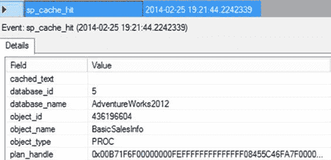
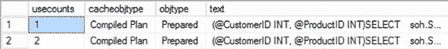

# 第 15 章：执行计划缓存行为



从扩展事件的输出中，您可以看到存储过程的计划未在缓存中找到。

当首次执行存储过程时，SQL Server 会查找过程缓存，但未能找到该过程 `BasicSalesInfo` 的任何缓存条目，这导致了一个 `sp_cache_miss` 事件。在未找到缓存计划后，SQL Server 会安排编译该存储过程。随后，SQL Server 生成并保存计划，然后继续执行该存储过程。您可以在 `sp_cache_insert` 事件中看到这一点。

`图 15-15: sp_cache_hit 扩展事件的详细信息`

如果重新执行此存储过程以检索 `@Productld = 777` 的结果集，则会重用现有计划，如图 15-16 中的 `sys.dm_exec_cached_plans` 输出所示。

`图 15-16: 显示存储过程计划重用的 sys.dm_exec_cached_plans 输出`

```sql
EXEC dbo.BasicSalesInfo
    @CustomerID = 29690,
    @ProductID = 777;
```

您也可以从扩展事件的输出中确认执行计划的重用，如图 15-17 所示。

`图 15-17: 显示存储过程计划重用的 Profiler 跟踪输出`

[www.it-ebooks.info](http://www.it-ebooks.info/)

从扩展事件的输出中，您可以看到在过程缓存中找到了现有计划。在搜索缓存后，SQL Server 找到了存储过程 `BasicSalesInfo` 的可执行计划，这导致了一个 `sp_cache_hit` 事件。一旦找到现有的执行计划，SQL 就会重用该计划来执行存储过程。

一个值得注意的地方是：之前的 `sp_cache_miss` 事件是针对调用该过程的 SQL 批处理。由于参数值的更改，该语句未在缓存中找到，但该过程的执行计划却找到了。

这种看似“额外”的缓存未命中事件可能会引起混淆。

存储过程的这些其他方面也值得考虑：

-   存储过程首次执行时会被编译。
-   存储过程具有其他性能优势，例如减少网络流量。
-   存储过程具有额外的好处，例如数据隔离。

##### 存储过程首次执行时编译

存储过程的执行计划在首次执行时生成。当创建存储过程时，它仅被解析并保存在数据库中。在创建存储过程期间不执行规范化与优化过程。这允许在创建存储过程所访问的所有对象之前创建存储过程。例如，即使存储过程中引用的表 `NotHere` 不存在，您也可以创建以下存储过程：

```sql
IF (SELECT OBJECT_ID('dbo.MyNewProc')) IS NOT NULL
    DROP PROCEDURE dbo.MyNewProc
GO

CREATE PROCEDURE dbo.MyNewProc
AS
    SELECT MyID
    FROM dbo.NotHere; --Table no_tl doesn't exist
```

该存储过程将成功创建，因为在存储过程创建期间不执行将引用对象绑定到查询树（由命令解析器在存储过程执行期间生成）的规范化过程。如果到那时表 `NotHere` 还未创建，该存储过程将在首次执行时报告错误，因为存储过程在首次执行时才会被编译。

##### 存储过程的其他性能优势

除了通过执行计划可重用性来提高性能外，存储过程还提供以下性能优势：

-   `业务逻辑贴近数据`：对存储在数据库中的数据执行大量操作的业务逻辑部分应置于存储过程中，因为 SQL Server 引擎对于关系和集合论操作极其强大。
-   `减少网络流量`：数据库应用程序仅通过网络发送存储过程的名称和参数值。只有处理后的结果集才会返回给应用程序。中间数据不需要在应用程序和数据库之间来回传递。

[www.it-ebooks.info](http://www.it-ebooks.info/)

##### 存储过程的额外好处

存储过程提供的其他一些好处如下：

-   `应用程序与数据结构更改隔离`：如果所有关键的数据访问都通过存储过程进行，那么当数据库架构更改时，可以重新创建存储过程而不影响通过这些存储过程访问数据的应用程序代码。实际上，访问数据库的应用程序甚至无需停止。
-   `管理点单一`：在存储过程中实现的所有业务逻辑都作为数据库的一部分进行维护，并可以在数据库本身上进行集中管理。当然，这个好处是相对的，取决于你问的是谁。要想获得不同的意见，请咨询一位非 DBA 人员！
-   `可以增强安全性`：可以限制用户对数据库表的权限，并且只能通过存储过程中实现的标准业务逻辑进行访问。例如，如果您希望限制用户 `UserOne` 从表 `RestrictedAccess` 中物理删除行，并且只允许通过存储过程 `MarkDeleted` 将行的状态设置为 'Deleted' 来标记为虚拟删除，那么您可以执行如下 `DENY` 和 `GRANT` 命令：

```sql
IF (SELECT OBJECT_ID('dbo.RestrictedAccess')) IS NOT NULL
    DROP TABLE dbo.RestrictedAccess;
GO

CREATE TABLE dbo.RestrictedAccess (ID INT, Status VARCHAR(7));
INSERT INTO dbo.RestrictedAccess VALUES (1,'New');
GO

IF (SELECT OBJECT_ID('dbo.MarkDeleted')) IS NOT NULL
    DROP PROCEDURE dbo.MarkDeleted;
GO

CREATE PROCEDURE dbo.MarkDeleted @ID INT
AS
    UPDATE dbo.RestrictedAccess
    SET Status = 'Deleted'
    WHERE ID = @ID;
GO

--Prevent user u1 from deleting rows
DENY DELETE ON dbo.RestrictedAccess TO UserOne;

--Allow user u1 to mark a row as 'deleted'
GRANT EXECUTE ON dbo.MarkDeleted TO UserOne;
```

这里假设用户 `UserOne` 存在。请注意，如果存储过程 `MarkDeleted` 中的查询是作为字符串 (`@sql`) 动态构建的，如下所示，那么授予存储过程的权限不会授予该查询任何权限，因为动态查询不被视为存储过程的一部分：

```sql
CREATE PROCEDURE dbo.MarkDeleted @ID INT
AS
    DECLARE @SQL NVARCHAR(MAX);
    SET @SQL = 'UPDATE dbo.RestrictedAccess
                SET Status = ''Deleted''
                WHERE ID = ' + CAST(@ID AS NVARCHAR(10));
    EXEC sys.sp_executesql @SQL;
GO

GRANT EXECUTE ON dbo.MarkDeleted TO UserOne;
```

因此，用户 `UserOne` 将无法使用存储过程 `MarkDeleted` 将行标记为 'Deleted'。

（我将在下一章介绍在存储过程中使用动态查询的各个方面。）由于存储过程保存为数据库对象，它们会给数据库管理增加维护开销。很多时候，您可能只需要从应用程序中执行一个或几个查询。如果这些单一查询频繁执行，您应该致力于重用它们的执行计划以提高性能。但为这些单个的单一查询创建存储过程，会向数据库添加大量的存储过程，从而显著增加数据库管理开销。为了避免使用存储过程的维护开销，同时又能获得计划重用的好处，请使用系统存储过程 `sp_executesql` 将单一查询作为准备好的工作负载提交。

`sp_executesql`


#### `sp_executesql` 与执行计划缓存

`sp_executesql` 是一个系统存储过程，它提供了一种将一个或多个查询作为预编译负载提交的机制。它允许查询的可变部分被显式地参数化，因此可以提供与存储过程一样有效的执行计划可重用性。`BasicSalesInfo` 的 `SELECT` 语句可以通过 `sp_executesql` 提交，如下所示：

```sql
DECLARE @query NVARCHAR(MAX),
@paramlist NVARCHAR(MAX);

SET @query = N'SELECT soh.SalesOrderNumber ,soh.OrderDate ,sod.OrderQty ,sod.LineTotal FROM
Sales.SalesOrderHeader AS soh
JOIN Sales.SalesOrderDetail AS sod ON soh.SalesOrderID = sod.SalesOrderID WHERE
soh.CustomerID = @CustomerID
AND sod.ProductID = @ProductID';

SET @paramlist = N'@CustomerID INT, @ProductID INT';

EXEC sp_executesql @query,@paramlist,@CustomerID = 29690,@ProductID = 711;
```

请注意，传递给 `sp_executesql` 存储过程的字符串被声明为 `NVARCHAR`，并且它们是以 `N` 为前缀构建的。这是必需的，因为 `sp_executesql` 使用 Unicode 字符串作为输入参数。

`sys.dm_exec_cached_plans` 的输出如下所示（见图 15-18）：

```sql
SELECT c.usecounts,
c.cacheobjtype,
c.objtype,
t.text
FROM sys.dm_exec_cached_plans c
CROSS APPLY sys.dm_exec_sql_text(c.plan_handle) t
WHERE text LIKE '(@CustomerID%';
```

[www.it-ebooks.info](http://www.it-ebooks.info/)





**图 15-18.** `sys.dm_exec_cached_plans` 输出，显示使用 `sp_executesql` 生成的参数化计划

在图 15-18 中，你可以看到该计划是为通过 `sp_executesql` 提交的查询的参数化部分生成的。由于该计划不绑定于查询的可变部分，如果使用不同的参数值（`d.ProductID=777`）重新提交此查询，则可以重用现有的执行计划，如下所示：

```sql
EXEC sp_executesql @query,@paramlist,@CustomerID = 29690,@ProductID = 777;
```

图 15-19 显示了 `sys.dm_exec_cached_plans` 的输出。

**图 15-19.** `sys.dm_exec_cached_plans` 输出，显示重用使用 `sp_executesql` 生成的参数化计划

从图 15-19 可以看出，当使用不同的变量值重新提交查询时，重用了现有计划（第 2 行计划上的 `usecounts` 为 2）。如果使用可变部分的不同值多次重新提交此查询，则可以重用现有的执行计划，而无需重新生成新的执行计划。

为其创建计划的查询（`text` 列）与通过 `sp_executesql` 提交的参数化查询的确本文本字符串相匹配。因此，如果从应用程序的不同部分提交相同的查询，请确保在所有位置使用相同的文本字符串。例如，如果使用查询字符串中的微小修改（例如小写字母而不是大写字母）重新提交相同的查询，则不会重用现有计划，而是创建一个新计划，如图 15-20 的 `sys.dm_exec_cached_plans` 输出所示。

```sql
SET @query = N'SELECT soh.SalesOrderNumber ,soh.OrderDate ,sod.OrderQty ,sod.LineTotal FROM
Sales.SalesOrderHeader AS soh JOIN Sales.SalesOrderDetail AS sod ON soh.SalesOrderID = sod.
SalesOrderID where soh.CustomerID = @CustomerID AND sod.ProductID = @ProductID' ;
```

**图 15-20.** `sys.dm_exec_cached_plans` 输出，显示使用 `sp_executesql` 生成的计划的敏感性

另一种查看缓存中有两个不同计划的方法是使用其他动态管理对象来查看缓存中计划的属性。

```sql
SELECT decp.usecounts,
decp.cacheobjtype,
decp.objtype,
dest.text,
deqs.creation_time,
deqs.execution_count,
deqs.query_hash,
deqs.query_plan_hash
FROM sys.dm_exec_cached_plans AS decp
CROSS APPLY sys.dm_exec_sql_text(decp.plan_handle) AS dest
JOIN sys.dm_exec_query_stats AS deqs
ON decp.plan_handle = deqs.plan_handle
WHERE dest.text LIKE '(@CustomerID INT, @ProductID INT)%' ;
```

图 15-21 显示了此查询的结果。

**图 15-21.** 来自 `sys.dm_exec_query_stats` 的额外输出

`sys.dm_exec_query_stats` 的输出显示，该查询的两个版本具有不同的 `creation_time` 值。更有趣的是，它们具有相同的 `query_hash` 但不同的 `query_plan_hash`（关于哈希值将在该部分后面详述）。所有这些都表明，更改大小写导致缓存中存储了不同的执行计划。

通常，使用 `sp_executesql` 显式参数化查询，以使它们在使用可变部分的不同值重新提交时其执行计划可重用。这提供了可重用计划的性能优势，而无需管理任何持久性对象（如存储过程所需的）。此功能通过 `SQLExecDirect` 和 `ICommandWithParameters` 分别由 `ODBC` 和 `OLEDB` 提供。

像 .NET 开发人员或 [ADO.NET](http://ado.net/)（ADO 2.7 或更新版本）用户一样，你可以使用 ADO Command 和 Parameters 提交前面的 `SELECT` 语句。如果你将 ADO Command 的 `Prepared` 属性设置为 `FALSE` 并使用 ADO Command（`'SELECT * FROM "Order Details" d, Orders o WHERE d.OrderID=o.OrderID and d.ProductID=?'`）与 ADO Parameters，那么 [.NET](http://ado.net/) 将使用 `sp_executesql` 发送 `SELECT` 语句。大多数对象关系映射工具（如 `nHibernate` 或 `Entity Framework`）也具有允许准备语句和使用参数的机制。

除了参数之外，`sp_executesql` 每次重新执行查询时都会通过网络发送整个查询字符串。你可以通过使用 `ODBC` 和 `OLEDB`（或 `OLEDB .NET`）的准备/执行模型来避免这种情况。

##### 准备/执行模型

`ODBC` 和 `OLEDB` 提供了一个准备/执行模型来将查询作为预编译负载提交。与 `sp_executesql` 类似，此模型允许显式参数化查询的可变部分。准备阶段允许 SQL Server 为查询生成执行计划，并将该执行计划的句柄返回给应用程序。此执行计划句柄由执行阶段用于使用不同的参数值执行查询。此模型只能用于通过 `ODBC` 或 `OLEDB` 提交查询，不能在 SQL Server 内部使用——存储过程内的查询无法使用此模型执行。

SQL Server `ODBC` 驱动程序提供了 `SQLPrepare` 和 `SQLExecute` API 来支持准备/执行模型。SQL Server `OLEDB` 提供程序通过 `ICommandPrepare` 接口公开此模型。`ADO.NET` 的 [OLEDB .NET](http://ado.net/) 提供程序的行为类似。

> **注意** 有关如何在数据库应用程序中使用准备/执行模型的详细说明，请参阅 MSDN 文章“Preparing SQL Statements”[(http://bit.ly/MskJcG](http://bit.ly/MskJcG))。

[www.it-ebooks.info](http://www.it-ebooks.info/)


##### 查询计划哈希与查询哈希


