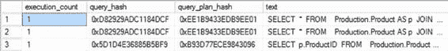

# 第 15 章 ■ 执行计划缓存行为

自 SQL Server 2008 起，引入了围绕执行计划和缓存的新功能，称为 `query plan hash` 和 `query hash`。它们是二进制对象，通过对查询或查询计划应用某种算法来生成二进制哈希值。这对于开发中的一个常见实践——*复制和粘贴*——非常有用。你会发现，通用的模式和实践会在你的代码中反复出现。在最理想的情况下，这是一件好事，因为你会看到最佳类型的查询、联接、基于集合的操作等，根据需要从一个存储过程复制到另一个。但有时，你会看到最糟糕的实践在你的代码中一遍又一遍地重复。这正是查询哈希和查询计划哈希发挥作用、为你提供帮助的地方。

你可以从 `sys.dm_exec_query_stats` 或 `sys.dm_exec_requests` 中检索查询计划哈希和查询哈希。

尽管这是一种识别查询及其计划的机制，但哈希值并非唯一的。不同的计划可能产生相同的哈希值，因此你不能依赖它作为替代的主键。

要查看哈希值的实际效果，请创建两个查询。

```sql
SELECT *
FROM Production.Product AS p
JOIN Production.ProductSubcategory AS ps
ON p.ProductSubcategoryID = ps.ProductSubcategoryID
JOIN Production.ProductCategory AS pc
ON ps.ProductCategoryID = pc.ProductCategoryID
WHERE pc.[Name] = 'Bikes'
AND ps.[Name] = 'Touring Bikes';
```

```sql
SELECT *
FROM Production.Product AS p
JOIN Production.ProductSubcategory AS ps
ON p.ProductSubcategoryID = ps.ProductSubcategoryID
JOIN Production.ProductCategory AS pc
ON ps.ProductCategoryID = pc.ProductCategoryID
where pc.[Name] = 'Bikes'
and ps.[Name] = 'Road Bikes';
```

注意，这两个查询之间唯一实质性的区别在于 `ProductSubcategory.Name` 不同，一个是 Touring Bikes，另一个是 Road Bikes。同时也要注意，第二个查询中的 `WHERE` 和 `AND` 关键字是小写的。在你执行每个查询之后，你可以通过以下查询从 `sys.dm_exec_query_stats` 中看到这些格式更改带来的结果，如图 15-22 所示：

```sql
SELECT deqs.execution_count,
deqs.query_hash,
deqs.query_plan_hash,
dest.text
FROM sys.dm_exec_query_stats AS deqs
CROSS APPLY sys.dm_exec_sql_text(deqs.plan_handle) dest
WHERE dest.text LIKE 'SELECT *
FROM Production.Product AS p%';
```

**图 15-22.** `sys.dm_exec_query_stats` 显示计划哈希值

[www.it-ebooks.info](http://www.it-ebooks.info/)



## 第 15 章 ■ 执行计划缓存行为

由于这些不是参数化查询，因此创建了两个不同的计划；它们过于复杂，无法被视为简单参数化，而强制参数化是关闭的。这两个计划具有相同的哈希值，因为它们仅在传递的值上有所不同。大小写的差异对于查询哈希或查询计划哈希值没有影响。然而，如果你在 `queryhash` 中更改了 SELECT 条件，那么将从 `sys.dm_exec_query_stats` 中检索到的值如图 15-23 所示，查询也会发生变化。

```sql
SELECT p.ProductID
FROM Production.Product AS p
JOIN Production.ProductSubcategory AS ps
ON p.ProductSubcategoryID = ps.ProductSubcategoryID
JOIN Production.ProductCategory AS pc
ON ps.ProductCategoryID = pc.ProductCategoryID
WHERE pc.[Name] = 'Bikes'
AND ps.[Name] = 'Touring Bikes';
```

**图 15-23.** `sys.dm_exec_query_stats` 显示不同的哈希值

尽管查询的基本结构相同，但返回列的更改足以改变查询哈希值和查询计划哈希值。

由于数据分布和索引的差异可能导致相同的查询产生两个不同的计划，`query_hash` 可能相同，而 `query_plan_hash` 可能不同。为了说明这一点，请执行两个新的查询。

```sql
SELECT p.[Name],
tha.TransactionDate,
tha.TransactionType,
tha.Quantity,
tha.ActualCost
FROM Production.TransactionHistoryArchive tha
```


