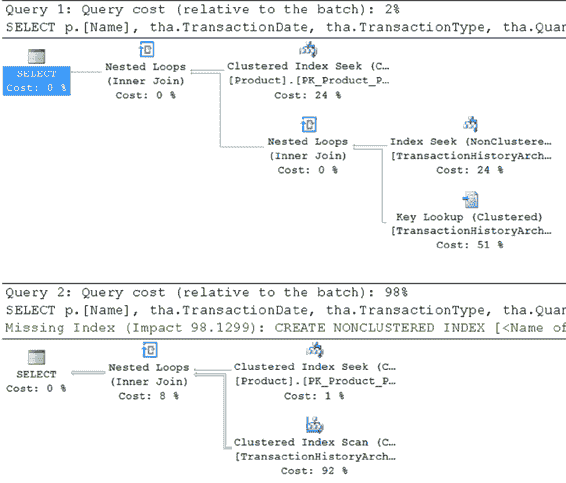

# 第 15 章 ■ 执行计划缓存行为

JOIN `Production.Product` p
ON tha.`ProductID` = p.`ProductID`
WHERE p.`ProductID` = 461;

SELECT p.[Name],
tha.`TransactionDate`,
tha.`TransactionType`,
tha.`Quantity`,
tha.`ActualCost`
FROM `Production.TransactionHistoryArchive` tha
JOIN `Production.Product` p
ON tha.`ProductID` = p.`ProductID`
WHERE p.`ProductID` = 712;

与之前使用的原始查询类似，这些查询的差异仅在于传递给 `ProductID` 列的值。当两个查询都运行时，你可以从 `sys.dm_exec_query_stats` 中选择数据来查看哈希值（图 15-24）。

[www.it-ebooks.info](http://www.it-ebooks.info/)




**图 15-24.** `query_plan_hash` 的差异

你可以看到 `query_hash` 值是相同的，但 `query_plan_hash` 值不同。这是因为根据传入值的统计信息创建的执行计划截然不同，如你在图 15-25 中所见。

**图 15-25.** 不同的参数导致截然不同的计划

查询计划哈希和查询哈希值是追踪不同查询间常见问题的有用工具，但正如你所见，它们并非在所有情况下都能检索到准确的信息集合。

它们确实为识别其他可能导致查询性能不佳的地方增添了另一个实用工具。它们也可用于随时间跟踪执行计划。你可以在将查询部署到生产环境后捕获其 `query_plan_hash`，然后观察它是否因数据变化而改变。借此，你还可以通过计划跟踪聚合的查询统计信息，参考 `sys.dm_exec_query_stats`，但请记住，当服务器重启或计划缓存以任何方式被清除时，聚合数据会被重置。在调优查询时，请牢记这些工具。

[www.it-ebooks.info](http://www.it-ebooks.info/)

## 执行计划缓存建议

计划缓存的基本目的是通过重用执行计划来提高性能。因此，确保你的执行计划确实可重用至关重要。由于即席查询的计划重用效率低下，通常建议尽可能依赖参数化的工作负载技术。为确保有效利用执行计划缓存，请遵循以下建议：

• 显式参数化查询的可变部分。
• 使用存储过程来实现业务功能。
• 使用 `sp_executesql` 以避免存储过程维护。
• 使用准备/执行模型以避免重新发送查询字符串。
• 避免即席查询。
• 对于动态查询，优先使用 `sp_executesql` 而非 `EXECUTE`。
• 谨慎地参数化查询的可变部分。
• 避免在连接之间修改环境设置。
• 避免查询中对象的隐式解析。

让我们更详细地看看这些要点。

### 显式参数化查询的可变部分

一个查询通常会运行多次，每次运行之间唯一的差异是可变部分的值不同。然而，如果能将查询的静态部分和可变部分分开，它们的计划就可以被重用。

尽管 SQL Server 具有简单参数化和强制参数化功能，但它们有严重的局限性。请始终使用标准的参数化工作负载技术显式执行参数化。

### 创建存储过程以实现业务功能

如果你已显式地参数化了查询，那么将其放入存储过程可以获得最佳的可重用性。由于只需随存储过程名称一起发送参数，网络流量得以减少。

由于存储过程是从缓存中重用的，它们可以比即席查询运行得更快。

像任何事物一样，好事也可能过头。有些业务流程适合放在数据库中，但也有些业务流程绝不应该放在数据库内。

### 使用 `sp_executesql` 编码以避免存储过程维护

如果存储过程所需的对象维护成为一个考虑因素，或者你正在使用客户端生成的查询，那么请使用 `sp_executesql` 将查询作为参数化工作负载提交。与存储过程模型不同，`sp_executesql` 不会在数据库中创建任何持久对象。`sp_executesql` 适合执行单例查询或小批量查询。

在存储过程中实现的完整业务逻辑也可以通过 `sp_executesql` 作为一个大的查询字符串提交。然而，随着业务逻辑复杂性的增加，为完整逻辑创建和维护查询字符串变得困难。

此外，使用 `sp_executesql` 和带有适当参数的存储过程可以防止针对服务器的 SQL 注入攻击。

[www.it-ebooks.info](http://www.it-ebooks.info/)

### 实现准备/执行模型以避免重新发送查询字符串

`sp_executesql` 要求每次重新执行查询时都要通过网络发送查询字符串。它还需要在服务器端进行查询字符串匹配的成本，以在过程缓存中找到相应的执行计划。在 ODBC 或 OLEDB（或 OLEDB .NET）应用程序的情况下，你可以使用准备/执行模型来避免在多次执行期间重新发送查询字符串，因为只需提交计划句柄和参数。在准备/执行模型中，由于计划句柄会返回给应用程序，因此该计划可以被其他用户连接重用；它不限于创建该计划的用户。

### 避免即席查询

不要设计使用即席查询的新应用程序！为即席查询创建的执行计划在查询以不同的可变部分值重新提交时无法被重用。尽管 SQL Server 具有简单参数化和强制参数化功能来隔离查询的可变部分，但由于 SQL Server 在参数化方面严格的保守性，该功能仅限于简单查询。为了获得更好的计划可重用性，请将查询作为参数化工作负载提交。

有些系统完全建立在即席查询的概念之上。这在功能上可行，并且可以在 SQL Server 中工作，但正如你所见，它伴随着大量你需要规划的额外开销。

此外，即席查询通常是 SQL 注入被引入系统的方式。

### 对于动态查询，优先使用 `sp_executesql` 而非 `EXECUTE`

在存储过程或数据库应用程序内动态生成的 SQL 查询字符串应使用 `sp_executesql` 执行，而不是 `EXECUTE` 命令。`EXECUTE` 命令不允许显式参数化查询的可变部分。

要理解前面关于 `sp_executesql` 和 `EXECUTE` 的比较，考虑在 `adhocsproc` 中用于执行 `SELECT` 语句的动态 SQL 查询字符串。

```sql
DECLARE @n VARCHAR(3) = '776',
        @sql VARCHAR(MAX);

SET @sql = 'SELECT * FROM Sales.SalesOrderDetail sod '
         + 'JOIN Sales.SalesOrderHeader soh '
         + 'ON sod.SalesOrderID=soh.SalesOrderID '
         + 'WHERE sod.ProductID='''
         + @n + '''';

--使用 EXECUTE 语句执行动态查询
EXECUTE (@sql);
```

`EXECUTE` 语句将查询连同 `d.ProductID` 的值作为即席查询提交，因此可能不会导致简单参数化。通过查看缓存来自己检查输出。

```sql
SELECT deqs.execution_count,
       deqs.query_hash,
       deqs.query_plan_hash,
       dest.text,
       deqp.query_plan
FROM   sys.dm_exec_query_stats AS deqs
       CROSS APPLY sys.dm_exec_sql_text(deqs.plan_handle) dest
       CROSS APPLY sys.dm_exec_query_plan(deqs.plan_handle) AS deqp;
```

[www.it-ebooks.info](http://www.it-ebooks.info/)


