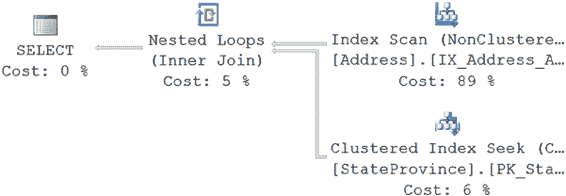
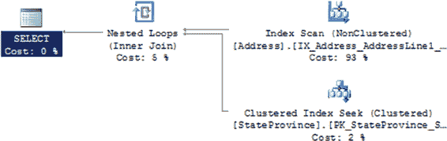
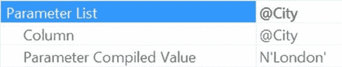

# 第 16 章：参数嗅探

### 执行计划分析

CPU 时间 = 0 毫秒，耗时 = 124 毫秒。

***图 16-1.** AddressByCity 的执行计划*

[www.it-ebooks.info](http://www.it-ebooks.info/)



优化器嗅探到了值 `London`，并基于 `Address` 表的统计数据中 `London` 市所代表的数据分布，得出了一个执行计划。该查询或表上的索引可能还有其他调优机会，但对于 `London` 而言，此计划是最优的。你可以像下面这样，使用一个局部变量来编写一个完全相同的查询：

```sql
DECLARE @City NVARCHAR(30) = N'London';

SELECT a.AddressID,
       a.AddressLine1,
       AddressLine2,
       a.City,
       sp.[Name] AS StateProvinceName,
       a.PostalCode
FROM Person.Address AS a
JOIN Person.StateProvince AS sp
    ON a.StateProvinceID = sp.StateProvinceID
WHERE a.City = @City;
```

当这个查询被执行时，I/O 和执行时间的结果是不同的。

```
表 'StateProvince'。扫描计数 0，逻辑读取 868 次
表 'Address'。扫描计数 1，逻辑读取 216 次
CPU 时间 = 0 毫秒，耗时 = 212 毫秒。
```

执行时间增加了，总读取次数从 219 次增加到了 1084 次。这可以通过查看图 16-2. 所示的新执行计划得到部分解释。

***图 16-2.** 使用局部变量创建的执行计划*

所发生的情况是，优化器无法对局部变量的值进行采样或嗅探，因此不得不使用统计数据中的平均行数。通过查看 `索引扫描` 运算符属性中的估计行数，你可以看到这一点。它显示为 34.113。然而，如果你查看返回的数据，`London` 值实际上有 434 行。简而言之，如果优化器认为需要检索 434 行，它会使用 `合并联接` 并只进行 219 次读取来创建一个计划。但是，如果它认为只返回大约 34 行，它会使用带有 `嵌套循环` 联接的计划，由于嵌套循环的特性（为上层数据集中的每个值在下层数据中执行一次查找），这导致了 1,084 次读取和更差的性能。

这就是参数嗅探在实际中导致性能提升的情况。现在，让我们看看当参数嗅探出问题时会发生什么。

[www.it-ebooks.info](http://www.it-ebooks.info/)

### 糟糕的参数嗅探

当你的统计数据存在问题时，参数嗅探就会产生问题。传递给参数的值可能代表你的数据以及统计数据内部的数据分布。在这种情况下，你会看到一个良好的执行计划。但是，当传递的参数不能代表表中其余数据时，会发生什么？

这种情况可能出现，因为你的数据分布本身就不是平均的。例如，统计数据中的大多数值只会返回几行，比如六行，但某些值会返回数百行。反之亦然，常见的情况是大量数据的分布，而小值的集合不常见。在这种情况下，基于非代表性数据创建了一个执行计划，但这个计划对大多数查询来说并不实用。这种情况最常表现为性能突然下降，有时相当严重。它甚至可能看似随机地自我修复，当重新编译事件允许一个更好的代表性数据值作为参数传入时。

当统计数据过时或由于是采样而非扫描导致不准确时（更多关于统计信息的细节，请参见第 12 章），你也可能看到这种情况发生。无论如何，这种情况会产生一个用处不大的计划，并将其存储在缓存中。例如，考虑以下存储过程：

```sql
CREATE PROC dbo.AddressByCity
    @City NVARCHAR(30)
AS
SELECT a.AddressID,
       a.AddressLine1,
       AddressLine2,
       a.City,
       sp.[Name] AS StateProvinceName,
       a.PostalCode
FROM Person.Address AS a
JOIN Person.StateProvince AS sp
    ON a.StateProvinceID = sp.StateProvinceID
WHERE a.City = @City;
GO
```


## 第 16 章 ■ 参数嗅探

如果再次运行之前创建的存储过程 `dbo.AddressByCity`，但这次使用不同的参数，那么它将返回一组不同的 I/O 和执行时间，但执行计划是相同的，因为它从缓存中被重用了。

`EXEC dbo.AddressByCity @City = N'Mentor';`

表 'Address'。扫描计数 1，逻辑读取 216
表 'StateProvince'。扫描计数 1，逻辑读取 3
CPU 时间 = 15 ms，耗时 = 84 ms。

由于重用了相同的执行计划，I/O 是相同的。执行时间更快是因为返回的行数更少。你可以查看 `sys.dm_exec_query_stats` 的输出（如图 16-3 所示）来验证该计划确实被重用了。

```sql
SELECT dest.text,
deqs.execution_count,
deqs.creation_time
FROM sys.dm_exec_query_stats AS deqs
CROSS APPLY sys.dm_exec_sql_text(deqs.sql_handle) AS dest
WHERE dest.text LIKE 'CREATE PROC dbo.AddressByCity%';
```

[www.it-ebooks.info](http://www.it-ebooks.info/)




图 16-3. `sys.dm_exec_query_stats` 的输出验证了存储过程的重用

为了展示不良的参数嗅探如何发生，你可以颠倒存储过程的执行顺序。首先运行 `DBCC FREEPROCCACHE` 来清空缓冲区缓存（这不应该在生产机器上运行）。然后以相反的顺序重新运行查询。第一个查询使用参数值 Mentor，产生以下 I/O 和执行计划（图 16-4）：

表 'StateProvince'。扫描计数 0，逻辑读取 2
表 'Address'。扫描计数 1，逻辑读取 216
CPU 时间 = 0 ms，耗时 = 78 ms

图 16-4. 执行计划发生了变化

图 16-4 与图 16-2 所示的执行计划不同。读取次数略有下降，但执行时间大致相同。第二次执行，使用 London 作为参数值，产生以下 I/O 和执行时间：

表 'StateProvince'。扫描计数 0，逻辑读取 868
表 'Address'。扫描计数 1，逻辑读取 216
CPU 时间 = 0 ms，耗时 = 283 ms。

这一次，读取次数急剧增加，达到了使用局部变量时的水平，执行时间也增加了。第一次使用参数 London 执行存储过程时创建的计划，最适合检索数据库中符合该条件的 434 行。然后，下一次使用参数值 Mentor 执行存储过程时，使用第一次执行生成的相同计划，表现也还算可以。当顺序颠倒后，为 Mentor 值创建了一个新的执行计划，而这个计划对于 London 值来说效果非常差。

在这些例子中，我实际上稍微取了点巧。如果你查看相关统计信息中的数据分布，你会发现平均返回行数在 34 左右，而 London 的 434 行是一个离群值。当存储过程为 London 编译时，你看到的略好的性能反映了一个事实：需要一个不同的计划。然而，对于像 Mentor 这样的值，在使用为 London 创建的计划时，性能略有下降。但是，为 Mentor 改进的计划对于像 London 这样的值来说，绝对是灾难性的。现在到了困难的部分。

你必须确定哪个计划适合你系统的负载。一个计划对平均值来说稍差一些，而另一个计划对平均值更好，但严重损害了离群值的性能。问题是，是为了支持离群值获得更好性能，而让所有可能的数据集都运行得稍慢一些，还是为了让更大部分的数据子集运行良好（因为它可能被更频繁地调用）而让离群值承受性能损失？

这需要你根据自己系统的具体情况来判断。

[www.it-ebooks.info](http://www.it-ebooks.info/)



### 识别不良参数嗅探


