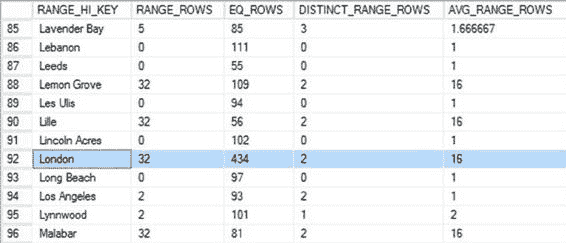
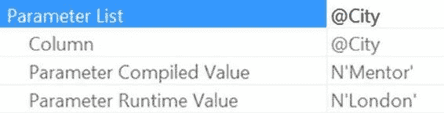

# 这将是一个间歇性问题

有时你会得到一个运行得足够好、没人抱怨的执行计划，有时则会得到另一个，然后突然电话响个不停，全是抱怨系统速度的投诉。因此，这个问题很难追踪。关键在于识别出你正在为给定的参数化查询获取两个（或有时更多）不同的执行计划。当你开始遇到这种性能间歇性变化时，必须捕获相关的查询计划。

一种方法是使用 `sys.dm_exec_query_plan` DMO 直接从缓存中提取估计的计划，如下所示：

```sql
SELECT deps.execution_count,
       deps.total_elapsed_time,
       deps.total_logical_reads,
       deps.total_logical_writes,
       deqp.query_plan
FROM sys.dm_exec_procedure_stats AS deps
CROSS APPLY sys.dm_exec_query_plan(deps.plan_handle) AS deqp
WHERE deps.object_id = OBJECT_ID('AdventureWorks2012.dbo.AddressByCity');
```

此查询使用 `sys.dm_exec_procedure_stats` DMO 来检索缓存中关于该存储过程的信息及其查询计划。在 SSMS 中运行结果将包含一个可点击的 `query_plan` 列。

点击它将打开一个图形化计划，即使检索到的是 XML。要保存计划以便以后比较，只需右键单击计划本身，然后从上下文菜单中选择“另存为执行计划”。然后你可以保存此计划，以便与以后的计划进行比较。你需要查看的是第一个运算符的属性，本例中是 `SELECT` 运算符。在那里，你会找到“参数列表”项，它将显示优化器编译计划时使用的值，如图 16-5 所示。

`图 16-5`

然后你可以使用这个值来查看你的统计信息，以理解为什么你会看到一个与预期不同的计划。在这种情况下，如果我运行以下查询，我可以检查直方图，看看像 `London` 这样的值可能存储在哪里以及我可以预期多少行：

```sql
DBCC SHOW_STATISTICS('Person.Address','_WA_Sys_00000004_164452B1');
```

图 16-6 显示了直方图的相关部分。

`www.it-ebooks.info`



第 16 章 ■ 参数嗅探

`图 16-6`

你可以看到，`London` 的值返回的行数比 `AVG_RANGE_ROWS` 中显示的任何平均行数都要多，并且它比 `RANG_HI_KEY` 计数中存储的许多其他步骤的 `EQ_ROWS` 都要高。

简而言之，`London` 的值与其余数据相比是偏斜的。这就是为什么那里的计划与其他计划不同。

你必须对统计信息和编译时参数值进行同样类型的评估，以理解不良的参数嗅探来自哪里。

但是，如果你有一个参数化查询正遭受不良参数嗅探的困扰，你可以采取几种不同的方法来尝试减轻这个问题。

### 减轻不良参数嗅探

一旦你确定在某种情况下遇到了不良参数嗅探，你不必默默忍受。你可以做些什么，但你需要做出决定。你有几种选择来减轻不良参数嗅探的行为。

- 你可以通过在执行存储过程前对其运行 `sp_recompile` 来强制在执行时重新编译计划。
- 另一种强制重新编译的方法是使用 `EXEC <procedure name> WITH RECOMPILE`。
- 还有一种强制每次执行都重新编译的机制，是在创建存储过程时使用 `WITH RECOMPILE` 作为过程定义的一部分。
- 你也可以在单个语句上使用 `OPTION (RECOMPILE)`，让只有那些语句而不是整个过程重新编译。如果你打算强制重新编译，这通常是最佳方法。
- 你可以将输入参数重新分配给局部变量。这种流行的修复方法强制优化器通过查看所引用数据的统计信息来猜测可能使用的值，这可以消除实际参数值被考虑在内的情况。这是一种旧方法，已被使用 `OPTIMIZE FOR UNKNOWN` 所取代。
- 你可以在创建存储过程时使用查询提示 `OPTIMIZE FOR`，并为其提供已知的良好参数，这些参数将为大多数查询生成一个有效的计划。你可以指定一个生成特定计划的值，或者你可以指定 `UNKNOWN` 以获取基于统计信息平均值的通用计划。
- 你可以使用计划指南，这是一种使查询以某种方式行为而无需修改存储过程的方法。这将在第 17 章中详细讨论。
- 你可以通过将跟踪标志 4136 设置为 `on` 来在服务器上禁用参数嗅探。请理解，这种有益的行为将对整个服务器关闭，而不仅仅是一个有问题的查询。对于你的系统来说，这可能是一个非常危险的选择。我稍后会进一步讨论它。
- 如果你有一个特定的查询模式导致不良参数嗅探，你可以通过设置两个或更多不同的存储过程来隔离功能，使用一个包装过程来确定调用哪一个。这可以帮助你同时使用多种不同的方法。

这些可能的解决方案中的每一个都伴随着必须考虑的权衡。如果你决定每次调用查询时都重新编译它，你将不得不为重新编译查询所需的额外 CPU 付出代价。这违背了通过使用参数化查询来尝试获得计划重用的整个想法，但在你的情况下，它可能是最佳解决方案。将参数重新分配给局部变量是一种老派的方法；代码看起来可能很傻。

```sql
ALTER PROC dbo.AddressByCity @City NVARCHAR(30)
AS
DECLARE @LocalCity NVARCHAR(30) = @City;
SELECT a.AddressID,
       a.AddressLine1,
       AddressLine2,
       a.City,
       sp.[Name] AS StateProvinceName,
       a.PostalCode
FROM Person.Address AS a
JOIN Person.StateProvince AS sp
  ON a.StateProvinceID = sp.StateProvinceID
WHERE a.City = @LocalCity;
```

使用这种方法，优化器基于相关列的密度而不是直方图来进行基数估计。但它在查询中看起来很奇怪。事实上，如果你采用这种方法，我强烈建议在变量声明前添加注释，以明确你为什么这样做。这里有一个例子：

```sql
-- 这允许查询绕过不良参数嗅探
DECLARE @LocalCity NVARCHAR(30) = @City;
```

但是，采用这种方法，你现在可能面临“变量嗅探”的可能性，因此除非你使用的是早于 2008 的 SQL Server 实例，否则并不真正推荐。从 SQL Server 2008 及更高版本开始，你最好使用 `OPTIMIZE FOR UNKNOWN` 查询提示来完成同样的事情。

你可以使用 `OPTIMIZE FOR` 查询提示并传递一个特定值。因此，例如，如果你想确保始终使用值 `Mentor` 生成的计划，你可以对查询执行以下操作：

```sql
ALTER PROC dbo.AddressByCity @City NVARCHAR(30)
AS
SELECT a.AddressID,
       a.AddressLine1,
       AddressLine2,
       a.City,
       sp.[Name] AS StateProvinceName,
       a.PostalCode
FROM Person.Address AS a
JOIN Person.StateProvince AS sp
  ON a.StateProvinceID = sp.StateProvinceID
WHERE a.City = @City
OPTION (OPTIMIZE FOR (@City = 'Mentor'));
```

`www.it-ebooks.info`



第 16 章 ■ 参数嗅探


现在优化器将忽略传递给 `@City` 的任何值，并始终使用 `Mentor` 的值。您甚至可以通过如图所示修改查询来实际观察这一点，这将把查询从缓存中移除，然后使用参数值 `London` 执行它。这会在缓存中生成一个新的执行计划。如果您打开该计划并查看 `SELECT` 属性，您将看到图 16-7 中所示的提示证据。

**图 16-7.** 运行时与编译时值不同

如您所见，优化器完全按照您的指定操作，使用了值 `Mentor` 来编译计划，尽管您也可以看到您是使用值 `London` 执行的查询。这种方法的问题在于数据会随时间变化，对您当时数据是最优的计划，可能不再是最优的。如果您选择使用 `OPTIMIZE FOR` 提示，则需要计划定期重新评估它。

如果您选择使用跟踪标志完全禁用参数嗅探，请注意这会在整个服务器上关闭它。由于大多数情况下，参数嗅探绝对对您有帮助，您最好确认自己从中得不到任何益处，并且处理它的唯一希望是关闭嗅探。这甚至不需要重启服务器，因此是即时生效的。生成的计划将基于可用统计信息的平均值，因此根据您的数据，计划可能会严重次优。在这样做之前，请探索在您最有问题的查询上使用 `RECOMPILE` 提示的可能性。通过这种方式，您更有可能获得更好的计划，尽管您不会得到计划重用。

对于所有这些可能的缓解方法，在决定采用哪种方法之前，请在您的系统上仔细测试。

这些方法中的每一种都有效，但它们的工作方式可能在某种情况下优于另一种情况，因此了解不同的方法是很好的，并且您可以根据您的情况对它们进行实验。

最后，请记住这是由统计信息驱动的，因此如果您的统计信息不准确或已过时，您更有可能遇到糟糕的参数嗅探。重新检查您的统计信息维护例程以确保其有效性通常是最简单的最佳解决方案。

## 总结

在本章中，我概述了参数嗅探究竟是什么，以及它在大多数情况下如何有益于您所有参数化的查询。这一点很重要，因为当您遇到糟糕的参数嗅探时，它可能看起来弊大于利。我讨论了统计信息和数据分布如何为部分数据集创建次优计划，即使它们对其他数据部分是最优的。这就是糟糕的参数嗅探在起作用。有几种方法可以缓解糟糕的参数嗅探，但每种方法都是一种权衡，因此请仔细检查它们以确保您为系统做出最佳选择。

在下一章中，我将讨论导致查询重新编译的原因以及可以采取的措施。

[www.it-ebooks.info](http://www.it-ebooks.info/)

