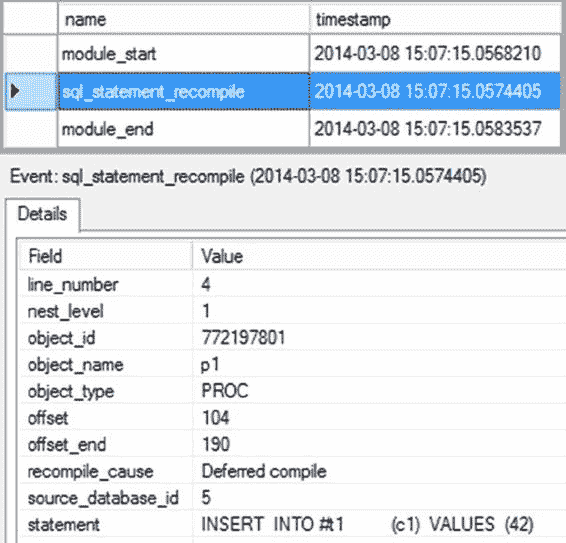

# 第 17 章 ■ 查询重编译

当你执行这个过程时，`SELECT`语句从表中返回完整的数据集（所有行和列），因此最好通过对表 `WorkOrder` 执行表扫描来完成。正如第 4 章所解释的，`SELECT`语句的处理不会受益于任何列上的非聚集索引。因此，理想情况下，在执行存储过程之前创建非聚集索引（如下所示）应该没有影响。

```sql
EXEC dbo.WorkOrderAll;
GO
CREATE INDEX IX_Test ON Production.WorkOrder(StockedQty,ProductID);
GO
EXEC dbo.WorkOrderAll; --创建索引 IX_Test 之后
```

但是，索引创建后的存储过程执行面临着重编译，如图 17-3 中相应的扩展事件输出所示。

### 图 17-3. 存储过程的无益重编译

使用 `sql_statement_recompile` 事件来跟踪语句重编译。在旧的跟踪事件中曾有的单独过程重编译事件已不复存在。

在这种情况下，重编译对存储过程并无实际益处。但不幸的是，它属于导致 SQL Server 在每次执行时都重编译存储过程的条件范围。这可能使存储过程的计划缓存失效，并在此次执行中浪费 CPU 周期来重新生成相同的计划。因此，重要的是要了解导致查询重编译的条件，并在实现旨在重用计划的存储过程和参数化查询时，尽一切努力避免这些条件。

在确定了在各种情况下导致 SQL Server 重编译语句的具体语句后，我接下来将讨论这些条件。

[www.it-ebooks.info](http://www.it-ebooks.info/)

## 识别导致重编译的语句

SQL Server 可以重编译存储过程内的单个语句或整个过程。因此，要找到重编译的原因，重要的是识别出无法重用现有计划的 SQL 语句。

你可以使用扩展事件来跟踪语句重编译。你也可以使用相同的事件来识别导致重编译的存储过程语句。表 17-1 显示了你可以使用的相关事件。

### 表 17-1. 用于分析查询重编译的事件

- `sql_batch_completed` 或 `module_end`
- `sql_statement_recompile`
- `sql_batch_starting` 或 `module_start`
- `sp_statement_completed` 或 `sql_statement_completed` （可选）
- `sp_statement_starting` 或 `sql_statement_starting` （可选）

考虑以下简单的存储过程：

```sql
IF (SELECT OBJECT_ID('dbo.TestProc')) IS NOT NULL
DROP PROC dbo.TestProc;
GO
CREATE PROC dbo.TestProc
AS
CREATE TABLE #TempTable (C1 INT);
INSERT INTO #TempTable (C1) VALUES (42); -- 数据更改导致重编译
GO
```

第一次执行此存储过程时，会得到如图 17-4 所示的扩展事件输出。

```sql
EXEC dbo.TestProc;
```

[www.it-ebooks.info](http://www.it-ebooks.info/)



### 图 17-4. 显示因重编译产生的 sql_statement_recompile 事件的扩展事件输出

在图 17-4 中，你可以看到一个重编译事件 (`sql_statement_recompile`)，表明存储过程经历了重编译。正如前一章所述，当第一次执行存储过程时，SQL Server 会编译该存储过程并生成一个执行计划。顺便说一句，如果你使用扩展事件进行跟踪，可能会看到其他语句。只需按数据库 ID 进行筛选或分组，就可以更轻松地查看你感兴趣的事件。在你的扩展事件会话中添加筛选器总是一个好主意。

由于执行计划仅维护在易失性内存中，因此在 SQL Server 重新启动时，它们会被清除。


