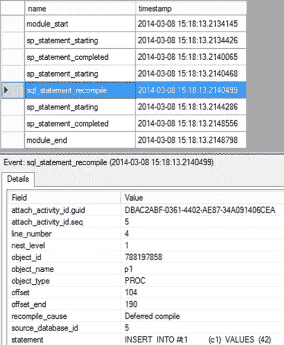

# 第 17 章 ■ 查询重编译

当存储过程在服务器重启后再次执行时，SQL Server 会重新编译该存储过程并生成执行计划。由于缓存中不存在可供重用的计划，这些编译不会被视为存储过程重编译。`sql_statement_recompile` 事件则表明计划已经存在但无法重用。

**注意** 我将在后面的“分析重编译原因”一节中讨论 `recompile_cause` 数据列的重要性。

要查看是哪个语句导致了重编译，请查看 `sql_statement_recompile` 事件中的 `statement` 列。它明确显示了正在被重编译的语句。你也可以通过将各种语句启动事件与重编译事件结合使用，来识别导致重编译的存储过程语句。如果在扩展事件会话中启用了 `Causality Tracking`，你将获得一个事件开始的标识符，以及同一链中其他事件的序列号。图 `17-5` 显示了紧接在 `sql_statement_recompile` 事件之前的 `sp_statement_starting` 事件的 `attach_activity_id.seq`。如果你查看重编译事件，它会作为序列中的下一个事件出现。

[www.it-ebooks.info](http://www.it-ebooks.info/)

**图 17-5.** 显示 `sp_statement_starting` 事件导致重编译的扩展事件输出

请注意，在语句重编译之后，导致重编译的存储过程语句将使用新计划重新开始执行。你可以捕获事件中的语句，通过时间戳按序列关联事件，或者最好是在扩展事件上使用 `Causality Tracking`。这些方法中的任何一种都可用于追踪具体是哪个语句导致了重编译。

### 分析重编译的原因

为了提升性能，分析重编译的原因至关重要。通常，重编译可能并非必要，你可以避免它以改善性能。例如，每次经历编译或重编译过程，你都在消耗 CPU 资源供优化器完成工作。在经历编译过程时，计划也会在内存中换入换出。当查询重编译时，该查询在重编译过程运行期间会被阻塞，这意味着频繁调用的查询如果也需要经历重编译，可能会成为主要的性能瓶颈。

了解导致重编译的不同条件有助于你评估重编译的原因，并确定如何在非必要时避免重编译。语句重编译由以下原因引起：

- 存储过程语句中引用的常规表、临时表或视图的架构已更改。架构更改包括表元数据或表上索引的更改。
- 常规表或临时表的列的绑定（例如默认值）已更改。
- 表索引或列上的统计信息已更改，无论是自动还是手动更改。
- 某个对象在存储过程编译时不存在，但在执行期间被创建。这被称为 *延迟对象解析*，是前述重编译的原因。
- `SET` 选项已更改。
- 执行计划老化并被释放。
- 显式调用了系统存储过程 `sp_recompile`。
- 显式使用了 `RECOMPILE` 提示。

你可以在扩展事件中看到这些更改。原因由 `sql_statement_recompile` 事件的 `recompile_cause` 数据列值指示，如 `表 17-2` 所示。

**表 17-2.** 反映重编译原因的重编译原因数据列

| 描述 |
| --- |
| 常规表或视图的架构或绑定已更改 |
| 统计信息已更改 |

