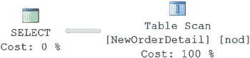
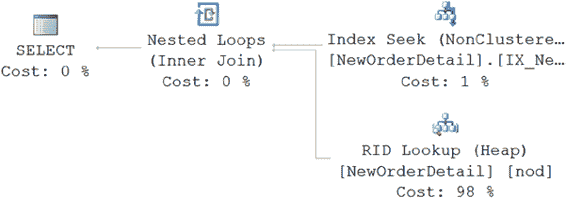
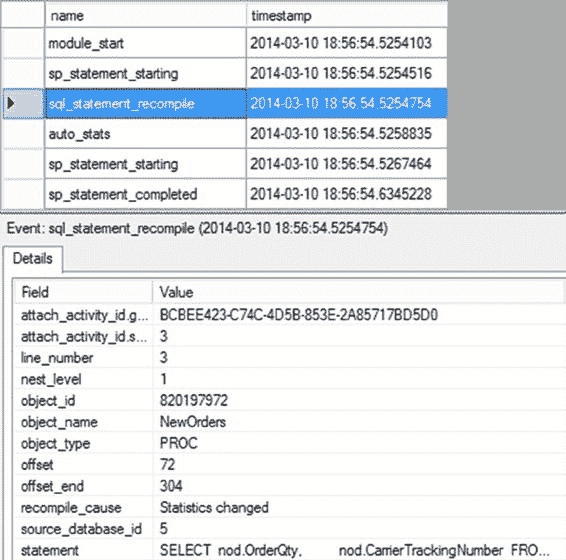
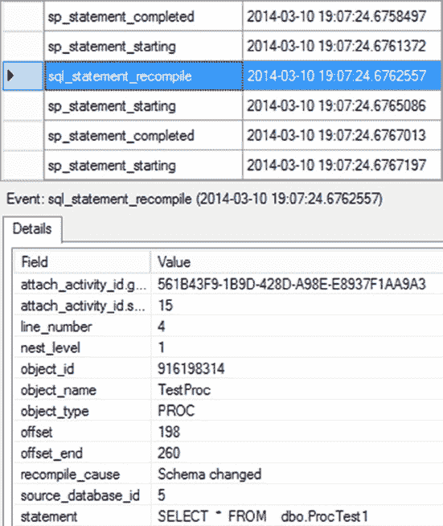

# 第 17 章 ■ 查询重新编译

对象在存储过程计划中不存在，但在执行期间被创建

SET 选项已更改

架构或对临时表的绑定已更改

远程行集的架构或绑定已更改

FOR BROWSE 权限已更改

查询通知环境已更改

MPI 视图已更改

游标选项已更改

调用了 WITH RECOMPILE 选项

让我们更详细地查看表 17-2 中列出的一些导致重新编译的原因，并讨论你可以采取哪些措施来避免它们。

[www.it-ebooks.info](http://www.it-ebooks.info/)

#### 架构或绑定更改

当视图、常规表或临时表的架构或绑定发生更改时，现有查询的执行计划将失效。在执行任何引用已修改对象的语句之前，必须重新编译查询。SQL Server 会自动检测这种情况并重新编译存储过程。

> `注意` 我将在“重新编译的优缺点”部分更详细地讨论由于架构更改导致的重新编译。

#### 统计信息更改

SQL Server 会跟踪表的更改次数。如果更改次数超过了重新编译阈值 (`RT`) 值，那么当语句中引用该表时，SQL Server 会自动更新统计信息，正如你在第 12 章中看到的。当检测到自动更新统计信息的条件时，SQL Server 会自动将该语句标记为重新编译，同时更新统计信息。

`RT` 由一个公式决定，该公式取决于表是永久表还是临时表（不是表变量）以及表中的行数。表 17-3 展示了基本公式，以便你可以确定何时可能由于数据更改而看到语句重新编译。

### 表 17-3. 确定数据更改的公式

| **表类型** | **公式** |
| :--- | :--- |
| 永久表 | 如果行数 (`n`) <= 500，`RT` = 500<br>如果 `n` > 500，`RT` = 500 + .2 * `n`<br>或者<br>当设置了跟踪标志 2371 时，25,000 行后按比例计算 |
| 临时表 | 如果 `n` < 6，`RT` = 6<br>如果 6 <= `n` <= 500，`RT` = 500<br>如果 `n` > 500，`RT` = 500 + .2 * `n`<br>或者<br>当设置了跟踪标志 2317 时，25,000 行后按比例计算 |

要理解统计信息更改如何导致重新编译，请考虑以下示例。该存储过程在第一次执行时表中只有一行。在第二次执行存储过程之前，向表中添加了大量行。

> `注意` 请确保数据库的 `AUTO_UPDATE_STATISTICS` 设置为 `ON`。你可以通过执行以下查询来确定 `AUTO_UPDATE_STATISTICS` 设置：
>
> `SELECT DATABASEPROPERTYEX('AdventureWorks2012', 'IsAutoUpdateStatistics');`

**328**

[www.it-ebooks.info](http://www.it-ebooks.info/)

```sql
IF EXISTS ( SELECT *
            FROM sys.objects AS o
            WHERE o.object_id = OBJECT_ID(N'dbo.NewOrderDetail')
            AND o.type IN (N'U') )
    DROP TABLE dbo.NewOrderDetail;
GO

SELECT *
INTO dbo.NewOrderDetail
FROM Sales.SalesOrderDetail;
GO

CREATE INDEX IX_NewOrders_ProductID ON dbo.NewOrderDetail (ProductID);
GO

IF EXISTS ( SELECT *
            FROM sys.objects
            WHERE object_id = OBJECT_ID(N'dbo.NewOrders')
            AND type IN (N'P',N'PC') )
    DROP PROCEDURE dbo.NewOrders;
GO

CREATE PROCEDURE dbo.NewOrders
AS
    SELECT nod.OrderQty,
           nod.CarrierTrackingNumber
    FROM dbo.NewOrderDetail nod
    WHERE nod.ProductID = 897;
GO

SET STATISTICS XML ON;
EXEC dbo.NewOrders;
SET STATISTICS XML OFF;
GO
```

接下来，你需要在重新执行存储过程之前修改一些行。

```sql
UPDATE dbo.NewOrderDetail
SET ProductID = 897
WHERE ProductID BETWEEN 800 AND 900;
GO

SET STATISTICS XML ON;
EXEC dbo.NewOrders;
SET STATISTICS XML OFF;
GO
```

第一次，SQL Server 使用 `Index Seek` 操作执行存储过程的 `SELECT` 语句，如图 17-6 所示。

[www.it-ebooks.info](http://www.it-ebooks.info/)





### 图 17-6. 数据更改前的执行计划

> `注意` 请确保图形执行计划的设置为 `OFF`；否则，`STATISTICS XML` 的输出将不会显示。

在重新执行存储过程时，SQL Server 自动检测到索引上的统计信息已更改。这导致存储过程内的 `SELECT` 语句重新编译，优化器在执行存储过程内的 `SELECT` 语句之前确定了一个更好的处理策略，如图 17-7 所示。

### 图 17-7. 统计信息更改对执行计划的影响

图 17-8 显示了相应的扩展事件输出（添加了 `auto_stats` 事件）。

[www.it-ebooks.info](http://www.it-ebooks.info/)



### 图 17-8. 统计信息更改对存储过程重新编译的影响

在图 17-8 中，你可以看到在第二次执行存储过程时执行 `SELECT` 语句，需要一次重新编译。从 `recompile_cause` 的值（`Statistics Changed`）可以理解，重新编译是由于统计信息更改引起的。作为创建新计划的一部分，统计信息会自动更新，如在请求重新编译语句之后发生的 `Auto Stats` 事件所示。你也可以使用 `DBCC SHOW_STATISTICS` 语句验证统计信息的自动更新，如第 12 章所述。

#### 延迟对象解析

查询通常动态创建并随后访问数据库对象。当这样的查询第一次执行时，第一个执行计划不会包含有关在运行时创建的对象的信息。因此，在第一个执行计划中，这些对象的处理策略被推迟到查询运行时。当查询中引用这些对象之一的 `DML` 语句执行时，查询会被重新编译以生成包含该对象处理策略的新计划。

常规表和本地临时表都可以在存储过程中创建，用于保存中间结果集。由于延迟对象解析导致的语句重新编译，对于常规表与本地临时表相比，表现不同，如下节所述。

[www.it-ebooks.info](http://www.it-ebooks.info/)

### 因常规表导致的重新编译

要理解在存储过程中创建常规表导致的查询重新编译问题，请考虑以下示例：

```sql
IF (SELECT OBJECT_ID('dbo.TestProc')
   ) IS NOT NULL
    DROP PROC dbo.TestProc;
GO

CREATE PROC dbo.TestProc
AS
    CREATE TABLE dbo.ProcTest1 (C1 INT); --确保表不存在
    SELECT *
    FROM dbo.ProcTest1; --导致重新编译
    DROP TABLE dbo.ProcTest1;
GO

EXEC dbo.TestProc; --第一次执行
EXEC dbo.TestProc; --第二次执行
```

当存储过程第一次执行时，在实际执行存储过程之前会生成一个执行计划。如果存储过程中创建的表在创建存储过程之前不存在（如前面代码中预期的那样），那么该计划将不包含引用该表的 `SELECT` 语句的处理策略。因此，要执行 `SELECT` 语句，该语句需要重新编译，如图 17-9 所示。

[www.it-ebooks.info](http://www.it-ebooks.info/)




