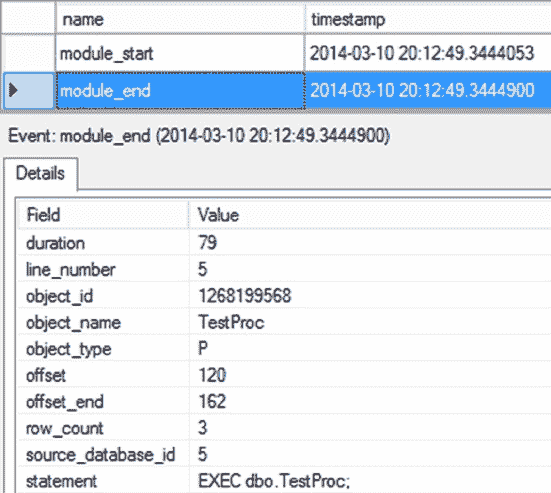

# 第 17 章 ■ 查询重编译

`图 17-13.` 扩展事件输出，显示因 DDL 和 DML 交错执行而导致的重编译。可以看到，这些语句被重编译了四次。

*   查询首次执行时生成的执行计划不包含任何关于局部临时表的信息。因此，最初生成的计划永远无法用于通过 DML 语句访问该临时表。
*   第二次重编译源于表在加载过程中其包含数据的变化。
*   第三次重编译是由第一个临时表 (`#MyTempTable`) 的架构更改引起的。在 `#MyTempTable` 上创建索引会使现有计划失效，导致再次访问该表时发生重编译。如果在此索引是在第一次重编译之前创建的，那么现有计划对于第二个 `SELECT` 语句也将保持有效。因此，你可以通过将 `CREATE INDEX` DDL 语句放在所有引用该表的 DML 语句之前来避免此次重编译。
*   第四次重编译生成了一个包含 `#t2` 处理策略的计划。现有计划没有关于 `#t2` 的信息，因此无法用于通过第三个 `SELECT` 语句访问 `#t2`。如果 `#t2` 的 `CREATE TABLE` DDL 语句被放置在所有可能导致重编译的 DML 语句之前，那么第一次重编译本身就会包含关于 `#t2` 的信息，从而避免第三次重编译。

[www.it-ebooks.info](http://www.it-ebooks.info/)

### 避免因统计信息更改导致的重编译

在“分析重编译原因”一节中，你看到统计信息的更改是重编译的原因之一。对于一个具有均匀数据分布的简单表，因统计信息更改而导致的重编译可能会生成一个与前一计划相同的计划。在这种情况下，重编译可能是不必要的，如果成本过高则应避免。但是，大多数情况下，统计信息的更改需要反映在执行计划中。我这里指的是那些重编译时间过长或重编译次数过多影响到 CPU 的情况。

你有两种技术可以避免因统计信息更改导致的重编译。

*   使用 `KEEPFIXED PLAN` 选项。
*   禁用表上的自动更新统计信息功能。

#### 使用 KEEPFIXED PLAN 选项

SQL Server 提供了 `KEEPFIXED PLAN` 选项来避免因统计信息更改而导致的重编译。要了解如何使用 `KEEPFIXED PLAN`，请考虑 `statschanges.sql` 脚本，并做适当修改以使用 `KEEPFIXED PLAN` 选项。

```sql
--创建一个包含一行数据和索引的小表
IF (SELECT OBJECT_ID('dbo.Test1')) IS NOT NULL
    DROP TABLE dbo.Test1 ;
GO
CREATE TABLE dbo.Test1 (C1 INT, C2 CHAR(50)) ;
INSERT INTO dbo.Test1
VALUES (1, '2') ;
CREATE NONCLUSTERED INDEX IndexOne ON dbo.Test1 (C1) ;

--创建一个引用前述表的存储过程
IF (SELECT OBJECT_ID('dbo.TestProc')) IS NOT NULL
    DROP PROC dbo.TestProc ;
GO
CREATE PROC dbo.TestProc
AS
    SELECT *
    FROM dbo.Test1 AS t
    WHERE t.C1 = 1
    OPTION (KEEPFIXED PLAN) ;
GO

--第一次执行存储过程，表中只有 1 行数据
EXEC dbo.TestProc ; --第一次执行

--向表中添加大量行以引起统计信息更改
WITH Nums
AS (SELECT 1 AS n
    UNION ALL
    SELECT n + 1
    FROM Nums
    WHERE n < 1000
    )
INSERT INTO dbo.Test1
    (C1, C2)
SELECT 1, n
FROM Nums
OPTION (MAXRECURSION 1000) ;
GO

--因统计信息更改而重新执行存储过程
EXEC dbo.TestProc ; --数据分布已更改
```

[www.it-ebooks.info](http://www.it-ebooks.info/)

`图 17-14.` 扩展事件输出，显示 `KEEPFIXED PLAN` 选项在减少重编译中的作用。可以看到，与之前数据更改的例子不同，这里没有 `auto_stats` 事件。因此，没有额外的重编译。所以，通过使用 `KEEPFIXED PLAN` 选项，你可以避免因统计信息更改导致的重编译。

**注意：** 这是一个潜在危险的选择。在你考虑使用此选项之前，请确保任何可能生成的新计划都不会优于现有计划，并且你已经穷尽了所有其他可能的解决方案。在大多数情况下，重编译查询是更可取的，尽管可能成本较高。

[www.it-ebooks.info](http://www.it-ebooks.info/)

#### 禁用表上的自动更新统计信息

你也可以通过禁用相关表上的自动统计信息更新来避免因统计信息更新导致的重编译。例如，你可以如下禁用 `dbo.Test1` 表上的自动更新统计信息功能：

```sql
EXEC sp_autostats
    'dbo.Test1',
    'OFF' ;
```

如果你在插入导致统计信息更改的大量行之前禁用此功能，就可以避免因统计信息更改导致的重编译。

然而，使用此技术需谨慎，因为过时的统计信息会对基于成本的优化器的有效性产生不利影响，如第 12 章所述。此外，如第 12 章所述，如果你禁用了自动更新统计信息，你应该有一个 SQL 作业来定期手动更新统计信息。

#### 使用表变量

SQL Server 2014 支持的变量类型之一是表变量。你可以像使用其他数据类型一样，使用 `DECLARE` 语句创建表变量数据类型。它的行为类似于局部变量，你可以在存储过程中使用它来保存中间结果集，就像使用临时表一样。

如果使用表变量，你可以避免由临时表引起的重编译。因为不会为表变量创建统计信息，所以与临时表相关的各种重编译问题不适用于它。例如，考虑“识别导致重编译的语句”一节中使用的脚本。这里重复供你参考。

```sql
IF (SELECT OBJECT_ID('dbo.TestProc')) IS NOT NULL
    DROP PROC dbo.TestProc ;
GO
CREATE PROC dbo.TestProc
AS
    CREATE TABLE #TempTable (C1 INT) ;
    INSERT INTO #TempTable (C1) VALUES (42) ; -- 数据更改导致重编译
GO
EXEC dbo.TestProc ; --第一次执行
```

由于延迟对象解析，存储过程在第一次执行时会被重编译。你可以通过使用表变量来避免这种由临时表引起的重编译，如下所示：

```sql
IF (SELECT OBJECT_ID('dbo.TestProc')) IS NOT NULL
    DROP PROC dbo.TestProc;
GO
CREATE PROC dbo.TestProc
AS
    DECLARE @TempTable TABLE (C1 INT);
    INSERT INTO @TempTable (C1) VALUES (42); -- 不需要重编译
GO
EXEC dbo.TestProc; --第一次执行
```

`图 17-15.` 显示了存储过程第一次执行时的扩展事件输出。通过使用表变量，避免了由临时表引起的重编译。

`图 17-15.` 扩展事件输出，显示表变量在解决重编译中的作用。然而，表变量有其局限性。主要局限如下：

*   表变量一旦创建，就无法在其上执行任何 DDL 语句，这意味着以后无法向表变量添加索引或约束。约束只能作为表变量 `DECLARE` 语句的一部分来指定。因此，只能使用 `PRIMARY KEY` 或 `UNIQUE` 约束在表变量上创建一个索引。


## 表变量的统计信息与性能影响
*   不会为表变量创建统计信息，这意味着它们在执行计划中被解析为单行表。当表实际只包含少量数据（大约少于 100 行）时，这不是问题。但是，当表变量包含更多数据时，这会成为一个主要的性能问题，因为执行计划中对正确操作类型的选择完全依赖于统计信息。

*   以下语句不支持对表变量使用：
    *   `INSERT INTO TableVariable EXEC StoredProcedure`
    *   `SELECT SelectList INTO TableVariable FROM Table`
    *   `SET TableVariable = Value`

## 第 17 章 ■ 查询重编译
#### 避免在存储过程中更改 SET 选项
通常建议不要在存储过程中更改环境设置，从而避免因 SET 选项更改而导致的重编译。为了 ANSI 兼容性，建议保持以下 SET 选项为 ON：
*   `ARITHABORT`
*   `CONCAT_NULL_YIELDS_NULL`
*   `QUOTED_IDENTIFIER`
*   `ANSI_NULLS`
*   `ANSI_PADDING`
*   `ANSI_WARNINGS`
*   以及 `NUMERIC_ROUNDABORT` 应设为 OFF。

虽然不推荐以下方法，但您可以通过为连接重置选项来避免因其中一些 SET 选项更改而引起的重编译，如下对`set.sql`的修改所示：
```sql
IF (SELECT OBJECT_ID('dbo.TestProc')) IS NOT NULL
    DROP PROC dbo.TestProc
GO
CREATE PROC dbo.TestProc
AS
    SELECT 'a' + NULL + 'b'; --1st
    SET CONCAT_NULL_YIELDS_NULL OFF
    SELECT 'a' + NULL + 'b'; --2nd
    SET ANSI_NULLS OFF
    SELECT 'a' + NULL + 'b'; --3rd
GO
SET CONCAT_NULL_YIELDS_NULL OFF;
SET ANSI_NULLS OFF;
EXEC dbo.TestProc;
SET CONCAT_NULL_YIELDS_NULL ON; --Reset to default
SET ANSI_NULLS ON; --Reset to default
```
图 17-16 显示了扩展事件输出。



**图 17-16.** 显示 ANSI SET 选项对存储过程重编译影响的扩展事件输出
您可以看到，与原始的`set.sql`代码（图 17-11）相比，重编译次数减少了。

在之前列出的 SET 选项中，`ANSI_NULLS`和`QUOTED_IDENTIFIER`选项在创建存储过程时会作为其一部分保存。因此，在存储过程外的连接中设置这些选项不会影响任何重编译问题；只有重新创建存储过程才能更改这些设置。

#### 使用 OPTIMIZE FOR 查询提示
虽然您可能并不总能减少或消除重编译，但在重编译确实发生时，使用`OPTIMIZE FOR`查询提示可以帮助您获得想要的计划。`OPTIMIZE FOR`查询提示使用您提供的参数值来编译计划，而不管调用应用程序传入的参数值如何。

以本章前面的`CustomerList`为例。您知道如果此过程接收到某些值，它将需要创建一个新计划。根据您的数据，您还知道两个更重要的事实：此查询返回小数据集的频率极低，并且当它使用错误的计划时，性能会受到影响。与其让它反复重编译，不如修改它，使其创建在大多数情况下效果最佳的计划。
```sql
IF (SELECT OBJECT_ID('dbo.CustomerList')) IS NOT NULL
    DROP PROC dbo.CustomerList
GO
CREATE PROCEDURE dbo.CustomerList @CustomerID INT
AS
    SELECT soh.SalesOrderNumber,
           soh.OrderDate,
           sod.OrderQty,
           sod.LineTotal
    FROM Sales.SalesOrderHeader AS soh
    JOIN Sales.SalesOrderDetail AS sod
        ON soh.SalesOrderID = sod.SalesOrderID
    WHERE soh.CustomerID >= @CustomerID
    OPTION (OPTIMIZE FOR (@CustomerID = 1));
GO
```
当此查询第一次执行或因任何原因重编译时，它总是获得相同的执行计划。


