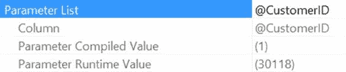
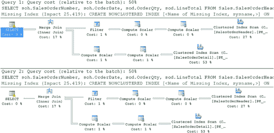

# 第 17 章：查询重编译

要进行测试，请按以下方式执行存储过程：

```
EXEC dbo.CustomerList
@CustomerID = 7920
WITH RECOMPILE;
```

```
EXEC dbo.CustomerList
@CustomerID = 30118
WITH RECOMPILE;
```

正如本章前面所述，这将强制存储过程在每次执行时都重新编译。图 17-17 显示了生成的执行计划。

**图 17-17.** `WITH RECOMPILE` 不会改变相同的执行计划

与本章前面的情况不同，现在重新编译存储过程并不会产生新的执行计划。相反，无论输入是什么，都会生成相同的计划，因为查询优化器在优化查询时收到了指令，要求使用提供的值 `@Customerld = 1`。

这可以减少重编译的次数，并且确实有助于你控制生成的执行计划。但这要求你非常了解你的数据。如果你的数据随时间变化，你可能需要重新审视那些使用了 `OPTIMIZE FOR` 查询提示的区域。

要在执行计划中查看该提示，只需查看 `SELECT` 运算符的属性，如图 17-18 所示。

[www.it-ebooks.info](http://www.it-ebooks.info/)



**图 17-18.** 参数编译值与查询提示提供的值相匹配

你可以看到，虽然查询被重新编译并赋予了一个 `30118` 的值，但由于提示的存在，实际使用的编译值是提示所指定的 `1`。

你可以指定查询使用 `OPTIMIZE FOR UNKNOWN` 进行优化。这与 `OPTIMIZE FOR` 提示几乎是相反的。`OPTIMIZE FOR` 提示会尝试使用直方图，而 `OPTIMIZE FOR UNKNOWN` 提示将使用统计信息的密度向量。你是在指示处理器始终基于统计信息的平均值来执行优化，并忽略查询优化时传入的实际值。

你可以将它与 `OPTIMIZE FOR <value>` 结合使用。它会为该参数提供的值进行优化，但会使用所有其他参数的统计信息。正如前一章所讨论的，这两种机制都是为了解决不良的参数探测问题。

#### 使用计划指南

计划指南允许你在不修改查询或过程文本的情况下使用查询提示或其他优化技术。当你有一个第三方产品，其中包含需要调整但无法修改的性能不佳的过程时，这尤其有用。作为优化过程的一部分，如果在编译或重新编译过程时存在计划指南，它将使用该指南来创建执行计划。

在上一节中，我向你展示了使用 `OPTIMIZE FOR` 会如何影响为过程创建的执行计划。以下是原始过程中的查询，不带任何提示：

```
IF (SELECT OBJECT_ID('dbo.CustomerList')) IS NOT NULL
    DROP PROC dbo.CustomerList;
GO
```

```
IF (SELECT OBJECT_ID('dbo. CustomerList')) IS NOT NULL
    DROP PROC dbo. CustomerList;
GO
```

```
CREATE PROCEDURE dbo.CustomerList @CustomerID INT
AS
SELECT soh.SalesOrderNumber,
       soh.OrderDate,
       sod.OrderQty,
       sod.LineTotal
FROM Sales.SalesOrderHeader AS soh
JOIN Sales.SalesOrderDetail AS sod
    ON soh.SalesOrderID = sod.SalesOrderID
WHERE soh.CustomerID >= @CustomerID;
GO
```

[www.it-ebooks.info](http://www.it-ebooks.info/)



现在假设这个查询是某个第三方应用程序的一部分，你无法修改它来包含 `OPTION (OPTIMIZE FOR)`。为了给它提供 `OPTIMIZE FOR` 查询提示，可以像下面这样创建一个计划指南：

```
sp_create_plan_guide @name = N'MyGuide',
@stmt = N'SELECT soh.SalesOrderNumber,
       soh.OrderDate,
       sod.OrderQty,
       sod.LineTotal
FROM Sales.SalesOrderHeader AS soh
JOIN Sales.SalesOrderDetail AS sod
    ON soh.SalesOrderID = sod.SalesOrderID
WHERE soh.CustomerID >= @CustomerID;',
@type = N'OBJECT',
@module_or_batch = N'dbo.CustomerList',
@params = NULL,
@hints = N'OPTION (OPTIMIZE FOR (@CustomerID = 1))';
```


