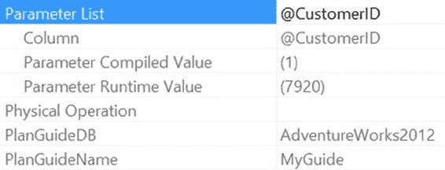
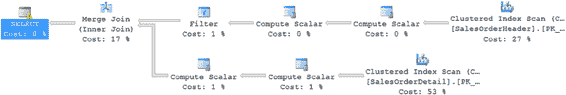
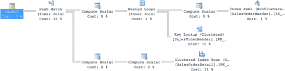

# 第 17 章 ■ 查询重新编译

现在，当使用不同的参数执行存储过程时，即使如下面所示强制使用了`RECOMPILE`，`OPTIMIZE FOR`提示也会被应用。图 17-19 显示了生成的执行计划。

```sql
EXEC dbo.CustomerList
@CustomerID = 7920
WITH RECOMPILE;
```

```sql
EXEC dbo.CustomerList
@CustomerID = 30118
WITH RECOMPILE;
```

**图 17-19.** 使用计划指南来应用 `OPTIMIZE FOR` 查询提示

[www.it-ebooks.info](http://www.it-ebooks.info/)




结果与修改存储过程时相同，但在这种情况下，无需进行任何修改。

你可以通过再次查看`SELECT`属性（图 17-20），来确认执行计划中已应用了计划指南。

**图 17-20.** `SELECT` 操作符属性显示了计划指南

存在多种类型的计划指南。前面的示例是一个*对象*计划指南，它与数据库中的特定对象（本例中是`CustomerList`）匹配。你还可以通过创建*SQL*计划指南来为系统中重复出现的即席查询创建计划指南，该指南用于查找特定的 SQL 语句。

假设传递给系统的是以下查询而非存储过程，并且需要一个`OPTIMIZE FOR`查询提示：

```sql
SELECT soh.SalesOrderNumber,
soh.OrderDate,
sod.OrderQty,
sod.LineTotal
FROM Sales.SalesOrderHeader AS soh
JOIN Sales.SalesOrderDetail AS sod
ON soh.SalesOrderID = sod.SalesOrderID
WHERE soh.CustomerID >=1;
```

运行此查询会产生你在图 17-21 中看到的执行计划。

**图 17-21.** 该查询使用了与预期不同的执行计划

[www.it-ebooks.info](http://www.it-ebooks.info/)

要创建查询计划指南，你首先需要知道查询使用的精确格式，以防参数化（强制或简单）改变查询文本。文本必须精确。

如果你第一次尝试创建的查询计划指南如下所示：

```sql
EXECUTE sp_create_plan_guide
@name = N'MyBadSQLGuide',
@stmt = N'SELECT soh.SalesOrderNumber,
soh.OrderDate,
sod.OrderQty,
sod.LineTotal
FROM Sales.SalesOrderHeader AS soh
join Sales.SalesOrderDetail AS sod
ON soh.SalesOrderID = sod.SalesOrderID
WHERE soh.CustomerID >= @CustomerID',
@type = N'SQL',
@module_or_batch = NULL,
@params = N'@CustomerID int',
@hints = N'OPTION (TABLE HINT(soh, FORCESEEK))';
```

那么运行 select 查询时，你仍然会得到相同的执行计划。这是因为查询的文本与为计划指南输入的内容不完全一致。有几处差异，例如空格和`JOIN`语句的大小写。

你可以使用 T-SQL 语句删除这个错误的计划指南。

```sql
EXECUTE sp_control_plan_guide
@operation = 'Drop',
@name = N'MyBadSQLGuide';
```

输入正确的语法将创建一个新的计划指南。

```sql
EXECUTE sp_create_plan_guide
@name = N'MyGoodSQLGuide',
@stmt = N'SELECT soh.SalesOrderNumber,
soh.OrderDate,
sod.OrderQty,
sod.LineTotal
FROM Sales.SalesOrderHeader AS soh
JOIN Sales.SalesOrderDetail AS sod
ON soh.SalesOrderID = sod.SalesOrderID
WHERE soh.CustomerID >=1;',
@type = N'SQL',
@module_or_batch = NULL,
@params = NULL,
@hints = N'OPTION (TABLE HINT(soh, FORCESEEK))';
```

现在，当查询运行时，会创建一个完全不同的计划，如图 17-22 所示。

[www.it-ebooks.info](http://www.it-ebooks.info/)



**图 17-22.** 计划指南强制在同一查询上生成新的执行计划

当你认为缓存中已有的某个计划符合要求时，还有另一种选择。你可以将该计划捕获到计划指南中，以确保下次运行查询时执行相同的计划。这可以通过运行`sp_create_plan_guide_from_handle`来实现。

为了进行测试，首先清除过程缓存，以便精确控制使用哪个查询计划。

```sql
DBCC FREEPROCCACHE();
```


