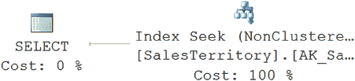

# `第 18 章`：`查询设计分析`

数据库模式可能包含许多提升性能的特性，如索引、统计信息和存储过程。但如果你的查询一开始就写得很糟糕，这些特性都无法保证良好的性能。SQL 查询可能无法有效地使用可用的索引。SQL 查询的结构可能会给查询成本增加可避免的开销。查询可能试图以逐行方式处理数据（或者引用 Jeff Moden 的说法，Row By Agonizing Row，缩写为 RBAR，发音为 “reebar”），而不是以逻辑集合的方式。为了提高数据库应用程序的性能，理解与不同查询编写方式相关的成本至关重要。

在本章中，我将涵盖以下主题：
* 影响性能的查询设计方面
* 查询设计如何有效地使用索引

## 查询设计建议

当需要运行查询时，通常可以使用多种不同方法来获取相同的数据。在许多情况下，无论查询结构如何，优化器都会生成相同的执行计划。然而，在某些情况下，查询结构会限制优化器选择最佳的处理策略。重要的是要意识到这种情况可能发生，并知道在发生时如何避免。

一般来说，请牢记以下建议以确保最佳性能：

• 在小的结果集上操作。

• 有效地使用索引。

• 避免使用优化器提示。

• 使用域和参照完整性。

• 避免资源密集型查询。

• 减少网络往返次数。

• 降低事务成本。（最后三点将在下一章中详细讨论。）

仔细的测试对于在特定数据库环境中确定提供最佳性能的查询形式至关重要。你应该熟悉编写和比较不同的 SQL 查询形式，以便能够评估在给定环境中提供最佳性能的查询形式。同时，你也需要能够实现测试的自动化。

[www.it-ebooks.info](http://www.it-ebooks.info/)

