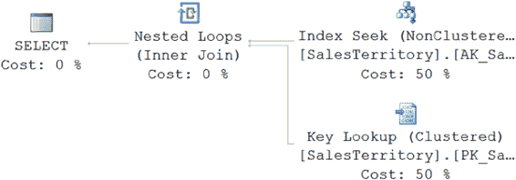

# 第 18 章 ■ 查询设计分析

## 在小的结果集上操作

为了提升查询性能，应限制其操作的数据量，包括列和行。

在小的结果集上操作可以减少查询消耗的资源量，并提高索引的有效性。为了限制数据集大小，你应该遵循以下两条规则：

• 限制 `select` 列表中的列数。

• 使用高选择性的 `WHERE` 子句来限制返回的行数。

需要注意的是，你可能会被要求向 `OLTP` 系统返回数万行数据。仅仅因为有人告诉你这是业务需求，并不意味着它是正确的。人类无法处理数万行数据。能够处理数千行数据的人也是凤毛麟角。对于这类请求，要做好回绝的准备，并能给出充分的理由。

### 限制 `select_list` 中的列数

在 `SELECT` 语句的 `select` 列表中使用最少量的列。不要使用输出结果集中不需要的列。例如，不要使用 `SELECT *` 来返回所有列。`SELECT *` 语句会使覆盖索引失效，因为将所有列都包含在索引中通常是不切实际的。例如，考虑以下查询：
```sql
SELECT Name, TerritoryID
FROM Sales.SalesTerritory AS st
WHERE st.Name = 'Australia' ;
```
在 `Name` 列上的覆盖索引（以及通过聚集键 `ProductID`）可以快速通过索引本身服务于查询，而无需访问聚集索引。当启用 `STATISTICS IO` 和 `STATISTICS TIME` 时，你将得到以下逻辑读取次数和执行时间，以及相应的执行计划（如图 18-1 所示）：
```
Table 'SalesTerritory'. Scan count 0, logical reads 2
CPU time = 0 ms, elapsed time = 6 ms.
```
***图 18-1.** 显示引用有限列数优势的执行计划*

如果将此查询修改为在 `select` 列表中包含所有列，如下所示，那么之前的覆盖索引将失效，因为此查询所需的所有列并未都包含在该索引中：
```sql
SELECT *
FROM Sales.SalesTerritory AS st
WHERE st.[Name] = 'Australia';
```
[www.it-ebooks.info](http://www.it-ebooks.info/)



第 18 章 ■ 查询设计分析

随后，必须访问包含所有列的基础表（或聚集索引），如下所示。逻辑读取次数和执行时间都增加了。
```
Table 'SalesTerritory'. Scan count 0, logical reads 4
CPU time = 0 ms, elapsed time = 20 ms
```
如图 18-2 所示，`select` 列表中的列越少，查询性能越好。请记住，我们一直关注的这个简单查询只返回单个、小行的数据，其读取次数已经翻倍，执行时间增加了两倍。选择过多的列还会增加网络上的数据传输，进一步降低性能。

***图 18-2.** 显示引用过多列所带来的额外开销的执行计划*

### 使用高选择性的 `WHERE` 子句

如第 8 章所述，`WHERE` 和 `HAVING` 子句中引用的列的选择性决定了该列上索引的使用。从表中请求大量行可能无法从使用索引中受益，要么因为它根本无法使用索引，要么（在非聚集索引的情况下）由于书签查找的额外开销。为确保索引的使用，`WHERE` 子句中引用的列应具有高选择性。

大多数时候，最终用户一次只关注有限数量的行。因此，你应该设计数据库应用程序，使其在用户导航数据时以增量方式请求数据。对于依赖大量数据进行数据分析或报告的应用程序，请考虑使用数据分析解决方案，如 `Analysis Services` 或 `PowerPivot`。请记住，返回巨大的结果集成本高昂，而且这些数据不太可能被完全使用。

## 有效地使用索引

在数据库表上建立有效的索引对于提高性能至关重要。然而，同样重要的是确保查询设计得当，以有效地利用这些索引。以下是一些应该遵循的、用于改进索引使用的查询设计规则：

• 避免不可用搜索条件。

• 避免在 `WHERE` 子句的列上使用算术运算符。

• 避免在 `WHERE` 子句的列上使用函数。

我将在以下各节中详细讨论每条规则。

[www.it-ebooks.info](http://www.it-ebooks.info/)

第 18 章 ■ 查询设计分析

### 避免不可用搜索条件

查询中的 *可用（sargable）* 谓词是指可以使用索引的谓词。该词是“Search ARGument ABLE”的缩写。优化器从索引中获益的能力取决于搜索条件的选择性，而选择性又取决于 `WHERE` 子句中引用的列的选择性，所有这些都可以追溯到索引的统计信息。`WHERE` 子句中列上使用的搜索谓词决定了是否可以对该列执行索引操作。

表 18-1 中列出的可用搜索条件通常允许优化器使用 `WHERE` 子句中引用列上的索引。可用搜索条件通常允许 `SQL Server` 在索引中查找一行并检索该行（或检索相邻的行范围，直到搜索条件不再为真）。

***表 18-1.** 常见的可用和不可用搜索条件*

**类型** | **搜索条件**
---|---
可用（Sargable） | 包含条件 `=`、`>`、`>=`、`<`、`<=` 和 `BETWEEN`，以及一些 `LIKE` 条件如 `LIKE '<literal>%'`
不可用（Nonsargable） | 排除条件 `<>`、`!=`、`!>`、`!<`、`NOT EXISTS`、`NOT IN` 和 `NOT LIKE`；`IN`、`OR` 以及一些 `LIKE` 条件如 `LIKE '%<literal>'`

另一方面，表 18-1 中列出的 *不可用（nonsargable）* 搜索条件通常会阻止优化器使用 `WHERE` 子句中引用列上的索引。排除性搜索条件通常不允许 `SQL Server` 执行像可用搜索条件所支持的 `Index Seek` 操作。例如，`!=` 条件需要扫描所有行来识别匹配的行。


