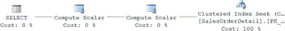
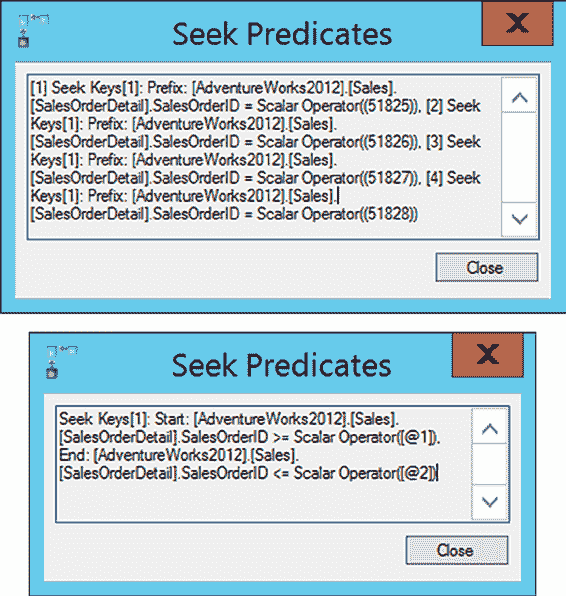
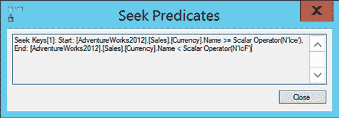
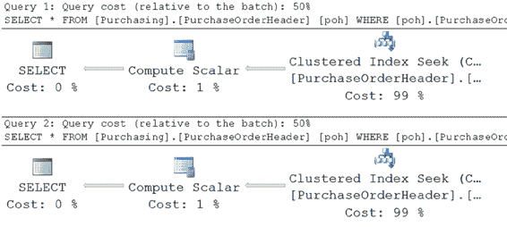
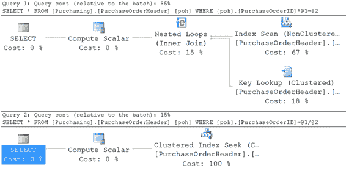
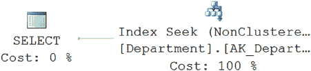
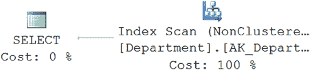
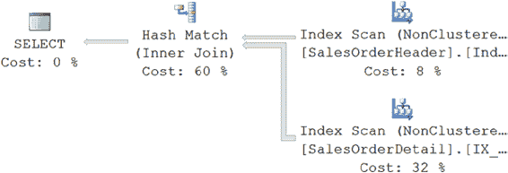

# 第 18 章 ■ 查询设计分析

### BETWEEN 与 IN/OR

尝试为这些**不可搜索**的搜索条件实现变通方法以提升性能。在某些情况下，可以重写查询以避免不可搜索的搜索条件。例如，考虑用 `BETWEEN` 条件替换 `IN`/`OR` 搜索条件，如下一节所述。

考虑以下使用 `IN` 搜索条件的查询：

```sql
SELECT * FROM Sales.SalesOrderDetail AS sod
WHERE sod.SalesOrderID IN (51825,51826,51827,51828);
```

另一种编写相同查询的方式是使用 `OR` 命令：

```sql
SELECT sod.*
FROM Sales.SalesOrderDetail AS sod
WHERE sod.SalesOrderID = 51825 OR
sod.SalesOrderID = 51826 OR
sod.SalesOrderID = 51827 OR
sod.SalesOrderID = 51828 OR
```

你可以用以下 `BETWEEN` 子句替换此查询中的任一搜索条件：

```sql
SELECT sod.*
FROM Sales.SalesOrderDetail AS sod
WHERE sod.SalesOrderID BETWEEN 51825 AND 51828;
```

[www.it-ebooks.info](http://www.it-ebooks.info/)





这三个查询返回相同的结果。表面上看，三个查询的执行计划似乎相同，如图 18-3 所示。

**图 18-3.** 使用 BETWEEN 子句的简单 SELECT 语句的执行计划

然而，仔细观察执行计划会揭示它们在数据检索机制上的差异，如图 18-4 所示。上方的框是 `IN` 条件，下方的框是 `BETWEEN` 条件。

**图 18-4.** IN 条件（上方）和 BETWEEN 条件（下方）的执行计划详情

如图 18-4 所示，SQL Server 将包含四个值的 `IN` 条件解析为四个 `OR` 条件。因此，聚簇索引（`PKSalesTerritoryTerritoryld`）被访问四次（扫描次数 4）以检索四个 `IN` 和 `OR` 条件的行，如下方的相应 `STATISTICS IO` 输出所示。另一方面，`BETWEEN` 条件被解析为一对 `>=` 和 `<=` 条件，如图 18-4 所示。SQL Server 仅访问聚簇索引一次（扫描次数 1），从第一个匹配行开始直到匹配条件为真，如下方的相应 `STATISTICS IO` 和 `QUERY TIME` 输出所示。

[www.it-ebooks.info](http://www.it-ebooks.info/)

*   使用 `IN` 条件时：
    `表 'SalesOrderDetail'。 扫描次数 4，逻辑读取 18`
    `CPU 时间 = 0 ms，耗时 = 102 ms。`
*   使用 `BETWEEN` 条件时：
    `表 'SalesOrderDetail'。 扫描次数 1，逻辑读取 6`
    `CPU 时间 = 0 ms，耗时 = 63 ms。`

将搜索条件 `IN` 替换为 `BETWEEN` 使此查询的逻辑读取次数从 18 次减少到 6 次。

如上所示，尽管三个查询都使用了聚簇索引寻址（`OrderID`），但优化器使用 `BETWEEN` 子句定位行范围的速度比使用 `IN` 子句快得多。当你观察 `BETWEEN` 条件和 `OR` 子句时，也会发生同样的情况。因此，如果在 `IN`/`OR` 和 `BETWEEN` 搜索条件之间做选择，请始终选择 `BETWEEN` 条件，因为它通常比 `IN`/`OR` 条件高效得多。

事实上，你应该更进一步，使用 `>=` 和 `<=` 的组合来代替 `BETWEEN` 子句，因为这样可以让优化器少做一点工作。

同样值得注意的是，此查询违反了之前关于仅返回有限列集而非使用 `SELECT *` 的建议。

并非每个使用排除性搜索条件的 `WHERE` 子句都会阻止优化器使用该搜索条件所引用列上的索引。在许多情况下，SQL Server 2014 优化器能出色地将排除性搜索条件转换为可搜索的搜索条件。为了理解这一点，请考虑以下两个搜索条件，我将在后续章节中讨论：

*   `LIKE` 条件
*   `!<` 条件与 `>=` 条件


### LIKE 条件

在使用 `LIKE` 搜索条件时，如果可能，请尝试在 `WHERE` 子句中使用一个或多个前导字符。在 `LIKE` 子句中使用前导字符允许优化器将 `LIKE` 条件转换为对索引友好的搜索条件。`LIKE` 条件中的前导字符越多，优化器就越能确定有效的索引。请注意，使用通配符作为 `LIKE` 条件中的前导字符会*阻止*优化器在索引上执行 `SEEK`（或窄范围扫描）；它依赖于扫描整个表。

要理解 SQL Server 2014 优化器的这种能力，请考虑以下使用带前导字符的 `LIKE` 条件的 `SELECT` 语句：

```sql
SELECT c.CurrencyCode
FROM Sales.Currency AS c
WHERE c.[Name] LIKE 'Ice%';
```

SQL Server 2012 优化器会自动进行此转换，如图 18-5 所示。

[www.it-ebooks.info](http://www.it-ebooks.info/)



第 18 章 ■ 查询设计分析

**图 18-5.** 显示将带有尾部 `%` 符号的 `LIKE` 子句自动转换为可索引搜索条件的执行计划

如您所见，优化器会自动将 `LIKE` 条件转换为等效的 `>=` 和 `<` 条件对。因此，您可以重写此 `SELECT` 语句，用可索引的搜索条件替换 `LIKE` 条件，如下所示：

```sql
SELECT c.CurrencyCode
FROM Sales.Currency AS c
WHERE c.[Name] >=N'Ice'
  AND c.[Name] < N'IcF';
```

请注意，在这两种情况下，逻辑读取次数、带有 `LIKE` 条件的查询的执行时间以及手动转换的可搜索搜索条件都完全相同。因此，如果您在 `LIKE` 子句中包含前导字符，SQL Server 2014 优化器会优化搜索条件以允许使用列上的索引。

### !< 条件 vs. >= 条件

尽管 `!<` 和 `>=` 搜索条件检索相同的结果集，但它们在内部可能执行不同的操作。`>=` 比较运算符允许优化器使用搜索参数中引用的列上的索引，因为该运算符的 `=` 部分允许优化器 seeks 到索引中的一个起始点，并从那里访问所有后续的索引行。另一方面，`!<` 运算符没有 `=` 元素，需要访问每一行的列值。

但真是这样吗？如第 14 章所述，SQL Server 优化器在执行查询前会执行基于语法的优化以提高性能。这使得 SQL Server 能够通过将 `!<` 转换为 `>=` 来处理该运算符的性能问题，如下面两个 `SELECT` 语句的执行计划图 18-6 所示：

```sql
SELECT *
FROM Purchasing.PurchaseOrderHeader AS poh
WHERE poh.PurchaseOrderID >=2975;
```

```sql
SELECT *
FROM Purchasing.PurchaseOrderHeader AS poh
WHERE poh.PurchaseOrderID !< 2975;
```

[www.it-ebooks.info](http://www.it-ebooks.info/)



第 18 章 ■ 查询设计分析

**图 18-6.** 显示将不可索引的 `!`< 运算符自动转换为可索引的 `>=` 运算符的执行计划

如您所见，优化器通常为您提供了使用首选 T-SQL 语法编写查询的灵活性，而不会牺牲性能。

尽管 SQL Server 优化器在许多情况下可以自动优化查询语法以提高性能，但您不应依赖它这样做。一开始就编写高效的查询是良好的实践。

### 避免在 WHERE 子句列上使用算术运算符

在 `WHERE` 子句中的列上使用算术运算符会阻止优化器使用该列上的索引。例如，考虑以下 `SELECT` 语句：

```sql
SELECT *
FROM Purchasing.PurchaseOrderHeader AS poh
WHERE poh.PurchaseOrderID * 2 = 3400;
```

在 `WHERE` 子句中的列上应用了一个乘法运算符 `*`。您可以通过如下重写 `SELECT` 语句来避免在列上使用它：

```sql
SELECT *
FROM Purchasing.PurchaseOrderHeader AS poh
WHERE poh.PurchaseOrderID = 3400 / 2;
```

该表在 `PurchaseOrderID` 列上有一个聚集索引。如第 4 章所述，该索引上的 `Index Seek` 操作适用于此查询，因为它只返回一行。尽管两个查询返回相同的结果集，但第一个查询在 `PurchaseOrderID` 列上使用乘法运算符阻止了优化器使用该列上的索引，如图 18-7 所示。

[www.it-ebooks.info](http://www.it-ebooks.info/)



第 18 章 ■ 查询设计分析

**图 18-7.** 显示在 `WHERE` 子句列上使用算术运算符的有害影响的执行计划

以下是相应的 `STATISTICS IO` 和 `TIME` 输出。

*   在 `PurchaseOrderID` 列上使用 `*` 运算符时：
    `Table 'PurchaseOrderHeader'. Scan count 1, logical reads 11 CPU time = 0 ms, elapsed time = 61 ms.`
*   在 `PurchaseOrderID` 列上不使用运算符时：
    `Table 'PurchaseOrderHeader'. Scan count 0, logical reads 2 CPU time = 0 ms, elapsed time =27 ms.`

因此，为了有效使用索引并提高查询性能，当表达式预期与索引一起使用时，避免在 `WHERE` 子句或 `JOIN` 条件中的列上使用算术运算符。

值得注意的是，在图 18-7 所示的查询中，两个查询都足够简单，可以进行参数化，如查询中的 `@1` 和 `@2` 所示，它们代替了提供的值。

**注意** 对于小结果集，尽管索引查找通常比表扫描（或完整的聚集索引扫描）是更好的数据检索策略，但对于小表（所有数据行都适合一页），表扫描的成本可能更低。我在第 8 章中有更详细的解释。

[www.it-ebooks.info](http://www.it-ebooks.info/)





第 18 章 ■ 查询设计分析

### 避免在 WHERE 子句列上使用函数

与算术运算符类似，在 `WHERE` 子句列上使用函数也会损害查询性能——原因相同。请尽量避免在 `WHERE` 子句列上使用函数，如下面两个示例所示：

*   `SUBSTRING` 与 `LIKE`
*   日期部分比较

### SUBSTRING 与 LIKE

在以下 `SELECT` 语句中（下载中的 `substring.sql`），使用 `SUBSTRING` 函数会阻止使用 `ShipPostalCode` 列上的索引。

```sql
SELECT d.Name
FROM HumanResources.Department AS d
WHERE SUBSTRING(d.[Name], 1, 1) = 'F';
```

图 18-8 说明了这一点。

**图 18-8.** 显示在 `WHERE` 子句列上使用 `SUBSTRING` 函数的有害影响的执行计划

如您所见，使用 `SUBSTRING` 函数阻止了优化器使用 `[Name]` 列上的索引。该列上的函数使优化器使用了聚集索引扫描。如果没有 `DepartmentID` 列上的聚集索引，则会执行表扫描。

您可以重新设计此 `SELECT` 语句以避免在列上使用函数，如下所示：
```sql
SELECT d.Name
FROM HumanResources.Department AS d
WHERE d.[Name] LIKE 'F%';
```

此查询允许优化器选择 `[Name]` 列上的索引，如图 18-9 所示。

**图 18-9.** 显示不在 `WHERE` 子句列上使用 `SUBSTRING` 函数的好处的执行计划

[www.it-ebooks.info](http://www.it-ebooks.info/)



第 18 章 ■ 查询设计分析

### 日期部分比较


