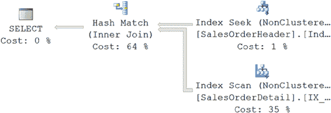

# SQL Server 查询设计与优化

SQL Server 可以将日期和时间数据存储为单独的字段，也可以存储为组合的 `DATETIME` 字段。虽然有时你可能需要将日期和时间数据保留在一个字段中，但有时你只需要日期部分，这通常意味着必须应用转换函数从 `DATETIME` 数据类型中提取日期部分。这样做会阻止优化器选择列上的索引，如下例所示。

首先，需要在其中一个表的 `DATETIME` 列上建立一个良好的索引。使用 `Sales.SalesOrderHeader` 表并创建以下索引：

```sql
IF EXISTS ( SELECT *
            FROM sys.indexes
            WHERE object_id = OBJECT_ID(N'[Sales].[SalesOrderHeader]')
              AND name = N'IndexTest' )
    DROP INDEX IndexTest ON [Sales].[SalesOrderHeader];
GO

CREATE INDEX IndexTest ON Sales.SalesOrderHeader(OrderDate);
```

要检索 `Sales.SalesOrderHeader` 中所有 `OrderDate` 在 2008 年 4 月的行，可以执行以下 `SELECT` 语句：

```sql
SELECT soh.SalesOrderID,
       soh.OrderDate
FROM   Sales.SalesOrderHeader AS soh
       JOIN Sales.SalesOrderDetail AS sod
            ON  soh.SalesOrderID = sod.SalesOrderID
WHERE  DATEPART(yy, soh.OrderDate) = 2008
       AND DATEPART(mm, soh.OrderDate) = 4;
```

在 `OrderDate` 列上使用 `DATEPART` 函数会阻止优化器正确使用该列上的索引 `IndexTest`，反而导致扫描，如图 18-10 所示。

**图 18-10.** 显示在 WHERE 子句列上使用 `DATEPART` 函数带来负面影响的执行计划

以下是 `SET STATISTICS IO` 和 `TIME` 的输出：

```
Table 'Worktable'. Scan count 0, logical reads 0
Table 'SalesOrderDetail'. Scan count 1, logical reads 276
Table 'SalesOrderHeader'. Scan count 1, logical reads 73

CPU time = 15 ms, elapsed time = 143 ms.
```

[www.it-ebooks.info](http://www.it-ebooks.info/)



无需对 `DATETIME` 列应用函数即可完成日期部分的比较。

```sql
SELECT soh.SalesOrderID,
       soh.OrderDate
FROM   Sales.SalesOrderHeader AS soh
       JOIN Sales.SalesOrderDetail AS sod
            ON  soh.SalesOrderID = sod.SalesOrderID
WHERE  soh.OrderDate >= '2008-04-01'
       AND soh.OrderDate < '2008-05-01';
```

这允许优化器正确引用在 `DATETIME` 列上创建的索引 `IndexTest`，如图 18-11. 所示。

**图 18-11.** 显示不在 WHERE 子句列上使用 `CONVERT` 函数带来益处的执行计划

以下是 `SET STATISTICS IO` 和 `TIME` 的输出：

```
Table 'Worktable'. Scan count 0, logical reads 0
Table 'SalesOrderDetail'. Scan count 1, logical reads 276
Table 'SalesOrderHeader'. Scan count 1, logical reads 8

CPU time = 0 ms, elapsed time = 132 ms
```

因此，为了允许优化器考虑 WHERE 子句中引用的列上的索引，请务必避免在被索引的列上使用函数。这增加了索引的有效性，从而可以提高查询性能。不过，在这个例子中值得注意的是，性能提升是轻微的，因为仍然需要扫描 `SalesOrderDetail` 表。

务必删除之前创建的索引。

```sql
DROP INDEX Sales.SalesOrderHeader.IndexTest;
```

## 避免使用优化器提示

SQL Server 基于成本的优化器会根据当前的表/索引结构和统计信息动态确定查询的处理策略。这种动态行为可以通过优化器提示被覆盖，通过指示优化器使用某种处理策略，从而从优化器那里拿走一些决策权。这使得优化器的行为变为静态，并且不允许它随着表/索引结构或统计信息的变化而动态更新处理策略。

[www.it-ebooks.info](http://www.it-ebooks.info/)

由于通常很难比优化器更聪明，因此通常的建议是避免使用优化器提示。


