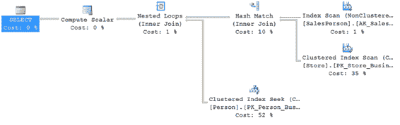
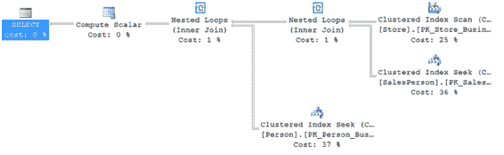

# 概述

通常，让优化器根据数据分布统计信息、索引和其他因素来确定一个高性价比的处理策略是有益的。如下面这些提示的示例所示，强制优化器（使用提示）使用特定的处理策略往往会损害性能：

• `JOIN 提示`
• `INDEX 提示`

### JOIN 提示

正如第 6 章所解释的，优化器会根据表/索引结构和数据，动态地确定两个数据集之间高性价比的`JOIN`策略。表 18-2 总结了 SQL Server 2012 支持的`JOIN`类型，供您快速参考。

**表 18-2. SQL Server 2014 支持的 JOIN 类型**

| **JOIN 类型** | **连接列上的索引** | **连接表的通常大小** | **预排序的 JOIN 子句** |
| :--- | :--- | :--- | :--- |
| 嵌套循环 | 内层表 a 必须<br>外层表最好 | 小 | 可选 |
| 合并 | 两个表 a 都必须 | 大 | 是<br>最佳条件：两者上都有聚集索引或覆盖索引 |
| 哈希 | 内层表*没有*索引 | 任意 | 否<br>最佳条件：内层表大，外层表小 |

> **注意** 外层表通常是两个连接表中较小的那个。

您可以通过使用表 18-3 中的`JOIN`提示来指示 SQL Server 使用特定的`JOIN`类型。

**表 18-3. JOIN 提示**

| **JOIN 类型** | **JOIN 提示** |
| :--- | :--- |
| 嵌套循环 | `LOOP JOIN` |
| 合并 | `MERGE JOIN` |
| 哈希 | `HASH JOIN` |

[www.it-ebooks.info](http://www.it-ebooks.info/)



要理解使用`JOIN`提示如何影响性能，请考虑以下`SELECT`语句：

```sql
SELECT s.[Name] AS StoreName,
       p.[LastName] + ', ' + p.[FirstName]
FROM [Sales].[Store] s
JOIN [Sales].SalesPerson AS sp
    ON s.SalesPersonID = sp.BusinessEntityID
JOIN HumanResources.Employee AS e
    ON sp.BusinessEntityID = e.BusinessEntityID
JOIN Person.Person AS p
    ON e.BusinessEntityID = p.BusinessEntityID;
```

图 18-12 展示了执行计划。

**图 18-12. 展示优化器所做选择的执行计划**

如您所见，SQL Server 动态决定使用`LOOP JOIN`来添加来自`Person.Person`表的数据，并使用`HASH JOIN`来连接`Sales.Salesperson`和`Sales.Store`表。正如第 6 章所演示的，对于影响小结果集的简单查询，`LOOP JOIN`通常比`HASH JOIN`或`MERGE JOIN`提供更好的性能。由于来自`Sales.Salesperson`表的行数相对较少，您可能会觉得可以像这样强制`JOIN`为`LOOP`：

```sql
SELECT s.[Name] AS StoreName,
       p.[LastName] + ', ' + p.[FirstName]
FROM [Sales].[Store] s
JOIN [Sales].SalesPerson AS sp
    ON s.SalesPersonID = sp.BusinessEntityID
JOIN HumanResources.Employee AS e
    ON sp.BusinessEntityID = e.BusinessEntityID
JOIN Person.Person AS p
    ON e.BusinessEntityID = p.BusinessEntityID
OPTION (LOOP JOIN);
```

运行此查询时，执行计划会发生变化，您可以在图 18-13 中看到。

[www.it-ebooks.info](http://www.it-ebooks.info/)



**图 18-13. 使用 JOIN 查询提示所做的更改**

以下是每个查询对应的`STATISTICS IO`和`TIME`输出。

• 无`JOIN`提示时：
`Table 'Person'. Scan count 0, logical reads 2155`
`Table 'Worktable'. Scan count 0, logical reads 0`
`Table 'Store'. Scan count 1, logical reads 103`
`Table 'SalesPerson'. Scan count 1, logical reads 2`
`CPU time = 0 ms, elapsed time = 48 ms.`

• 使用`JOIN`提示时：
`Table 'Person'. Scan count 0, logical reads 2155`
`Table 'SalesPerson'. Scan count 0, logical reads 1402`
`Table 'Store'. Scan count 1, logical reads 103`
`CPU time = 16 ms, elapsed time = 73 ms.`

您可以看到，使用`JOIN`提示的查询比不使用提示的查询运行时间更长。它还增加了 CPU 的开销。您甚至可以让情况变得更糟。与其告诉查询中使用的所有提示都采用`LOOP`连接，不如只针对您感兴趣的那一个，像这样：

```sql
SELECT s.[Name] AS StoreName,
       p.[LastName] + ', ' + p.[FirstName]
FROM [Sales].[Store] s
```


