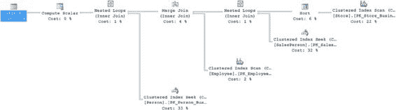
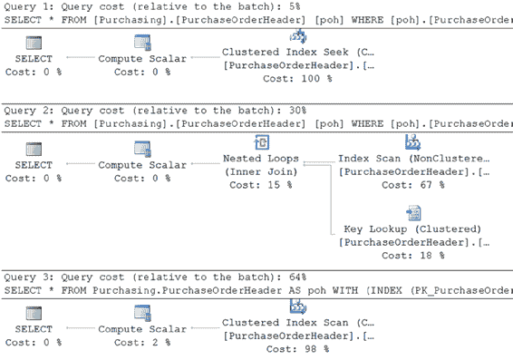
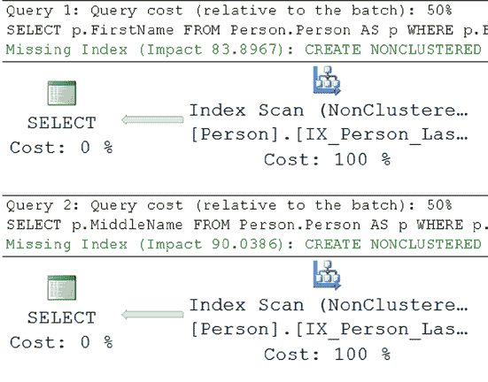
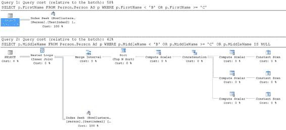

# 第 18 章 查询设计分析

### JOIN 提示

```sql
INNER LOOP JOIN [Sales].SalesPerson AS sp
ON s.SalesPersonID = sp.BusinessEntityID
JOIN HumanResources.Employee AS e
ON sp.BusinessEntityID = e.BusinessEntityID
JOIN Person.Person AS p
ON e.BusinessEntityID = p.BusinessEntityID ;
```

运行此查询会产生如图 18-14 所示的执行计划。

[www.it-ebooks.info](http://www.it-ebooks.info/)



**图 18-14.** 使用 LOOP 连接提示带来的更多变化

如你所见，查询计划中现在引用了四个表。虽然在之前的所有执行中都引用了四个表，但优化器通过优化的简化过程（在第 8 章中提及）能够从查询中移除一个表。现在，这个提示迫使优化器做出了与其原本可能做出的不同选择，并将简化过程从流程中移除。读取次数和执行时间也受到了影响。

```text
Table 'Person'. Scan count 0, logical reads 2155
Table 'Worktable'. Scan count 0, logical reads 0
Table 'Employee'. Scan count 1, logical reads 9
Table 'SalesPerson'. Scan count 0, logical reads 1402
Table 'Store'. Scan count 1, logical reads 103
CPU time = 0 ms, elapsed time = 92 ms.
```

`JOIN`提示强制优化器忽略其自身的优化策略，转而使用查询指定的策略。`JOIN`提示通常会损害查询性能，原因如下：

- 提示会阻止自动参数化。
- 优化器无法动态决定表的连接顺序。

因此，合理的做法是不使用`JOIN`提示，而是让优化器动态地确定一种成本效益高的处理策略。当然也有例外，但这些例外必须通过彻底的测试来验证其有效性。

### INDEX 提示

如前所述，在`WHERE`子句列上使用算术运算符会阻止优化器选择该列上的索引。为了提高性能，你可以重写查询，避免在`WHERE`子句上使用算术运算符，如相应示例所示。或者，你甚至可能考虑使用`INDEX`提示（一种优化器提示）来强制优化器使用该列上的索引。然而，大多数情况下，最好避免使用`INDEX`提示，让优化器动态地运作。

要理解`INDEX`提示对查询性能的影响，请思考“避免在 WHERE 子句列上使用算术运算符”一节中给出的例子。`PurchaseOrderID`列上的乘法运算符阻止了优化器选择该列上的索引。你可以使用`INDEX`提示强制优化器使用`OrderID`列上的索引，如下所示：

```sql
SELECT *
FROM Purchasing.PurchaseOrderHeader AS poh WITH (INDEX (PK_PurchaseOrderHeader_PurchaseOrderID))
WHERE poh.PurchaseOrderID * 2 = 3400 ;
```

请注意与不使用`INDEX`提示相比，使用`INDEX`提示的相对成本，如图 18-14.所示。

同时，请注意以下`STATISTICS IO`输出显示的逻辑读次数的差异。

- 无提示（在`WHERE`子句列上使用算术运算符）：
  ```text
  Table 'PurchaseOrderHeader'. Scan count 1, logical reads 11
  CPU time = 0 ms, elapsed time = 61 ms.
  ```

- 无提示（不在`WHERE`子句列上使用算术运算符）：
  ```text
  Table 'PurchaseOrderHeader'. Scan count 0, logical reads 2
  CPU time = 0 ms, elapsed time = 27 ms.
  ```

- `INDEX`提示：
  ```text
  Table 'PurchaseOrderHeader'. Scan count 1, logical reads 44
  CPU time = 0 ms, elapsed time = 83 ms.
  ```

从执行计划的相对成本和逻辑读次数来看，显然使用`INDEX`提示的查询实际上损害了查询性能。尽管它允许优化器使用`PurchaseOrderID`列上的索引，但它并未允许优化器确定合适的索引访问机制。


因此，优化器使用了索引扫描，仅访问了一行数据。相比之下，避免在`WHERE`子句列上使用算术运算符，且不使用`INDEX`提示，不仅使得优化器能够使用`PurchaseOrderID`列上的索引，还能确定合适的索引访问机制：`INDEX SEEK`（索引查找）。

## 查询设计分析

### 优化器与索引提示

因此，通常而言，让优化器为查询选择最佳索引策略，不要使用`INDEX`提示来覆盖优化器的行为。此外，不使用`INDEX`提示允许优化器根据数据随时间的变化动态决定最佳索引策略。图 18-15 展示了指定索引提示与不指定索引提示之间的差异。

[www.it-ebooks.info](http://www.it-ebooks.info/)



***图 18-15.** 使用不同`INDEX`提示与不使用`INDEX`提示时的查询成本*

## 使用域完整性和引用完整性

域完整性和引用完整性有助于为列定义并强制有效的值，从而维护数据库的完整性。这是通过列/表约束来实现的。

由于数据访问通常是查询执行中最昂贵的操作之一，避免冗余的数据访问有助于优化器减少查询执行时间。域完整性和引用完整性帮助 SQL Server 2014 优化器在不实际访问数据的情况下分析有效的数据值，从而缩短查询时间。

为了理解这是如何实现的，请考虑以下示例：

*   `NOT NULL`（非空）约束
*   声明式引用完整性（DRI）

### `NOT NULL` 约束

`NOT NULL`列约束用于实现域完整性，它定义了不能在特定列中输入`NULL`值的事实。SQL Server 在运行时自动强制执行此规则，以维护该列的域完整性。此外，定义`NOT NULL`列约束有助于优化器在查询中对该列使用`ISNULL`函数时生成高效的处理策略。

[www.it-ebooks.info](http://www.it-ebooks.info/)



要理解`NOT NULL`列约束带来的性能优势，请看下面的例子。

这两个查询旨在返回所有不等于`'B'`的值。这两个查询针对大小相似的列运行，每个查询都需要进行表扫描才能返回数据：
```sql
SELECT p.FirstName
FROM Person.Person AS p
WHERE p.FirstName < 'B'
   OR p.FirstName >= 'C';
```

```sql
SELECT p.MiddleName
FROM Person.Person AS p
WHERE p.MiddleName < 'B'
   OR p.MiddleName >= 'C';
```

这两个查询使用相同的执行计划，如图 18-16 所示。

***图 18-16.** 因缺少索引而导致的表扫描*

由于`Person.MiddleName`列可以包含`NULL`值，因此返回的数据不完整。这是因为，根据定义，尽管`NULL`值满足不以任何方式等于`'B'`的必要条件，但无法以这种方式返回`NULL`值。需要添加一个`OR`子句。这意味着要像这样修改第二个查询：
```sql
SELECT p.FirstName
FROM Person.Person AS p
WHERE p.FirstName < 'B'
   OR p.FirstName >= 'C';
```

```sql
SELECT p.MiddleName
FROM Person.Person AS p
WHERE p.MiddleName < 'B'
   OR p.MiddleName >= 'C'
   OR p.MiddleName IS NULL;
```

[www.it-ebooks.info](http://www.it-ebooks.info/)



此外，如图 18-15 执行计划中的缺失索引语句所示，这两个查询都可以从在其表上创建索引中受益。创建如下测试索引应该可以满足要求：
```sql
CREATE INDEX TestIndex1
ON Person.Person (MiddleName);
```

```sql
CREATE INDEX TestIndex2
ON Person.Person (FirstName);
```

当重新执行查询时，图 18-17 显示了两个`SELECT`语句的最终执行计划。

***图 18-17.** 使用`IS NULL`选项的效果*


