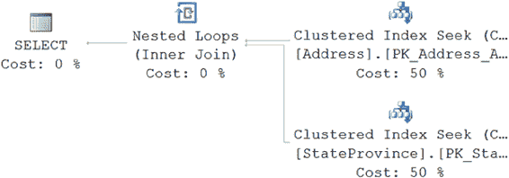
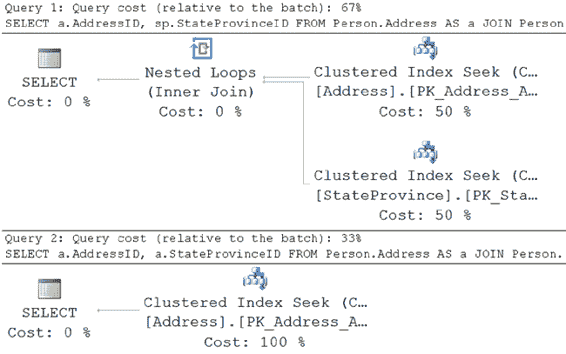

# 第 18 章 查询设计分析

如图 18-17 所示，优化器能够利用 `Person.FirstName` 列上的索引 `TestIndex2` 来执行一个简洁的索引查找操作。不幸的是，处理 `NULL` 列的需求则非常不同。索引 `TestIndex1` 没有以相同的方式使用。相反，为查询中定义的三个条件分别创建了三个常量。然后通过连接操作将它们连接起来，在通过嵌套循环操作符三次扫描索引之前进行排序和合并，以得到结果集。尽管从执行计划中的估计成本来看，这似乎是成本较低的查询（42% 对比 58%），但 `STATISTICS IO` 和 `TIME` 告诉了我们更准确的情况，即 `NULL` 查询的成本更高。

```
表 'Person'. 扫描计数 2, 逻辑读取 66
CPU 时间 = 0 毫秒, 已用时间 = 126 毫秒.
```

对比

```
表 'Person'. 扫描计数 3, 逻辑读取 42
CPU 时间 = 0 毫秒, 已用时间 = 137 毫秒.
```

[IT 电子书](http://www.it-ebooks.info/)

### 声明式引用完整性

声明式引用完整性用于定义父表和子表之间的引用完整性。它确保子表中的记录仅在父表中存在相应记录时才存在。此规则的唯一例外是，子表可以包含用于链接子表行与父表行的标识符的 `NULL` 值。对于子表中标识符的所有其他值，父表中必须存在相应的值。在 SQL Server 中，DRI 是通过在父表上使用 `PRIMARY KEY` 约束并在子表上使用 `FOREIGN KEY` 约束来实现的。

在两个表之间建立了 DRI，并且子表的外键列设置为 `NOT NULL` 后，SQL Server 2014 优化器便能确定子表中的每条记录在父表中都有对应的记录。

有时，这可以帮助优化器提高性能，因为不需要访问父表来验证子记录对应的父记录是否存在。

为了理解实现声明式引用完整性带来的性能优势，让我们考虑一个示例。首先，使用以下脚本消除两个表 `Person.Address` 和 `Person.StateProvince` 之间的引用完整性：

```sql
IF EXISTS ( SELECT *
            FROM sys.foreign_keys
            WHERE object_id = OBJECT_ID(N'[Person].[FK_Address_StateProvince_StateProvinceID]') 
              AND parent_object_id = OBJECT_ID(N'[Person].[Address]') )
ALTER TABLE [Person].[Address] DROP CONSTRAINT [FK_Address_StateProvince_StateProvinceID];
```

考虑以下 `SELECT` 语句：

```sql
SELECT a.AddressID,
       sp.StateProvinceID
FROM Person.Address AS a
JOIN Person.StateProvince AS sp
    ON a.StateProvinceID = sp.StateProvinceID
WHERE a.AddressID = 27234;
```

[IT 电子书](http://www.it-ebooks.info/)



请注意，此 `SELECT` 语句从父表 (`Person.Address`) 获取 `StateProvinceID` 列的值。如果数据特性要求子表 (`Person.StateProvince`) 中的每个产品（由 `StateProvinceId` 标识）在父表 (`Person.Address`) 中都包含相应的产品，那么您可以将前面的 `SELECT` 语句重写如下：

```sql
SELECT a.AddressID,
       a.StateProvinceID
FROM Person.Address AS a
JOIN Person.StateProvince AS sp
    ON a.StateProvinceID = sp.StateProvinceID
WHERE a.AddressID = 27234;
```

两个 `SELECT` 语句应该返回相同的结果集。甚至优化器为两个 `SELECT` 语句生成了相同的执行计划，如图 18-18 所示。

**图 18-18.** 两个表之间未定义 DRI 时的执行计划

为了理解声明式引用完整性如何影响查询性能，替换之前删除的外键。

```sql
ALTER TABLE [Person].[Address]
WITH CHECK ADD CONSTRAINT [FK_Address_StateProvince_StateProvinceID]
    FOREIGN KEY ([StateProvinceID])
    REFERENCES [Person].[StateProvince] ([StateProvinceID]);
```

**注意** 现在表之间已存在引用完整性。

图 18-19 显示了两个 `SELECT` 语句的执行计划结果。

[IT 电子书](http://www.it-ebooks.info/)



**图 18-19.** 显示在两个表之间定义 DRI 所带来好处的执行计划

如您所见，第二个 `SELECT` 语句的执行计划是高度优化的：没有访问 `Person.StateProvince` 表。由于声明式引用完整性已就位（并且 `Address.StateProvince` 设置为 `NOT NULL`），优化器能确定子表中的每条记录在父表中都有对应的记录。

因此，在第二个 `SELECT` 语句中，父表和子表之间的 `JOIN` 子句是多余的，因为没有从父表请求其他数据。

您可能已经知道域和引用完整性是好事，但您可以看到它们不仅确保数据完整性，还能提高性能。如前所述，域和引用完整性为优化器提供了更多选择，以生成成本效益高的执行计划并提高性能。

为了获得 DRI 的性能优势，如前所述，子表中的外键列应设置为 `NOT NULL`。否则，子表中可能存在（外键列值为 `NULL`）在父表中没有对应表示的行。这不会阻止优化器在之前的查询中访问主表（Prod）。默认情况下——即如果未为列指定 `NOT NULL` 属性——该列可以包含 `NULL` 值。考虑到 `NOT NULL` 属性的好处以及本节解释的其他好处，如果 `NULL` 不是列的有效值，请始终将该列的属性标记为 `NOT NULL`。

您还必须确保在构建外键约束时使用 `WITH CHECK` 选项。如果使用 `NOCHECK` 选项，优化器会认为这些约束是不可信的，您将无法实现它们可能带来的性能优势。

## 总结


正如本章所讨论的，要提升数据库应用程序的性能，关键在于确保 SQL 查询设计得当，从而能够利用诸如索引、存储过程、数据库约束等性能增强技术。务必确保查询的设计不会妨碍索引的使用。在许多情况下，优化器有能力生成高性价比的执行计划，无论查询结构如何；但首先就将查询设计妥当，仍然是一个良好的做法。即使在你为单个查询设计了出色的性能之后，数据库应用程序的整体性能也可能不尽如人意。不仅提升单个查询的性能很重要，还要确保它们不会耗尽系统上的可用资源。下一章将介绍如何减少查询内的资源使用。

[www.it-ebooks.info](http://www.it-ebooks.info/)

