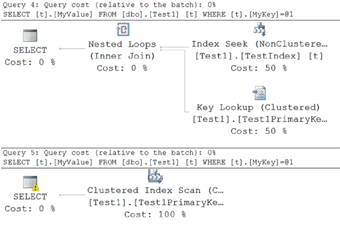
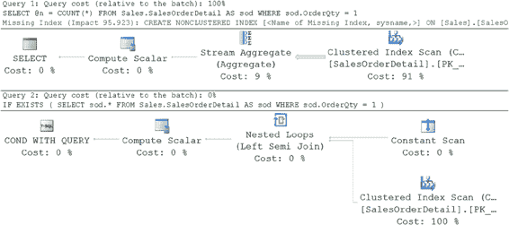

# 第 19 章：减少查询资源使用

两个查询返回相同的结果集。如你所见，除了与 `MyKey` 列相等的变量的数据类型不同外，这两个查询是相同的。由于该列是 `VARCHAR`，第一个查询不需要隐式数据类型转换。第二个查询使用了与 `MyKey` 列不同的数据类型，因此需要隐式数据类型转换，从而增加了查询性能的开销。图 19-1 展示了这两个查询的执行计划。

[www.it-ebooks.info](http://www.it-ebooks.info/)



**图 19-1.** 进行与未进行隐式数据类型转换的查询的开销

隐式数据类型转换的复杂性取决于比较中所涉及数据类型的优先级。SQL Server 的数据类型优先级规则指定了哪种数据类型会转换为另一种。通常，优先级较低的数据类型会转换为优先级较高的数据类型。例如，`TINYINT` 数据类型的优先级低于 `INT` 数据类型。有关 SQL Server 2014 中数据类型优先级的完整列表，请参阅 MSDN 文章“数据类型优先级”([`bit.ly/1cN7AYc`](http://bit.ly/1cN7AYc))。关于哪种数据类型可以隐式转换为哪种数据类型的更多信息，请参阅 MSDN 文章“数据类型转换”([`bit.ly/1j7kIJf`](http://bit.ly/1j7kIJf))。

注意 `SELECT` 运算符上的警告图标。它在提示你这个查询中存在可疑之处。在本例中，问题在于存在数据类型转换操作。优化器提示你，这可能会负面影响其查找和使用索引来辅助查询性能的能力。这也可能是一个误报。如果转换发生在未用于任何谓词的列上，那么发生隐式甚至显式转换实际上也无关紧要。

当 SQL Server 比较具有某种数据类型的列值与具有不同数据类型的变量（或常量）时，变量（或常量）的数据类型总是会被转换为列的数据类型。这样做是因为列值的访问是基于变量（或常量）的隐式转换值。因此，在这种情况下，隐式转换总是应用于变量（或常量）。

如你所见，隐式数据类型转换既会因生成不良的执行计划，也会因增加执行转换的 CPU 成本，从而给查询性能带来额外开销。因此，为了提升性能，始终应为两个表达式使用相同的数据类型。

[www.it-ebooks.info](http://www.it-ebooks.info/)



### 使用 EXISTS 而非 COUNT(*) 来验证数据是否存在

一个常见的数据库需求是验证一组数据是否存在。通常你会看到如下（下载文件中的 --count）使用一批 SQL 查询来实现：

```sql
DECLARE @n INT ;

SELECT @n = COUNT(*)

FROM Sales.SalesOrderDetail AS sod

WHERE sod.OrderQty = 1;

IF @n > 0

PRINT 'Record Exists';
```

使用 `COUNT(*)` 来验证数据存在性是高度资源密集型的，因为 `COUNT(*)` 必须扫描表中的所有行。`EXISTS` 只需扫描并在匹配 `EXISTS` 条件的第一条记录处停止。为了提高性能，请使用 `EXISTS` 替代 `COUNT(*)` 方法。

```sql
IF EXISTS ( SELECT sod.*

FROM Sales.SalesOrderDetail AS sod

WHERE sod.OrderQty = 1 )

PRINT 'Record Exists';
```

`EXISTS` 技术相对于 `COUNT(*)` 技术的性能优势，可以通过 `STATISTICS IO` 和 `TIME` 输出以及图 19-2 中的执行计划进行比较，从运行这些查询的输出中可以看出。

表 `'SalesOrderDetail'`. 扫描计数 1, 逻辑读取 1246
CPU 时间 = 0 ms, 已用时间 = 29 ms.

表 `'SalesOrderDetail'`. 扫描计数 1, 逻辑读取 3
CPU 时间 = 0 ms, 已用时间 = 4 ms.


