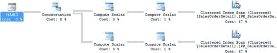
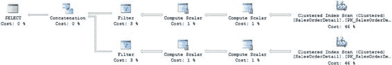
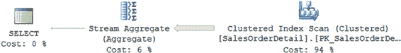
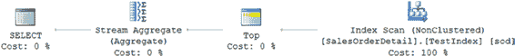
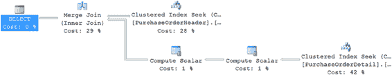
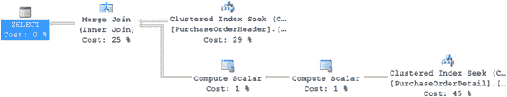
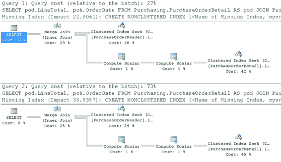

# 第 19 章 ■ 减少查询资源使用

***图 19-2.** COUNT 与 EXISTS 的区别*

[www.it-ebooks.info](http://www.it-ebooks.info/)





如图所示，`EXISTS` 技术仅使用了 3 次逻辑读取，而 `COUNT(*)` 技术使用了 1,246 次，执行时间从 29 毫秒缩短到 4 毫秒。因此，要判断数据是否存在，请使用 `EXISTS` 技术。

### 使用 UNION ALL 代替 UNION

您可以使用 `UNION` 子句来串联多个 `SELECT` 语句的结果集，如下所示，如图 19-3 所示：

```sql
SELECT *
FROM Sales.SalesOrderDetail AS sod
WHERE sod.ProductID = 934
UNION
SELECT *
FROM Sales.SalesOrderDetail AS sod
WHERE sod.ProductID = 932;
```

***图 19-3.** 使用 UNION 子句的查询执行计划*

`UNION` 子句处理来自两个 `SELECT` 语句的结果集，从最终结果集中删除重复项，实际上是对每个查询运行了 `DISTINCT`。如果参与 `UNION` 子句的 `SELECT` 语句的结果集彼此互斥，或者您允许最终结果集中存在重复行，那么请使用 `UNION ALL` 代替 `UNION`。这避免了检测和删除任何重复项的开销，从而提高了性能，如图 19-4 所示。

***图 19-4.** 使用 UNION ALL 的查询执行计划*

[www.it-ebooks.info](http://www.it-ebooks.info/)





如图所示，在第一种情况下（使用 `UNION`），优化器在串联两个 `SELECT` 语句的结果集时，以完全不同的方式筛选记录以消除重复。由于结果集是互斥的，您可以使用 `UNION ALL` 代替 `UNION` 子句。使用 `UNION ALL` 子句避免了检测重复项的开销，从而提高了性能。

### 为聚合和排序条件使用索引

通常，`MIN` 和 `MAX` 等聚合函数会受益于对应列上的索引。如果列上没有任何索引，优化器必须扫描基表（或聚集索引），检索所有行，并在包含所有行的组上执行流聚合以识别 `MIN`/`MAX` 值，如下面的示例所示（参见图 19-5：）

```sql
SELECT MIN(sod.UnitPrice)
FROM Sales.SalesOrderDetail AS sod;
```

***图 19-5.** 扫描整个表被过滤为单行*

使用 `MIN` 聚合函数的 `SELECT` 语句的 `STATISTICS IO` 和 `TIME` 输出如下：表 'SalesOrderDetail'。扫描计数 1，逻辑读取 1246 CPU 时间 = 46 毫秒，经过时间 = 52 毫秒。

如 `STATISTICS` 输出所示，该查询仅为了检索 `UnitPrice` 列最小值所在的行就执行了超过 1,200 次逻辑读取。您可以在图 19-5 的执行计划中看到这一点。从 `Clustered Index Scan` 出来一个巨大的胖行，结果被 `Stream Aggregate` 操作过滤为单行。如果您在 `UnitPrice` 列上创建索引，那么 `UnitPrice` 值将由索引在叶页面中预排序。

```sql
CREATE INDEX TestIndex ON Sales.SalesOrderDetail (UnitPrice ASC);
```

`UnitPrice` 列上的索引显著提高了 `MIN` 聚合函数的性能。优化器可以通过寻址到索引中最顶部的行来检索最小的 `UnitPrice` 值。这减少了查询的逻辑读取次数，如相应的 `STATISTICS` 输出所示（参见图 19-6。）

表 'SalesOrderDetail'。扫描计数 1，逻辑读取 3 CPU 时间 = 0 毫秒，经过时间 = 20 毫秒。

***图 19-6.** 索引从根本上提高了性能*

[www.it-ebooks.info](http://www.it-ebooks.info/)



类似地，在 `ORDER BY` 子句引用的列上创建索引有助于优化器快速组织结果集，因为列值已在索引中预先排列。`GROUP BY` 子句的内部实现也会首先对列值进行排序，因为排序的列值允许快速地将相邻的匹配值分组。因此，与 `ORDER BY` 子句类似，`GROUP BY` 子句也受益于 `GROUP BY` 子句引用的列中的值预先排序。

### 避免在批量查询中使用局部变量

通常，多个查询会作为一批一起提交，以避免多次网络往返。在查询批处理中使用局部变量在各个查询之间传递值是很常见的。但是，在批处理中查询的 `WHERE` 子句中使用局部变量，不允许优化器生成高效的执行计划。

为了理解在批处理中查询的 `WHERE` 子句中使用局部变量如何影响性能，请考虑以下批处理查询（`--batch`）：

```sql
DECLARE @Id INT = 1;

SELECT pod.LineTotal,
       poh.OrderDate
FROM Purchasing.PurchaseOrderDetail AS pod
JOIN Purchasing.PurchaseOrderHeader AS poh
    ON poh.PurchaseOrderID = pod.PurchaseOrderID
WHERE poh.PurchaseOrderID >= @Id;
```

图 19-7 显示了 此 `SELECT` 语句的执行计划。

***图 19-7.** 显示局部变量在批量查询中影响的执行计划*

如图所示，执行了 `Clustered Index Seek` 操作来访问 `Purchasing.PurchaseOrderDetail` 表中的行。如果执行 `SELECT` 语句时不使用局部变量，而是用适当的常量值替换局部变量值，如下面的查询，优化器会做出不同的选择。

```sql
SELECT pod.LineTotal,
       poh.OrderDate
FROM Purchasing.PurchaseOrderDetail AS pod
JOIN Purchasing.PurchaseOrderHeader AS poh
    ON poh.PurchaseOrderID = pod.PurchaseOrderID
WHERE poh.PurchaseOrderID >=1;
```

[www.it-ebooks.info](http://www.it-ebooks.info/)



图 19-8 显示了 结果。

***图 19-8.** 未使用局部变量时的查询执行计划*

虽然这两种方法看起来相同，但仔细检查后，开始出现有趣的差异。

注意某些操作的估算成本。例如，图 19-6 和图 19-7 之间的 `Merge Join` 就不同；前者是 29%，后者是 25%。如果查看每个查询的 `STATISTICS IO` 和 `TIME`，还会出现其他差异。首先是第一个查询的信息：表 'PurchaseOrderDetail'。扫描计数 1，逻辑读取 66 表 'PurchaseOrderHeader'。扫描计数 1，逻辑读取 44 CPU 时间 = 16 毫秒，经过时间 = 151 毫秒。

然后是第二个查询，没有局部变量：表 'PurchaseOrderDetail'。扫描计数 1，逻辑读取 66 表 'PurchaseOrderHeader'。扫描计数 1，逻辑读取 44 CPU 时间 = 0 毫秒，经过时间 = 132 毫秒。

请注意，扫描和读取次数是相同的，正如具有几乎相同执行计划的查询所预期的那样。CPU 时间和经过时间不同，第二个查询（没有局部变量的那个）总是稍少一些。基于这些事实，您可能会假设第一个查询的执行计划会比第二个查询成本更高。但实际情况却大不相同，如图 19-9 中的 执行计划成本比较所示。

[www.it-ebooks.info](http://www.it-ebooks.info/)




