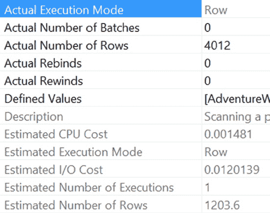
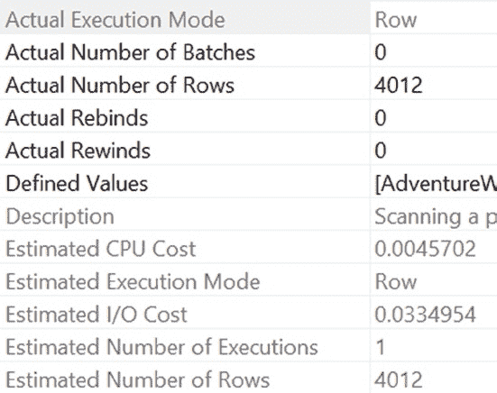

# 第 19 章 ■ 减少查询资源使用

## *图 19-9. 使用与不使用局部变量时的查询相对成本*

从两个执行计划的相对成本来看，第二个查询似乎并不比第一个查询更便宜。然而，从 `STATISTICS` 的对比来看，第二个查询应该比第一个查询更便宜。你应该相信哪个：`STATISTICS` 的比较结果还是执行计划的相对成本？这个异常现象的根源是什么？

执行计划是基于优化器对每个执行步骤所影响行数的估算生成的。如果你查看带有局部变量的查询的初始执行计划中各个操作符的属性（如图 19-7 所示），你可能会注意到一个差异。请看图 19-10。

[www.it-ebooks.info](http://www.it-ebooks.info/)





## *图 19-10. 使用局部变量时的聚集索引查找详细信息*

你要找的差异是“Actual Number of Rows（实际行数）”值（靠近顶部）与“Estimated Number of Rows（估计行数）”值（在底部）的对比。在图 19-10 所示的属性中，估计行数是 1,203.6，而实际行数要高得多，为 4,012。如果你将此与第二个查询（没有局部变量的查询）中的相同操作符进行比较，可能会注意到其他情况。看一下图 19-11。

## *图 19-11. 不使用局部变量时的聚集索引查找详细信息*

[www.it-ebooks.info](http://www.it-ebooks.info/)

在这里，你会看到“Actual Number of Rows（实际行数）”和“Estimated Number of Rows（估计行数）”值是相同的：4,012。

从这两个测量值可以看出，第一个查询（在 `WHERE` 子句中使用局部变量）执行步骤的估计行数与该步骤返回的实际行数相差甚远。因此，基于估计行数计算的第一个查询的执行计划成本在某种程度上是具有误导性的。错误的估计误导了优化器，并导致查询执行方式出现一些变化。你可以在查询的返回时间上看到这一点，即使最终返回的行数是相同的。

任何时候，当你在分析查询时发现相对执行计划成本与 `STATISTICS` 输出之间存在这样的异常时，都应该验证估算的基础。如果执行计划本身的基础事实（估计行数）是错误的，那么执行计划中表示的成本也很可能出错。

但是，由于各种 `STATISTICS` 测量的输出显示了实际的逻辑读取次数和执行查询所需的实际经过时间，并且不受初始估计的影响，因此你可以依赖 `STATISTICS` 输出。

现在让我们回到与在 `WHERE` 子句中使用局部变量相关的实际性能问题。如前面的示例所示，在批处理查询的 `WHERE` 子句中使用局部变量作为过滤条件，不允许优化器确定正确的索引策略。这是因为，在优化批处理中的查询时，优化器不知道 `WHERE` 子句中使用的变量的值，也无法确定正确的访问策略——它要到执行时才知道变量的值。这实际上意味着优化器不得不使用密度向量，而不是通过统计信息中的直方图来查找信息。

为避免此特定性能问题，请使用以下方法之一：不要在批处理中使用局部变量作为此类查询的过滤条件。局部变量不同于参数值，如第 16 章所示。为批处理创建一个存储过程并按如下方式执行：

```sql
CREATE PROCEDURE dbo.LocalVarProc
    @LocalVar INT
AS
SELECT  columnlist
FROM    dbo.tablename
WHERE   keycolumn = @LocalVar;
```


```markdown
# 第 19 章 ■ 减少查询资源使用

```sql
CREATE PROCEDURE spProductDetails (@id INT)
AS
SELECT pod.*
FROM Purchasing.PurchaseOrderDetail AS pod
JOIN Purchasing.PurchaseOrderHeader AS poh
ON poh.PurchaseOrderID = pod.PurchaseOrderID
WHERE poh.PurchaseOrderID >= @id;
GO

EXEC spProductDetails
@id = 1;
```

在理想情况下，优化器生成的执行计划与不使用局部变量的查询相同。相应地，执行时间也得以减少。对于存储过程，优化器在首次执行存储过程时生成执行计划，并根据提供的参数值来确定正确的处理策略。

这种方法可能适得其反。使用传递给参数的值的过程被称为*参数嗅探*。参数嗅探会自动发生在所有存储过程和参数化查询中。根据统计信息的准确性和传递给参数的值，有可能使用特定值得到一个糟糕的计划，而使用采样值（当你使用局部变量时）得到一个良好的计划。在任何给定情况下，测试是确定哪种方法效果最好的唯一途径。然而，在大多数情况下，拥有准确值通常比采样值更好。有关参数嗅探的更多详细信息，请参见第 16 章。

### 命名存储过程时要小心

存储过程的名称确实很重要。你不应该使用 `sp_` 前缀来命名你的过程。开发人员通常给他们的存储过程加上 `sp_` 前缀，以便轻松识别。然而，SQL Server 会假定任何带有此前缀的存储过程很可能是一个系统存储过程，其位置在 `master` 数据库中。当提交一个带有 `sp_` 前缀的存储过程执行时，SQL Server 会按以下顺序在以下位置查找该存储过程：

*   在 `master` 数据库中
*   在当前数据库中，基于提供的任何限定符（数据库名或所有者）
*   如果未指定架构，则在当前数据库中使用 `dbo` 作为架构

因此，尽管用户创建的、以 `sp_` 为前缀的存储过程存在于当前数据库中，但系统仍会首先检查 `master` 数据库。即使存储过程已用数据库名限定，这种情况也会发生。

要理解给存储过程名称添加 `sp_` 前缀的影响，请考虑以下存储过程：

```sql
IF EXISTS ( SELECT *
            FROM sys.objects
            WHERE object_id = OBJECT_ID(N'[dbo].[sp_Dont]')
              AND type IN (N'P', N'PC') )
    DROP PROCEDURE [dbo].[sp_Dont]
GO

CREATE PROC [sp_Dont]
AS
    PRINT 'Done!'
GO

--将 sp_Dont 的计划添加到过程缓存中
EXEC AdventureWorks2012.dbo.[sp_Dont] ;
GO

--使用上面缓存的 sp_Dont 计划
EXEC AdventureWorks2012.dbo.[sp_Dont] ;
GO
```

存储过程的第一次执行将其执行计划添加到过程缓存中。随后执行该存储过程时，除非需要重新编译计划（存储过程重新编译的原因在第 10 章中解释），否则会重用过程缓存中现有的计划。

因此，如图 19-12 所示的存储过程 `sp_Dont` 的第二次执行应该在过程缓存中找到一个计划。这在相应的扩展事件输出中由 `SP:CacheMiss` 事件表示。

***图 19-12.** 扩展事件输出，显示了 `sp_` 前缀对存储过程名称的影响*

请注意，在 SQL Server 尝试在过程缓存中定位存储过程的计划之前，会触发一个 `SP:CacheMiss` 事件。该 `SP:CacheMiss` 事件是由 SQL Server 在 `master` 数据库中查找存储过程引起的，即使存储过程的执行已正确限定为用户数据库名。
```


当您创建一个与现有系统存储过程同名的存储过程时，`sp_`前缀的这个特性会变得更加有趣。

```
CREATE PROC sp_addmessage @param1 NVARCHAR(25)

AS

PRINT '@param1 = ' + @param1 ;

GO

EXEC AdventureWorks2012.dbo.[sp_addmessage] 'AdventureWorks';
```

如图 19-13 所示，执行这个用户定义的存储过程，反而会导致执行`master`数据库中的系统存储过程`sp_addmessage`。

***图 19-13.** 展示`sp_`前缀对存储过程名称影响的执行结果* 不幸的是，无法执行这个用户定义的存储过程。现在您能明白为什么不应该用`sp_`作为用户定义存储过程名称的前缀了。请使用其他命名约定。

## 减少网络往返次数

数据库应用程序通常执行多个查询来实现一个数据库操作。除了优化单个查询的性能外，优化批处理的性能也很重要。为了减少多次网络往返的开销，请考虑以下技术：

• 一起执行多个查询。

• 使用`SET NOCOUNT`。

让我们更深入地了解一下这些技术。

### 一起执行多个查询

最好将一组查询作为一个批处理或存储过程一起提交。除了减少数据库应用程序和服务器之间的网络往返次数外，存储过程还提供多种性能和管理上的优势，如第 15 章所述。这意味着应用程序中的代码需要能够处理多个结果集。这也意味着您的 T-SQL 代码可能需要处理 XML 数据或其他大型数据集，而不是单行的插入或更新。

[www.it-ebooks.info](http://www.it-ebooks.info/)

第 19 章 ■ 减少查询资源使用

### 使用`SET NOCOUNT`

在执行批处理或存储过程时，还需要考虑另一个因素。在批处理或存储过程中的每个查询执行完毕后，服务器会报告受影响的行数。

(<Number> row(s) affected)

此信息会返回给数据库应用程序，并增加了网络开销。使用 T-SQL 语句`SET NOCOUNT`可以避免此开销。

`SET NOCOUNT ON` <SQL queries> `SET NOCOUNT OFF`

请注意，与某些 SET 语句不同（如第 17 章所述），`SET NOCOUNT`语句不会导致存储过程的重新编译问题。

## 降低事务成本

SQL Server 中的每个操作查询都是作为*原子*操作执行的，因此数据库表的状态从一个*一致*状态转移到另一个一致状态。SQL Server 自动执行此操作，且无法禁用。如果从一个一致状态转移到另一个一致状态需要多个数据库查询，则应使用显式定义的数据库事务来维护跨多个查询的原子性。每个原子操作的旧状态和新状态都保存在事务日志（在磁盘上）中，以确保*持久性*，这保证了一旦原子操作成功完成，其结果不会丢失。执行中的原子操作通过数据库锁与其他数据库操作*隔离*。

基于事务的特性，以下是降低事务成本的两条主要建议：

• 减少日志记录开销。

• 减少锁开销。

### 减少日志记录开销

一个数据库查询可能包含多个数据操作查询。如果为每个查询单独维护原子性，则会在事务日志上执行大量的磁盘写入。由于磁盘活动相比内存或 CPU 活动极其缓慢，过度的磁盘活动会增加数据库功能的执行时间。例如，考虑以下批处理查询：

```
--Create a test table
IF (SELECT OBJECT_ID('dbo.Test1')
) IS NOT NULL
DROP TABLE dbo.Test1;
GO
CREATE TABLE dbo.Test1 (C1 TINYINT);
GO
```


