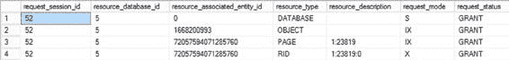

# SQL Server 锁机制概述

SQL Server 数据库作为物理磁盘上的文件进行维护。对于桌面上的传统非数据库文件（例如 Excel 文件），一次可能只有一名用户写入。其他用户任何写入文件的尝试都会失败。然而，与非数据库文件有限的并发性不同，SQL Server 允许多个用户同时修改（或访问）内容，只要它们不影响彼此的数据一致性。这减少了阻塞并提高了事务间的并发性。

为了提高并发性，SQL Server 在以下资源级别按此顺序实现锁粒度：

-   行（`RID`）
-   键（`KEY`）
-   页（`PAG`）
-   区（`EXT`）
-   堆或 B 树（`HoBT`）
-   表（`TAB`）
-   文件（`FIL`）
-   应用程序（`APP`）
-   元数据（`MDT`）
-   分配单元（`AU`）
-   数据库（`DB`）

让我们更详细地了解这些锁级别。

[www.it-ebooks.info](http://www.it-ebooks.info/)



**第 20 章 ■ 阻塞与被阻塞的进程**

#### 行级锁

此锁维护在表中的单个行上，是数据库表的最低级别锁。当查询修改表中的一行时，会授予该查询在该行上的 `RID` 锁。例如，考虑以下测试表上的事务：

```sql
--Create a test table
IF (SELECT OBJECT_ID('dbo.Test1')) IS NOT NULL
    DROP TABLE dbo.Test1;
GO

CREATE TABLE dbo.Test1 (C1 INT);
INSERT INTO dbo.Test1
VALUES (1);
GO

BEGIN TRAN
DELETE dbo.Test1
WHERE C1 = 1;

SELECT dtl.request_session_id,
       dtl.resource_database_id,
       dtl.resource_associated_entity_id,
       dtl.resource_type,
       dtl.resource_description,
       dtl.request_mode,
       dtl.request_status
FROM sys.dm_tran_locks AS dtl
WHERE dtl.request_session_id = @@SPID;
ROLLBACK
```

动态管理视图 `sys.dm_tran_locks` 可用于显示锁状态。图 20-1 中对 `sys.dm_tran_locks` 的查询显示，`DELETE` 语句获取了（以及其他锁）一个针对待删除行的排他 `RID` 锁。

***图 20-1.*** *`sys.dm_tran_locks` 的输出，显示授予 `DELETE` 语句的行级锁*

> **注意** 我将在本章后面的“锁模式”一节中解释锁模式。

授予 `DELETE` 语句一个 `RID` 锁可以防止其他事务访问该行。

由 `RID` 锁锁定的资源可以从 `resource_description` 列中以以下格式表示：

`DatabaseID:FileID:PageID:Slot(row)`

在图 20-1 对 `sys.dm_tran_locks` 的查询输出中，`DatabaseID` 单独显示在 `resource_database_id` 列下。`RID` 类型的 `resource_description` 列值表示 `RID` 资源的剩余部分为 `1:23819:0`。在此情况下，`FileID` 1 是主数据文件，`PageID` 23819 是属于由 `C1` 列标识的 `dbo.Test1` 表的一页，`Slot (row)` 0 代表该页内的行位置。您可以通过执行以下 SQL 语句获取表名和数据库名：

```sql
SELECT OBJECT_NAME(1668200993),
       DB_NAME(5);
```

行级锁提供了非常高的并发性，因为阻塞仅限于受影响的行。

#### 键级锁

这是索引内的行锁，被标识为 `KEY` 键。如您所知，对于具有聚集索引的表，表的数据页与聚集索引的叶页是相同的。由于对于具有聚集索引的表，这两者的行是相同的，因此在从表（或聚集索引）访问行时，仅在聚集索引行或有限的行范围内获取一个 `KEY` 键锁。例如，考虑在 `Test1` 表上有一个聚集索引。

```sql
CREATE CLUSTERED INDEX TestIndex ON dbo.Test1(C1);
```

接下来，重新运行以下代码：

```sql
BEGIN TRAN
DELETE dbo.Test1
WHERE C1 = 1 ;

SELECT dtl.request_session_id,
       dtl.resource_database_id,
       dtl.resource_associated_entity_id,
       dtl.resource_type,
```


