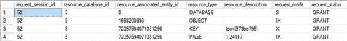

# 第 20 章 ■ 阻塞与被阻塞进程

## 锁的类型

#### 行级锁

行级锁是最细粒度的锁，应用于单行数据。当查询需要锁定特定行时，会使用此类锁。例如，在以下查询中：

```sql
dtl.resource_description,
dtl.request_mode,
dtl.request_status
FROM sys.dm_tran_locks AS dtl
WHERE dtl.request_session_id = @@SPID ;
ROLLBACK
```

从`sys.dm_tran_locks`对应的输出中可以看到，它显示的是 KEY 锁而非 RID 锁，如图 20-2.所示。



*图 20-2. 显示授予 DELETE 语句的键级锁的 sys.dm_tran_locks 输出*

当查询`sys.dm_tran_locks`时，可以检索数据库标识符`resource_database_id`。也可以从`resource_associated_entity_id`获取被锁定对象的信息；然而，要获取特定资源（本例中是键所在的页），必须查看`resource_description`列的值，即`1:24117`。其中，Index ID 为 1 表示`dbo.Test1`表上的聚集索引。还可以看到各种请求类型：S、Sch-S、X 等。这些将在接下来的“锁模式”部分详细介绍。

> **注意** 本章的“索引对锁的影响”部分将介绍`IndId`列的不同值以及如何确定对应的索引名称。

与行级锁类似，键级锁提供了非常高的并发性。

#### 页级锁

页级锁维护在表或索引中的单个页上，标识为 PAG 锁。当查询请求一页内的多个行时，锁管理器可以通过在各行上获取 RID/KEY 锁或在整个页上获取 PAG 锁来维护所有请求行的一致性。从查询计划中，锁管理器会确定获取多个 RID/KEY 锁的资源压力，如果压力很高，则会请求 PAG 锁。

PAG 锁锁定的资源在`sys.dm_tran_locks`的`resource_description`列中可能表示为以下格式：

`DatabaseID:FileID:PageID`

页级锁可以通过减少锁开销来提高单个查询的性能，但会通过阻塞对页中所有行的访问而损害数据库的并发性。

#### 区级锁

区级锁维护在区（一组八个连续的数据或索引页）上，标识为 EXT 锁。例如，当在表上执行`ALTER INDEX REBUILD`命令，并且表的页可能从现有区移动到新区时，会使用此锁。在此期间，使用 EXT 锁保护区的完整性。

#### 堆或 B 树锁

堆或 B 树锁用于描述可能对任一类型对象加锁的情况。目标对象可以是无序堆表（即没有聚集索引的表），或 B 树对象（通常指分区）。`ALTER TABLE`函数中的一个设置允许你控制锁升级（在“锁升级”部分介绍）如何影响分区。由于分区可能跨多个文件组，每个分区必须有自己的数据分配定义。这就是 HoBT 锁的作用。它的作用类似于表级锁，但作用于分区本身而非整个表。

#### 表级锁

这是表的最高级别锁，标识为 TAB 锁。表上的表级锁保留了对整个表及其所有索引的访问权限。

当执行查询时，锁管理器会自动确定在较低级别获取多个锁的锁开销。如果确定在行级或页级获取锁的资源压力很高，则锁管理器会直接为查询获取表级锁。

TAB 锁锁定的资源在`resource_description`中表示为以下格式：`DatabaseID:ObjectID`

与其他锁相比，表级锁所需的开销最小，因此可以提高单个查询的性能。另一方面，由于表级锁会阻塞整个表（包括索引）上的所有写请求，因此可能严重损害数据库并发性。

有时，应用程序功能可能受益于对查询中引用的表使用特定的锁级别。例如，如果在非高峰时间执行管理查询，则表级锁可能不会对系统用户造成太大影响；但是，它可以减少查询的锁开销，从而提高其性能。在这种情况下，查询开发人员可以通过使用锁提示来覆盖锁管理器对查询中引用表的锁级别选择。

```sql
SELECT * FROM <TableName> WITH(TABLOCK)
```

但是，在像这样从 SQL Server 拿走控制权时要谨慎。在实施前进行彻底测试。

#### 数据库级锁

数据库级锁维护在数据库上，标识为 DB 锁。当应用程序建立数据库连接时，锁管理器会为相应的`session_id`分配一个数据库级共享锁。这可以防止用户在其他用户连接到数据库时意外地删除或还原数据库。

SQL Server 确保一个级别请求的锁尊重在其他级别授予的锁。例如，一旦用户获取了表行的行级锁，其他用户就无法获取可能影响该行完整性的任何其他级别的锁。第二个用户可以获取其他行的行级锁或其他页的页级锁，但包含该行的不兼容的页级或表级锁不会授予其他用户。

用户或数据库管理员无需指定应应用锁的级别；锁管理器会自动确定。当访问少量行时，它通常倾向于行级锁和键级锁以辅助并发性。但是，如果多个低级别锁的锁开销变得非常高，锁管理器会自动选择一个适当的高级别锁。

### 锁操作和模式

由于 SQL Server 需要执行多种操作，因此维护了一套同样庞大且复杂的锁机制。除了不同类型的锁之外，还有一个升级路径可以将一种类型的锁更改为另一种。以下部分描述了这些模式和过程及其用途。

#### 锁升级

当执行查询时，SQL Server 确定查询引用的数据库对象所需的锁级别，并在获取所需锁后开始执行查询。在查询执行期间，锁管理器会跟踪查询请求的锁数量，以确定是否需要将锁级别从当前级别升级到更高级别。

锁升级阈值由 SQL Server 在事务过程中确定。当事务超过其阈值时，行锁和页锁会自动升级为表锁。锁级别升级为表级锁后，表上所有较低级别的锁都会自动释放。锁管理器的这种动态锁升级功能优化了查询的锁开销。

可以对给定表上的锁机制建立一定程度的控制。例如，你可以控制是否发生锁升级。以下是用于进行更改的 T-SQL 语法：

```sql
ALTER TABLE schema.table
SET (LOCK_ESCALATION = DISABLE)
```


此语法将完全禁用表上的锁升级（少数特殊情况除外）。你也可以将其设置为 `TABLE`，这将导致每次升级都直接升级到表锁。你还可以将表上的锁升级设置为 `AUTO`，这将允许 SQL Server 自行决定锁定架构和任何必要的升级。如果该表已分区，你可能会看到升级变为分区级别。再次强调，使用这些修改来改变标准 SQL Server 行为时请**谨慎操作**。

你也可以选择使用跟踪标志 `1224` 来在更广的范围内禁用锁升级。这将基于锁的数量禁用锁升级，但保留基于内存压力的锁升级。你也可以通过使用跟踪标志 `1211` 来同时禁用基于内存压力和锁数量的升级，但这是一个危险的选择，可能导致系统错误。我强烈建议在使用这两种选项之前进行彻底的测试。

### 锁模式

不同事务所需的数据隔离级别可能不同。例如，两个事务同时读取数据不会影响数据一致性；然而，如果允许两个事务同时修改数据，则会影响一致性。根据请求的访问类型，SQL Server 在锁定资源时会使用不同的锁模式：

*   共享锁 (`S`)
*   更新锁 (`U`)
*   排他锁 (`X`)
*   意向锁：
    *   意向共享锁 (`IS`)
    *   意向排他锁 (`IX`)
    *   共享意向排他锁 (`SIX`)
*   架构锁：
    *   架构修改锁 (`Sch-M`)
    *   架构稳定性锁 (`Sch-S`)
*   大容量更新锁 (`BU`)
*   键范围锁

#### 共享 (S) 模式

共享模式用于只读查询，例如 `SELECT` 语句。它不会阻止其他只读查询同时访问数据，因为并发读取不会损害数据的完整性。

然而，为了维护数据一致性，会阻止对数据的并发修改查询。`（S）`锁会一直持有在数据上，直到数据被读取。默认情况下，`SELECT` 语句获取的 `（S）` 锁在数据被读取后会立即释放。例如，考虑以下事务：

```sql
BEGIN TRAN
SELECT *
FROM Production.Product AS p
WHERE p.ProductID = 1;
--其他查询
COMMIT
```

`SELECT` 语句获取的 `（S）` 锁不会持有到事务结束；相反，在默认隔离级别 `read_committed` 下，它会在 `SELECT` 语句读取数据后立即释放。`（S）` 锁的这种行为可以通过使用更高的隔离级别或锁提示来改变。

#### 更新 (U) 模式

更新模式可以被认为类似于 `（S）` 锁，但它还包含在同一查询中修改数据的目标。与 `（S）` 锁不同，`（U）` 锁表示数据是为修改而读取的。由于数据是为修改目的而读取的，SQL Server 不允许同时对数据持有多个 `（U）` 锁。此规则有助于维护数据一致性。请注意，数据上允许并发的 `（S）` 锁。`（U）` 锁与 `UPDATE` 语句相关联，而 `UPDATE` 语句的动作实际上涉及两个中间步骤。

1.  读取要修改的数据。
2.  修改数据。

在这两个中间步骤中使用了不同的锁模式以最大化并发性。在第一步读取数据时，不是获取排他权，而是在数据上获取一个 `（U）` 锁。在第二步中，`（U）` 锁被转换为排他锁以进行修改。如果不需要修改，则释放 `（U）` 锁；换句话说，它不会持有到事务结束。考虑以下示例，它演示了 `UPDATE` 语句的锁定行为：

```sql
BEGIN TRANSACTION LockTran1
UPDATE Sales.Currency
SET Name = 'Euro'
WHERE CurrencyCode = 'EUR';
COMMIT
```

要理解 `UPDATE` 语句中间步骤的锁定行为，你需要在每一步结束时从 `sys.dm_tran_locks` 获取数据。你可以按照以下概述的步骤，在 `UPDATE` 语句的每一步之后获取锁状态。你需要打开三个连接，我将它们称为连接 1、连接 2 和连接 3。这需要 Management Studio 中的三个不同查询窗口。你需要按照我指定的顺序运行我所列连接中的查询，以达到一个阻塞情况；目的是观察这些阻塞发生的过程。最初的查询，如前所述，在连接 1 中：

3.  首先从第二个连接（连接 2）执行一个事务来阻塞 `UPDATE` 语句的第二步。

```sql
--从第二个连接执行
BEGIN TRANSACTION LockTran2
--在资源上保留一个 (S) 锁
SELECT *
FROM Sales.Currency AS c WITH (REPEATABLEREAD)
WHERE c.CurrencyCode = 'EUR' ;
--允许在事务 LockTran1 执行 UPDATE 语句的第二步之前执行 DMV
WAITFOR DELAY '00:00:10';
COMMIT
```

在连接 2 中运行的 `REPEATABLEREAD` 锁提示允许 `SELECT` 语句在资源上保留 `（S）` 锁。

4.  当事务 `LockTran2` 正在执行时，从第一个连接（连接 1）执行 `UPDATE` 事务 `updatelock`（为清晰起见在此重复）。

```sql
BEGIN TRANSACTION LockTran1
UPDATE Sales.Currency
SET Name = 'Euro'
WHERE CurrencyCode = 'EUR';
-- 注意：我们尚未提交
--COMMIT
```

5.  当 `UPDATE` 语句被阻塞时，从第三个连接（连接 3）查询 `sys.dm_tran_locks` DMV，如下所示：

```sql
SELECT dtl.request_session_id,
dtl.resource_database_id,
dtl.resource_associated_entity_id,
dtl.resource_type,
dtl.resource_description,
dtl.request_mode,
dtl.request_status
FROM sys.dm_tran_locks AS dtl
ORDER BY dtl.request_session_id;
```

连接 3 中 `sys.dm_tran_locks` 的输出将提供 `UPDATE` 语句第一步之后的锁状态，因为 `UPDATE` 语句向排他 `（X）` 锁的转换被 `SELECT` 语句阻塞了。

6.  通过重新运行连接 3 中对 `sys.dm_tran_locks` 的查询，将提供 `UPDATE` 语句第二步之后的锁状态。

接下来，让我们看看在 `UPDATE` 语句的各个步骤中，`sys.dm_tran_locks` 提供的锁状态。

*   图 20-3 显示了 `UPDATE` 语句第 1 步之后的锁状态（如前所述，从在第三个连接（连接 3）上执行的 `sys.dm_tran_locks` 的输出中获得）。

**图 20-3.** `sys.dm_tran_locks` 的输出，显示 `UPDATE` 语句的锁转换状态

**注意**这些行的顺序并不重要。我按 `session_id` 排序是为了将每个查询的锁分组。

*   图 20-4 显示了 `UPDATE` 语句第 2 步之后的锁状态。

**图 20-4.** `sys.dm_tran_locks` 的输出，显示 `UPDATE` 语句持有的最终锁状态

从 `UPDATE` 语句第一步之后的 `sys.dm_tran_locks` 输出中，你可以注意到以下几点：

*   一个 `（U）` 锁被授予了数据行上的 `SPID`。
*   请求了在该数据行上转换为 `（X）` 锁。

从 `UPDATE` 语句第二步之后的 `sys.dm_tran_locks` 输出中，你可以看到 `UPDATE` 语句仅在该数据行上持有一个 `（X）` 锁。本质上，数据行上的 `（U）` 锁被转换为了 `（X）` 锁。


