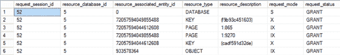

# 第 20 章 ■ 阻塞与被阻塞的进程

**注意** 死锁将在第 21 章中更详细地介绍。

为了避免这种典型的死锁，`UPDATE` 语句在其第一个中间步骤使用 `(U)` 锁代替 `(S)` 锁。与 `(S)` 锁不同，`(U)` 锁不允许同时在同一个资源上再放置另一个 `(U)` 锁。这迫使第二个并发的 `UPDATE` 语句等待，直到第一个 `UPDATE` 语句完成。

#### 排他 (X) 模式

排他模式为数据操作查询（如 `INSERT`、`UPDATE` 和 `DELETE`）修改数据库资源提供了排他权利。它阻止其他并发事务访问正在修改的资源。`INSERT` 和 `DELETE` 语句都在其执行一开始就获取 `(X)` 锁。如前所述，`UPDATE` 语句在读取要修改的数据后转换为 `(X)` 锁。在一个事务中授予的 `(X)` 锁会一直持有到事务结束。

`(X)` 锁有两个用途。

- 它防止其他事务访问正在修改的资源，这样它们看到的值要么是修改前的，要么是修改后的，而不是一个正在修改中的值。
- 它允许修改资源的事务在需要时安全地回滚到修改前的原始值，因为不允许其他事务同时修改该资源。

#### 意向共享 (IS)、意向排他 (IX) 和共享意向排他 (SIX) 模式

意向共享、意向排他和共享意向排他锁表明查询打算在较低的锁层级上获取相应的 `(S)` 或 `(X)` 锁。例如，考虑在 `Sales.Currency` 表上的以下事务：

```sql
BEGIN TRAN
DELETE Sales.Currency
WHERE CurrencyCode = 'ALL';

SELECT 
    tl.request_session_id,
    tl.resource_database_id,
    tl.resource_associated_entity_id,
    tl.resource_type,
    tl.resource_description,
    tl.request_mode,
    tl.request_status
FROM sys.dm_tran_locks tl;

ROLLBACK TRAN
```

图 20-5 显示了 `sys.dm_tran_locks` 的输出。



**图 20-5.** `sys.dm_tran_locks` 的输出，显示在较高层级授予的意向锁

表级（PAGE）的 `(IX)` 锁表明 `DELETE` 语句打算在页、行或键级别获取 `(X)` 锁。类似地，页级（PAGE）的 `(IX)` 锁表明查询打算在该页中的某一行上获取 `(X)` 锁。较高层级的 `(IX)` 锁阻止另一个事务在表或包含该行的页上获取不兼容的锁。

事务在较低层级持有锁的同时，在相应较高层级标记意向锁——`(IS)` 或 `(IX)`——可防止其他事务在较高层级获取不兼容的锁。如果不使用意向锁，那么尝试在较高层级获取锁的事务将必须扫描较低层级以检测较低层级锁的存在。虽然较高层级的意向锁表明存在较低层级的锁，但获取较高层级锁的锁定开销得到了优化。授予事务的意向锁会一直持有到事务结束。

一次只能在给定资源上放置一个 `(SIX)` 锁。这防止了其他事务进行更新。当 `(SIX)` 锁生效时，其他事务可以在较低层级的资源上放置 `(IS)` 锁。

此外，在某个层级请求（或获取）的锁与打算在较低层级拥有锁的组合是可能的。例如，可能存在 `(SIU)` 和 `(UIX)` 锁组合，表示在相应层级已获取 `(S)` 或 `(U)` 锁，并打算在较低层级获取 `(U)` 或 `(X)` 锁。

#### 架构修改 (Sch-M) 和架构稳定性 (Sch-S) 模式

架构修改和架构稳定性锁由依赖于表架构的 SQL 语句在表上获取。对表的架构进行操作的 DDL 语句会在表上获取 `(Sch-M)` 锁，并阻止其他事务访问该表。对于依赖于架构但不修改架构的数据库活动（例如查询编译），会获取 `(Sch-S)` 锁。它阻止在表上获取 `(Sch-M)` 锁，但允许在表上授予其他锁。

由于在生产数据库上，架构修改并不频繁，`(Sch-M)` 锁通常不会成为阻塞问题。并且因为 `(Sch-S)` 锁除了 `(Sch-M)` 锁外不会阻塞其他锁，所以并发性通常也不会受到 `(Sch-S)` 锁的影响。

#### 批量更新 (BU) 模式

批量更新锁模式是批量加载操作独有的。这些操作包括旧式的 `bcp`（批量复制）、`BULK INSERT` 语句以及使用 `BULK` 选项的 `OPENROWSET` 插入。作为加速这些过程的一种机制，你可以提供 `TABLOCK` 提示或在表上设置选项以使其在批量加载时锁定。`(BU)` 锁模式的关键在于，它允许多个针对被锁定表的批量操作，但在批量进程运行时阻止其他操作。

[www.it-ebooks.info](http://www.it-ebooks.info/)

