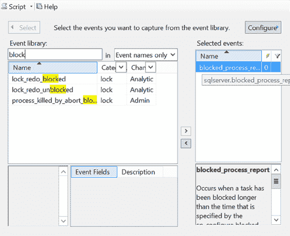
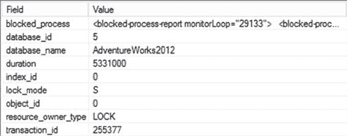
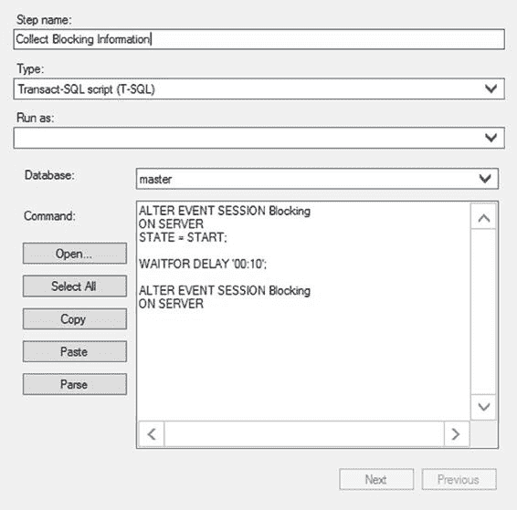
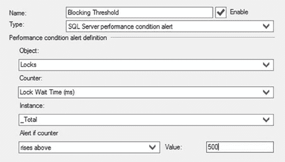
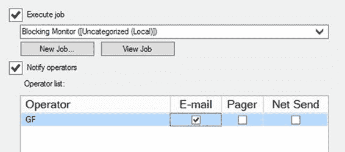

# 可序列化和快照隔离级别

正如你所看到的，`可序列化`隔离级别不仅像`可重复读`隔离级别那样持有共享锁直到事务结束，还通过持有范围锁来防止任何新行出现在数据集中。因为这种增加的阻塞会损害数据库并发性，所以应避免使用`可序列化`隔离级别。如果必须使用`可序列化`，那么请确保你已准备好优化性能的良好索引和查询，以最小化事务的规模和持续时间。

### 快照

自 SQL Server 2005 以来，快照隔离是 SQL Server 提供的第二种行版本控制隔离级别。与`已提交读快照`隔离不同，`快照`隔离需要在事务开始时显式调用 `SET TRANSACTION ISOLATION LEVEL`。它还需要在数据库上设置隔离级别。

`快照`隔离旨在成为比`已提交读快照`隔离更严格的隔离级别。`快照`隔离将尝试对其打算修改的数据放置排他锁。如果该数据上已存在锁，则快照事务将失败。它提供事务级别的读取一致性，这使得它比`已提交读快照`更适用于金融类型的系统。

## 索引对锁的影响

索引会影响表上的锁行为。在没有索引的表上，锁的粒度是 `RID`、`PAG`（包含 `RID` 的页面）和 `TAB`。向表添加索引会影响要锁定的资源。

例如，考虑以下没有索引的测试表：

```sql
IF (SELECT OBJECT_ID('dbo.Test1')) IS NOT NULL
    DROP TABLE dbo.Test1;
GO

CREATE TABLE dbo.Test1 (C1 INT, C2 DATETIME);
INSERT INTO dbo.Test1
VALUES (1, GETDATE());
```

接下来，观察该表上事务的锁行为（下载中的 `--indexlock`）。

```sql
BEGIN TRAN LockBehavior
    UPDATE dbo.Test1 WITH (REPEATABLEREAD) --Hold all acquired locks
    SET C2 = GETDATE()
    WHERE C1 = 1 ;

    --Observe lock behavior from another connection
    WAITFOR DELAY '00:00:10' ;
COMMIT
```

图 20-9 显示了适用于测试表的 `sys.dm_tran_locks` 的输出。

***图 20-9.** `sys.dm_tran_locks` 的输出，显示在没有索引的表上授予的锁*

该事务获取了以下锁：

*   表上的 (`IX`) 锁
*   包含数据行的页面上的 (`IX`) 锁
*   表中数据行上的 (`X`) 锁

当 `resource_type` 是对象时，`sys.dm_tran_locks` 中的 `resource_associated_entity_id` 列值表示放置锁的对象的 `objectid`。你可以从 `sys.object` 系统表中获取获取锁的具体对象名称，如下所示：

```sql
SELECT OBJECT_NAME(<object_id>);
```

索引对表锁行为的影响随 `WHERE` 子句列上的索引类型而异。这种差异源于非聚集索引和聚集索引的叶级页与表的数据页有不同的关系。让我们深入研究这些索引对表锁行为的影响。

### 非聚集索引的影响

因为非聚集索引的叶级页与表的数据页是分开的，所以与非聚集索引关联的资源也受到保护以防止损坏。SQL Server 会自动确保这一点。

要查看实际效果，请在测试表上创建一个非聚集索引。

```sql
CREATE NONCLUSTERED INDEX iTest ON dbo.Test1(C1);
```

再次运行 `LockBehavior` 事务并从另一个连接查询 `sys.dm_tran_locks`，你将得到如图 20-10 所示的结果。

***图 20-10.** `sys.dm_tran_locks` 的输出，显示非聚集索引对锁行为的影响*

该事务获取了以下锁：

*   包含非聚集索引行的页面上的 (`IU`) 锁
*   索引页中非聚集索引行上的 (`U`) 锁
*   表上的 (`IX`) 锁
*   包含数据行的页面上的 (`IX`) 锁
*   数据页中数据行上的 (`X`) 锁

请注意，只有行级锁和页级锁与非聚集索引直接关联。非聚集索引的下一个更高级别的锁粒度是对相应表的表级锁。

因此，非聚集索引会给表带来额外的锁开销。你可以通过在 `ALTER INDEX` 中使用 `ALLOW_ROW_LOCKS` 和 `ALLOW_PAGE_LOCKS` 选项来避免索引上的锁开销。不过，要明白这是一种权衡，可能会涉及性能损失，并且需要仔细测试以确保它不会对你的系统产生负面影响。

```sql
ALTER INDEX iTest ON dbo.Test1
SET (ALLOW_ROW_LOCKS = OFF ,ALLOW_PAGE_LOCKS= OFF);

BEGIN TRAN LockBehavior
    UPDATE dbo.Test1 WITH (REPEATABLEREAD) --Hold all acquired locks
    SET C2 = GETDATE()
    WHERE C1 = 1;

    --Observe lock behavior using sys.dm_tran_locks
    --from another connection
    WAITFOR DELAY '00:00:10';
COMMIT

ALTER INDEX iTest ON dbo.Test1
SET (ALLOW_ROW_LOCKS = ON ,ALLOW_PAGE_LOCKS= ON);
```

在使用索引时，你可以使用这些选项来启用/禁用索引上的 `KEY` 锁和 `PAG` 锁。仅禁用 `KEY` 锁会导致索引上的最低锁粒度变为 `PAG` 锁。对索引配置的锁粒度在重新配置之前一直有效。

**注意：** 像这样修改锁应该是尝试许多其他选项后的最后手段。这可能会导致显著的锁开销，从而严重影响系统性能。

图 20-11 显示了从另一个连接执行的 `sys.dm_tran_locks` 的输出。

***图 20-11.** `sys.dm_tran_locks` 的输出，显示 `sp_index` 选项对锁粒度的影响*

事务在测试表上获取的唯一锁是表上的 (`X`) 锁。

从新的锁行为可以看出，禁用 `KEY` 锁会将锁粒度升级到表级。这将阻塞对表或表上索引的每个并发访问；因此，它会严重损害数据库并发性。然而，如果非聚集索引在阻塞场景中成为一个争用点，那么禁用索引上的 `PAG` 锁，从而只允许索引上的 `KEY` 锁，可能是有益的。

**注意：** 使用此选项可能产生严重的副作用。仅应将其作为最后手段使用。

### 聚集索引的影响

因为对于聚集索引，索引的叶级页和表的数据页是相同的，所以可以使用聚集索引来避免非聚集索引引入的额外锁定页（叶级页）和行的开销。要理解与聚集索引相关的锁开销，请将前面的非聚集索引转换为聚集索引。

```sql
CREATE CLUSTERED INDEX iTest ON dbo.Test1(C1) WITH DROP_EXISTING;
```

如果你再次运行锁定脚本并在另一个连接中查询 `sys.dm_tran_locks`，你应该会看到 `LockBehavior` 事务在 `iTest` 上的结果输出，如图 20-12 所示。

***图 20-12.** `sys.dm_tran_locks` 的输出，显示聚集索引对锁行为的影响*

该事务获取了以下锁：

*   表上的 (`IX`) 锁
*   包含聚集索引行的页面上的 (`IX`) 锁


### 聚簇索引的锁定优势

• 对表或聚簇索引中的行施加 (`X`) 锁。

聚簇索引行上的锁以及叶级页上的锁实际上也是数据行和数据页上的锁，因为数据页和叶级页是相同的。因此，与非聚簇索引相比，聚簇索引减少了对表的锁定开销。

使用聚簇索引而非堆表所带来的降低锁定开销，是使用聚簇索引的另一个好处。

### 索引对可序列化隔离级别（Serializable Isolation Level）的影响

索引在决定可序列化隔离级别导致的阻塞量方面起着重要作用。

在 WHERE 子句列（导致数据集被锁定）上存在索引，使得 SQL Server 能够确定要锁定行的顺序。例如，考虑“可序列化隔离级别”部分中使用的例子。`SELECT` 语句使用 `GroupID` 列上的过滤器来形成其数据集，如下所示：

```sql
DECLARE @NumberOfEmployees INT;

SELECT @NumberOfEmployees = COUNT(*)
FROM dbo.MyEmployees WITH (HOLDLOCK)
WHERE GroupID = 10;
```

在 `GroupID` 列上存在聚簇索引，这允许 SQL Server 在要访问的行及其正确的顺序中的下一行上获取 (`RangeS-S`) 锁。

如果删除 `GroupID` 列上的索引，则 SQL Server 无法确定应在哪些行上获取范围锁，因为行的顺序不再得到保证。因此，`SELECT` 语句会在表级别获取 (`IS`) 锁，而不是在行级别获取粒度更低的锁，如图 20-13. 所示。

***图 20-13.** `sys.dm_tran_locks` 的输出，显示了在 WHERE 子句列上没有索引时授予 `SELECT` 语句的锁*

未能在过滤列上创建索引，会显著增加可序列化隔离级别导致的阻塞程度。这也是在 WHERE 子句列上创建索引的另一个充分理由。

## 捕获阻塞信息

尽管阻塞对于将事务与其他并发事务隔离是必要的，但有时它可能上升到过高的水平，对数据库并发性产生不利影响。在最简单的阻塞场景中，一个会话在资源上获取的锁会阻塞另一个请求在该资源上不兼容锁的会话。为了提高并发性，分析阻塞的原因并应用适当的解决方案非常重要。

[www.it-ebooks.info](http://www.it-ebooks.info/)

第 20 章 ■ 阻塞与被阻塞的进程

在阻塞场景中，你需要以下信息来清晰理解阻塞原因：

• *阻塞和被阻塞会话的连接信息：* 你可以从 `sys.dm_os_waiting_tasks` 动态管理视图或 `sp_who2` 系统存储过程获取此信息。

• *阻塞和被阻塞会话的锁信息：* 你可以从 `sys.dm_tran_locks` DMO 获取此信息。

• *阻塞和被阻塞会话最后执行的 SQL 语句：* 你可以结合使用 `sys.dm_exec_requests` DMV 与 `sys.dm_exec_sql_text` 和 `sys.dm_exec_queryplan` 或 Extended Events 来获取此信息。

你也可以通过运行 SQL Server Management Studio 中的活动监视器（Activity Monitor）来获取以下信息。“进程”页面提供了所有 SPID 的连接信息。这显示了被阻塞的 SPID、阻塞它们的进程以及任何阻塞链的头部，并详细说明了进程已运行多久、其 SPID 等信息。可以利用阻塞报告来启用 Extended Events，以收集大量相同的信息。对于立即检查锁的情况，请使用 DMO；对于扩展监视和历史跟踪，则需要使用 Extended Events。你可以在“Extended Events 与 blocked_process_report 事件”一节中找到更多相关信息。


为了在收集阻塞信息的过程中提供更强大的功能和灵活性，SQL Server 管理员可以使用 SQL 脚本来提供此处列出的相关信息。

### 使用 SQL 捕获阻塞信息

要获取关于被阻塞进程和阻塞进程的充分信息，你可以借助多个动态管理视图。此查询将基于那些正在等待的进程，显示识别被阻塞进程所必需的信息。你可以轻松添加筛选条件，例如仅访问那些被阻塞超过一定时间的进程，或仅限于某些数据库中的进程等。

```sql
SELECT dtl.request_session_id AS WaitingSessionID,
der.blocking_session_id AS BlockingSessionID,
dowt.resource_description,
der.wait_type,
dowt.wait_duration_ms,
DB_NAME(dtl.resource_database_id) AS DatabaseName,
dtl.resource_associated_entity_id AS WaitingAssociatedEntity,
dtl.resource_type AS WaitingResourceType,
dtl.request_type AS WaitingRequestType,
dest.[text] AS WaitingTSql,
dtlbl.request_type BlockingRequestType,
destbl.[text] AS BlockingTsql
FROM sys.dm_tran_locks AS dtl
JOIN sys.dm_os_waiting_tasks AS dowt
ON dtl.lock_owner_address = dowt.resource_address
JOIN sys.dm_exec_requests AS der
ON der.session_id = dtl.request_session_id
CROSS APPLY sys.dm_exec_sql_text(der.sql_handle) AS dest
LEFT JOIN sys.dm_exec_requests derbl
ON derbl.session_id = dowt.blocking_session_id
OUTER APPLY sys.dm_exec_sql_text(derbl.sql_handle) AS destbl
LEFT JOIN sys.dm_tran_locks AS dtlbl
ON derbl.session_id = dtlbl.request_session_id;
```

[www.it-ebooks.info](http://www.it-ebooks.info/)


## 第 20 章 ■ 阻塞与被阻塞进程

为了理解如何分析阻塞场景以及阻塞脚本提供的相关信息，请考虑以下示例。首先，创建一个测试表。

```sql
IF (SELECT OBJECT_ID('dbo.BlockTest')
) IS NOT NULL
DROP TABLE dbo.BlockTest;
GO

CREATE TABLE dbo.BlockTest
(C1 INT,
C2 INT,
C3 DATETIME
);

INSERT INTO dbo.BlockTest
VALUES (11, 12, GETDATE()),
(21, 22, GETDATE());
```

现在打开三个连接，并同时运行以下两个查询。运行它们之后，在第三个连接中使用阻塞脚本。在一个连接中执行以下代码：

```sql
BEGIN TRAN User1
UPDATE dbo.BlockTest
SET C3 = GETDATE();
```

接下来，在 `User1` 事务执行期间，执行此代码：

```sql
BEGIN TRAN User2
SELECT C2
FROM dbo.BlockTest
WHERE C1 = 11;
COMMIT
```

这就创建了一个简单的阻塞场景，其中 `User1` 事务阻塞了 `User2` 事务。

阻塞脚本的输出提供了立即对开始解决阻塞问题有用的信息。

首先，你可以识别具体的会话信息，包括阻塞会话和等待会话的 ID。你可以立即获得等待资源的资源描述、等待类型以及进程已等待的时间长度（以毫秒为单位）。正是这个值允许你提供筛选条件以消除短期阻塞，这是正常处理的一部分。

这里提供了数据库名称，因为阻塞可能发生在系统中的任何位置，而不仅限于 `AdventureWorks2012`。你需要确定它发生的位置。基本锁信息中的资源和类型是为等待进程检索的。

会显示阻塞请求类型，如果有的话，还会显示等待的 T-SQL 和阻塞的 T-SQL。一旦你获得了发生阻塞的对象，拥有 T-SQL 代码可以帮助你确切理解进程正在何处以及如何阻塞或被阻塞，这是消除或减少阻塞量的关键部分。所有这些信息都可以从一个简单的查询中获得。图 20-14 显示了前面被阻塞进程的示例输出。

**图 20-14.** 阻塞脚本的输出

请务必返回到连接 1 并提交或回滚该事务。

[www.it-ebooks.info](http://www.it-ebooks.info/)



## 第 20 章 ■ 阻塞与被阻塞进程


扩展事件与 `blocked_process_report` 事件

扩展事件提供了一个名为 `blocked_process_report` 的事件。该事件基于你提供给系统配置的**阻塞进程阈值**工作。以下脚本将阈值设置为五秒：

```sql
EXEC sp_configure 'show advanced option', '1';
RECONFIGURE;
EXEC sp_configure 'blocked process threshold', 5;
RECONFIGURE;
```

在大多数系统中，这通常是一个非常低的值。如果你已建立了成熟的性能服务级别协议（SLA），可以将其用作阈值。一旦设置了该值，你就可以配置警报，以便在任何进程被阻塞的时间超过你设定的值时发送电子邮件、推文或即时消息。它也充当了扩展事件的触发器。

要设置一个捕获 `blocked_process_report` 的会话，首先打开扩展事件会话属性窗口。（尽管在生产环境中应使用脚本来设置此事件，但我将展示如何使用图形界面。）为会话提供一个名称，然后导航到“事件”页面。在“事件库”文本框中输入 **block**，这将找到 `blocked_process_report` 事件。通过单击右箭头选择该事件。你应该会看到类似图 20-15 的内容。

**图 20-15.** 在扩展事件窗口中选择的阻塞进程报告事件

[www.it-ebooks.info](http://www.it-ebooks.info/)



第 20 章 ■ 阻塞与被阻塞进程

事件字段都已为你预选。如果你仍有来自上一节创建阻塞的查询在运行，你现在只需单击“运行”按钮即可捕获该事件。否则，返回清单 20-1 和 20-2，并在两个不同的连接中运行它们。在阻塞进程阈值通过后，你会看到事件触发……并持续触发。如果你配置如此且让清单 20-1 和 20-2 的连接保持运行，它将每五秒触发一次。实时数据流中的输出如图 20-16 所示。

**图 20-16.** `blocked_process_report` 事件的输出

部分信息是自解释的；要了解细节，你需要查看 `blocked_process` 字段中生成的 XML。

```xml
<blocked-process-report monitorLoop="29133">
 <blocked-process>
  <process id="process26911b848" taskpriority="0" logused="0" waitresource="RID: 5:1:24292:0"
  waittime="5331" ownerId="255377" transactionname="User2" lasttranstarted="2014-03-26T20:31:40.427"
  XDES="0x26b386d70" lockMode="S" schedulerid="1" kpid="2340" status="suspended" spid="55"
  sbid="0" ecid="0" priority="0" trancount="1" lastbatchstarted="2014-03-26T20:31:40.427"
  lastbatchcompleted="2014-03-26T20:31:40.423" lastattention="1900-01-01T00:00:00.423"
  clientapp="Microsoft SQL Server Management Studio - Query" hostname="WIN-TUTJRM1T45J" hostpid="2324"
  loginname="WIN-TUTJRM1T45J\Administrator" isolationlevel="read committed (2)" xactid="255377"
  currentdb="5" lockTimeout="4294967295" clientoption1="671098976" clientoption2="390200">
   <executionStack>
    <frame line="2" stmtstart="24" stmtend="118" sqlhandle="0x02000000ccf3e6045e680885750c3f36d7cc54
9d8ff013680000000000000000000000000000000000000000" />
    <frame line="2" stmtstart="36" stmtend="134" sqlhandle="0x0200000063e12d309fa7874804b7b56c7be7be
ecf2a0255b0000000000000000000000000000000000000000" />
   </executionStack>
   <inputbuf>
BEGIN TRAN User2
SELECT C2
FROM dbo.BlockTest
WHERE C1 = 11;
COMMIT </inputbuf>
  </process>
 </blocked-process>
 <blocking-process>
  <process status="sleeping" spid="52" sbid="0" ecid="0" priority="0" trancount="1"
  lastbatchstarted="2014-03-26T20:31:36.567" lastbatchcompleted="2014-03-26T20:31:36.567"
  lastattention="1900-01-01T00:00:00.567" clientapp="Microsoft SQL Server Management Studio -
Query" hostname="WIN-TUTJRM1T45J" hostpid="2324" loginname="WIN-TUTJRM1T45J\Administrator"
```

[www.it-ebooks.info](http://www.it-ebooks.info/)

第 20 章 ■ 阻塞与被阻塞进程


### 阻塞解决方案

一旦分析了阻塞的原因，下一步就是确定所有可能的解决方案。以下是一些你可以用于此目的的技术：

•  优化引起阻塞和被阻塞的 SPID 所执行的查询。
•  降低隔离级别。
•  对争用的数据进行分区。
•  在争用的数据上使用覆盖索引。

`注意`：本章后面的“减少阻塞的建议”一节将提供一个详细的避免阻塞的建议列表。

为了理解这些解决技术，让我们将它们依次应用于前面的阻塞场景。

#### 优化查询

优化引起阻塞和被阻塞进程所执行的查询有助于减少阻塞持续时间。在阻塞场景中，参与阻塞的进程所执行的查询如下：

•  引起阻塞的进程：
```sql
BEGIN TRAN User1
UPDATE dbo.BlockTest
SET C3 = GETDATE();
```

•  被阻塞的进程：
```sql
BEGIN TRAN User2
SELECT C2
FROM dbo.BlockTest
WHERE C1 = 11;
COMMIT
```

接下来，让我们分析引起阻塞和被阻塞的 SPID 所执行的各个 SQL 语句，以优化其性能。

•  引起阻塞的 SPID 的 `UPDATE` 语句在没有 `WHERE` 子句的情况下访问数据。这使得该查询在大表上本质上就是代价高昂的。如果可能，请使用适当的 `WHERE` 子句将 `UPDATE` 语句的操作分解为多个批次。记住要尝试使用基于集合的操作，例如 `TOP` 语句来限制行数。如果批处理中的各个 `UPDATE` 语句在单独的事务中执行，那么在一个事务内资源上持有的锁将更少，且持有时间更短。这也有助于减少或避免锁升级。

•  被阻塞的 SPID 执行的 `SELECT` 语句有一个针对 `C1` 列的 `WHERE` 子句。从测试表的索引结构可以看出，该列上没有索引。为了优化 `SELECT` 语句，你可以在 `C1` 列上创建一个聚集索引：
```sql
CREATE CLUSTERED INDEX i1 ON dbo.BlockTest(C1);
```

`注意`：由于示例表仅适合一个页，因此添加聚集索引对查询性能不会有太大影响。但是，随着表中行数的增加，索引的有益效果将变得更加明显。

优化查询减少了进程持有锁的时间。查询优化降低了阻塞的影响，但它并不能完全阻止阻塞。然而，只要优化后的查询在可接受的性能限制内执行，少量的阻塞或许可以忽略。

#### 降低隔离级别

另一种解决阻塞的方法是，如果可能，使用更低的隔离级别。`User2` 事务的 `SELECT` 语句在请求数据行的共享 (S) 锁时被阻塞。可以通过利用 `SNAPSHOT` 隔离级别（即 `Read Committed Snapshot`）来缓解此事务的隔离级别，这样 `SELECT` 语句就不会请求 (S) 锁。可以使用 `SET` 语句为连接配置 `Read Committed Snapshot` 隔离级别。
```sql
SET TRANSACTION ISOLATION LEVEL READ COMMITTED SNAPSHOT;
GO
BEGIN TRAN User2
SELECT C2
FROM dbo.BlockTest
WHERE C1 = 11;
COMMIT
GO
--恢复为默认值
SET TRANSACTION ISOLATION LEVEL READ COMMITTED;
GO
```

这个例子展示了降低隔离级别的实用性。使用这种 `SNAPSHOT` 隔离远比使用任何可能导致脏读（进而引发数据不正确、行缺失或额外行）的方法更受青睐。

#### 对争用的数据进行分区

当处理大型数据集或可以离散存储的数据时，可以考虑对数据应用表分区。分区数据是水平拆分的，即根据某些值进行拆分（例如，按月拆分销售数据）。这允许事务在各个分区上并发执行，而不会相互阻塞。这些独立的分区在查询、更新和插入时被视为一个单一单元；只有存储和访问由 SQL Server 分开处理。需要注意的是，分区仅在 SQL Server 的开发者版和企业版中可用。

在前面的阻塞场景中，可以按日期对数据进行分离。如果你关心性能，这将需要设置多个文件组（或者如果担心管理问题，可以将所有内容放在 `PRIMARY` 文件组上），并根据定义的规则拆分数据。一旦 `UPDATE` 语句有了 `WHERE` 子句，那么它与原始的 `SELECT` 语句就能在两个独立的分区上并发执行。这确实要求 `WHERE` 子句仅基于分区键列进行过滤。一旦你加入了其他条件，你就不太可能从分区消除中受益，这意味着性能可能会更差，而不是更好。

`注意`：如果操作得当，分区可以提高大型数据集上的性能和并发性。但是，分区主要是一种数据管理解决方案，而不是一种性能调优选项。

#### 在争用的数据上使用覆盖索引

在阻塞场景中，你应该分析引起阻塞或被阻塞进程的查询是否可以通过覆盖索引来完全满足。如果其中一个进程的查询可以通过覆盖索引来满足，那么它将阻止该进程在争用的资源上请求锁。此外，如果另一个进程不需要在覆盖索引上获取锁（以维护数据完整性），那么两个进程将能够并发执行而不会相互阻塞。

例如，在前面的阻塞场景中，被阻塞进程的 `SELECT` 语句可以通过在 `C1` 和 `C2` 列上的覆盖索引来完全满足。
```sql
CREATE NONCLUSTERED INDEX iAvoidBlocking ON dbo.BlockTest(C1, C2);
```
引起阻塞的进程的事务无需在覆盖索引上获取锁，因为它只访问表的 `C3` 列。覆盖索引将允许 `SELECT` 语句获取 `C1` 和 `C2` 列的值，而无需访问基表。因此，被阻塞进程的 `SELECT` 语句可以在覆盖索引行上获取共享 (S) 锁，而不会被引起阻塞进程在数据行上获取的排他 (X) 锁所阻塞。这允许两个事务并发执行，没有任何阻塞。

查看此 XML，元素就很清晰了。`<blocked-process>` 显示了有关被阻塞进程的信息，包括熟悉的信息，例如会话 ID（此处标记为老式的 `SPID`）、数据库 ID 等。你可以在 `<inputbuf>` 元素中看到查询。诸如 `lockMode` 之类的详细信息可在 `<process>` 元素中找到。请注意，该 XML 不包括你可以轻松从 T-SQL 查询中获取的一些其他信息，例如被阻塞和正在等待的进程的查询字符串。但有了可用的 `SPID`，如果缓存中有的话，你可以从中获取它们，或者你可以将阻塞进程报告与其他事件（如 `rpc_starting`）结合以显示查询信息。然而，这样做会增加在数据库中长期使用这些事件的开销。如果你知道存在阻塞问题，这可以作为短期监控项目的一部分来捕获必要的阻塞信息。

```xml
isolationlevel="read committed (2)" xactid="255368" currentdb="5" lockTimeout="4294967295"
clientoption1="671098976" clientoption2="390200">
    <executionStack />
    <inputbuf>
SET STATISTICS IO OFF SET STATISTICS TIME OFF </inputbuf>
    </process>
</blocking-process>
</blocked-process-report>
```


## 考虑将覆盖索引作为一种“复制”部分表数据的机制，这种复制由 SQL Server 自动维护其一致性。如果该覆盖索引主要是只读的，它可以允许某些事务从“复制”数据中得到服务，而基础表（及其他索引）则可以继续服务其他事务。

这种方法的权衡之处在于需要额外的存储空间，以及在数据修改期间可能产生额外的开销。

## 减少阻塞的建议

单用户性能和多用户扩展能力对于数据库应用都至关重要。

在多用户环境中，确保数据库操作不会长时间持有数据库资源非常重要。这使得数据库能够支持大量操作（或数据库用户）并发执行，而不会出现严重的性能下降。以下是一些减少/避免数据库阻塞的技巧列表：

*   保持事务简短。
*   在事务内执行最少量的步骤/逻辑。
*   不要在事务内执行开销大的外部活动，例如发送确认邮件或执行由最终用户驱动的活动。
*   优化查询。
*   根据需要创建索引，以确保系统中查询的最佳性能。
*   避免在频繁更新的列上创建聚集索引。更新聚集索引键列需要在聚集索引和所有非聚集索引上加锁（因为它们的行定位器包含聚集索引键）。
*   考虑使用覆盖索引来服务被阻塞的 SELECT 语句。
*   考虑对存在争用的表进行分区。
*   使用查询超时或资源调控器来控制失控的查询。有关资源调控器的更多信息，请查阅在线手册：[`bit.ly/1jiPhfS.`](http://bit.ly/1jiPhfS)
*   避免因错误处理例程或应用程序逻辑不佳而失去对事务范围的控制。
*   使用 `SET XACTABORT ON` 来避免在事务内出现错误条件时，事务保持打开状态。
*   在执行包含事务的 SQL 批处理或存储过程后，从客户端错误处理程序 (`TRY/CATCH`) 执行以下 SQL 语句。

    ```
    IF @@TRANCOUNT > 0 ROLLBACK
    ```
*   使用所需的最低隔离级别。
*   考虑使用行版本控制（SNAPSHOT 隔离级别之一）来帮助减少争用。

[www.it-ebooks.info](http://www.it-ebooks.info/)

## 自动化检测和收集阻塞信息

除了使用扩展事件捕获信息外，您还可以使用 SQL Server Agent 自动化检测阻塞条件并收集相关信息的过程。SQL Server 提供了如表 20-1 所示的性能监视器计数器来跟踪等待时间。

**表 20-1.** 性能监视器计数器

| 对象 | 计数器 | 实例 | 描述 |
| :--- | :--- | :--- | :--- |
| `SQLServer:Locks` (对于 SQL Server 命名实例 `MSSQL$<实例名>:Locks`) | `Average Wait Time(ms)` | `_Total` | 导致等待的每个锁的平均等待时间 |
| | `Lock Wait Time (ms)` | `_Total` | 过去一秒内锁的总等待时间 |

您可以创建 SQL Server 警报和作业的组合来自动化以下过程：

1.  使用 `Average Wait Time (ms)` 计数器确定平均等待时间何时超过可接受的阻塞量。根据您的偏好，也可以使用 `Lock Wait Time (ms)` 计数器。
2.  一旦确定了最小等待时间，就设置 `Blocked Process Threshold`（阻塞进程阈值）。当平均等待时间超过限制时，通过电子邮件通知 SQL Server DBA 阻塞情况。
3.  在一段时间内，自动使用阻塞脚本或依赖于阻塞进程报告的跟踪来收集阻塞信息。

要设置自动运行阻塞进程报告，首先创建名为“Blocking Analysis”的 SQL Server 作业，以便稍后由您将创建的 SQL Server 警报使用。您可以通过以下步骤从 SQL Server Management Studio 创建此 SQL Server 作业来收集阻塞信息：

1.  使用 `blocked_process_report` 事件生成一个扩展事件脚本（如第 6 章详述）。
2.  运行该脚本在服务器上创建会话，但先不要启动它。
3.  在 Management Studio 中，通过选择 *<服务器名>* ➤ SQL Server Agent ➤ Jobs 来展开服务器。最后，右键单击并选择新建作业（New Job）。
4.  在“新建作业”对话框的“常规”页上，输入作业名称和其他详细信息。
5.  在“步骤”页上，单击“新建”，然后输入通过 T-SQL 启动和停止会话的命令，如图 20-17 所示。

    [www.it-ebooks.info](http://www.it-ebooks.info/)

    

    **图 20-17.** 输入运行阻塞脚本的命令

    您可以使用以下命令执行此操作：

    ```sql
    ALTER EVENT SESSION Blocking
    ON SERVER
    STATE = START;

    WAITFOR DELAY '00:10';

    ALTER EVENT SESSION Blocking
    ON SERVER
    STATE = STOP;
    ```

    会话的输出取决于您在创建时如何定义目标。
6.  单击“确定”返回“新建作业”对话框。
7.  单击“确定”创建 SQL Server 作业。SQL Server 作业将被创建为启用且可运行状态，使用跟踪脚本收集十分钟的阻塞信息。

    [www.it-ebooks.info](http://www.it-ebooks.info/)

    

您可以创建 SQL Server 警报来自动化以下任务：

*   通过电子邮件、短信或寻呼机通知 DBA。
*   执行“Blocking Analysis”作业以收集十分钟的阻塞信息。

您可以通过以下步骤从 SQL Server 企业管理器创建 SQL Server 警报：

1.  在 Management Studio 中，仍然在对象资源管理器的 SQL Agent 区域中，右键单击“警报”（Alerts）并选择“新建警报”（New Alert）。
2.  在新警报属性对话框的“常规”页上，输入警报名称和其他详细信息，如图 20-18 所示。您需要从中捕获信息的特定对象是 `Locks`（图 20-18 中的 `MSSQL$GF2008:Locks`）。我选择了 500ms 作为严格 SLA 的示例，希望在查询超过该值时得到通知。

    

    **图 20-18.** 输入警报名称和其他详细信息
3.  在“响应”页上，定义您认为合适的响应，例如通知操作员。
4.  单击“确定”返回新警报的属性对话框。
5.  在“响应”页上，输入图 20-19 中所示的剩余信息。

    [www.it-ebooks.info](http://www.it-ebooks.info/)

    

    **图 20-19.** 输入警报触发时要执行的操作
6.  选择“Blocking Analysis”作业以自动收集阻塞信息。
7.  完成所有信息输入后，单击“确定”创建 SQL Server 警报。

    SQL Server 警报将被创建为启用状态，以执行预期任务。
8.  确保 SQL Server Agent 正在运行。

SQL Server 警报和作业一起，将自动化阻塞检测和信息收集过程。这种自动收集阻塞信息的方式将确保当系统进入大规模阻塞状态时，能够获得足够多的阻塞信息。

## 总结

尽管阻塞是不可避免的，并且实际上是维持事务间隔离所必需的，但它有时会对数据库并发性产生不利影响。在多用户数据库应用程序中，您必须尽量减少并发事务之间的阻塞。


