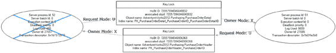
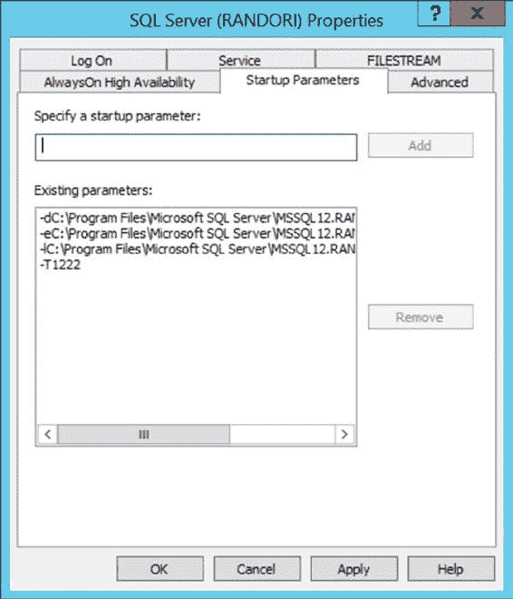
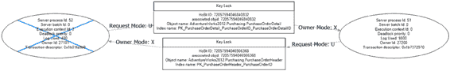

# 第 21 章：死锁的原因与解决方案

SQL Server 提供了不同的技术来避免或减少阻塞，数据库应用程序应该利用这些技术，随着数据库用户数量的增加而线性扩展。当应用程序面临高度阻塞时，可以使用各种工具收集相关的阻塞信息，以了解阻塞的根本原因。下一步就是使用适当的技术来避免或减少阻塞。

阻塞不仅会损害并发性，还会在进程之间甚至进程内部发生相互阻塞的情况下，导致数据库请求突然终止。我们将在下一章中介绍这一事件，称为*死锁*。

[www.it-ebooks.info](http://www.it-ebooks.info/)

在上一章中，我讨论了阻塞的工作原理。阻塞是性能不佳的主要原因。

它可能导致一种特殊情况，称为*死锁*，这反过来意味着死锁从根本上说是一个性能问题。当两个或多个事务之间发生死锁时，SQL Server 允许一个事务完成，并终止另一个事务，回滚该事务。然后，SQL Server 向相应的应用程序返回错误，通知用户其事务已被选为死锁牺牲品。这使得应用程序只有两个选择：重新提交事务或向最终用户道歉。为了成功完成事务并避免道歉，了解可能导致死锁的原因以及处理死锁的方法非常重要。

在本章中，我将涵盖以下主题：

*   死锁基础
*   捕获死锁的错误处理
*   分析死锁原因的方法
*   解决死锁的技术

## 死锁基础

*死锁*是一种特殊的阻塞场景，其中两个进程被彼此阻塞。每个进程在持有自己的资源时，都试图访问被另一个进程锁定的资源。这将导致一种称为*致命拥抱*的阻塞场景，如图 21-1 所示。

[www.it-ebooks.info](http://www.it-ebooks.info/)

第 21 章 ■ 死锁的原因与解决方案

等待于

资源 1

SPID1

SPID2

持有的锁：

持有的锁：

-资源 1

-资源 2

请求的锁

请求的锁

-资源 2

-资源 1

等待于

资源 2

***图 21-1.** 死锁场景*

当两个进程尝试在同一资源上升级其锁定机制时，死锁也经常发生。在这种情况下，两个进程中的每一个都对某个资源（如 RID）持有共享锁，并且每个进程都试图将锁从共享锁提升为独占锁；然而，除非另一个进程释放其共享锁，否则两者都无法做到。这同样会导致其中一个进程被选为死锁牺牲品。

最后，在并行操作期间，单个进程也可能发生死锁。在并行操作期间，一个线程可能持有对一个资源 A 的锁，同时等待另一个资源 B；与此同时，另一个线程可能持有对 B 的锁，同时等待 A。这与涉及多个进程的死锁情况一样，但涉及的是同一个进程中的多个线程。这是一个罕见的事件，但它是可能的。

死锁是一种特别麻烦的阻塞类型，因为即使给予无限时间，死锁也无法自行解决。死锁需要一个外部进程来打破循环阻塞。

SQL Server 有一个死锁检测例程，称为*锁监视器*，它会定期检查 SQL Server 中是否存在死锁。一旦检测到死锁条件，SQL Server 会选择参与死锁的会话之一作为*牺牲品*，以打破循环阻塞。牺牲品通常是估计成本最低的进程，因为这意味着该进程对于 SQL Server 来说最容易回滚。此操作涉及撤回牺牲品会话持有的所有资源。SQL Server 通过回滚被选为牺牲品的会话的未提交事务来实现这一点。

### 选择死锁牺牲品

SQL Server 通过评估参与会话的事务回滚成本来确定哪个会话作为死锁牺牲品，并选择估计成本最低的会话。你可以通过将其连接的死锁优先级设置为 `LOW` 来对被选为牺牲品的会话施加一些控制。

```sql
SET DEADLOCK_PRIORITY LOW;
```

这会引导 SQL Server 在发生死锁时选择此特定会话作为牺牲品。你可以通过执行以下 `SET` 语句将连接的死锁优先级重置为其正常值：`SET DEADLOCK_PRIORITY NORMAL;`

[www.it-ebooks.info](http://www.it-ebooks.info/)

第 21 章 ■ 死锁的原因与解决方案

`SET` 语句也允许将会话标记为高 (`HIGH`) 死锁优先级。这不会阻止给定会话上发生死锁，但会降低给定会话被选为牺牲品的可能性。你甚至可以将优先级级别设置为数字值，从 `-10` 表示最低优先级，到 `10` 表示最高优先级。

■ **注意** 设置死锁优先级不应随意应用。你可能会意外地在报告上设置优先级，导致关键任务进程被选为牺牲品。必须对此设置进行仔细测试。

在平局的情况下，其中一个进程会被选为牺牲品并回滚，就像它的成本最低一样。有些进程对成为死锁牺牲品是免疫的。这些进程被标记为这样，永远不会被选为死锁牺牲品。我见过的最常见的例子是当进程已经处于回滚过程时。

### 使用错误处理捕获死锁

当 SQL Server 选择一个会话作为牺牲品时，它会引发一个带有错误号的错误。你可以在 T-SQL 中使用 `TRY/CATCH` 结构来处理该错误。SQL Server 通过自动回滚牺牲品会话的事务来确保数据库的一致性。回滚确保会话返回到其事务开始之前的状态。在错误处理程序中确定死锁情况后，可以在将错误返回给应用程序之前，在 T-SQL 中尝试多次重启事务。

以下 T-SQL 语句是处理死锁错误的一种方法的示例：

```sql
DECLARE @retry AS TINYINT = 1,
        @retrymax AS TINYINT = 2,
        @retrycount AS TINYINT = 0;

WHILE @retry = 1
    AND @retrycount <= @retrymax
BEGIN
    SET @retry = 0;

    BEGIN TRY
        UPDATE HumanResources.Employee
        SET LoginID = '54321'
        WHERE BusinessEntityID = 100;
    END TRY

    BEGIN CATCH
        IF (ERROR_NUMBER() = 1205)
        BEGIN
            SET @retrycount = @retrycount + 1;
            SET @retry = 1;
        END
    END CATCH
END
```

`TRY/CATCH` 方法允许你捕获错误。然后你可以使用 `ERROR_NUMBER()` 函数检查错误号，以确定是否发生了死锁。一旦确定是死锁，就可以尝试在设定的次数内（本例中为两次）重新启动事务。使用错误捕获将帮助你的应用程序处理间歇性或偶尔发生的死锁，但最好的方法是分析死锁的原因，并在可能的情况下解决它。

[www.it-ebooks.info](http://www.it-ebooks.info/)

第 21 章 ■ 死锁的原因与解决方案

## 死锁分析


有时，你可以通过分析成因来防止死锁发生。为此，你需要以下信息：

*   参与死锁的会话
*   死锁涉及的资源
*   会话执行的查询

### 收集死锁信息

你可以通过四种方式收集死锁信息。

*   使用扩展事件
*   设置跟踪标志 `1222`
*   设置跟踪标志 `1204`
*   使用跟踪事件

跟踪标志用于自定义某些 `SQL Server` 行为，例如在此情况下生成死锁信息。但是，它们是一种较旧的捕获此信息的方法。在 `SQL Server` 中，自 2008 年起的每个实例上，都有一个名为 `system_health` 的 `Extended Events` 会话。此会话自动运行，其默认收集的事件之一就是死锁图。这是无需以任何方式修改服务器即可立即获取死锁信息的最简单方法。

然而，`system_health` 仅适用于快速检查。并且由于它使用 `ring_buffer` 来捕获数据，除非在发生死锁后立即查看，否则你可能会发现信息已丢失。如果你需要收集更长时间段的信息并确保捕获尽可能多的事件，`Extended Events` 提供了多种收集死锁信息的方法。这可能是你可以应用于服务器以收集死锁信息的最佳方法。你可以使用这些选项：

*   `Lock_deadlock`：显示有关死锁事件的基本信息
*   `Lock_deadlock_chain`：捕获死锁中每个参与者的信息
*   `Xml_deadlock_report`：显示包含死锁原因的 XML 死锁图

死锁图生成 XML 输出。在 `Extended Events` 捕获死锁事件后，你可以通过 `SSMS` 中的事件查看器，或者如果你已将事件结果输出到文件，则通过打开 XML 文件来查看死锁图。虽然这三个事件显示的信息类似，但对于基本的死锁信息，最容易理解的是 `xml_deadlock_report`。在监控死锁时，我建议同时捕获 `lock_deadlock_chain`，以便在需要时拥有有关死锁中涉及的各个会话的更详细信息。

你可以在 Management Studio 中打开死锁图。你可以搜索 XML，但从 XML 生成的死锁图几乎可以像死锁的执行计划一样工作，如图 21-2. 所示。

[www.it-ebooks.info](http://www.it-ebooks.info/)



第 21 章 ■ 死锁的原因与解决方案

**图 21-2.** 在 Profiler 中显示的死锁图

我将在本章后面的“分析死锁”一节中向你展示如何使用此图。

生成死锁信息的两个跟踪标志可以单独使用或一起使用，以生成不同的信息集。通常人们更喜欢运行其中一个，因为它们会将大量信息写入 `SQL Server` 的错误日志。跟踪标志将收集到的信息写入发生死锁事件的服务器上的日志文件。跟踪标志 `1222` 提供有关死锁的最详细信息。

跟踪标志 `1204` 提供详细的死锁信息，可帮助你分析死锁的原因。它按死锁中涉及的每个节点对信息进行排序。跟踪标志 `1222` 也提供详细的死锁信息，但其信息分解方式不同。跟踪标志 `1222` 按资源和进程对信息进行排序，并提供更多信息。两组数据都将在“分析死锁”一节中讨论。

`DBCC TRACEON` 语句用于打开（或启用）跟踪标志。跟踪标志将保持启用状态，直到使用 `DBCC TRACEOFF` 语句将其禁用。如果服务器重新启动，此跟踪标志将被清除。你可以使用 `DBCC TRACESTATUS` 语句确定跟踪标志的状态。设置两个死锁跟踪标志如下所示：

```
DBCC TRACEON (1222, -1);
DBCC TRACEON (1204, -1);
```

为确保跟踪标志始终设置，你可以按照以下步骤在 `SQL Server Configuration Manager` 中将其设置为 `SQL Server` 启动参数的一部分：

1.  打开 `SQL Server` 实例的属性对话框。
2.  切换到属性对话框的“启动参数”选项卡，如图 21-3. 所示。

[www.it-ebooks.info](http://www.it-ebooks.info/)



第 21 章 ■ 死锁的原因与解决方案

**图 21-3.** SQL Server 实例的属性对话框，显示“启动参数”选项卡
3.  在“指定启动参数”文本框中键入 `-T1222`，然后单击“添加”以添加跟踪标志 `1222`。
4.  单击“确定”按钮关闭所有对话框。

这些跟踪标志设置将在你重新启动 `SQL Server` 实例后生效。

### 分析死锁

为了分析死锁的原因，让我们考虑一个简单的示例。首先，请确保你已经启用了死锁跟踪标志 `1222` 并创建了一个使用 `xml_deadlock_report` 事件的 `Extended Events` 会话。我同时使用这两种方法进行演示。通常你只需要一种方法来捕获死锁信息。

在一个连接中，执行此脚本：

```
BEGIN TRAN
UPDATE Purchasing.PurchaseOrderHeader
SET Freight = Freight * 0.9 -- 运费打九折
WHERE PurchaseOrderID = 1255;
```

[www.it-ebooks.info](http://www.it-ebooks.info/)



第 21 章 ■ 死锁的原因与解决方案

在第二个连接中，执行此脚本：

```
BEGIN TRANSACTION
UPDATE Purchasing.PurchaseOrderDetail
SET OrderQty = 4
WHERE ProductID = 448
AND PurchaseOrderID = 1255;
```

这两个脚本都打开一个事务并操作数据，但都没有提交或回滚事务。切换回第一个事务并运行这个附加查询：

```
UPDATE Purchasing.PurchaseOrderDetail
SET OrderQty = 2
WHERE ProductID = 448
AND PurchaseOrderID = 1255;
```

不幸的是，可能几秒钟后，第一个连接就遇到了死锁。

```
错误 1205，级别 13，状态 51，第 1 行
进程 ID 为 52 的事务在锁资源上与另一个进程发生死锁，并被选作死锁牺牲品。请重新运行该事务。
```

知道问题出在哪里吗？

让我们首先通过检查通过跟踪事件收集的死锁图来分析死锁。事件资源管理器窗口中有一个单独的选项卡用于 `xml_deadlock_report` 事件。打开该选项卡将显示死锁图（见图 21-4）。

**图 21-4.** 在 Profiler 工具中显示的死锁图

从图 21-4 所示的死锁图可以清楚地看到，涉及两个进程：会话 `51` 和会话 `52`。会话 `52`（屏幕上带有一个大 *X* 将其划掉的，在死锁图上显示为蓝色）被选为死锁牺牲品。涉及两个不同的键。顶部的键由会话 `51` 拥有，如指向会话对象的箭头所示，名为所有者模式，并标记为 `X`（排他锁）。会话 `52` 正在尝试请求相同的键进行更新。另一个键由会话 `54` 拥有，会话 `51` 请求更新，由 `U`（更新锁）表示。你可以看到死锁所涉及对象的确切 `HoBt ID`、`object ID`、`object name` 和 `index name`。对于像这样一个经典的、简单的死锁，你已经拥有了所需的大部分信息。

最后一部分是每个进程运行的查询。这些需要使用不同的扩展事件来捕获。


