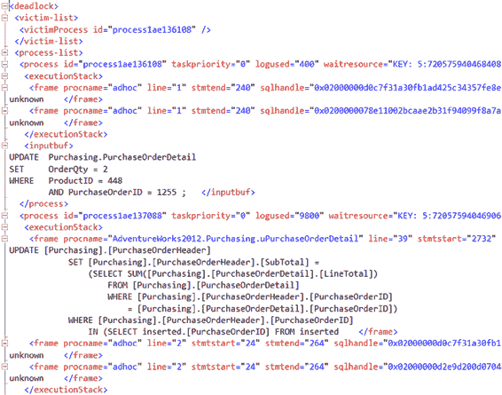

# 第 21 章 ■ 死锁的原因与解决方案

这种死锁的可视化表示可以起到作用。然而，你可能需要深入研究底层的 XML，才能真正理解死锁发生的确切位置、哪些进程导致了死锁以及涉及了哪些对象。如果你直接从扩展事件值中打开那个 XML 文件，你会发现比图形化死锁图中为你显示的简单集合多得多的信息。请参阅图 21-5。

[www.it-ebooks.info](http://www.it-ebooks.info/)



## 图 21-5. 定义死锁图的 XML 信息

如果你仔细查看这个文件，你可以看到死锁图上显示的一些信息，但你还会看到更多的信息。例如，这部分死锁实际上涉及了一些并非我作为示例编写的代码。在名为`uPurchaseOrderDetail`的表上有一个触发器。你还可以看到我用来生成死锁的代码。所有这些信息都可以帮助你准确识别哪些代码片段导致了死锁。你还会获得诸如`sqlhandle`之类的信息，然后你可以结合 DMO（分布式管理对象）从缓存中提取语句和执行计划。因为计划是在查询运行之前创建的，所以即使对于那些被选为死锁牺牲品的查询，它也是可用的。

花些时间更详细地研究这个 XML 是值得的。表 21-1 展示了来自扩展事件的一些元素及其代表的信息。

[www.it-ebooks.info](http://www.it-ebooks.info/)

## 表 21-1. XML 死锁图数据

| 日志中的条目 | 描述 |
| :--- | :--- |
| `<deadlock>` | 死锁信息的开始。它开始列出牺牲品进程。 |
| `<victim-list>` | |
| `<victimProcess id="processf4ced868" />` | 被选为死锁牺牲品的进程的物理内存地址。 |
| `<process-list>` | 定义死锁牺牲品的进程。可能不止一个。 |
| `<process id="processf4ced868" taskpriority="0" logused="400" waitresource="KEY: 9:72057594046775296 (4ab5f0d47ad5)" waittime="1718" ownerId="20008" transactionname="user_transaction" lasttranstarted="2012-01-18T17:41:50.553" XDES="0xfd04d078" lockMode="U" schedulerid="2" kpid="4404" status="suspended" spid="52" sbid="0" ecid="0" priority="0" trancount="2" lastbatchstarted="2012-01-18T17:42:12.090" lastbatchcompleted="2012-01-18T17:42:12.087" lastattention="1900-01-01T00:00:00.087" clientapp="Microsoft SQL Server Management Studio - Query" hostname="DOJO" hostpid="2376" loginname="NEVERNEVER\grant" `isolationlevel="read committed (2)"` xactid="20008" currentdb="9" lockTimeout="4294967295" clientoption1="671096864" clientoption2="128056">` | 关于被选为死锁牺牲品的会话的所有信息。请注意高亮显示的隔离级别，这是帮助识别死锁根本原因的关键。 |
| `<executionStack>` | 正在被执行的 T-SQL。 |
| `<frame procname="adhoc" line="1" stmtstart="44" `sqlhandle`="0x02000000e3586a2a82447915dba3de497a09b2eed9643a840000000000000000000000000000">` | 正在被执行的查询类型，在本例中是即席查询。注意`sqlhandle`。你可以将其与`sys.dm_exec_query_plan`一起使用来查看执行计划。其后是 T-SQL 语句。 |
| `update Purchasing . PurchaseOrderDetail set OrderQty = @0 where ProductID = @1 and PurchaseOrderID = @2` | |
| `</frame>` | |
| `<frame procname="adhoc" line="1" `sqlhandle`="0x020000001bdbe9296e67741f7b4604aee8b9093427da296a0000000000000000000000000000">` | 批处理中的下一条语句。 |
| `UPDATE Purchasing.PurchaseOrderDetail SET OrderQty = 4 WHERE ProductID = 448 AND PurchaseOrderID = 1255 ;` | |
| `</frame>` | |
| `UPDATE Purchasing.PurchaseOrderDetail SET OrderQty = 4 WHERE ProductID = 448 AND PurchaseOrderID = 1255 ;` | 带具体值的查询。 |

( *续* )

[www.it-ebooks.info](http://www.it-ebooks.info/)


## 第 21 章 ■ 死锁的原因和解决方案

### 表 21-1. （续）

**日志中的条目**

**描述**

`<inputbuf>`
当前批处理的语句。这是 `UPDATE Purchasing.PurchaseOrderDetail` 语句，后跟显示该语句先前定义所用精确值的查询。
```
SET OrderQty = 4
WHERE ProductID = 448
AND PurchaseOrderID = 1255 ;
```
它们通过简单参数化被替换为参数。
`</inputbuf>`

`<process id="processf4ecf498" taskpriority="0" logused="10896" waitresource="KEY: 9:72057594046840832 (4bc08edebc6b)" waittime="7851" ownerId="21222" transactionname="user_transaction" lasttranstarted="2012-01-18T17:42:05.957" XDES="0xf682cd28" lockMode="U" schedulerid="2" kpid="4944" status="suspended" spid="55" sbid="0" ecid="0" priority="0" trancount="2" lastbatchstarted="2012-01-18T17:42:05.957" lastbatchcompleted="2012-01-18T17:42:05.957" lastattention="1900-01-01T00:00:00.957" clientapp="Microsoft SQL Server Management Studio - Query" hostname="DOJO" hostpid="2376" loginname="NEVERNEVER\grant" isolationlevel="read committed (2)" xactid="21222" currentdb="9" lockTimeout="4294967295" clientoption1="673327200" clientoption2="390200">`
死锁中的下一个进程。在这种情况下，这是成功的那个进程。有时你会在图中看到不同的顺序。
`<executionStack>`
注意 `procname` 的值，`AdventureWorks2008R2.Purchasing.uPurchaseOrderDetail`。这是一个被触发并正在运行以下代码的触发器。
`<frame procname="AdventureWorks2008R2.Purchasing.uPurchaseOrderDetail" line="39" stmtstart="2732" stmtend="3864" sqlhandle="0x0300090076146e6c16a11f01c69d000000000000000000 000000000000000000000000000000000000000000">`
```
UPDATE [Purchasing].[PurchaseOrderHeader]
SET [Purchasing].[PurchaseOrderHeader].[SubTotal] =
    (SELECT SUM([Purchasing].[PurchaseOrderDetail].[LineTotal])
     FROM [Purchasing].[PurchaseOrderDetail]
     WHERE [Purchasing].[PurchaseOrderHeader].[PurchaseOrderID]
         = [Purchasing].[PurchaseOrderDetail].[PurchaseOrderID])
WHERE [Purchasing].[PurchaseOrderHeader].[PurchaseOrderID]
    IN (SELECT inserted.[PurchaseOrderID] FROM inserted);
```
`</frame>`

(续)

### 表 21-1. （续）

**日志中的条目**

**描述**

`<frame procname="adhoc" line="2" stmtstart="44" sqlhandle="0x02000000e3586a2a82447915dba3de497a09b2eed9643a8 4000000000000000000000000000000000000000">`
清单中定义的即席代码正在运行。你可以再次看到自动参数化在它上面起作用。
```
update Purchasing . PurchaseOrderDetail set OrderQty = @0 where ProductID = @1 and PurchaseOrderID = @2
```
`</frame>`

`<frame procname="adhoc" line="2" stmtstart="38" sqlhandle="0x02000000178f4e2824eef68b5abf0096b085df45a8cbe9d9000000000 000000000000000000000000000000">`
T-SQL 的定义。
```
UPDATE Purchasing.PurchaseOrderDetail
SET OrderQty = 2
WHERE ProductID = 448
AND PurchaseOrderID = 1255 ;
```
`</frame>`

`<inputbuf>`
包含实际值的 T-SQL。这将是触发触发器的原因。
```
BEGIN TRANSACTION
UPDATE Purchasing.PurchaseOrderDetail
SET OrderQty = 2
WHERE ProductID = 448
AND PurchaseOrderID = 1255 ;
```
`</inputbuf>`
`</process-list>`

`<resource-list>`
引起冲突的对象。其中包含了来自 `Purchasing.PurchaseOrderDetail` 表的主键定义。你可以看到之前的代码中哪个进程拥有哪个资源。你还可以看到定义等待进程的信息。这是你辨别问题所在所需的一切。
`<keylock hobtid="72057594046775296" dbid="9" objectname="AdventureWorks2008R2.Purchasing.PurchaseOrderDetail" indexname="1" id="lockf98b8c00" mode="X" associatedObjectId="72057594046775296">`
`<owner-list>`
`<owner id="processf4ecf498" mode="X" />`
`</owner-list>`
`<waiter-list>`
`<waiter id="processf4ced868" mode="U" requestType="wait" />`
`</waiter-list>`
`</keylock>`

(续)

### 表 21-1. （续）

**日志中的条目**

**描述**


**<keylock hobtid="72057594046840832" dbid="9" objectname="AdventureWorks2008R2.Purchasing.PurchaseOrderHeader" indexname="1" id="lockf98b8800" mode="X" associatedObjectId="72057594046840832">** <owner-list> <owner id="processf4ced868" mode="X" /> </owner-list> <waiter-list> <waiter id="processf4ecf498" mode="U" requestType="wait" /> </waiter-list> </keylock> </resource-list> </deadlock>

这些信息比图形化死锁图提供的那套干净数据更难读一些。不过，它们包含的信息类似，只是更为详细。你可以看到，在底部附近加粗高亮的部分，是与死锁相关的其中一个键的定义。你还可以看到，在它之前一点，执行计划的文本可以通过扩展事件 XML 输出获得，这一点与死锁图不同。在这种情况下，你更有可能获得隔离死锁原因所需的一切信息。

由跟踪标志 `1222` 收集的信息在各个方面几乎与 XML 数据完全相同。主要区别在于格式和位置。`1222` 的输出位于 SQL Server 错误日志中，并且是文本格式，而不是整洁的 XML。由跟踪标志 `1204` 收集的信息则与另外两套数据完全不同，并且提供的细节远没有那么丰富。跟踪标志 `1204` 也更难解读。基于所有这些原因，我建议你尽可能坚持使用扩展事件——如果不行，则使用跟踪标志 `1222` ——来捕获死锁数据。你还有 `system_health` 会话，它默认捕获许多事件，包括死锁。如果你没有准备好捕获这些信息，它是一个很好的资源。只需记住，它只在线保留四个 5MB 的文件。当这些文件填满时，最旧文件中的数据就会丢失。根据系统中的事务数量以及可能填满这些文件的死锁或其他事件的数量，你可能只有近期数据可用。此外，如前所述，由于 `system_health` 会话使用环形缓冲区来捕获事件，你可能会预期大量的事件丢失，因此你的死锁事件可能会丢失。

此示例演示了一个经典的循环引用。虽然不明显，但死锁是由 `Purchasing.PurchaseOrderDetail` 表上的触发器引起的。当 `Purchasing.PurchaseOrderDetail` 表上的 `Quantity` 被更新时，它会尝试更新 `Purchasing.PurchaseOrderHeader` 表。

当前两个查询分别在开放的事务中运行时，这只是一个阻塞情况。第二个查询正在等待第一个查询完成，以便它也能更新 `Purchasing.PurchaseOrderHeader` 表。但是，当第三个查询（即第一个事务中的第二个查询）被引入时，就产生了循环引用。解决它的唯一方法是终止其中一个进程。

在继续之前，请确保回滚任何未完成的事务。

在这个阶段，显而易见的问题是：你能避免这个死锁吗？如果答案是“能”，那么该怎么做？

[www.it-ebooks.info](http://www.it-ebooks.info/)

## 第 21 章 ■ 死锁的原因和解决方案

## 避免死锁

避免死锁场景的方法取决于死锁的性质。以下是一些可用于避免死锁的技术：

- 以相同的物理顺序访问资源。
- 减少访问的资源数量。
- 最小化锁争用。

### 以相同的物理顺序访问资源

避免死锁最常用的技术之一是确保每个事务以相同的物理顺序访问资源。例如，假设两个事务需要访问两个资源。

如果每个事务以相同的物理顺序访问资源，那么第一个事务将成功获取资源上的锁，而不会被第二个事务阻塞。第二个事务在尝试获取第一个资源上的锁时，将被第一个事务阻塞。这将导致典型的阻塞场景，而不会导致循环阻塞和死锁。

如果资源不是以相同的物理顺序访问（如前面的死锁分析示例所示），这可能导致两个事务之间的循环阻塞。

- 事务 1：
    - 访问资源 1
    - 访问资源 2
- 事务 2：
    - 访问资源 2
    - 访问资源 1

在当前的死锁场景中，以下资源涉及死锁：

- 资源 1，`hobtid=72057594046578688`：这是 `Purchasing.PurchaseOrderDetail` 表上索引 `PK_PurchaseOrderDetail_PurchaseOrderId_PurchaseOrderDetailId` 中的索引行。
- 资源 2，`hobtid=72057594046644224`：这是 `Purchasing.PurchaseOrderHeader` 表上聚集索引 `PK_PurchaseOrderHeader_PurchaseOrderId` 中的行。

两个会话都试图访问该资源；不幸的是，它们访问键的顺序不同。

在由 `nHibernate` 和 `Entity Framework` 等工具生成的代码中，经常可以看到不同查询中以不同顺序引用对象。你必须与你的开发团队合作，以确保在生成的代码中消除这类问题。

[www.it-ebooks.info](http://www.it-ebooks.info/)

### 减少访问的资源数量

死锁涉及至少两个资源。一个会话持有第一个资源，然后请求第二个资源。另一个会话持有第二个资源，然后请求第一个资源。如果你能阻止会话（或至少其中一个）访问死锁中涉及的一个资源，那么你就可以防止死锁。你可以通过重新设计应用程序来实现这一点，这是一个在项目后期开发人员强烈抵制的解决方案。

但是，你可以考虑在不改变应用程序设计的情况下使用 SQL Server 的以下特性：

- 将非聚集索引转换为聚集索引。
- 为 `SELECT` 语句使用覆盖索引。

#### 将非聚集索引转换为聚集索引

如你所知，非聚集索引的叶级页与堆或聚集索引的数据页是分开的。因此，一个非聚集索引需要两个锁：一个用于基表（无论是聚集索引还是堆），另一个用于非聚集索引本身。然而，在聚集索引的情况下，索引的叶级页和表的数据页是相同的；它只需要一个锁，这个锁同时保护聚集索引和表，因为叶级页和数据页是相同的。与非聚集索引相比，这减少了同一查询需要访问的资源数量。但是，这完全取决于这是否是一个合适的聚集索引。

聚集索引本身并没有什么神奇之处，简单地将其应用于任何列都不会有帮助。你仍然需要评估它是否合适。

#### 为 SELECT 语句使用覆盖索引

你也可以使用覆盖索引来减少 `SELECT` 语句访问的资源数量。由于 `SELECT` 语句可以直接从覆盖索引本身获取所有内容，因此它不需要访问基表。否则，`SELECT` 语句需要访问索引和基表以检索所有必需的列值。

使用覆盖索引可以阻止 `SELECT` 语句访问基表，从而使基表可以被其他会话自由锁定。

### 最小化锁争用


