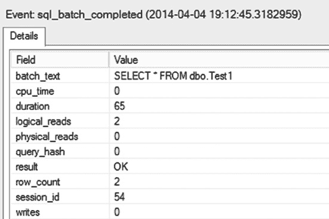
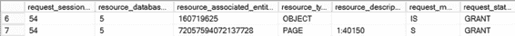
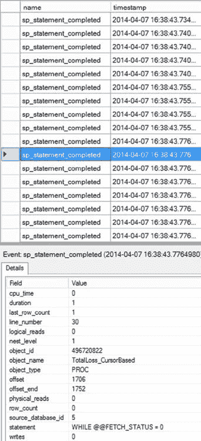

# 第 22 章 ■ 逐行处理

#### 服务器端游标

服务器端游标具有以下成本优势：

*   `一个连接上支持多个活动的基于游标的语句`：使用服务器端游标时，在游标操作之间，连接上不会遗留未处理的结果。这释放了连接，允许在同一时间在一个连接上使用多个基于游标的语句。而对于客户端游标，如之前所述，在应用程序获取所有游标行之前，连接将一直保持忙碌状态。这意味着它们无法同时被多个基于游标的语句使用。

*   `靠近数据的行处理`：如果行处理涉及与其他表的连接以及大量的集合操作，那么使用服务器端游标靠近数据源执行行处理是有利的。

*   `减轻客户端资源压力`：它减轻了客户端资源的压力。但这可能并不那么理想，因为如果服务器资源达到上限（而不是客户端资源），那么就需要对数据库进行横向扩展，这是一个困难的命题。

*   `支持所有游标类型`：客户端游标在支持哪些游标类型方面有限制。服务器端游标则没有此限制。

[www.it-ebooks.info](http://www.it-ebooks.info/)

服务器端游标具有以下成本开销或缺点：

*   `可扩展性较低`：它们会使服务器的可扩展性降低，因为需要消耗服务器资源来管理游标。

*   `更多的网络往返`：如果游标行处理在客户端应用程序中完成，它们会增加网络往返次数。可以通过在存储过程中处理游标行或使用数据访问层的缓存大小特性来优化网络往返次数。

*   `可移植性较差`：使用 T-SQL 游标实现的服务器端游标不易移植到其他数据库，因为管理游标的数据库代码语法在不同数据库之间存在差异。

### 游标并发的成本比较

正如预期的那样，具有更高并发模型的游标在数据库中产生最少的阻塞，并支持更高的可扩展性，如下节所述。

#### 只读

只读并发模型提供以下成本优势：

*   `最低的锁开销`：只读并发模型对数据库引入的锁和同步开销最小。因为在获取游标行后，不会在底层行上持有（`S`）锁，其他用户不会被阻塞访问该行。此外，通过在游标的 `SELECT` 语句中使用 `NO_LOCK` 锁定提示，可以避免在获取游标行时对底层行获取的（`S`）锁，但这仅适用于你不关心因脏读而返回何种数据的情况。

*   `最高的并发性`：由于不在底层行上持有额外的锁，只读游标不会阻塞其他用户访问底层表。共享锁仍然会被获取。

只读游标的主要缺点如下：

*   `不可更新`：无法通过游标修改底层表的内容。

#### 乐观

乐观并发模型提供以下优势：

*   `低锁开销`：与只读模型类似，乐观并发模型在获取游标行后，不会在游标行上持有（`S`）锁。为了进一步提高并发性，也可以像只读并发模型那样使用 `NOLOCK` 锁定提示。但是，请注意 `NOLOCK` 绝对可能导致不正确的数据或丢失或多余的行，因此使用时需要仔细规划。通过游标修改底层行需要操作查询所要求的对该行的独占权限。

*   `高并发性`：由于仅在底层行上使用共享锁，游标不会阻塞其他用户访问底层表。但是，通过游标对底层行进行的修改操作会在修改期间阻塞其他用户访问该行。

[www.it-ebooks.info](http://www.it-ebooks.info/)

以下示例详述了乐观并发模型的成本开销：

*   `行版本控制`：由于乐观并发模型允许游标可更新，因此会产生额外成本，以确保在通过游标应用修改之前，先将当前底层行（使用基于版本或基于值的并发控制）与最初获取的游标行进行比较。这可以防止通过游标进行的修改意外覆盖在获取游标行之后由另一个用户进行的修改。

*   `没有 ROWVERSION 列的并发控制`：如前所述，底层表中的 `ROWVERSION` 列允许游标执行高效的基于版本的并发控制。如果底层表不包含 `ROWVERSION` 列，游标将采用基于值的并发控制，这需要将行的当前值与读入游标时的值进行匹配。这增加了并发控制的成本。两种形式的并发控制都会在 `TEMPDB` 中导致额外开销。

#### 滚动锁

滚动锁并发模型的主要优势如下：

*   `简单的并发控制`：通过对游标最后获取的行所对应的底层行加锁，游标确保该底层行不会被其他用户修改。这消除了乐观锁的版本控制开销。此外，由于该行不能被其他用户修改，应用程序也免于检查行不匹配错误。

滚动锁并发模型会产生以下成本开销：

*   `最高的锁开销`：滚动锁并发模型引入了悲观锁的特性。一个（`U`）锁会一直保持在最后获取的游标行上，直到获取另一个游标行或关闭游标。

*   `最低的并发性`：由于在底层行上持有一个（`U`）锁，所有其他请求对该底层行加（`U`）或（`X`）锁的用户都将被阻塞。这会严重损害并发性。因此，除非绝对必要，请避免使用此游标并发模型。

### 游标类型的成本比较

本章前面“游标基础”一节提到的四种基本游标类型中的每一种都会对服务器产生不同的成本开销。选择不正确的游标类型会损害数据库性能。除了四种基本游标类型外，还提供了一种仅向前快速游标（仅向前游标的一种变体）以增强性能。这些游标类型的成本开销将在接下来的章节中解释。

[www.it-ebooks.info](http://www.it-ebooks.info/)

#### 仅向前游标

仅向前游标具有以下成本优势：


## 只进游标

- *游标打开成本低于静态游标和键集驱动游标：* 由于游标行不是从底层表中检索，且在游标打开时不会复制到 `tempdb` 数据库，因此只进 T-SQL 游标打开速度很快。类似地，具有乐观/滚动锁并发性的只进服务器端 API 游标也能快速打开，因为它们不会在打开时检索行。

- *滚动开销更低：* 由于此游标类型只能执行 `FETCH NEXT`，因此支持不同滚动操作所需的开销更少。

- *对 `tempdb` 数据库的影响低于静态游标和键集驱动游标：* 由于只进 T-SQL 游标不会将行从底层表复制到 `tempdb` 数据库，因此不会给该数据库带来额外压力。

只进游标类型有以下缺点：

- *并发性较低。* 每次获取游标行时，根据游标并发模型（如前文并发性讨论所述），会对相应的底层行发出带锁请求。这可能会阻止其他用户访问该资源。

- *不支持向后滚动。* 需要双向滚动的应用程序无法使用此游标类型。

但如果应用程序设计得当，不用向后滚动也并非难事。

## 快速只进游标

快速只进游标是速度最快、成本最低的游标类型。这种只进且只读的游标是专门为性能优化的。因此，在 `SQL Server` 中，你应始终优先选择它，而非其他游标类型。

此外，数据访问层在客户端提供了快速只进游标。该类型的游标使用所谓的 `默认结果集`，使得游标开销几乎消失。

■ **注意** `默认结果集` 将在本章后面的“默认结果集”一节中解释。

#### 静态游标

静态游标有以下成本优势：

- *获取成本低于其他游标类型：* 由于在打开游标时，会在 `tempdb` 数据库中根据底层行创建快照，游标行的获取操作是针对快照而非底层行进行的。这避免了原本获取游标行可能需要的锁开销。

- *不会阻塞底层行：* 由于快照创建在 `tempdb` 数据库中，其他试图访问底层行的用户不会被阻塞。

[www.it-ebooks.info](http://www.it-ebooks.info/)

第 22 章 ■ 逐行处理

另一方面，静态游标存在以下成本开销：

- *打开成本高于其他游标类型：* 静态游标的打开操作比其他游标类型慢，因为必须在游标打开期间从底层表中检索结果集的所有行，并在 `tempdb` 数据库中创建快照。

- *对 `tempdb` 的影响高于其他游标类型：* 在 `tempdb` 数据库中创建、填充和清理快照可能会对服务器资源产生显著影响。

#### 键集驱动游标

键集驱动游标有以下成本优势：

- *打开成本低于静态游标：* 由于在 `tempdb` 数据库中只创建键集，而非完整的快照，键集驱动游标的打开速度快于静态游标。

`SQL Server` 异步填充大型键集驱动游标的键集，这缩短了从游标打开到获取第一个游标行之间的时间。

- *对 `tempdb` 的影响低于静态游标：* 由于键集驱动游标更小，它在 `tempdb` 中占用的空间更少。

键集驱动游标的成本开销如下：

- *打开成本高于只进游标和动态游标：* 在 `tempdb` 数据库中填充键集，使得键集驱动游标的打开操作比只进游标（前面提到的例外情况除外）和动态游标的成本更高。


#### 键集驱动游标

**键集驱动游标**具有以下成本开销：

*   `Higher fetch cost than other cursor types:` 获取每一行游标数据时，都必须先访问键集中的键，然后才能访问用户数据库中对应的底层行。为每一行获取操作同时访问 `tempdb` 和用户数据库，这使得获取操作的成本高于其他游标类型。
*   `Higher impact on tempdb than forward-only and dynamic cursors:` 在 `tempdb` 中创建、填充和清理键集会影响服务器资源。
*   `Higher lock overhead and blocking than the static cursor:` 由于从游标获取行时是从底层表中检索，因此在行获取操作期间会对底层行获取一个 `S` 锁（除非使用了 `NOLOCK` 锁定提示）。

#### 动态游标

**动态游标**具有以下成本优势：

*   `Lower open cost than static and keyset-driven cursors:` 由于游标直接在底层行上打开，无需将任何内容复制到 `tempdb` 数据库，因此动态游标比静态游标和键集驱动游标打开得更快。
*   `Lower impact on tempdb than static and keyset-driven cursors:` 由于没有内容被复制到 `tempdb`，动态游标对 `tempdb` 造成的压力远小于其他游标类型。

**动态游标**具有以下成本开销：

*   `Higher lock overhead and blocking than the static cursor:` 动态游标中的每一行游标获取操作都会对游标 `SELECT` 语句中涉及的底层表进行重新查询。动态获取通常开销较大，因为可能必须重新执行原始的选取条件。

[www.it-ebooks.info](http://www.it-ebooks.info/)

## 第 22 章 ■ 逐行处理

## 默认结果集

数据访问层（ADO、OLEDB 和 ODBC）的默认游标类型是只进且只读的。数据访问层创建的默认游标类型并非真正的游标，而是从服务器到客户端的数据流，通常被称为 `default result set` 或仅进游标（由数据访问层创建）。

在 ADO.NET 中，`DataReader` 控件具有只进和只读的属性，它可以被视为 ADO.NET 环境中的默认结果集。SQL Server 在以下条件下使用这种类型的结果集处理：

*   使用数据访问层（ADO、OLEDB、ODBC）的应用程序将所有游标特性保留为默认设置，这会请求一个只进且只读的游标。
*   应用程序执行 `SELECT` 语句，而不是执行 `DECLARE CURSOR` 语句。

> **Note** 因为 SQL Server 设计用于处理数据集，而不是逐条遍历记录，所以默认结果集总是比任何其他类型的游标更快。

客户端发送到 SQL Server 的唯一请求是与默认游标关联的 SQL 语句。

SQL Server 执行查询，将结果集的行组织在网络数据包中（尽可能填满数据包），然后将这些数据包发送到客户端。这些网络数据包被缓存在客户端的网络缓冲区中。

SQL Server 将尽可能多的结果集行发送到客户端，只要客户端网络缓冲区可以缓存。随着客户端应用程序一次请求一行数据，客户端机器上的数据访问层从客户端网络缓冲区中提取该行并将其传输到客户端应用程序。

以下部分概述了默认结果集的优缺点。

### 优点

默认结果集通常是返回 SQL Server 行的最佳、最高效的方式，原因如下：

*   `Minimum network round-trips between the client and SQL Server:` 由于 SQL Server 返回的结果集被缓存在客户端网络缓冲区中，因此客户端不必通过网络请求来获取各个行。SQL Server 将其可以放入网络缓冲区的大部分行发送给客户端，发送的数量取决于客户端网络缓冲区的缓存能力。
*   `Minimum server overhead:` 由于 SQL Server 不需要在服务器上存储数据，这减少了服务器资源的利用率。

### 多活动结果集

SQL Server 2005 引入了多活动结果集的概念，其中单个连接在任何给定时刻可以运行多个批处理。在之前的版本中，在提交下一个请求之前，必须处理或关闭单个结果集。`MARS` 允许通过同一连接同时提交多个请求。`MARS` 在 SQL Server 上始终启用。除非连接显式调用它，否则该连接不会启用它。事务必须在客户端级别处理，并且必须显式声明和提交或回滚。如果使用 `MARS`，某个语句上的事务未提交且连接关闭，则作为该单个连接一部分的所有其他事务都将回滚。`MARS` 通过应用程序连接属性启用。

[www.it-ebooks.info](http://www.it-ebooks.info/)

## 第 22 章 ■ 逐行处理

### 缺点

虽然默认结果集有优势，但也有其缺点。使用默认结果集需要满足一些特殊条件以获得最佳性能：

*   `It doesn’t support all properties and methods:` 不支持诸如 `AbsolutePosition`、`Bookmark` 和 `RecordCount` 等属性，以及 `Clone`、`MoveLast`、`MovePrevious` 和 `Resync` 等方法。
*   `Locks may be held on the underlying resource:` SQL Server 将尽可能多的结果集行发送到客户端，只要客户端网络缓冲区可以缓存。如果结果集的大小很大，则客户端网络缓冲区可能无法接收所有行。此时，SQL Server 会在尚未发送到客户端的底层表的下一页上保持锁。

为了演示这些概念，请考虑以下测试表：

```sql
USE AdventureWorks2012;
GO
IF (SELECT OBJECT_ID('dbo.Test1')) IS NOT NULL
    DROP TABLE dbo.Test1;
GO
CREATE TABLE dbo.Test1 (C1 INT, C2 CHAR(996));
CREATE CLUSTERED INDEX Test1Index ON dbo.Test1 (C1);
INSERT INTO dbo.Test1
VALUES (1, '1') ,
       (2, '2');
GO
```

现在考虑这个 PowerShell 脚本，它使用 ADO 和 OLEDB 访问测试表的行，并使用数据库 API 游标（`ADODB.Recordset` 对象）的默认游标类型，如下所示：

```powershell
$AdoConn = New-Object -comobject ADODB.Connection
$AdoRecordset = New-Object -comobject ADODB.Recordset
$AdoConn.Open("Provider= SQLOLEDB; Data Source=DOJO\RANDORI; Initial Catalog=AdventureWorks2012; Integrated Security=SSPI")
$AdoRecordset.Open("SELECT * FROM dbo.Test1", $AdoConn)
do {
    $C1 = $AdoRecordset.Fields.Item("C1").Value
    $C2 = $AdoRecordset.Fields.Item("C2").Value
    Write-Output "C1 = $C1 and C2 = $C2"
    $AdoRecordset.MoveNext()
} until ($AdoRecordset.EOF -eq $True)
$AdoRecordset.Close()
$AdoConn.Close()
```

[www.it-ebooks.info](http://www.it-ebooks.info/)



## 第 22 章 ■ 逐行处理

这并非从 PowerShell 访问数据库的常规方式，但它确实展示了客户端游标如何操作。请注意，该表有两行，每行大小为 1,000 字节（不考虑内部开销时，= 4 字节 `INT` + 996 字节 `CHAR(996)`）。因此，`SELECT` 语句返回的完整结果集大小约为 2,000 字节（= 2 **x** 1,000 字节）。

在执行游标打开语句（`$AdoRecordset.Open()`）时，在运行代码的客户端机器上创建了一个默认结果集。该默认结果集保存了客户端网络缓冲区可以缓存的尽可能多的行。


## 第 22 章 ■ 逐行处理

由于结果集的大小足够小，可以被客户端网络缓冲区缓存，所有游标行在游标打开语句执行期间就被缓存在客户端机器上，而不会在 `dbo.Test1` 表上保留任何锁。你可以使用 `sys.dm_tran_locks` 动态管理视图来验证该连接的锁定状态。在整个游标操作期间，客户端向 SQL Server 发起的唯一请求是与游标关联的 `SELECT` 语句，如图 22-1 的扩展事件输出所示。

**图 22-1.** 显示默认结果集所做数据库请求的 Profiler 跟踪输出

为了了解大型结果集对默认结果集处理的影响，让我们向测试表中添加更多行。

```sql
SELECT TOP 100000
IDENTITY( INT,1,1 ) AS n
INTO #Tally
FROM Master.dbo.syscolumns scl,
Master.dbo.syscolumns sc2;

INSERT INTO dbo.Test1
(C1, C2)
SELECT n,
n
FROM #Tally AS t;

GO
```

[www.it-ebooks.info](http://www.it-ebooks.info/)



此示例生成的额外行大大增加了结果集的大小。根据客户端网络缓冲区的大小，结果集可能只有一部分能被缓存。在执行 `Ado.Recordset.Open` 语句时，客户端机器上的默认结果集将获得部分结果集，而 SQL Server 则在网络另一端等待发送剩余的行。

在此期间，在我的机器上，底层 `Test1` 表上持有的锁如图 22-2 所示，这是从 `sys.dm_tran_locks` 的输出中获取的。

**图 22-2.** `sys.dm_tran_locks` 输出，显示在处理大型结果集时默认结果集持有的锁

表上的 (`IS`) 锁会阻止其他用户尝试获取 (`X`) 锁。为了最小化阻塞问题，请遵循以下建议：
-   立即处理默认结果集的所有行。
-   保持结果集较小。如示例所示，如果结果集的大小很小，那么默认结果集将能够在游标打开操作期间读取所有行。

## 游标开销

在应用程序中实现以游标为中心的功能时，你有两种选择。你可以使用 T-SQL 游标或数据库 API 游标。由于 T-SQL 游标和数据库 API 游标的内部实现不同，它们在 SQL Server 上产生的负载也不同。这些游标对数据库的影响还取决于游标的不同特性，例如位置、并发性和类型。你可以使用扩展事件来分析 T-SQL 和数据库 API 游标产生的负载。当然，用于监控查询的标准事件将非常有用。在 `cursor` 类别下还有一些事件。其中最有用的事件包括：
-   `cursor_open`
-   `cursor_close`
-   `cursor_execute`
-   `cursor_prepare`

其他事件也很有用，但只有在你尝试对特定问题进行故障排除时才需要它们。甚至这些游标的优化选项也不同。让我们逐一分析这些游标的开销。

[www.it-ebooks.info](http://www.it-ebooks.info/)

### 使用 T-SQL 游标分析开销

使用 T-SQL 语句实现的 T-SQL 游标总是在 SQL Server 上执行，因为它们需要 SQL Server 引擎来处理其 T-SQL 语句。你可以结合先前解释的游标特性来减少这些游标的开销。如前所述，最轻量级的 T-SQL 游标不是用默认设置创建的，而是通过调整设置得到的仅向前只读游标。但这仍然留下了需要由 SQL Server 处理的、用于实现游标操作的 T-SQL 语句。游标的全部负载由 SQL Server 承担，客户端机器不提供任何帮助。

假设一个应用程序需求导致必须支持以下任务列表：
-   识别所有已报废的产品（来自 `Production.WorkOrder` 表）。
-   对于每个报废的产品，计算损失的金额，其中每个产品损失的金额等于库存单位乘以产品的单价。
-   计算总损失。
-   根据总损失，确定业务状态。

第二点中的 `FOR EACH` 短语表明这些应用程序任务可以由游标来完成。

然而，在 SQL Server 内部使用 `FOR`、`WHILE`、游标或任何其他此类处理可能是危险的。让我们看看它如何使用游标工作。你可以使用 T-SQL 游标实现此应用程序需求，如下所示：

```sql
IF (SELECT OBJECT_ID('dbo.TotalLoss_CursorBased')
) IS NOT NULL
DROP PROC dbo.TotalLoss_CursorBased;
GO

CREATE PROC dbo.TotalLoss_CursorBased
AS --声明一个具有默认设置的 T-SQL 游标，即快速
--仅向前游标以检索已丢弃的产品
DECLARE ScrappedProducts CURSOR
FOR
SELECT p.ProductID,
wo.ScrappedQty,
p.ListPrice
FROM Production.WorkOrder AS wo
JOIN Production.ScrapReason AS sr
ON wo.ScrapReasonID = sr.ScrapReasonID
JOIN Production.Product AS p
ON wo.ProductID = p.ProductID;

--打开游标，一次处理一个产品
OPEN ScrappedProducts;

DECLARE @MoneyLostPerProduct MONEY = 0,
@TotalLoss MONEY = 0;

--通过一次处理一个产品来计算每个产品损失的金额
DECLARE @ProductId INT,
@UnitsScrapped SMALLINT,
@ListPrice MONEY;

FETCH NEXT FROM ScrappedProducts INTO @ProductId,@UnitsScrapped,@ListPrice;

WHILE @@FETCH_STATUS = 0
BEGIN
SET @MoneyLostPerProduct = @UnitsScrapped * @ListPrice; --计算总损失
SET @TotalLoss = @TotalLoss + @MoneyLostPerProduct;

FETCH NEXT FROM ScrappedProducts INTO @ProductId,@UnitsScrapped,
@ListPrice;
END

--确定状态
IF (@TotalLoss > 5000)
SELECT '我们破产了！' AS Status;
ELSE
SELECT '我们很安全！' AS Status;

--关闭游标并释放分配给游标的所有资源
CLOSE ScrappedProducts;
DEALLOCATE ScrappedProducts;
GO
```

可以按如下方式执行存储过程，但你应该执行两次以利用计划缓存（见图 22-3）：

```sql
EXEC dbo.TotalLoss_CursorBased;
GO
```

[www.it-ebooks.info](http://www.it-ebooks.info/)



**图 22-3.** 扩展事件输出，显示了使用 T-SQL 游标进行数据处理的部分总成本

如图 22-3 所示，许多语句在 SQL Server 上执行。本质上，存储过程中的所有 SQL 语句都在 SQL Server 上执行，而 `WHILE` 循环中的语句会执行多次（游标 `SELECT` 语句返回的每一行执行一次）。

该存储过程执行的逻辑读取总数为 8,788（由最后一个 `sql_batch_completed` 事件指示）。嗯，这个数字是高还是低？考虑到 `Production.Products` 表只有 6,196 页，`Production.WorkOrder` 表只有 926 页，这个数字肯定不低。你可以通过查询动态管理视图 `sys.dm_db_index_physical_stats` 来确定分配给这些表的页数。

[www.it-ebooks.info](http://www.it-ebooks.info/)

```sql
SELECT SUM(page_count)
FROM sys.dm_db_index_physical_stats(DB_ID(N'AdventureWorks2012'),
OBJECT_ID('Production.WorkOrder'),
DEFAULT, DEFAULT, DEFAULT);
```

**注意** `sys.dm_db_index_physical_stats` DMV 在第 13 章中有详细解释。


