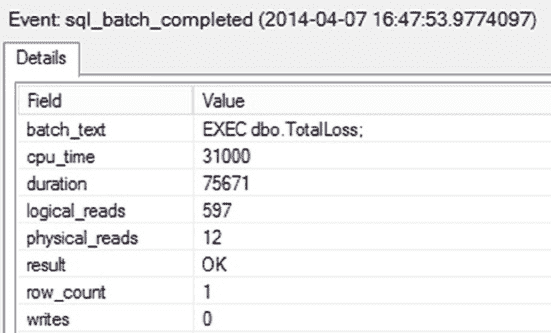

# 内存 OLTP 与游标优化

## 游标替代方案

在大多数情况下，你可以通过使用 SQL 查询重写功能来避免游标操作，专注于基于集合的数据访问方法。例如，你可以使用 SQL 查询（而非游标操作）重写前面的存储过程（下载中的`nocursor.sql`文件）：

```sql
IF (SELECT OBJECT_ID('dbo.TotalLoss')) IS NOT NULL
    DROP PROC dbo.TotalLoss;
GO

CREATE PROC dbo.TotalLoss
AS
SELECT CASE --根据以下计算确定状态
    WHEN SUM(MoneyLostPerProduct) > 5000 THEN '我们破产了！'
    ELSE '我们安全！'
END AS Status
FROM (--计算所有废弃产品的总损失金额
    SELECT SUM(wo.ScrappedQty * p.ListPrice) AS MoneyLostPerProduct
    FROM Production.WorkOrder AS wo
    JOIN Production.ScrapReason AS sr
        ON wo.ScrapReasonID = sr.ScrapReasonID
    JOIN Production.Product AS p
        ON wo.ProductID = p.ProductID
    GROUP BY p.ProductID
) DiscardedProducts;
GO
```

在此存储过程中，使用了 SQL Server 的聚合函数来计算每个产品的损失金额和总损失。`CASE`语句用于根据产生的总损失来确定业务状态。该存储过程可以按如下方式执行；但同样，你应该执行两次，以便看到计划缓存的结果：

```sql
EXEC dbo.TotalLoss;
```

图 22-4 显示了相应的扩展事件输出。

[www.it-ebooks.info](http://www.it-ebooks.info/)



### 第 22 章 - 逐行处理

`图 22-4`. 使用等效`SELECT`语句进行数据处理的总成本的 Profiler 跟踪输出

在图 22-4 中，你可以看到存储过程的第二次执行重用了现有计划，总共使用了 597 次逻辑读取。但是，你可以看到一个比读取更重要的结果：CPU 时间使用量从第一次查询的 156 毫秒下降到图 22-4 中的 31 毫秒，持续时间从 682 毫秒下降到 75 毫秒。使用 SQL 查询代替游标操作使执行速度提高了九倍。

因此，为了获得更好的性能，几乎总是建议你在 SQL 查询中使用基于集合的操作，而不是 T-SQL 游标。

## 游标使用建议

游标的低效使用会通过引入额外的网络往返和服务器资源负载来降低应用程序性能。为保持游标成本较低，请尽量遵循以下建议：

-   优先使用基于集合的 SQL 语句，而非 T-SQL 游标，因为 SQL Server 是为处理数据集而设计的。
-   使用成本最低的游标。
-   使用 SQL Server 游标时，使用`FAST FORWARD`游标类型。
-   使用`ADO`、`OLEDB`或`ODBC`实现的 API 游标时，使用默认游标类型，通常称为*默认结果集*。
-   使用`ADO.NET`时，使用`DataReader`对象。
-   最小化对服务器资源的影响。
-   对 API 游标使用客户端游标。
-   不要通过游标对基础表执行操作。
-   尽快释放游标。这有助于释放资源，尤其是在`tempdb`中。
-   重新设计游标的`SELECT`语句（或应用程序）以返回最小的行集和列集。
-   通过将游标逻辑重写为基于集合的语句来完全避免 T-SQL 游标，基于集合的语句通常比游标更高效。
-   对动态游标使用`ROWVERSION`列，以利用高效的、基于版本的并发控制，而不是依赖基于值的技术。
-   最小化对`tempdb`的影响。
-   通过避免使用`static`和`keyset-driven`游标类型来最小化`tempdb`中的资源争用。
-   静态和键集驱动游标会给`tempdb`增加额外负载，因此如果必须使用它们，请考虑这一点，或者如果`tempdb`处于压力之下，请避免使用它们。
-   最小化阻塞。
-   使用默认结果集、仅向前快速游标或静态游标。
-   尽快处理所有游标行。
-   避免滚动锁或悲观锁。
-   使用 API 游标时最小化网络往返。
-   使用`ADO`的`CacheSize`属性在一次往返中获取多行。
-   使用客户端游标。
-   使用断开连接的记录集。

## 总结

正如你在本章所学，游标是对 SQL Server 返回的结果集的自然扩展，使调用应用程序能够一次处理一行数据。游标会给应用程序性能增加成本开销，并影响服务器资源。

你应该始终寻找避免游标的方法。基于集合的解决方案在几乎所有情况下都更有效。但是，如果必须执行游标操作，则选择最佳的游标位置、并发性、类型和缓存大小特性组合，以最小化游标的成本开销。

在下一章中，我们将探讨 SQL Server 2014 中引入的内存表、本机编译过程以及 Hekaton 的其他方面所带来的特殊功能。

## 第 23 章 - 内存优化 OLTP 表与过程

在线事务处理（OLTP）系统的主要需求之一是尽可能提高系统速度。考虑到这一点，微软在 SQL Server 2014 中引入了一套新的功能，专注于使 OLTP 系统尽可能快速。这些就是内存表和本机编译存储过程的内存优化技术。这套仅限企业版的功能面向高端、事务密集型、专注于 OLTP 的系统。内存优化技术是查询调优工具箱中的另一个工具，但它是一个高度专业化的工具，仅适用于某些应用程序。在采用这项新技术时需谨慎。也就是说，在合适的系统和合适的内存条件下，我谈论的是极快的速度。

在本章中，我将涵盖以下主题：

-   内存表工作原理的基础知识
-   通过本机编译存储过程提高性能
-   本机编译过程和内存 OLTP 表的优点与缺点
-   何时使用内存 OLTP 表的建议

## 内存 OLTP 基础

归根结底，你可以调优查询以使其运行得非常快。但是，无论你让它们运行得多快，在某种程度上，你都受到现代计算机内部某些架构问题的限制。通常，头号瓶颈是存储系统。无论你仍在使用旋转盘片还是已经转向某种类型的`SSD`或类似技术，磁盘仍然是系统中最慢的方面。这意味着对于读取或写入，你必须等待。但内存很快，而且有了新的 64 位操作系统，它可以非常充足。因此，如果你有可以完全移入内存的表，你就可以显著提高速度。这正是内存 OLTP 表的核心部分：将数据访问（包括读取和写入）移至内存中，脱离磁盘。


但微软所做的远不止于此。它认识到，虽然磁盘速度较慢，但系统变慢的另一个方面在于查询如何被编译、存储和访问，以及数据如何通过事务系统进行访问和管理。因此，微软也在此处进行了一系列改动。其中最主要的改动是将事务处理方式从悲观改为乐观。现有的产品要求所有事务在允许数据更改刷新到磁盘之前，必须先写入事务日志。这在事务处理过程中形成了一个瓶颈。于是，微软不再对事务能否成功完成持悲观态度，而是采取了乐观的方式，认为在大多数情况下事务会顺利完成。此外，为了避免出现阻塞情况（即一个事务必须完成数据更新后，下一个事务才能访问或更新数据），微软对数据进行了版本控制。此举现在消除了系统内的一个主要争用点，并大幅减少了阻塞，而且这一切都在内存中进行，因此速度更快。

[www.it-ebooks.info](http://www.it-ebooks.info/)

## 第 23 章 ■ 内存优化的 OLTP 表与存储过程

随后，微软将这一切又推进了一步。它没有对防止多个进程同时访问一个页面进行写入的内存锁采用悲观方式，而是将乐观方法扩展到了内存管理领域。现在，借助版本控制，内存中表的工作模式是“最终一致”，并配有冲突解决过程，该过程会回滚一个事务，但绝不会因一个事务而阻塞另一个事务。这有可能导致一些数据丢失，但它使数据访问层内的一切都变得非常快。

最后，正如你在本书其他部分所见，查询调优的一个主要部分是弄清楚如何与查询优化器协作以获得良好的执行计划，并让该计划被多次复用。这个过程也可能非常耗费资源且缓慢。SQL Server 2014 引入了原生编译存储过程的概念。这些存储过程本质上是将 `T-SQL` 代码编译成 `DLLs`，并使其成为 SQL Server 操作系统的一部分。这个编译过程成本高昂，不应随意用于任何普通查询。其核心理念是投入时间和精力将一个存储过程编译为原生代码，然后以极大提升的速度使用该过程数百万次。

所有这些技术汇聚在一起，创造了新的功能，你可以单独使用它们，也可以结合现有的表结构和标准 `T-SQL` 来使用。事实上，你可以像对待普通 SQL Server 表一样对待内存中表，仍然能实现一些性能改进。但是，你不能在任何地方都这样做。

利用内存 OLTP 表和存储过程有一些相当具体的要求。

### 系统要求

内存技术最重要的系统要求是，你必须运行 SQL Server 2014 的企业版才能使用它（尽管它在开发版中也能使用）。在考虑内存优化表是否可行之前，你还需要满足其他一些标准要求。

• 现代的 64 位处理器
• 用于打算放入内存的数据的两倍的可用磁盘存储空间
• 大量内存

显然，对于大多数系统来说，关键是大量的内存。你需要有足够的内存供操作系统和 SQL Server 正常运行。然后，你还需要内存来满足系统所有非内存优化的需求，包括数据缓存。最后，你还需要在所有这些之外，额外为你的内存优化表分配内存。如果你考虑的不是一个相当大的系统（最低 64GB 内存），我甚至不建议将此作为选项。较小的系统在内存中无法提供足够的存储空间，使得投入的时间、精力和额外的授权成本变得不值得。

### 基本设置


