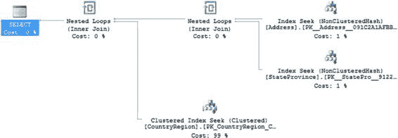
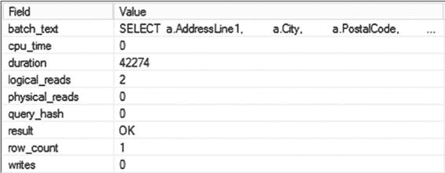
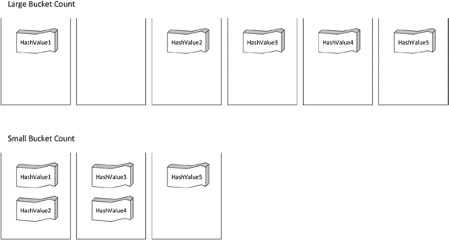
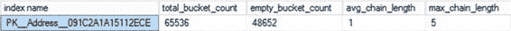
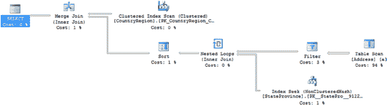
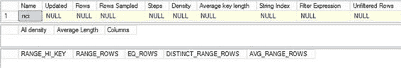
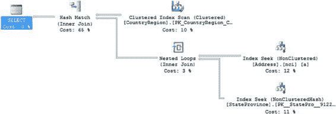
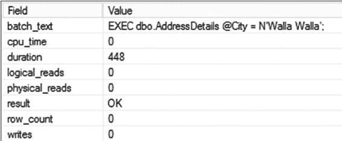

# 第 23 章：内存优化的 OLTP 表与过程

## SQL 操作

```sql
INTO dbo.StateProvinceStaging
FROM AdventureWorks2012.Person.StateProvince AS sp;

INSERT dbo.StateProvince
(StateProvinceCode,
CountryRegionCode,
Name,
TerritoryID
)
SELECT stateprovincecode,
countryregioncode,
name,
territoryid
FROM dbo.stateprovincestaging;

DROP TABLE dbo.StateProvinceStaging;

INSERT dbo.countryregion
(countryregioncode,
name
)
SELECT cr.CountryRegionCode,
cr.Name
FROM AdventureWorks2012.Person.CountryRegion AS cr;
```

[www.it-ebooks.info](http://www.it-ebooks.info/)



数据加载完成后，以下查询返回单行，其执行计划如图`23-2`所示：

```sql
SELECT a.AddressLine1,
a.City,
a.PostalCode,
sp.Name AS StateProvinceName,
cr.Name AS CountryName
FROM dbo.Address AS a
JOIN dbo.StateProvince AS sp
ON sp.StateProvinceID = a.StateProvinceID
JOIN dbo.CountryRegion cr
ON cr.CountryRegionCode = sp.CountryRegionCode
WHERE a.AddressID = 42;
```

**图 23-2.** 同时显示内存中表和标准表的执行计划

如您所见，即使使用内存中表，也完全有可能获得正常的执行计划。操作符甚至都是相同的。在这个例子中，您有三个不同的索引查找操作。其中两个是针对您在内存中表上创建的非聚集哈希索引，另一个是针对标准表的标准聚集索引查找。

主要的性能提升源于没有锁定和闩锁，这允许在允许查询的同时进行大量的插入和更新操作。但是，查询运行得也确实更快。之前的查询产生了以下执行时间和读取次数：

```
Table 'CountryRegion'. Scan count 0, logical reads 2
CPU time = 0 ms, elapsed time = 19 ms.
```

对`AdventureWorks2012`数据库运行类似的查询会产生如下行为：

```
Table 'CountryRegion'. Scan count 0, logical reads 2
Table 'StateProvince'. Scan count 0, logical reads 2
Table 'Address'. Scan count 0, logical reads 2
CPU time = 0 ms, elapsed time = 154 ms.
```

虽然很明显使用内存中表时执行时间好得多，但读取次数是如何处理的尚不明确。但是，由于我讨论的是从内存中存储读取，而不是内存中的页或磁盘上的页，而是哈希索引，因此在衡量性能方面情况完全不同。

[www.it-ebooks.info](http://www.it-ebooks.info/)



您不会使用与之前完全相同的衡量指标，而是会依赖执行时间。即使您通过扩展事件捕获指标，您也不会看到与图`23-3`所示相同类型的值；然而，在这种情况下，读取次数是对系统活动量的度量，因此您可以预期较高的值意味着更多的数据访问，较低的值意味着较少的访问。

**图 23-3.** 使用内存中表的`SELECT`查询的扩展事件输出显示的是持续时间，而非读取次数

表已就位，并且证明插入和选择操作的性能都有所提升，现在让我们谈谈可以与内存中表一起使用的索引，以及它们与标准索引有何不同。

## 内存中索引

一个内存中表上最多可以同时创建八个索引。但是，每个内存优化表必须至少有一个索引。由主键定义的索引也算在内。一个持久化表必须有一个主键。

您可以创建两种基本索引类型：之前使用的非聚集哈希索引和非聚集索引。但这些索引并非与标准表一起创建的索引类型。首先，它们以内存中表相同的方式维护在内存中。其次，索引的持久性规则与内存中表相同。

### 哈希索引


哈希索引并非仅仅是存储在内存中的平衡树索引。相反，哈希索引使用预定义的哈希桶（或表）以及键的哈希值，来提供一种检索表数据的机制。SQL Server 有一个哈希函数，对于给定的输入，该函数总是会产生一个恒定的哈希值。这意味着对于一个给定的键值，你总是会得到相同的哈希值。你可以在哈希桶中存储多个哈希值副本。使用哈希值来执行点查找（检索单行）是一种极其高效的操作，**前提是**你不会遇到大量的哈希冲突。哈希冲突发生在多个值存储在同一个位置时。

这意味着，正确设置哈希索引的关键在于确保值在各个桶之间**正确分布**。这通过为索引定义桶计数来实现。对于我创建的第一张表 `dbo.Address`，我将桶计数设置为 50,000。目前表中有一万九千行数据。因此，通过设置 50,000 的桶计数，我确保了有足够的存储空间来容纳现有的值集，并提供了充足的增量空间。你需要设置一个足够大但又不过大的桶计数。如果桶计数过小，你将在一个桶内存储大量数据，这会严重影响系统高效检索数据的能力。简而言之，**宁可让桶过大，也不要让它太小**。如果你查看图 23-4，你可以从另一个角度看到这一点。

[www.it-ebooks.info](http://www.it-ebooks.info/)



## 第 23 章 ■ 内存优化 OLTP 表与过程

### 图 23-4. 大量桶与少量桶中的哈希值分布

第一组桶呈现出所谓的*浅分布*，即少量哈希值分布于大量桶中。这是一种更优的存储方案。正如你所看到的，某些桶可能是空的，但由于每个桶只包含一个值，查找速度很快。第二组桶显示了较小的桶计数，或称为*深分布*。这意味着在给定的桶中有更多的哈希值，需要在桶内进行扫描才能识别出各个哈希值。

微软对于桶计数的建议是设置为表行数的一到两倍。但是，由于你无法修改内存表，因此还需要考虑**预期的增长**。

如果你认为你的内存表在未来三到六个月内可能会增长到原来的三倍，你可能需要扩大桶计数。桶计数过大唯一会遇到的问题是扫描操作会耗时更长，因此你会分配更多的内存。但是，如果你的查询很可能导致扫描操作，那么你真的不应该使用非聚集哈希索引，而应直接使用非聚集索引。

你还需要关注每个哈希值可能返回的值的数量。唯一索引和主键是使用哈希索引的主要候选对象，因为它们始终是唯一的。微软的建议是，如果平均每个哈希值会对应超过五个值，你就应该放弃非聚集哈希索引，转而使用非聚集索引。这是因为哈希桶仅仅充当指向存储在该桶中第一个行的指针。然后，如果桶中存储了重复或额外的值，第一行会指向第二行，每一后续行依次指向其后的行。这会将点查找操作转变为扫描操作，再次严重损害性能。这就是为什么哈希索引最适合用于重复项很少（少于五个）或值唯一的情况。

要查看哈希表中索引的分布情况，可以使用 `sys.dm_db_xtp_hash_index_stats`。

```
SELECT i.name AS 'index name',

hs.total_bucket_count,

hs.empty_bucket_count,

hs.avg_chain_length,

hs.max_chain_length
```


[www.it-ebooks.info](http://www.it-ebooks.info/)



## 第 23 章 ■ 内存优化的 OLTP 表和过程

```sql
FROM sys.dm_db_xtp_hash_index_stats AS hs
JOIN sys.indexes AS i
  ON hs.object_id = i.object_id AND hs.index_id = i.index_id
WHERE OBJECT_NAME(hs.object_id) = 'Address';
```

图 23-5 显示了此查询的结果。

**图 23-5.** 查询 `sys.dm_db_xtp_hash_index_stats` 的结果

由此，你可以看到一些关于哈希索引如何创建和维护的有趣事实。你会注意到总存储桶数并非我设置的值 `50,000`。存储桶数被向上舍入到最接近的下一个 2 的幂，在本例中是 `65,536`。有 `48,652` 个空存储桶。由于这是唯一索引，平均链长度值为 `1`，因为值是唯一的。存在一些链值是因为当行被修改或更新时，会存储数据版本，直到所有问题都得到解决。

### 非聚集索引

非聚集索引基本上就像常规索引一样，只是它们与数据一起存储在内存中以协助数据检索。它们也有指向数据存储位置的指针，类似于非聚集索引在堆表上的行为。内存中的非聚集索引与标准非聚集索引之间一个有趣的区别是，SQL Server 无法从内存索引中按相反顺序检索数据。

其他行为似乎与标准索引大致相同。

为了看看非聚集索引的实际效果，我们使用这个查询：

```sql
SELECT a.AddressLine1,
    a.City,
    a.PostalCode,
    sp.Name AS StateProvinceName,
    cr.Name AS CountryName
FROM dbo.Address AS a
JOIN dbo.StateProvince AS sp
    ON sp.StateProvinceID = a.StateProvinceID
JOIN dbo.CountryRegion AS cr
    ON cr.CountryRegionCode = sp.CountryRegionCode
WHERE a.City = 'Walla Walla';
```

[www.it-ebooks.info](http://www.it-ebooks.info/)



## 第 23 章 ■ 内存优化的 OLTP 表和过程

目前的性能表现如下：

```
Table 'CountryRegion'. Scan count 1, logical reads 4
CPU time = 16 ms, elapsed time = 118 ms.
```

图 23-6 显示了执行计划。

**图 23-6.** 导致表扫描的执行计划

虽然内存表扫描肯定比磁盘上存储的表的相同扫描要快，但这仍然不是一种好的情况。另外，考虑到优化器为了满足其认为需要的 `Merge Join` 而产生的额外工作，即 `Filter` 操作和 `Sort` 操作，这是一个有问题的查询。因此，你应该为该表添加索引以加快速度。

但是，你不能直接在 `dbo.Address` 表上运行 `CREATE INDEX`。相反，你必须删除该表，重新创建它，然后用数据重新加载它。现在的表创建脚本如下所示：

```sql
CREATE TABLE dbo.Address(
    AddressID int IDENTITY(1,1) NOT NULL PRIMARY KEY NONCLUSTERED HASH WITH (BUCKET_COUNT=50000),
    AddressLine1 nvarchar(60) NOT NULL,
    AddressLine2 nvarchar(60) NULL,
    City nvarchar(30) COLLATE Latin1_General_100_BIN2 NOT NULL,
    StateProvinceID int NOT NULL,
    PostalCode nvarchar(15) NOT NULL,
    ModifiedDate datetime NOT NULL CONSTRAINT DF_Address_ModifiedDate DEFAULT (getdate()),
    INDEX nci NONCLUSTERED (City)
) WITH (MEMORY_OPTIMIZED=ON);
```

请注意，我不得不为 `City` 列添加一个排序规则才能创建索引。这是因为内存数据库中字符列上的索引只支持 `*_BIN2` 排序规则。你或者需要更改整个数据库的排序规则，或者像我之前那样在局部设置排序规则。

将数据重新加载到新创建的表后，你可以再次尝试查询。这次在我的系统上它运行了 `15ms`，比之前快得多。图 23-7 显示了执行计划。

[www.it-ebooks.info](http://www.it-ebooks.info/)





## 第 23 章 ■ 内存优化的 OLTP 表和过程


**图 23-7.**`一个利用非聚集索引改进后的执行计划`
正如你所见，非聚集索引被用来替代表扫描以提升性能，其效果与标准表上的索引如出一辙。然而，与标准表不同的是，尽管此查询确实检索了非聚集索引未包含的列，却无需通过键查找来从内存表中获取数据，因为每个索引都直接指向内存中所需数据的存储位置。这是对标准表行为的又一个虽小但重要的改进。

### 索引维护

与标准表相比，内存表上的索引创建方式存在许多根本性的差异。但索引维护仍然是你必须考虑的事项。内存索引会维护统计信息，这些信息需要更新。你还需要获取有关内存索引的信息，例如它们是通过扫描还是查找来访问的。虽然追踪所有这些信息的动机是相同的，但实现的机制却不同。

你实际上无法查看内存索引的统计信息。你可以对索引运行 `DBCC SHOW_STATISTICS`，但输出结果如图 23-8 所示。

**图 23-8.**`内存索引统计信息的空输出`

[www.it-ebooks.info](http://www.it-ebooks.info/)

第 23 章 ■ 内存优化 OLTP 表与存储过程

这意味着没有办法查看内存索引的统计信息。然而，随着数据的变化，这些统计信息仍然会过时。更重要的是，无论你的系统设置如何，它们都不会随数据更改而自动更新。因此，你必须计划手动运行更新。你可以使用 `sp_updatestats`。

2014 版本的该存储过程完全知晓内存索引及其差异。你也可以使用 `UPDATE STATISTICS`，但必须配合 `FULLSCAN` 或 `RESAMPLE` 以及 `NORECOMPUTE` 选项，如下所示：
```sql
UPDATE STATISTICS dbo.Address WITH FULLSCAN, NORECOMPUTE;
```

如果不使用此语法，系统会认为你试图修改内存表上的统计信息，而这是不允许的。你会看到一个相当明确的错误提示。
```text
Msg 41346, Level 16, State 2, Line 1
CREATE and UPDATE STATISTICS for memory optimized tables requires the WITH FULLSCAN or RESAMPLE and the NORECOMPUTE options. The WHERE clause is not supported.
```

通过将采样定义为 `FULLSCAN` 或 `RESAMPLE`，然后使用 `NORECOMPUTE` 明确表示你并非试图启用自动更新，统计信息就将得以更新。你需要根据数据的易变性来制定定期更新的计划，但目前尚无明确方法来观察统计信息本身。

内存索引不是从磁盘访问的，因此你无需担心这些索引的碎片问题，也无需对它们进行碎片整理。

## 本地编译存储过程

仅仅将表放入内存并通过乐观并发方式大幅减少锁争用，就能带来相当可观的性能提升。但要真正让系统飞速运行，你还可以实现一项新功能：将存储过程编译为在 SQL Server 可执行文件内运行的 `DLL`。

这确实能让性能飙升。语法很简单。以下是如何将之前的查询进行编译：
```sql
CREATE PROC dbo.AddressDetails @City NVARCHAR(30)
WITH NATIVE_COMPILATION,
     SCHEMABINDING,
     EXECUTE AS OWNER
AS
BEGIN ATOMIC
WITH (TRANSACTION ISOLATION LEVEL = SNAPSHOT, LANGUAGE = N'us_english')
    SELECT a.AddressLine1,
           a.City,
           a.PostalCode,
           sp.Name AS StateProvinceName,
           cr.Name AS CountryName
    FROM dbo.Address AS a
    JOIN dbo.StateProvince AS sp
        ON sp.StateProvinceID = a.StateProvinceID
    JOIN dbo.CountryRegion AS cr
        ON cr.CountryRegionCode = sp.CountryRegionCode
    WHERE a.City = @City;
END
```

[www.it-ebooks.info](http://www.it-ebooks.info/)




