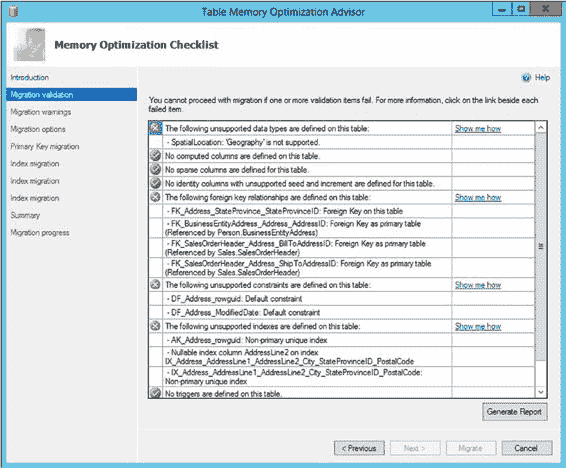
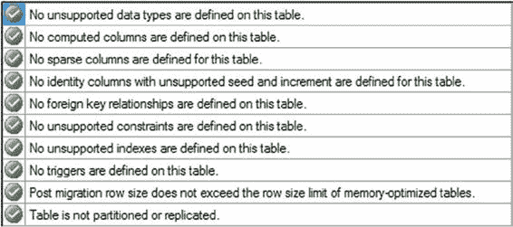
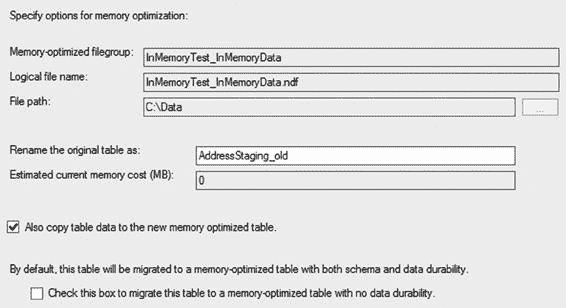
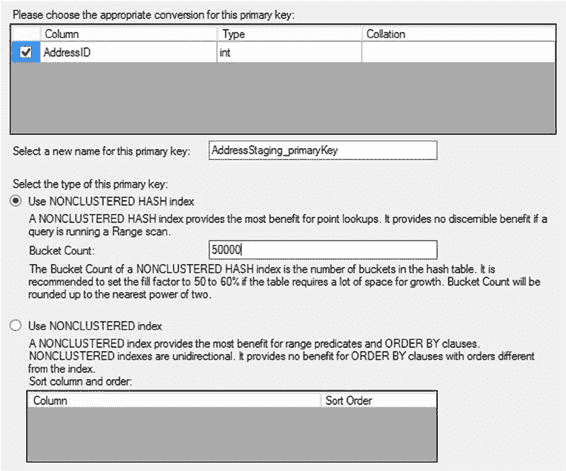
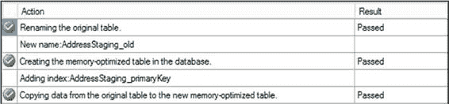
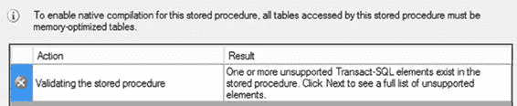
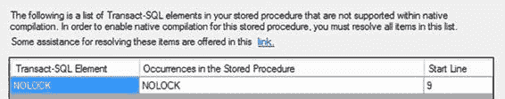

# 第 23 章 ■ 内存优化 OLTP 表与存储过程

### 基线

你应该已经计划通过使用性能监视器、动态管理对象、扩展事件以及你掌握的所有其他工具来收集各种指标，从而建立系统的性能基线。一旦有了基线，你就可以判断你的工作负载是否可能受益于内存表减少的锁定和提升的速度。

### 合适的工作负载

这项技术被称为内存 OLTP 表是有原因的。如果你处理的系统主要是读操作为主，只有夜间或间歇性负载，或者在线事务处理的工作负载级别非常低，那么内存表和原生编译存储过程可能不会为你带来重大好处。如果你的系统存在大量延迟，内存表可能是一个很好的解决方案。微软已经概述了其他几种可能受益的工作负载，你可以考虑使用内存表和原生编译存储过程；参见在线文档（[`bit.ly/1r6dmKY`](http://bit.ly/1r6dmKY)）。

### 内存优化顾问

为了快速轻松地确定一个表是否适合迁移到内存存储，微软在 SSMS 中提供了一个新工具。如果你使用对象资源管理器导航到特定表，可以右键单击该表并从上下文菜单中选择“内存优化顾问”。这将打开一个向导。如果我选择之前手动迁移的`Person.Address`表，初始检查将找到内存表中不支持的所有列。这将阻止向导继续，且没有其他选项可用。输出如图`23-12`所示。

[www.it-ebooks.info](http://www.it-ebooks.info/)



**图 23-12.** 内存优化顾问显示所有不支持的数据类型

这意味着该表按当前结构不适合迁移到内存存储。为了让你能看到该工具的完整运行过程，我将在之前创建的`InMemoryTest`数据库中创建一个表的干净副本，如下所示：

```sql
USE InMemoryTest;
GO
CREATE TABLE dbo.AddressStaging
(
    AddressID INT NOT NULL IDENTITY(1, 1) PRIMARY KEY,
    AddressLine1 NVARCHAR(60) NOT NULL,
    AddressLine2 NVARCHAR(60) NULL,
    City NVARCHAR(30) NOT NULL,
    StateProvinceID INT NOT NULL,
    PostalCode NVARCHAR(15) NOT NULL
);
```

[www.it-ebooks.info](http://www.it-ebooks.info/)





现在，运行内存优化顾问在第一步会得到完全不同的结果，如图`23-13`所示。

**图 23-13.** 内存优化顾问的成功首次检查

向导的下一步显示了关于使用内存表将对你的 T-SQL 产生差异的一系列相当标准的警告，以及关于这些限制的进一步阅读链接。这是一个有用的提醒，如果你选择将此表迁移到内存存储，可能需要调整你的代码。

你可以在此停止并单击“报告”按钮，生成针对你的表运行的检查报告。

或者，你可以使用向导实际将表移入内存。从“警告”页面单击“下一步”将打开一个“选项”页面，你可以在其中确定表将如何迁移到内存。你可以选择旧表的名称。它假设你会为内存表保持相同的表名。如图`23-14`所示，还有其他几个选项可用。

**图 23-14.** 设置将标准表迁移到内存的选项
500

[www.it-ebooks.info](http://www.it-ebooks.info/)



单击“下一步”，你可以确定如何为表创建主键。你需要为其提供一个名称。然后你必须选择是使用非聚集哈希索引还是非聚集索引。如果选择非聚集哈希索引，你将需要提供一个桶数。图`23-15`展示了我如何配置密钥，其方式与我之前使用 T-SQL 所做的大致相同。

**图 23-15.** 选择新内存表主键的配置

单击“下一步”将显示你所做选择的摘要，并启用屏幕底部的按钮以立即迁移表。它将迁移表，按照指示重命名旧表，如果你选择了该选项，还将迁移数据。成功迁移的输出如图`23-16`所示。

[www.it-ebooks.info](http://www.it-ebooks.info/)



**图 23-16.** 使用向导成功进行内存表迁移

然后，内存优化顾问可以识别哪些表在物理上可以移入内存，并可以为你完成这项工作。但是，它不具备判断哪些表应该移入内存的能力。这仍然需要你自己思考决定。

### 原生编译顾问

在功能上与内存优化顾问类似，原生编译顾问可以针对现有的存储过程运行，以确定是否可以对其进行原生编译。然而，它的功能比之前的向导简单得多。为了展示其实际操作，我将创建两个不同的存储过程，如下所示：

```sql
CREATE PROCEDURE dbo.FailWizard (@City NVARCHAR(30))
AS
SELECT a.AddressLine1,
       a.City,
       a.PostalCode,
       sp.Name AS StateProvinceName,
       cr.Name AS CountryName
FROM dbo.Address AS a
JOIN dbo.StateProvince AS sp
    ON sp.StateProvinceID = a.StateProvinceID
JOIN dbo.CountryRegion AS cr WITH (NOLOCK)
    ON cr.CountryRegionCode = sp.CountryRegionCode
WHERE a.City = @City;
GO

CREATE PROCEDURE dbo.PassWizard (@City NVARCHAR(30))
AS
SELECT a.AddressLine1,
       a.City,
       a.PostalCode,
       sp.Name AS StateProvinceName,
       cr.Name AS CountryName
FROM dbo.Address AS a
JOIN dbo.StateProvince AS sp
    ON sp.StateProvinceID = a.StateProvinceID
JOIN dbo.CountryRegion AS cr
    ON cr.CountryRegionCode = sp.CountryRegionCode
WHERE a.City = @City;
GO
```

[www.it-ebooks.info](http://www.it-ebooks.info/)





第一个过程包含一个`NOLOCK`提示，该提示无法在内存表上运行。第二个过程只是本章中一直在使用的存储过程的重复。执行创建这两个过程的脚本后，我可以通过右键单击存储过程`dbo.FailWizard`并从上下文菜单中选择“原生编译顾问”来访问它。跳过向导开始屏幕后，第一步识别出了该过程的一个问题，如图`23-17`所示。

**图 23-17.** 原生编译顾问已识别出不恰当的 T-SQL 语法

请特别注意图`23-17`顶部的注释。它指出，所有表都必须是内存优化表才能原生编译该过程。但是，该检查并非原生编译顾问检查的一部分。

按提示单击“下一步”，然后你可以看到向导识别出的问题，如图`23-18`所示。


