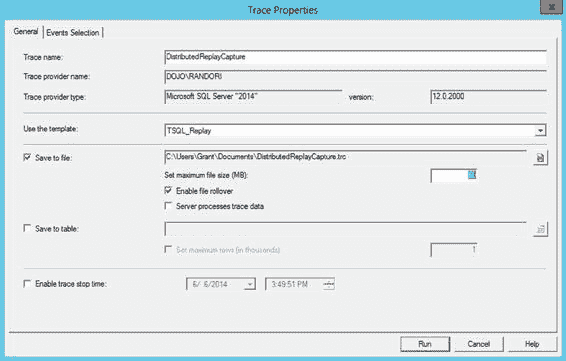

# 第 24 章 ■ 数据库性能测试

• `分布式重放管理员`：这是一个允许您控制`分布式重放控制器`和`分布式重放`进程的界面。

• `分布式重放客户端`：这是一个在一台或多台机器（最多 16 台）上运行的界面，用于向您的数据库服务器发出所有调用。

您可以将所有三个组件安装到一台机器上；然而，理想的方法是将控制器放在一台机器上，然后让一个或多个客户端机器与控制器完全分离，以便这些机器中的每一台仅处理您将对测试机器进行的部分事务。仅为说明目的，我将所有组件都运行在单个实例上。

[www.it-ebooks.info](http://www.it-ebooks.info/)

首先将`分布式重放控制器`服务安装到一台机器上。`分布式重放`实用程序没有图形界面。相反，您将使用 XML 配置文件来控制`分布式重放`架构的不同部分。您可以将分布式重放用于各种任务，例如基本查询重放、服务器端游标或预处理服务器语句。由于我主要涵盖查询调优，因此我专注于查询和预处理服务器语句（也称为`参数化查询`）。这定义了一组必须捕获的特定事件。我将在下一节介绍如何执行此操作。

一旦信息被捕获到跟踪文件中，您就需要使用`分布式重放控制器`通过预处理事件运行该文件。这会将基本的跟踪数据修改为不同的格式，以便分发到各个`分布式重放客户端`机器。然后，您可以启动重放过程。重新格式化的数据被发送到客户端，客户端继而将创建查询以针对目标服务器运行。您可以从客户端机器捕获另一个跟踪输出，以准确查看它们执行了哪些调用，以及这些调用的 I/O 和 CPU 情况。

大概您还将在目标服务器上设置标准监控，以了解您生成的负载如何影响该服务器。

当您准备对服务器运行系统时，可以选择两种重放类型之一：`同步模式`或`压力模式`。在`同步模式`下，您将获得与原始重放完全相同的副本，尽管您可以影响系统的空闲时间量。这对于精确的性能调优非常有用，因为它有助于您了解系统如何工作，特别是当您对结构、索引或 T-SQL 代码进行更改时。

`压力模式`不以任何特定顺序运行，但在单个连接内除外，查询将按正确顺序流式传输。在这种情况下，调用以客户端机器能够达到的最快速度发出——按任何顺序——以服务器能够接收的最快速度进行。简而言之，它执行压力测试。这对于测试数据库设计或硬件安装非常有用。

## 使用服务器端跟踪捕获数据

使用跟踪事件捕获数据类似于使用`扩展事件`捕获查询执行。为了支持`分布式重放`过程，您需要为这些事件捕获一些特定事件和特定列。如果要构建自己的跟踪事件，您需要捕获下表中列出的事件。

### 表 24-1. 需要捕获的事件

| 事件 | 列 |
| :--- | :--- |
| `准备 SQL` | `事件类` |
| `执行准备的 SQL` | `EventSequence` |
| `SQL:BatchStarting` | `TextData` |
| `SQL:BatchCompleted` | `应用程序名称` |
| `RPC:Starting` | `LoginName` |
| `RPC:Completed` | `数据库名称` |
| `RPC 输出参数` | `数据库 ID` |
| `审核登录` | `主机名` |
| `审核注销` | `二进制数据` |
| `现有连接` | `SPID` |
| `服务器端游标` | `开始时间` |
| `服务器端准备的 SQL` | `结束时间` |
|  | `IsSystem` |

[www.it-ebooks.info](http://www.it-ebooks.info/)




设置这些事件有两种选择。首先，你可以使用 `T-SQL` 来设置服务器端跟踪。其次，你可以使用一个名为 `Profiler` 的外部工具。虽然 `Profiler` 可以直接连接到你的 `SQL Server` 实例，但我强烈建议不要使用此工具来捕获数据。`Profiler` 最好用作执行捕获操作的模板提供程序。你应该使用 `T-SQL` 来生成实际的服务器端跟踪。

在测试或开发机器上，打开 `Profiler`，并从模板列表中选择 `TSQL_Replay`，如 `图 24-1` 所示。

`图 24-1`：分布式重放跟踪模板

由于分布式重放需要文件，你会希望将跟踪的输出保存到文件。反正这也是设置服务器端跟踪的最佳方式，所以这样做正合适。你应该将输出到一个有足够空间的目录。

根据系统需要支持的事务数量，跟踪文件可能会非常大。

另外，对文件大小设置限制并允许它们在需要时滚动创建新文件也是一个好主意。

这样虽然会需要处理更多文件，但操作系统实际上能更好地处理大量较小文件的写入操作，而不是单个大文件。我发现这确实成立，原因有二。首先，较小的文件大小，滚动更新更快，这意味着如果你需要将其加载到表中或复制到另一台服务器，前一个文件可立即用于处理。其次，根据我的经验，简单日志文件的写入通常耗时更长，因为此类文件会变得非常大。我还建议为跟踪进程定义一个停止时间；这同样有助于确保不会填满你指定用于存储跟踪数据的驱动器。

由于这是一个模板，事件和列已经为你选定。你可以单击“事件选择”选项卡来验证事件和列，确保你获得的正是所需内容。`图 24-2` 显示了一些事件和列，所有这些都已为你预先定义好。

`图 24-2`：`T-SQL_Replay` 模板的事件和列

此模板是通用的，因此它包含了完整的事件列表，包括所有游标事件。你可以通过单击框来取消选择事件进行编辑；但是，如果确实要移除内容，除了游标事件，我不建议移除其他任何内容。

我是在连接到测试服务器而非生产机器的情况下启动此模板的，因为一旦你正确设置好，就必须单击 `Run` 来启动跟踪。我不会在生产系统上这样做。然而，在测试系统上，你可以查看屏幕以确保获得预期的事件。它将显示事件，同时也会将其捕获到文件中。当你满意配置正确后，可以暂停跟踪。接下来，单击 `File` 菜单，然后选择 `Export` ➤ `Script Trace Definition`。最后，选择 `For SQL Server 2005 – 2014`（参见 `图 24-3`）。

`图 24-3`：用于输出跟踪定义的菜单选择

此模板允许你将刚刚创建的跟踪保存为 `T-SQL` 文件。一旦有了 `T-SQL`，你就可以配置它在任何你喜欢的服务器上运行。文件路径将需要替换，并且你可以通过脚本中的参数重置停止时间。以下脚本展示了用于设置服务器端跟踪事件的 `T-SQL` 过程的开头部分：

```
/****************************************************/
/* Created by: SQL Server 2014 Profiler             */
/* Date: 06/06/2014 02:58:35 PM                     */
/****************************************************/

-- Create a Queue
declare @rc int
declare @TraceID int
declare @maxfilesize bigint
set @DateTime = '2014-06-06 16:00:20.000'
set @maxfilesize = 50

-- Please replace the text InsertFileNameHere, with an appropriate
-- filename prefixed by a path, e.g., c:\MyFolder\MyTrace. The .trc extension
-- will be appended to the filename automatically. If you are writing from
-- remote server to local drive, please use UNC path and make sure server has
-- write access to your network share

exec @rc = sp_trace_create @TraceID output, 0, N'InsertFileNameHere', @maxfilesize, NULL
if (@rc != 0) goto error
```

你可以在显示 `InsertFileNameHere` 的地方编辑路径，并为 `@DateTime` 提供不同的值。至此，你的脚本就可以在任何 `SQL Server 2014` 服务器上运行了。

你收集的信息量确实取决于你想要运行的测试类型。对于标准性能测试，收集至少一小时的信息可能是个好主意；然而，在大多数情况下，你不希望捕获超过两到三小时的数据。另外，必须强调的是，跟踪事件不像扩展事件那样轻量级，因此你捕获数据的时间越长，对生产服务器的负面影响就越大。捕获更多数据意味着要管理更多数据，也意味着你计划运行测试的时间很长。

在捕获数据之前，你确实需要考虑将在哪里运行测试。假设你不担心磁盘空间，也不需要保护法律审计数据（如果存在这些问题，你需要单独解决）。如果你的数据库未处于 `Full Recovery` 模式，那么你将无法使用日志备份将其恢复到某个时间点。如果是这种情况，我强烈建议在启动跟踪数据收集时运行一次数据库备份。原因是你需要数据库在开始记录事务时保持相同的状态。如果不是，你可能会遇到大量错误，这可能会严重改变性能测试的运行方式。例如，尝试选择或修改不存在的数据会影响测试中测量的 `I/O` 和 `CPU`。如果你的数据库保持在与你跟踪开始时（或接近开始时）相同的状态，那么你应该很少（如果有的话）遇到错误。

准备好数据库副本和一组跟踪数据后，你就可以运行分布式重放工具了。

## 用于数据库测试的分布式重放

假设你使用了分布式重放模板来捕获跟踪信息，现在应该可以开始处理文件了。如前所述，第一步是将跟踪文件转换为不同的格式，一种可以分配到多个客户端机器上进行重放的格式。但这不仅仅是简单地对你的文件运行可执行文件。你还需要就希望分布式重放如何运行做出一些决定；这些决定是在预处理跟踪文件时做出的。

这些决定相当直接。首先，你需要决定是否要与用户进程一起重放系统进程。除非你要处理特定的系统问题，否则我建议将此值设置为 `No`。这也是默认值。其次，你需要决定如何处理空闲时间。

你可以使用实际的数据库调用频率值；或者，你可以输入一个以秒为单位的值，将等待时间限制为不超过该值。这实际上取决于你将要运行的重放类型。假设你使用 `Synchronization` 模式重放（最适合直接性能测量的模式），通过将值设置得较低（例如三到五秒）来消除空闲时间是个好主意。


