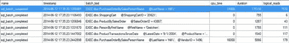

# 第 25 章：数据库工作负载优化

这是一个极其简化的工作负载，仅用于说明流程。在一个典型系统中，你将会看到成百上千个额外的调用。然而，尽管它很简单，这个示例工作负载包含了你通常在 SQL Server 上执行的不同类型的查询。

*   使用聚合函数的查询
*   仅检索单行或少量行的点查询
*   连接多个表的查询
*   检索小范围行的查询
*   执行额外结果集处理的查询，例如提供排序输出

第一个优化步骤是识别性能最差的查询，如下一节所述。

[www.it-ebooks.info](http://www.it-ebooks.info/)

## 捕获工作负载

作为诊断数据收集步骤的一部分，你必须定义一个 `Extended Events` 会话来捕获数据库服务器上的工作负载。你可以使用第 6 章推荐的工具和方法来完成此操作。表 25-1 列出了你应使用的特定事件，以衡量查询的资源消耗情况。

**表 25-1. 用于捕获高成本查询信息的事件**

| 类别 | 事件 |
| :--- | :--- |
| 执行 | `rpc_completed` |
| | `sql_batch_completed` |

如第 6 章所述，对于生产数据库，建议将 `Extended Events` 会话的输出捕获到文件中。将输出捕获到文件有几个显著优势：

*   由于你打算在工作负载捕获后分析 SQL 查询，因此不需要在捕获时显示这些 SQL 查询。
*   通过 SSMS 运行会话无法为跟踪过程提供灵活的时序控制。

让我们更仔细地看看时序控制。假设你想在晚上 11 点开始捕获事件，并记录 24 小时的 SQL 工作负载。你可以使用 GUI 或 T-SQL 定义一个 `Extended Events` 会话。但是，你不必立即启动该过程。这意味着你可以在 SQL Server Agent 或其他调度工具中创建命令，使用 `ALTER EVENT SESSION` 命令来启动和停止该过程。

```sql
ALTER EVENT SESSION <sessionname>
ON SERVER
STATE = <start/stop>;
```

在这个例子中，我对会话设置了筛选器，仅捕获来自 `AdventureWorks2012` 数据库的事件。

该文件将只捕获针对该数据库的查询，从而减少了我需要处理的信息量。对于你的系统来说，这可能也是一个不错的选择。虽然扩展事件的开销可能非常低（尤其是与较旧的跟踪事件相比），但它们并非免费。应始终应用良好的筛选，以确保最小的影响。

## 分析工作负载

一旦工作负载被捕获到文件中，你可以通过使用 SSMS 浏览数据或将输出文件的内容导入数据库表来分析工作负载。

SSMS 提供了以下两种分析文件内容的方法，这两种方法都相对简单：

*   **通过右键单击数据列选择排序顺序或按特定列分组来对输出进行排序**：你可能希望从“详细信息”选项卡中选择列，并使用“在表中显示列”命令将其上移。之后，你就可以在该列上发出分组和排序命令。
*   **重新排列输出为选择性的列和事件列表**：你可以通过右键单击表格并从上下文菜单中选择“选择列”来更改 SSMS 中显示的输出。这不仅可以让你挑选和选择列，还可以将它们组合成新列。

[www.it-ebooks.info](http://www.it-ebooks.info/)

不幸的是，使用 SSMS 分析 `Extended Events` 输出的方法有限。例如，考虑一个频繁执行的查询。你不应该只查看该查询单次执行的成本，还应该尝试确定在固定时间内重复执行该查询的累积成本。

虽然该查询的单次执行成本可能不高，但如果它执行次数非常多，即使是一点小小的优化也可能带来巨大的改变。SSMS 的功能不够强大，无法以这种高级方式帮助分析工作负载。因此，虽然你可以按 `batch_text` 列分组，但参数值的差异意味着你会看到同一个存储过程调用的不同分组。如果你的查询都是存储过程，你可以捕获 `object_id` 并按其分组。但大多数系统至少有一些临时查询，甚至大量临时查询，所以这可能行不通。为了对工作负载进行深入分析，你必须将跟踪文件的内容导入数据库表。会话的输出将大多数重要数据放入 XML 字段中，因此你会希望在加载数据时按如下方式查询它：

```sql
IF (SELECT OBJECT_ID('dbo.ExEvents')) IS NOT NULL
    DROP TABLE dbo.ExEvents;
GO

WITH xEvents
AS (SELECT object_name AS xEventName,
           CAST (event_data AS XML) AS xEventData
    FROM sys.fn_xe_file_target_read_file('C:\Data\MSSQL11.RANDORI\MSSQL\Log\QueryMetrics*.xel',
                                         NULL, NULL, NULL)
    )
SELECT xEventName,
       xEventData.value('(/event/data[@name=''duration'']/value)[1]', 'bigint') Duration,
       xEventData.value('(/event/data[@name=''physical_reads'']/value)[1]', 'bigint') PhysicalReads,
       xEventData.value('(/event/data[@name=''logical_reads'']/value)[1]', 'bigint') LogicalReads,
       xEventData.value('(/event/data[@name=''cpu_time'']/value)[1]', 'bigint') CpuTime,
       CASE xEventName
           WHEN 'sql_batch_completed'
           THEN xEventData.value('(/event/data[@name=''batch_text'']/value)[1]', 'varchar(max)')
           WHEN 'rpc_completed'
           THEN xEventData.value('(/event/data[@name=''statement'']/value)[1]', 'varchar(max)')
       END AS SQLText,
       xEventData.value('(/event/data[@name=''query_plan_hash'']/value)[1]', 'binary(8)') QueryPlanHash
INTO dbo.ExEvents
FROM xEvents;
```

你需要用你自己的路径和文件名替换 `<ExEventsFileName>`。一旦你将内容放入表中，就可以使用 SQL 查询来分析工作负载。例如，要找到最慢的查询，你可以执行以下 SQL 查询：

```sql
SELECT *
FROM dbo.ExEvents AS ee
ORDER BY ee.Duration DESC;
```

[www.it-ebooks.info](http://www.it-ebooks.info/)

前面的查询将显示成本最高的单个查询，这对于你在本章中进行的测试来说已经足够。你可能也想在生产系统上运行类似的查询；然而，你更可能希望基于聚合数据进行分析，如下例所示：

```sql
SELECT ee.SQLText,
       SUM(Duration) AS SumDuration,
       AVG(Duration) AS AvgDuration,
       COUNT(Duration) AS CountDuration
FROM dbo.ExEvents AS ee
GROUP BY ee.SQLText;
```

执行此查询可以让你按你最感兴趣的字段排序——例如，按 `CountDuration` 排序以获取最常调用的过程，或按 `SumDuration` 排序以获取累积运行时间最长的过程。你需要一种方法来移除或替换参数及参数值。这是必要的，以便仅基于过程名称或不带参数和参数值的查询文本来进行聚合（因为这些参数和值会不断变化）。

另一种方法是直接查询缓存，以查看其中代价最高的查询。这比设置扩展事件更简单。此外，大多数情况下，你很可能能捕获到大部分有问题的查询。因此，如果你是首次开始对系统进行查询调优，你可能希望跳过设置跟踪事件来识别代价最高的查询。然而，我发现在时间推移并开始量化系统行为后，你会希望获得使用扩展事件所提供的那种详细数据。

分析工作负载的目标是识别代价最高的查询（或通常代价较高的查询）；下一节将介绍如何做到这一点。

## 识别代价最高的查询

如前所述，你可以使用 SSMS 或查询技术，根据不同的标准来识别代价较高的查询。如第三章所讨论的，工作负载中的查询可以按 `CPU`、`读取` 或 `写入` 列进行排序，以识别代价最高的查询。你还可以使用聚合函数来得出累计成本以及单个成本。在生产系统中，了解哪个存储过程累积了最长的运行时间、最多的 CPU 使用量或最大的读写次数，通常比仅仅识别一次数值最高的查询更有用。

即使对于最繁重的 OLTP 数据库，读取总数通常至少是写入总数的七到八倍，因此按 `读取` 列对查询进行排序，通常比按 `写入` 列排序能识别出更多有问题的查询（但你应该始终在你的系统上测试这一点）。同样值得查看那些执行时间最长的查询。如第五章所述，你可以使用性能监视器捕获等待状态，并将其与特定查询一起查看，以帮助识别为何某个查询运行时间过长。

每个系统都是不同的。一般来说，我会首先处理最常调用的存储过程；然后是运行时间最长的；最后是读取次数最多的。当然，性能调优是一个迭代过程，因此你需要定期重新检查每个类别。

要分析样本工作负载中最差性能的查询，你需要知道查询在持续时间或读取方面的代价。由于这些值只有在查询执行完成后才能得知，因此你主要关注的是已完成的事件。（使用已完成事件进行性能分析背后的原理在第 6 章有详细解释。）

出于展示目的，在 SSMS 中打开跟踪文件。图 25-1 显示了将几列移动到网格后捕获的跟踪输出。

[www.it-ebooks.info](http://www.it-ebooks.info/)



第 25 章 ■ 数据库工作负载优化

`图 25-1.` 显示 SQL 工作负载的扩展事件会话输出

在持续时间方面性能最差的查询，也是在 CPU 使用率和读取方面最差的查询之一。该存储过程 `dbo.PurchaseOrderBySalesPersonName` 在图 25-1 中突出显示（你可能有不同的值，但此查询很可能是性能最差或至少是最差之一）。为方便参考，该存储过程内部的查询如下所示：

```sql
SELECT poh.PurchaseOrderID,
       poh.OrderDate,
       pod.LineTotal,
       p.[Name] AS ProductName,
       e.JobTitle,
       per.LastName + ', ' + per.FirstName AS SalesPerson,
       poh.VendorID
FROM   Purchasing.PurchaseOrderHeader AS poh
       JOIN Purchasing.PurchaseOrderDetail AS pod
         ON poh.PurchaseOrderID = pod.PurchaseOrderID
       JOIN Production.Product AS p
         ON pod.ProductID = p.ProductID
       JOIN HumanResources.Employee AS e
         ON poh.EmployeeID = e.BusinessEntityID
       JOIN Person.Person AS per
         ON e.BusinessEntityID = per.BusinessEntityID
WHERE  per.LastName LIKE @LastName AND
       poh.VendorID = COALESCE(@VendorID, poh.VendorID)
ORDER BY per.LastName,
         per.FirstName;
```

如果你无法运行扩展事件，另一种可行的方法是使用 `sys.dm_exec_query_stats` DMO（动态管理视图）。这将为你提供当前缓存中所有查询的聚合信息。这是一种快速识别最常调用、运行时间最长和资源消耗最大的存储过程的方法。它还带来了一个额外的好处，即可以快速连接到其他 DMO 以提取执行计划和其他有趣的信息。

一旦你识别出性能最差的查询，下一步优化步骤是确定该查询消耗的资源。

### 确定代价最高查询的基线资源使用情况

在应用任何优化技术之前，性能最差查询的当前资源使用情况可以被视为一个基线数据。你可能会对该查询应用不同的优化技术，并将查询优化后的资源使用情况与基线数据进行比较，以确定特定优化技术的有效性。查询的资源使用情况可以分为两类呈现：

- 总体资源使用情况
- 详细资源使用情况

[www.it-ebooks.info](http://www.it-ebooks.info/)

第 25 章 ■ 数据库工作负载优化

#### 总体资源使用情况

查询的总体资源使用情况提供了性能最差查询所消耗硬件资源的总体数据。你可以将优化后查询的资源使用情况与未优化查询的总体资源使用情况相比较，以确保你所应用的性能技术的整体有效性。

你可以从工作负载跟踪中确定查询的总体资源使用情况。你将使用该存储过程的第一次调用，因为它显示了最差的行为。表 25-2 显示了图 25-1 中跟踪的查询总体使用情况。需要指出一点，表中的持续时间单位是毫秒，而图 25-1 中的值单位是微秒。使用扩展事件时请记住考虑这一点。

`表 25-2.` 表示查询所用资源数量的数据列
**数据列** | **值** | **描述**
---|---|---
逻辑读取 |  | 查询执行的逻辑读取次数。如果在内存中未找到某页，则为该页执行一次逻辑读取需要先从磁盘执行物理读取以将该页获取到内存中。
写入 |  | 查询修改的页数。
CPU | 31 ms | 查询使用 CPU 的时间。
持续时间 | 175.1 ms | SQL Server 从编译到返回结果集处理此查询所花费的时间。

**注意** 在你的环境中，前述数据列的值可能不同。无论数据列的绝对值如何，跟踪这些值都很重要，以便日后与相应的值进行比较。

#### 详细资源使用情况

你可以分解查询的总体资源使用情况，以定位查询所访问的不同数据库表上的瓶颈。这种详细的资源使用情况有助于你确定哪些表访问问题最大。

了解系统中的等待状态将帮助你确定需要重点关注调优的地方。一个粗略的经验法则是简单地查看持续时间；然而，持续时间可能受到太多因素的影响，充其量只是一个不完美的衡量标准。在这种情况下，我会在 CPU 使用率、读取和持续时间这三方面都投入时间。读取是衡量性能的常用指标，但像持续时间一样，孤立地看它们也可能同样有问题。这就是为什么我在所有这些值上都投入时间。


如你在第 6 章所见，你可以从给定查询的`STATISTICS IO`输出中，获取该查询访问的各个表上执行的读取次数。你也可以设置`STATISTICS TIME`选项来获取查询的基本执行时间和 CPU 时间，包括其编译时间。你可以通过以下`SET`语句重新执行查询来获取此输出（或在查询窗口中选择`Set Statistics IO`复选框）：

```
--不要在生产环境中运行
DBCC FREEPROCCACHE();
DBCC DROPCLEANBUFFERS;
GO
SET STATISTICS TIME ON;
GO
SET STATISTICS IO ON;
GO
EXEC dbo.PurchaseOrderBySalesPersonName @LastName = 'Hill%';
GO
SET STATISTICS TIME OFF;
GO
SET STATISTICS IO OFF;
GO
```

为了模拟图 25-1 中所示的相同首次运行情况，请使用`DBCC DROPCLEANBUFFERS`（不要在生产系统上运行）清除内存中存储的数据，并通过运行`DBCC FREEPROCCACHE`（同样不要在生产系统上运行）将该存储过程从缓存中移除。

性能最差查询的`STATISTICS`输出如下所示：

```
DBCC execution completed. If DBCC printed error messages, contact your system administrator.
DBCC execution completed. If DBCC printed error messages, contact your system administrator.
SQL Server parse and compile time:
CPU time = 1 ms, elapsed time = 1 ms.
SQL Server Execution Times:
CPU time = 0 ms, elapsed time = 0 ms.
SQL Server parse and compile time:
CPU time = 0 ms, elapsed time = 0 ms.
SQL Server parse and compile time:
CPU time = 0 ms, elapsed time = 128 ms.
(1496 row(s) affected)
Table 'Employee'. Scan count 0, logical reads 2992, physical reads 2, read-ahead reads 0, lob logical reads 0, lob physical reads 0, lob read-ahead reads 0.
Table 'Product'. Scan count 0, logical reads 2992, physical reads 3, read-ahead reads 0, lob logical reads 0, lob physical reads 0, lob read-ahead reads 0.
Table 'PurchaseOrderDetail'. Scan count 763, logical reads 1539, physical reads 8, read-ahead reads 0, lob logical reads 0, lob physical reads 0, lob read-ahead reads 0.
Table 'Workfile'. Scan count 0, logical reads 0, physical reads 0, read-ahead reads 0, lob logical reads 0, lob physical reads 0, lob read-ahead reads 0.
Table 'Worktable'. Scan count 0, logical reads 0, physical reads 0, read-ahead reads 0, lob logical reads 0, lob physical reads 0, lob read-ahead reads 0.
Table 'PurchaseOrderHeader'. Scan count 1, logical reads 44, physical reads 1, read-ahead reads 42, lob logical reads 0, lob physical reads 0, lob read-ahead reads 0.
Table 'Person'. Scan count 1, logical reads 3, physical reads 1, read-ahead reads 8, lob logical reads 0, lob physical reads 0, lob read-ahead reads 0.
SQL Server Execution Times:
CPU time = 62 ms, elapsed time = 1313 ms.
SQL Server Execution Times:
CPU time = 62 ms, elapsed time = 1442 ms.
SQL Server parse and compile time:
CPU time = 0 ms, elapsed time = 0 ms.
```

表 25-3 总结了`STATISTICS IO`的输出。

***表 25-3.** `STATISTICS IO` 输出分解*

**表** | **逻辑读取次数**
---|---
`Person.Employee` | 2,992
`Production.Product` | 2,992
`Purchasing.PurchaseOrderDetail` | 1,539
`Purchasing.PurchaseOrderHeader` | 44
`Person.Person` | 3

通常，查询所涉及的各个表的读取次数总和将小于查询执行的总读取次数。这是因为需要读取额外的页面来访问内部数据库对象，例如`sysobjects`、`syscolumns`和`sysindexes`。

表 25-4 总结了`STATISTICS TIME`的输出。

***表 25-4.** `STATISTICS TIME` 输出分解*

**事件** | **持续时间** | **CPU 时间**
---|---|---
编译 | 128 ms | 0 ms
执行 | 1313 ms | 62 ms
完成 | 1442 ms | 62 ms

不要孤立地使用逻辑读取次数而不考虑执行时间。在确定性能不佳的查询时，你需要将所有衡量指标都纳入考量。反之，也不要假设执行时间是一个完美的衡量标准。资源争用在执行时间中扮演着重要角色，因此你会看到这个指标存在一些波动。使用这两个值，但要充分理解，单独使用任何一个都可能无法准确反映现实情况。

一旦确定了性能最差的查询并衡量了其资源使用情况，接下来的优化步骤是确定影响查询性能的因素。然而，在进行此操作之前，你应检查是否存在查询外部的任何因素可能导致了性能不佳。

## 分析与优化外部因素

除了查询设计和索引等因素外，外部因素也会影响查询性能。因此，在深入研究查询的执行计划之前，你应该分析并优化可能影响查询性能的主要外部因素。以下是一些外部因素：

-   应用程序使用的连接选项
-   查询所访问的数据库对象的统计信息
-   查询所访问的数据库对象的碎片情况

### 分析应用程序使用的连接选项

在连接到 SQL Server 时，可以设置各种选项（如`ANSI_NULL`或`CONCAT_NULL_YIELDS_NULL`），使其与服务器或数据库的默认设置不同。然而，按连接更改这些设置可能导致存储过程重新编译，从而引发性能下降。此外，某些选项（如`ARITHABORT`）在处理索引视图和某些其他专用索引时必须设置为`ON`。如果未设置，可能会导致性能低下，甚至在代码中出现错误。例如，将`ANSI_WARNINGS`设置为`OFF`将导致优化器在生成执行计划时忽略索引视图和索引计算列。你可以使用扩展事件的输出来查看此信息。`login`事件和`existing_connection`事件中的`options_text`列包含了该连接使用的设置，如图 25-2.所示。

***图 25-2.** 显示批处理级别选项的现有连接*

此列不仅能显示批处理级别的选项；它还可以让你检查事务隔离级别。

你也可以从执行计划中第一个操作符的属性中获取这些设置。

我建议使用 ANSI 标准设置，即将以下选项设置为`ON`：`ANSI_NULLS`、`ANSI_NULL_DFLT_ON`、`ANSI_PADDING`、`ANSI_WARNINGS`、`CURSOR_CLOSE_ON_COMMIT`、`IMPLICIT_TRANSACTIONS`和`QUOTED_IDENTIFIER`。你可以使用单一命令`SET ANSI_DEFAULTS ON`将它们同时全部设置为`ON`。

### 分析统计信息的有效性

查询所引用的数据库对象的统计信息是查询优化器用于决定某些执行计划的关键信息之一。如第 12 章所述，优化器根据查询所引用对象的统计信息来生成查询的执行计划。优化器查看查询所引用的数据库对象的统计信息，并估算受影响的行数。通过这种方式，它确定查询的处理策略。如果数据库对象的统计信息不准确，那么优化器可能会为查询生成一个低效的执行计划。

如第 12 章所述，你可以使用`DBCC SHOW_STATISTICS`来检查表及其索引的统计信息。


