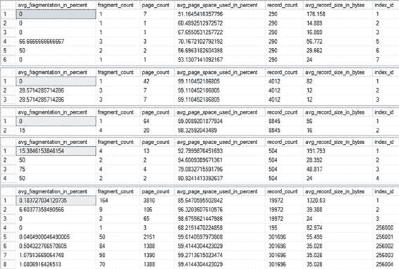
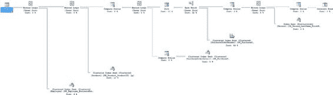

# 第 25 章：数据库工作负载优化

作为迭代性能调优过程的一部分，这里有一个实验可以尝试。运行第 13 章提供（并在本章重复）的索引碎片整理脚本。

```sql
DECLARE @DBName NVARCHAR(255),
    @TableName NVARCHAR(255),
    @SchemaName NVARCHAR(255),
    @IndexName NVARCHAR(255),
    @PctFrag DECIMAL,
    @Defrag NVARCHAR(MAX)

IF EXISTS ( SELECT *
            FROM sys.objects
            WHERE object_id = OBJECT_ID(N'#Frag') )
    DROP TABLE #Frag;

CREATE TABLE #Frag
(
    DBName NVARCHAR(255),
    TableName NVARCHAR(255),
    SchemaName NVARCHAR(255),
    IndexName NVARCHAR(255),
    AvgFragment DECIMAL
)

EXEC sys.sp_MSforeachdb 'INSERT INTO #Frag ( DBName, TableName, SchemaName, IndexName, AvgFragment ) SELECT ''?'' AS DBName ,t.Name AS TableName ,sc.Name AS SchemaName ,i.name AS IndexName ,s.avg_fragmentation_in_percent FROM ?.sys.dm_db_index_physical_stats(DB_ID(''?''), NULL, NULL, NULL, ''Sampled'') AS s JOIN ?.sys.indexes i ON s.Object_Id = i.Object_id AND s.Index_id = i.Index_id JOIN ?.sys.tables t ON i.Object_id = t.Object_Id JOIN ?.sys.schemas sc ON t.schema_id = sc.SCHEMA_ID WHERE s.avg_fragmentation_in_percent > 20 AND t.TYPE = ''U'' AND s.page_count > 8 ORDER BY TableName,IndexName';

DECLARE cList CURSOR
FOR
    SELECT *
    FROM #Frag

OPEN cList;

FETCH NEXT FROM cList
    INTO @DBName, @TableName, @SchemaName, @IndexName, @PctFrag;

WHILE @@FETCH_STATUS = 0
BEGIN
    IF @PctFrag BETWEEN 20.0 AND 40.0
    BEGIN
        SET @Defrag = N'ALTER INDEX ' + @IndexName + ' ON ' + @DBName +
            '.' + @SchemaName + '.' + @TableName + ' REORGANIZE';
        EXEC sp_executesql @Defrag;
        PRINT 'Reorganize index: ' + @DBName + '.' + @SchemaName + '.' +
            @TableName + '.' + @IndexName;
    END
    ELSE
        IF @PctFrag > 40.0
        BEGIN
            SET @Defrag = N'ALTER INDEX ' + @IndexName + ' ON ' +
                @DBName + '.' + @SchemaName + '.' + @TableName +
                ' REBUILD';
            EXEC sp_executesql @Defrag;
            PRINT 'Rebuild index: ' + @DBName + '.' + @SchemaName +
                '.' + @TableName + '.' + @IndexName;
        END

    FETCH NEXT FROM cList
        INTO @DBName, @TableName, @SchemaName, @IndexName, @PctFrag;
END

CLOSE cList;
DEALLOCATE cList;

DROP TABLE #Frag;
GO
```

在整理数据库上的索引后，重新针对所有五个表运行对 `sys.dm_db_index_physical_stats` 的查询。这将使你能够确定索引碎片（如果有的话）的变化情况（见图 25-6）。



**图 25-6.** 重建索引后各表的索引碎片情况

如图 25-6 所示，在性能最差的查询所使用的表中，任何索引的碎片都没有减少。在大多数情况下，这是因为页数太少，以至于无法进行碎片整理。通常，我甚至不会费心去整理少于 100 页的索引。Microsoft 的建议是等到有 1,000 页时再进行碎片整理。

一旦你分析了可能影响查询性能的外部因素并解决了其中非最优的部分，接下来就应该分析内部因素，例如不当的索引和查询设计。

## 分析代价最高查询的内部行为

既然统计信息是最新的，你就可以分析优化器为查询选择的处理策略，以确定影响查询性能的内部因素。分析可能影响查询性能的内部因素涉及以下步骤：

• 分析查询执行计划

• 识别执行计划中的高代价步骤

• 分析处理策略的有效性



### 分析查询执行计划

要查看执行计划，单击“显示实际执行计划”按钮以启用它，然后运行存储过程。

请确保你在非生产系统上进行此类测试。关于阅读执行计划的更多细节，请查阅我的书 `SQL Server Execution Plans`（Red Gate Publishing，2013）。图 25-7 显示了性能最差查询的图形化执行计划。

**图 25-7.** 性能最差查询的实际执行计划

此计划的图形有些难以阅读。如果你没有跟随代码，我将分解一些有趣的细节。阅读执行计划在第 15 章中已作解释。你可以从该执行计划中观察到以下内容：

• `SELECT` 属性：

  • 优化级别：完全

  • 提前终止原因：找到了足够好的计划

• 数据访问：

  • 在非聚集索引 `Person.IX_Person_LastName_FirstName_MiddleName` 上进行索引查找

  • 在聚集索引 `PurchaseOrderHeader.PK_PruchaseOrderHeader_PurchaseOrderID` 上进行索引扫描

  • 在聚集索引 `PurchaseOrderDetail.PK_PurchaseOrderDetail_PurchaseOrderDetailID` 上进行索引查找

  • 在聚集索引 `Product.PK_Product_ProductID` 上进行索引查找

  • 在聚集索引 `Employee.PK_Employee_BusinessEntityID` 上进行索引查找

• 连接策略：

  • 在常量扫描和 `Person.Person` 表之间进行嵌套循环联接，`Person.Person` 表作为外部表

  • 在先前联接的输出与 `Purchasing.PurchaseOrderHeader` 表之间进行嵌套循环联接，`Purchasing.PurchaseOrderHeader` 表作为外部表

  • 在先前联接的输出与 `Purchasing.PurchaseOrderDetail` 表之间进行嵌套循环联接，该表也是外部表

  • 在先前联接的输出与 `Production.Product` 表之间进行嵌套循环联接，`Production.Product` 作为外部表

  • 在先前的联接与 `HumanResources.Employee` 表之间进行嵌套循环联接，`HumanResource.Employee` 表作为外部表

• 附加处理：

  • 常量扫描，为 `@LastName` 变量的 `LIKE` 操作提供占位符

  • 计算标量，定义了 `@LastName` 变量 `LIKE` 操作的结构，显示范围的上限和下限以及要检查的值

  • 计算标量，将 `FirstName` 和 `LastName` 列组合成一个新列

  • 计算标量，计算来自 `Purchasing.PurchaseOrderDetail` 表的 `LineTotal` 列

  • 计算标量，获取计算出的 `LineTotal` 并将其作为永久值存储在结果集中，以供进一步处理

所有这些信息都可以通过浏览图形化执行计划中属性表所暴露的操作符详细信息来获取。

### 识别执行计划中的高代价步骤

一旦理解了查询的执行计划，下一步就是识别执行计划中估计代价最高的步骤。尽管这些代价是估计值，并不能以任何方式反映现实情况，但它们是你将获得的用于衡量计划功能的唯一数字。因此，识别、理解并可能解决代价最高的操作可以带来巨大的性能收益。你可以看到以下是两个代价最高的步骤：

• `高代价步骤 1`：在 `Purchasing.PurchaseOrderHeader` 表上的聚集索引扫描占 36%。

• `高代价步骤 2`：哈希匹配联接操作占 32%。

接下来的优化步骤是分析这些高代价步骤，以确定是否可以通过诸如重新设计查询或索引等技术来优化这些步骤。

### 分析处理策略

虽然优化器完成了计划的优化（你知道这一点，因为优化过程提前终止的原因是“找到了足够好的计划”），但这并不意味着查询和结构中不存在调优的机会。你可以遵循传统步骤开始评估它。


代价高昂的步骤 1 是一个聚集索引扫描。扫描操作本身不一定是个问题。它们仅仅表明，为了获取查询所需的信息，对相关对象（本例中是整个表）进行全表扫描的成本低于其他备选方案。

[www.it-ebooks.info](http://www.it-ebooks.info/)

